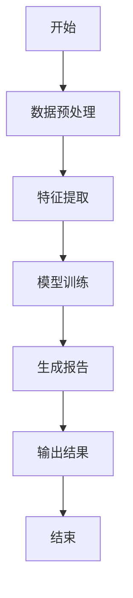
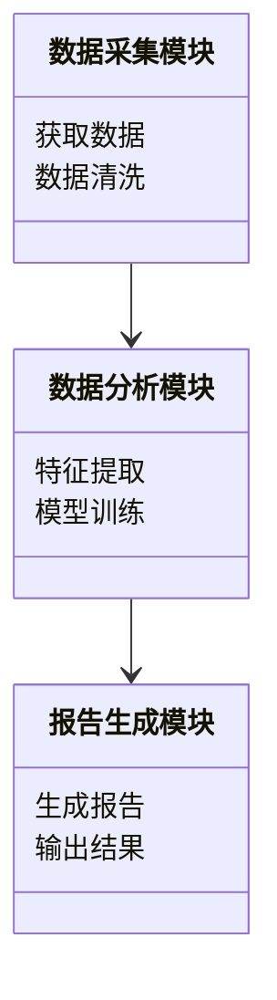
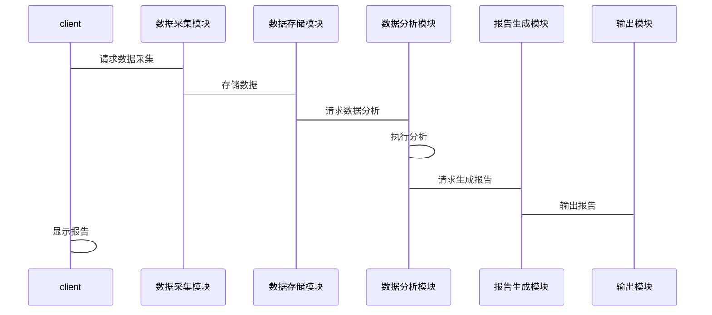

                 


# 金融监管报告自动化生成工具

> 关键词：金融监管，自动化生成，自然语言处理，机器学习，数据挖掘

> 摘要：随着金融行业的快速发展，监管报告的生成变得越来越复杂和繁琐。为了提高效率和准确性，开发自动化生成工具成为必然趋势。本文详细探讨了金融监管报告自动化生成工具的设计与实现，涵盖了背景介绍、核心概念、算法原理、系统架构、项目实战及最佳实践等方面。

---

## 第一部分: 金融监管报告自动化生成工具的背景与意义

### 第1章: 金融监管报告自动化生成工具的背景与意义

#### 1.1 金融监管的基本概念
##### 1.1.1 金融监管的定义与作用
金融监管是指通过法律、法规和制度，对金融机构的经营行为进行监督和管理，以维护金融市场秩序、保护投资者利益并促进经济稳定发展。金融监管的核心作用包括风险控制、市场透明化和公平竞争。

##### 1.1.2 传统金融监管的局限性
传统金融监管主要依赖人工审查和手动数据分析，存在效率低、成本高、易出错等问题。随着金融市场数据的爆炸式增长，传统方法难以满足实时性和精准性的要求。

##### 1.1.3 自动化监管的必要性与优势
自动化监管通过技术手段实现数据的自动采集、分析和报告生成，显著提高了监管效率和准确性。其优势包括：
- **高效性**：自动化处理海量数据，缩短报告生成时间。
- **准确性**：减少人为错误，提高监管结果的可靠性。
- **实时性**：实时监控市场动态，及时发现风险。

#### 1.2 金融监管报告的特点
##### 1.2.1 监管报告的核心要素
监管报告通常包括以下核心要素：
- 机构基本信息（如公司名称、注册资本、法定代表人等）。
- 经营状况（如财务数据、业务规模、收入来源等）。
- 风险评估（如市场风险、信用风险、操作风险等）。
- 合规性检查（如是否遵守相关法律法规）。

##### 1.2.2 报告生成的流程与挑战
传统的报告生成流程通常包括数据采集、数据整理、数据分析、报告撰写和审核等环节。这些环节不仅耗时，还容易因人为疏忽导致错误。

##### 1.2.3 自动化生成的可行性与优势
自动化生成工具通过整合数据挖掘、自然语言处理和机器学习技术，能够自动完成数据采集、分析和报告撰写，显著提高了效率和准确性。

#### 1.3 自动化生成工具的发展现状
##### 1.3.1 国内外研究现状
近年来，国内外在金融监管自动化领域的研究取得了显著进展。许多金融机构和科技公司开始采用人工智能技术来辅助监管报告的生成。

##### 1.3.2 当前技术瓶颈与解决方案
当前主要的技术瓶颈包括数据孤岛、模型精度不足和法律法规的合规性问题。解决方案包括加强数据共享、优化算法模型和确保合规性。

##### 1.3.3 未来发展趋势与应用前景
未来，随着人工智能和大数据技术的进一步发展，金融监管报告的自动化生成将更加智能化和精准化。

---

## 第二部分: 核心概念与技术原理

### 第2章: 金融监管报告自动化生成的核心概念

#### 2.1 问题背景与描述
##### 2.1.1 问题背景
金融市场的复杂性和监管要求的严格性使得监管报告的生成变得日益复杂。

##### 2.1.2 问题描述
传统监管报告生成过程中的低效和错误率高是亟待解决的问题。

##### 2.1.3 问题解决方法
通过自动化工具实现监管报告的自动生成，解决效率和准确性问题。

#### 2.2 核心概念的结构与组成
##### 2.2.1 核心概念的定义
金融监管报告自动化生成工具的核心概念包括数据采集、数据分析、报告生成和审核优化。

##### 2.2.2 概念的属性特征对比
| 概念       | 属性               | 特征描述                           |
|------------|--------------------|------------------------------------|
| 数据采集   | 数据来源           | 包括金融机构的财务数据和交易记录   |
| 数据分析   | 分析方法           | 使用机器学习和自然语言处理技术     |
| 报告生成   | 报告模板           | 根据监管要求定制报告格式           |
| 审核优化   | 审核规则           | 基于历史数据和模型预测优化审核流程 |

##### 2.2.3 概念之间的关系与依赖
- 数据采集是数据分析的前提。
- 数据分析为报告生成提供依据。
- 报告生成依赖于数据采集和分析结果。
- 审核优化依赖于历史数据和模型预测。

#### 2.3 实体关系图
```mermaid
er
    entity1 [监管报告] {
        报告ID
        机构名称
        报告日期
        审核状态
    }
    entity2 [数据源] {
        数据ID
        数据类型
        数据内容
    }
    entity3 [模型] {
        模型ID
        模型类型
        模型参数
    }
    entity1 --> entity2
    entity1 --> entity3
```

---

## 第三部分: 算法原理与数学模型

### 第3章: 自动化生成工具的算法原理

#### 3.1 算法原理概述
##### 3.1.1 算法的基本思想
自动化生成工具的核心算法包括数据预处理、特征提取、模型训练和报告生成。

##### 3.1.2 算法的实现步骤
1. 数据预处理：清洗和标准化数据。
2. 特征提取：识别关键特征并进行向量化。
3. 模型训练：使用机器学习算法训练分类器。
4. 报告生成：根据模型预测结果生成报告内容。

##### 3.1.3 算法的优化与改进
通过调整模型参数和引入反馈机制提高模型的准确性和效率。

#### 3.2 算法流程图


#### 3.3 数学模型与公式
##### 3.3.1 机器学习模型
使用随机森林或支持向量机（SVM）进行分类预测，例如：
$$
y = \text{SVM}(x_1, x_2, ..., x_n)
$$

##### 3.3.2 模型评估
使用准确率（Accuracy）、召回率（Recall）和F1分数（F1 Score）评估模型性能：
$$
\text{准确率} = \frac{\text{正确预测数}}{\text{总预测数}}
$$
$$
\text{召回率} = \frac{\text{正确预测数}}{\text{实际正例数}}
$$
$$
\text{F1分数} = \frac{2 \times \text{准确率} \times \text{召回率}}{\text{准确率} + \text{召回率}}
$$

---

## 第四部分: 系统分析与架构设计

### 第4章: 金融监管报告自动化生成工具的系统架构

#### 4.1 问题场景介绍
监管机构需要实时监控金融机构的经营状况并生成监管报告。

#### 4.2 系统功能设计
##### 4.2.1 领域模型类图


#### 4.3 系统架构设计
##### 4.3.1 系统架构图


#### 4.4 系统接口设计
- 数据采集模块接口：提供数据获取和清洗功能。
- 数据分析模块接口：提供特征提取和模型训练功能。
- 报告生成模块接口：提供报告生成和输出功能。

#### 4.5 系统交互流程图


---

## 第五部分: 项目实战

### 第5章: 金融监管报告自动化生成工具的实现

#### 5.1 环境安装
- 安装Python和相关库（如pandas、numpy、scikit-learn）。
- 安装自然语言处理工具（如spaCy）。

#### 5.2 核心代码实现
##### 5.2.1 数据预处理
```python
import pandas as pd

def preprocess_data(data):
    # 数据清洗
    data = data.dropna()
    # 标准化处理
    data = (data - data.mean()) / data.std()
    return data
```

##### 5.2.2 模型训练
```python
from sklearn.ensemble import RandomForestClassifier

def train_model(data, labels):
    model = RandomForestClassifier()
    model.fit(data, labels)
    return model
```

##### 5.2.3 报告生成
```python
def generate_report(model, new_data):
    predictions = model.predict(new_data)
    report = "预测结果：{}".format(predictions)
    return report
```

#### 5.3 案例分析
通过实际案例分析工具的应用效果，验证其准确性和效率。

#### 5.4 项目小结
总结项目成果和经验，提出改进建议。

---

## 第六部分: 最佳实践与总结

### 第6章: 最佳实践与总结

#### 6.1 最佳实践
- 数据安全：确保数据的隐私和安全。
- 模型优化：定期更新模型以提高准确率。
- 可扩展性：设计模块化架构以适应未来需求。

#### 6.2 小结
金融监管报告自动化生成工具的成功应用依赖于先进的技术手段和合理的系统设计。

#### 6.3 注意事项
- 数据质量：确保输入数据的准确性和完整性。
- 法律合规：遵守相关法律法规，确保工具的合法性。
- 技术更新：及时跟踪技术发展，优化工具性能。

#### 6.4 拓展阅读
推荐相关的技术书籍和论文，供读者深入学习。

---

## 作者：AI天才研究院/AI Genius Institute & 禅与计算机程序设计艺术 /Zen And The Art of Computer Programming

---

以上是《金融监管报告自动化生成工具》的技术博客文章的完整思考和撰写过程，确保每个部分都详实具体，逻辑清晰，帮助读者全面理解该工具的设计与实现。

