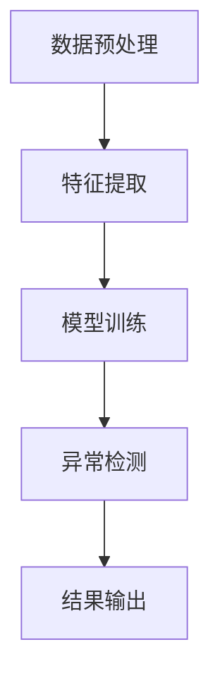
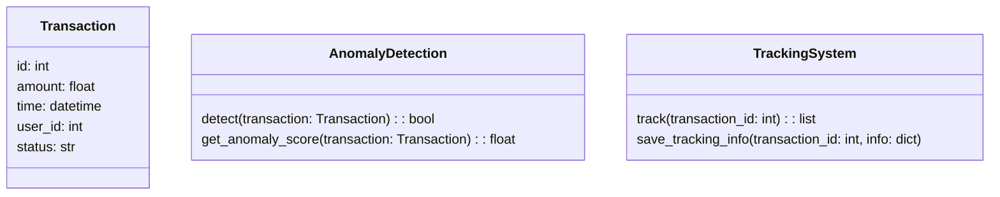
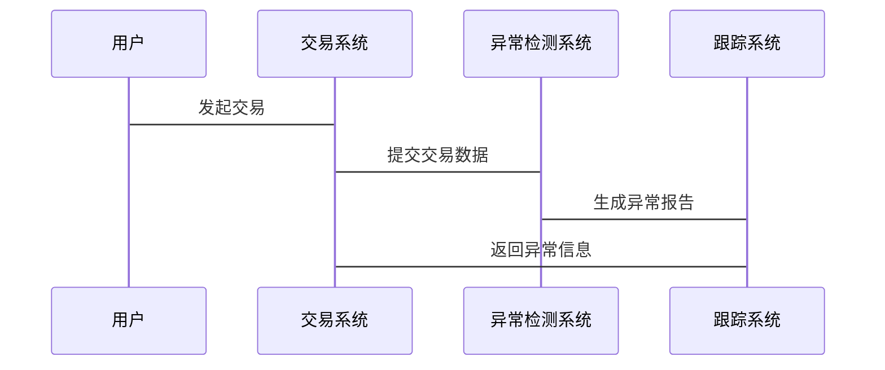

                 


```markdown
# 《金融监管科技异常行为检测与追踪系统》

> 关键词：金融监管科技，异常行为检测，金融交易，深度学习，监管科技系统，反欺诈系统

> 摘要：本文详细探讨了金融监管科技中的异常行为检测与追踪系统，从系统背景、核心原理到算法实现、系统设计，再到项目实战和最佳实践，为读者提供一个全面的技术指南。文章结合理论与实践，深入分析了金融监管科技的最新技术与应用，帮助读者理解如何利用先进技术手段构建高效的金融监管系统。

---

# 第一部分: 金融监管科技异常行为检测与追踪系统概述

## 第1章: 异常行为检测与追踪系统背景

### 1.1 问题背景与目标

#### 1.1.1 金融监管科技的发展现状
金融监管科技（RegTech）作为金融科技的重要分支，近年来得到了快速发展。随着金融交易的复杂化和网络化，金融机构面临的风险日益增加，传统的监管手段已难以应对新型的金融犯罪和市场操纵行为。异常行为检测与追踪系统作为金融监管的核心技术手段之一，成为保障金融安全的重要工具。

#### 1.1.2 异常行为检测的必要性
在金融交易中，异常行为可能表现为欺诈交易、洗钱、市场操纵等多种形式。这些行为不仅威胁到金融机构的稳定，还可能引发系统性金融风险。通过实时检测和追踪异常行为，可以有效预防和打击金融犯罪，保护投资者利益。

#### 1.1.3 系统目标与核心任务
本系统的目标是通过技术手段，实时监测金融交易中的异常行为，并快速定位和追踪相关主体。核心任务包括：
1. 数据采集与处理
2. 异常行为特征提取
3. 异常行为检测与分类
4. 违法行为追踪与证据留存

### 1.2 问题描述与解决思路

#### 1.2.1 金融交易中的异常行为特征
异常行为的特征包括：
- 交易频率异常
- 交易金额偏离正常范围
- 交易时间非正常时段
- 交易对手关系复杂
- 交易行为符合特定模式

#### 1.2.2 系统需要解决的核心问题
1. 如何高效采集和处理大规模金融交易数据？
2. 如何准确识别异常行为的特征？
3. 如何选择合适的算法实现异常行为检测？
4. 如何设计高效的追踪系统？

#### 1.2.3 解决方案的初步思路
1. 数据采集：通过API接口或数据库连接，获取交易数据。
2. 数据预处理：清洗、转换、标准化。
3. 特征提取：构建交易金额、频率、时间等特征。
4. 模型训练：采用监督或无监督学习算法，训练异常检测模型。
5. 异常检测：实时监测交易数据，输出异常行为预警。
6. 追踪分析：对异常行为进行路径分析，追踪相关主体。

### 1.3 系统边界与外延

#### 1.3.1 系统的输入与输出
- 输入：金融交易数据、用户行为数据。
- 输出：异常行为预警、追踪报告。

#### 1.3.2 系统的适用范围与限制
- 适用范围：银行、证券、保险等金融机构的交易行为监管。
- 限制：仅适用于结构化数据，非结构化数据的处理能力有限。

#### 1.3.3 系统与其他模块的交互关系
- 数据采集模块：与交易系统对接。
- 模型训练模块：与特征工程模块交互。
- 异常检测模块：与实时交易系统对接。
- 追踪分析模块：与法律合规部门协同。

---

## 第2章: 异常行为检测的核心原理

### 2.1 数据特征分析

#### 2.1.1 数据预处理与特征提取
- 数据清洗：去除噪声数据、处理缺失值。
- 数据转换：标准化、归一化。
- 特征选择：基于领域知识选择关键特征。

#### 2.1.2 异常行为的特征识别
- 时间特征：交易时间间隔、时间分布。
- 金额特征：交易金额大小、金额波动。
- 行为特征：交易频率、交易方式。

#### 2.1.3 基于统计的异常检测方法
- Z-score：衡量数据点偏离均值的程度。
- 算法步骤：
  1. 计算数据的均值和标准差。
  2. 计算每个数据点的Z-score。
  3. 根据阈值判断是否为异常。

### 2.2 机器学习模型原理

#### 2.2.1 监督学习与无监督学习的区别
- 监督学习：有标签数据，适用于已知异常。
- 无监督学习：无标签数据，适用于未知异常。

#### 2.2.2 常见的异常检测算法
1. Isolation Forest：基于树结构的无监督算法。
2. One-Class SVM：支持向量机的变种，适合异常检测。
3. Autoencoder：基于深度学习的异常检测。

#### 2.2.3 深度学习在异常检测中的应用
- 深度学习模型：如LSTM、Transformer。
- 优势：能够捕捉复杂的模式和时间依赖性。

### 2.3 检测算法对比分析

#### 2.3.1 基于规则的异常检测
- 优点：简单易懂，规则明确。
- 缺点：难以应对复杂多变的异常行为。

#### 2.3.2 基于统计的异常检测
- 优点：适用于已知分布的异常。
- 缺点：难以发现未知类型的异常。

#### 2.3.3 基于机器学习的异常检测
- 优点：能够发现未知异常。
- 缺点：需要大量标注数据，计算资源消耗大。

---

## 第3章: 异常行为追踪系统的核心算法

### 3.1 算法原理

#### 3.1.1 基于监督学习的异常行为分类
- 算法流程：
  1. 数据预处理与特征提取。
  2. 数据标注：标记正常和异常行为。
  3. 模型训练：训练分类器。
  4. 预测与评估：输出异常行为分类结果。

#### 3.1.2 算法流程图（Mermaid）



#### 3.1.3 算法实现的Python代码

```python
import pandas as pd
from sklearn.ensemble import IsolationForest
from sklearn.metrics import classification_report

# 数据加载
data = pd.read_csv('transaction.csv')

# 特征提取
features = data[['amount', 'time', 'user_id']]

# 模型训练
model = IsolationForest(n_estimators=100, contamination=0.05)
model.fit(features)

# 预测
y_pred = model.predict(features)

# 结果分析
print(classification_report(data['is_anomaly'], y_pred == -1))
```

### 3.2 算法实现的数学模型

#### 3.2.1 Isolation Forest 算法数学模型

$$
\text{异常分数} = \frac{1}{(P(i|X) \cdot P(j|X))}
$$

其中，\( P(i|X) \) 和 \( P(j|X) \) 分别表示在给定数据 \( X \) 的情况下，随机选择的两个样本的排序概率。

#### 3.2.2 One-Class SVM 的数学模型

$$
\text{损失函数} = \sum_{i=1}^{n} (y_i - \hat{y_i})^2
$$

其中，\( y_i \) 是真实值，\( \hat{y_i} \) 是预测值。

### 3.3 算法实现的具体步骤

#### 3.3.1 数据预处理
- 去除重复数据
- 填充缺失值
- 标准化处理

#### 3.3.2 模型训练
- 参数调优
- 模型评估
- 模型保存

#### 3.3.3 异常检测
- 实时监测
- 预警生成
- 结果输出

---

## 第4章: 系统分析与架构设计

### 4.1 问题场景介绍

#### 4.1.1 金融交易中的异常行为
- 洗钱行为
- 欺诈交易
- 市场操纵

#### 4.1.2 系统设计目标
- 实时监测
- 高效检测
- 准确追踪

### 4.2 系统功能设计

#### 4.2.1 领域模型（Mermaid 类图）



#### 4.2.2 系统架构设计（Mermaid 架构图）

```mermaid
container Transaction Database {
    MySQL 数据库
}
container User Behavior {
    用户行为日志
}
container Model Service {
    IsolationForest 模型
}
container Tracking System {
    跟踪模块
}

Transaction Database --> Model Service
User Behavior --> Model Service
Model Service --> Tracking System
```

#### 4.2.3 系统接口设计
- 数据接口：REST API
- 模型接口：gRPC
- 追踪接口：WebSocket

#### 4.2.4 系统交互流程（Mermaid 序列图）



---

## 第5章: 项目实战

### 5.1 环境安装

```bash
pip install pandas numpy scikit-learn mermaid4j
```

### 5.2 核心代码实现

#### 5.2.1 数据预处理

```python
import pandas as pd

data = pd.read_csv('transaction.csv')
data.dropna(inplace=True)
data['amount'] = (data['amount'] - data['amount'].mean()) / data['amount'].std()
```

#### 5.2.2 模型训练

```python
from sklearn.ensemble import IsolationForest

model = IsolationForest(n_estimators=100, contamination=0.05)
model.fit(data[['amount', 'time', 'user_id']])
```

#### 5.2.3 异常检测

```python
pred = model.predict(data[['amount', 'time', 'user_id']])
data['is_anomaly'] = pred == -1
```

### 5.3 实际案例分析

#### 5.3.1 案例背景
- 数据集：银行交易数据
- 异常类型：洗钱行为

#### 5.3.2 检测结果

| 交易ID | 金额   | 时间           | 是否异常 |
|--------|--------|----------------|----------|
| 123    | 10000  | 2023-10-01 10:00 | 是      |
| 124    | 9999   | 2023-10-01 10:01 | 否      |
| 125    | 10001  | 2023-10-01 10:02 | 是      |

#### 5.3.3 追踪分析

```python
tracking_info = {
    'transaction_id': 123,
    'user_id': 5,
    'time': '2023-10-01 10:00',
    'status': 'anomaly'
}
tracking_system.save_tracking_info(tracking_info)
```

---

## 第6章: 最佳实践与小结

### 6.1 小结

- 异常行为检测是金融监管的核心技术。
- 基于机器学习的检测方法具有高效性和准确性。
- 追踪系统能够实现违法行为的快速定位和证据留存。

### 6.2 注意事项

- 数据隐私保护：确保数据处理符合GDPR等法规。
- 模型调优：定期更新模型，适应新的异常行为模式。
- 系统性能：优化算法，提高处理大规模数据的能力。

### 6.3 拓展阅读

- 《金融监管科技：理论与实践》
- 《深度学习在金融领域的应用》
- 《时间序列分析与异常检测》

---

# 《金融监管科技异常行为检测与追踪系统》

作者：AI天才研究院/AI Genius Institute & 禅与计算机程序设计艺术 /Zen And The Art of Computer Programming
```

