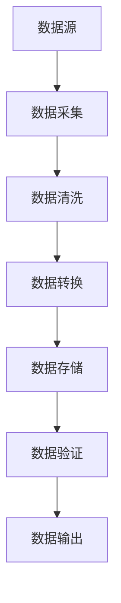
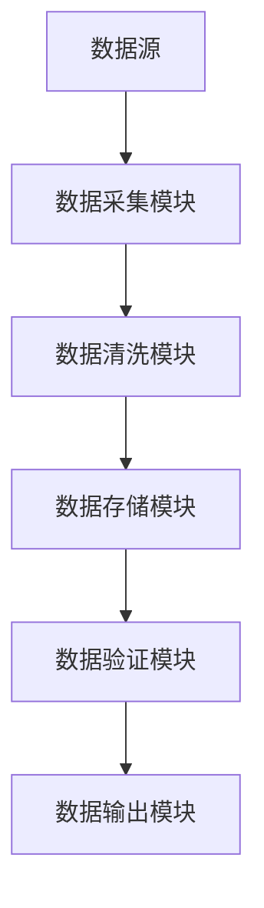
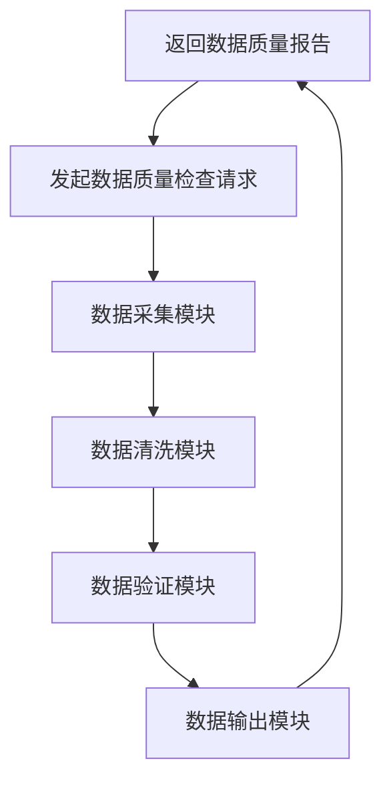

                 


# 金融监管科技数据质量控制

> 关键词：数据质量控制、金融监管科技、数据清洗、特征工程、数据质量管理、系统架构

> 摘要：本文深入探讨了金融监管科技领域中的数据质量控制问题，从背景、核心概念、算法原理、系统架构到项目实战，结合实际案例，详细分析了数据质量控制的重要性、实现方法及应用价值。通过本文，读者将能够全面理解如何在金融监管科技中有效地进行数据质量管理，从而提升金融监管的效率和准确性。

---

## 第1章: 数据质量控制的背景与意义

### 1.1 数据质量控制的背景

在金融监管科技（RegTech）快速发展的背景下，数据质量控制的重要性日益凸显。金融行业的核心运作依赖于数据，从交易清算到风险评估，数据的准确性、完整性、一致性和及时性直接关系到金融机构的稳健运行和监管效能。然而，随着金融业务的复杂化和数据量的爆炸式增长，数据质量问题也随之而来，如数据缺失、重复、错误、不一致等。这些问题不仅影响金融机构的决策效率，还可能导致合规风险和监管失败。因此，如何在金融监管科技中实现高效的数据质量控制，成为行业关注的焦点。

### 1.2 数据质量控制的定义与特点

数据质量控制是指通过一系列方法和技术，确保数据在采集、处理、存储和应用过程中符合特定的质量标准。其核心目标是提高数据的准确性、完整性、一致性和可用性。数据质量控制具有以下特点：

1. **系统性**：数据质量控制贯穿数据生命周期的各个环节，从采集到应用，每个阶段都需要进行质量检查和优化。
2. **实时性**：在金融监管中，数据的实时性至关重要，尤其是在高频交易和实时监控场景中，数据质量控制需要实时进行。
3. **智能化**：借助人工智能和机器学习技术，数据质量控制可以从传统规则驱动向智能学习驱动转变，提高质量控制的效率和精准度。

### 1.3 金融监管科技的定义与特点

金融监管科技（RegTech）是指利用技术手段提升金融监管效率和效果的新兴领域。其核心在于通过技术创新，优化传统的金融监管流程，降低监管成本，提高监管透明度和准确性。金融监管科技的特点包括：

1. **技术驱动**：RegTech依赖于大数据、人工智能、区块链等前沿技术，推动金融监管的数字化和智能化。
2. **合规导向**：RegTech的应用目标是确保金融机构的合规性，帮助其满足日益复杂的监管要求。
3. **创新性**：RegTech通过技术创新解决传统金融监管中的痛点，如数据孤岛、信息不对称等问题。

### 1.4 数据质量控制在金融监管科技中的作用

数据质量控制在金融监管科技中发挥着关键作用，主要体现在以下几个方面：

1. **提升监管效率**：通过数据清洗和标准化，减少低质量数据对监管分析的干扰，提高监管决策的准确性。
2. **降低合规风险**：高质量的数据能够确保金融机构在报送监管报告时的准确性，避免因数据错误导致的合规问题。
3. **支持智能监管**：数据质量控制是实现智能监管的前提，通过高质量的数据输入，监管系统能够更精准地识别风险和异常行为。

---

## 第2章: 数据质量控制的核心概念与联系

### 2.1 数据质量的维度

数据质量可以从多个维度进行评估，每个维度都有其特定的衡量标准和优化方法。以下是数据质量的主要维度：

1. **准确性**：数据是否真实反映实际情况。例如，客户姓名是否正确，交易金额是否准确。
2. **完整性**：数据是否包含所有必要的信息。例如，是否缺少交易时间、交易地点等字段。
3. **一致性**：数据在不同系统或不同时间点之间是否保持一致。例如，客户信息在前端和后端系统中是否一致。
4. **及时性**：数据是否能够及时更新和反映最新状态。例如，交易数据是否能够实时同步。
5. **可追溯性**：数据是否可以追溯到其来源，并能够追踪其修改历史。例如，审计日志是否完整。

### 2.2 数据质量控制的流程

数据质量控制通常包括以下流程：

1. **数据采集**：从多个来源（如数据库、API、文件等）采集数据。
2. **数据清洗**：识别并修复数据中的错误、重复、缺失等问题。
3. **数据转换**：将数据转换为适合后续分析和存储的格式。
4. **数据存储**：将清洗和转换后的数据存储到目标数据库或数据仓库中。
5. **数据验证**：对数据进行验证，确保其符合既定的质量标准。

### 2.3 数据质量控制的边界与外延

数据质量控制的边界是指其作用范围的限制，通常包括数据的采集、处理和存储环节。其外延则涵盖了与数据质量管理相关的其他领域，如数据治理、数据安全、数据隐私等。

### 2.4 数据质量控制的核心要素

数据质量控制的核心要素包括：

1. **数据源**：数据的来源，如交易系统、客户数据库等。
2. **数据处理规则**：用于清洗和转换数据的规则和算法。
3. **数据存储系统**：用于存储和管理高质量数据的数据库或数据仓库。
4. **数据验证标准**：用于评估数据质量的标准和指标。
5. **数据输出格式**：数据经过处理后的最终格式，如JSON、CSV等。

### 2.5 数据质量控制的实体关系图

以下是一个简化的数据质量控制实体关系图：



---

## 第3章: 数据质量控制的算法原理

### 3.1 数据清洗算法

数据清洗是数据质量控制的核心步骤之一，主要包括异常值检测、重复数据删除、缺失值填充等。以下是几种常用的数据清洗算法：

1. **异常值检测**：通过统计方法（如z-分数、IQR）或机器学习方法（如Isolation Forest）识别异常值。
2. **重复数据删除**：通过唯一键或相似性检测删除重复数据。
3. **缺失值填充**：使用均值、中位数、模式填补或插值方法填充缺失值。

### 3.2 数据特征工程

特征工程是数据清洗的延伸，旨在通过构建高质量的特征，提升后续模型的性能。以下是几种常见的特征工程方法：

1. **特征提取**：从原始数据中提取有用的特征，如文本特征提取、图像特征提取。
2. **特征变换**：通过标准化、归一化等方法对特征进行变换，使其更适合模型输入。
3. **特征组合**：将多个特征组合成新的特征，如通过交叉特征提升模型的表达能力。

### 3.3 数据清洗与特征工程的实现

以下是一个简单的数据清洗和特征工程的Python代码示例：

```python
import pandas as pd
import numpy as np
from sklearn.impute import SimpleImputer

# 1. 数据采集
data = pd.read_csv('input.csv')

# 2. 数据清洗
# 删除重复数据
data.drop_duplicates(inplace=True)

# 处理缺失值（使用均值填充）
imp = SimpleImputer(missing_values=np.nan, strategy='mean')
data['target_column'] = imp.fit_transform(data[['target_column']])

# 3. 数据转换
data['new_feature'] = data['feature1'] * data['feature2']

# 4. 特征工程
# 标准化处理
from sklearn.preprocessing import StandardScaler
scaler = StandardScaler()
data[['feature1', 'feature2']] = scaler.fit_transform(data[['feature1', 'feature2']])
```

### 3.4 数据质量控制的数学模型

数据质量控制的数学模型主要应用于异常值检测和缺失值填充。例如，z-分数公式用于检测异常值：

$$ z = \frac{x - \mu}{\sigma} $$

其中，\( x \) 是数据点，\( \mu \) 是均值，\( \sigma \) 是标准差。通常，绝对值大于3的z-分数被视为异常值。

---

## 第4章: 系统分析与架构设计

### 4.1 问题场景介绍

本章将从一个实际的金融监管场景出发，设计一个数据质量控制系统。假设某银行需要对其信贷业务的数据进行质量控制，确保客户信息的准确性和完整性。

### 4.2 系统功能设计

以下是数据质量控制系统的功能模块：

1. **数据采集模块**：负责从多个数据源采集数据。
2. **数据清洗模块**：对采集到的数据进行清洗和转换。
3. **数据存储模块**：将清洗后的数据存储到数据库中。
4. **数据验证模块**：对数据进行验证，确保其符合质量标准。
5. **数据输出模块**：将高质量数据输出到目标系统或生成报告。

### 4.3 系统架构设计

以下是数据质量控制系统的架构图：



### 4.4 系统接口设计

以下是系统的主要接口：

1. **数据采集接口**：用于从数据库、文件或其他API采集数据。
2. **数据清洗接口**：用于调用数据清洗算法。
3. **数据验证接口**：用于验证数据是否符合质量标准。
4. **数据输出接口**：用于将数据输出到目标系统或生成报告。

### 4.5 系统交互流程

以下是系统交互的流程图：



---

## 第5章: 项目实战

### 5.1 环境搭建

本项目需要以下环境：

1. **Python 3.8+**
2. **Pandas、NumPy、Scikit-learn等库**

### 5.2 核心代码实现

以下是项目的核心代码：

```python
import pandas as pd
from sklearn.impute import SimpleImputer
from sklearn.preprocessing import StandardScaler

# 1. 数据采集
data = pd.read_csv('input.csv')

# 2. 数据清洗
# 删除重复数据
data.drop_duplicates(inplace=True)

# 处理缺失值（使用均值填充）
imp = SimpleImputer(missing_values=np.nan, strategy='mean')
data['target_column'] = imp.fit_transform(data[['target_column']])

# 3. 数据转换
data['new_feature'] = data['feature1'] * data['feature2']

# 4. 特征工程
# 标准化处理
scaler = StandardScaler()
data[['feature1', 'feature2']] = scaler.fit_transform(data[['feature1', 'feature2']])

# 5. 数据验证
# 检查数据是否满足质量标准
print(data.head())
print(data.info())
print(data.describe())
```

### 5.3 案例分析与总结

通过上述代码，我们可以实现一个简单的数据质量控制系统。以下是一个具体案例的分析：

假设我们有一个包含客户信息和交易数据的CSV文件，通过上述代码，我们可以实现数据清洗和特征工程，最终生成高质量的数据用于后续的监管分析。

---

## 第6章: 案例分析与最佳实践

### 6.1 案例分析

本章将以某银行的信贷业务为例，分析数据质量控制在实际中的应用。通过案例分析，我们可以总结出以下经验：

1. **数据清洗是关键**：在信贷业务中，客户信息的准确性直接影响贷款审批的准确性。
2. **特征工程不可忽视**：通过构建高质量的特征，可以显著提升风险评估模型的性能。
3. **实时数据质量控制**：在高频交易和实时监控场景中，实时数据质量控制尤为重要。

### 6.2 最佳实践

以下是数据质量控制的最佳实践：

1. **建立数据质量管理标准**：明确数据质量的目标和标准，确保数据质量管理有章可循。
2. **采用自动化工具**：利用自动化工具和算法，提高数据质量控制的效率和精准度。
3. **加强数据治理**：通过数据治理，确保数据的来源、存储和使用符合法规和内部政策。
4. **持续优化**：定期评估数据质量控制的效果，根据反馈不断优化数据质量管理流程。

### 6.3 小结

通过案例分析和最佳实践，我们可以看到，数据质量控制在金融监管科技中的重要性不容忽视。只有通过高效的

