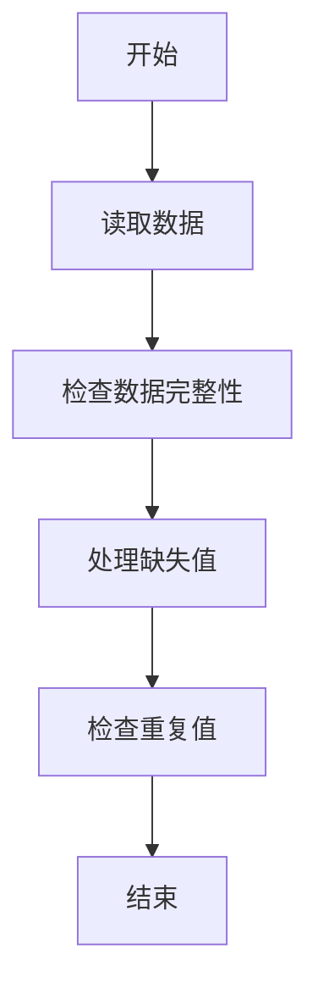
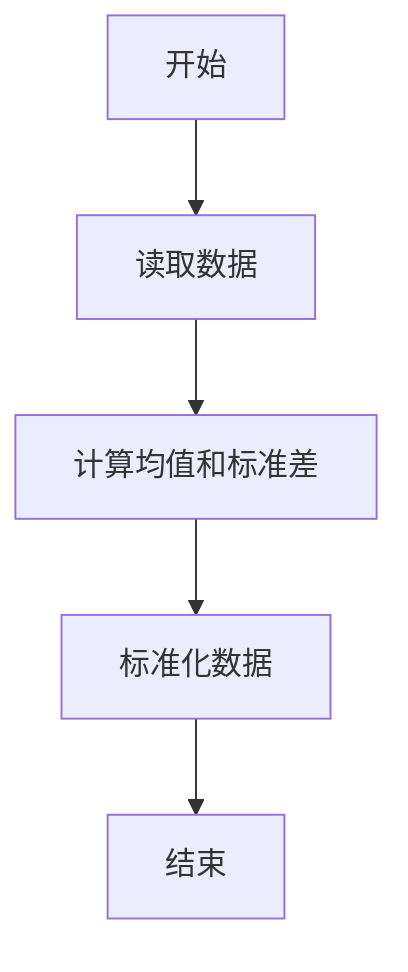
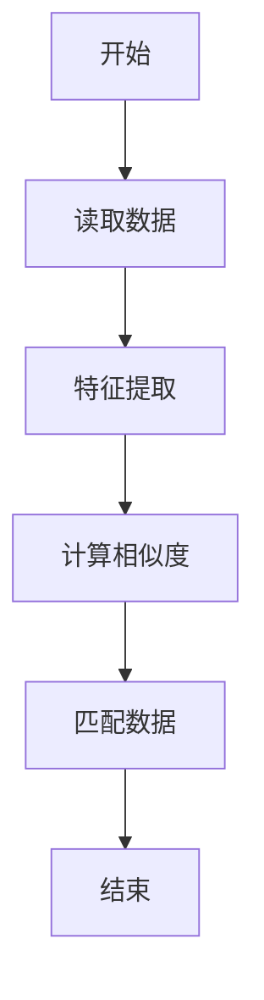
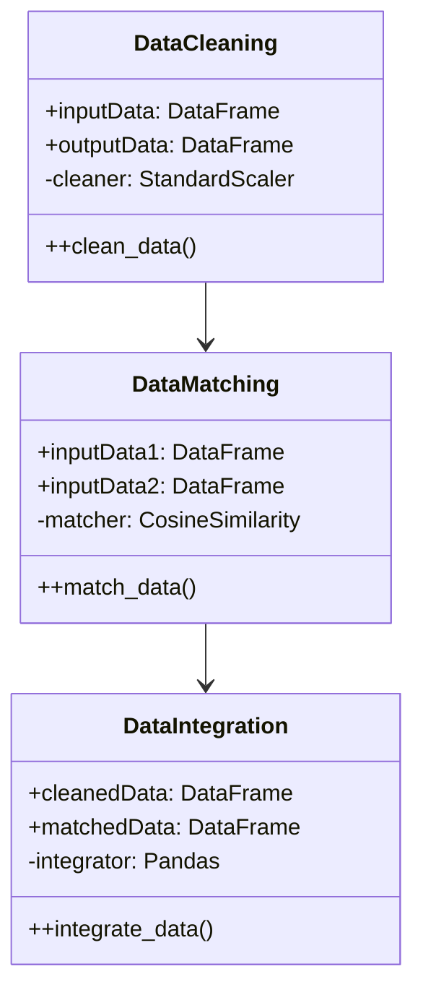
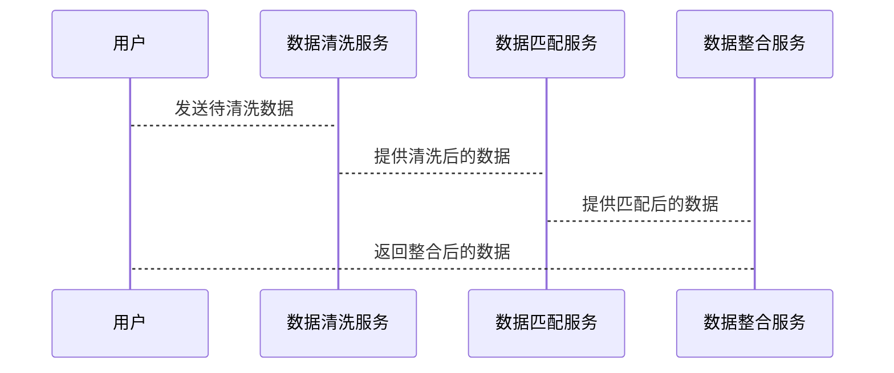

                 


# 金融监管科技数据质量控制平台

> 关键词：金融监管、数据质量、平台架构、数据清洗、数据匹配、数据标准化

> 摘要：金融监管科技数据质量控制平台是确保金融数据准确性和完整性的重要工具。本文从背景介绍、核心概念、算法原理、系统架构到项目实战，详细探讨了如何构建一个高效的数据质量控制平台，帮助金融监管机构提高数据处理效率和准确性。

---

## 第一部分: 金融监管科技数据质量控制平台概述

### 第1章: 问题背景与数据质量控制的重要性

#### 1.1 金融监管科技的发展现状

- **1.1.1 金融监管科技的定义与特点**  
  金融监管科技（FinTech）是指利用现代信息技术手段，如大数据、人工智能和区块链等，来优化和创新金融监管模式。其特点是高效性、智能化和数据驱动。

- **1.1.2 金融监管科技的核心要素**  
  包括数据采集、数据分析、风险评估和监管报告等关键环节。

- **1.1.3 数据在金融监管中的关键作用**  
  数据是金融监管的基础，直接影响监管决策的准确性和及时性。

#### 1.2 数据质量问题的背景与挑战

- **1.2.1 数据质量问题的定义**  
  数据质量问题指数据中的错误、不一致、缺失或冗余等问题，影响数据的准确性和可用性。

- **1.2.2 金融监管中数据质量问题的表现形式**  
  包括数据格式不统一、数据源冲突、数据冗余等。

- **1.2.3 数据质量问题对金融监管的影响**  
  数据质量问题可能导致监管决策失误，影响金融市场稳定。

#### 1.3 数据质量控制平台的必要性

- **1.3.1 数据质量控制的目标**  
  提供高效、准确的数据处理工具，确保数据质量和一致性。

- **1.3.2 数据质量控制的边界与外延**  
  数据质量控制的边界包括数据采集、清洗、标准化和匹配，外延则涉及数据存储和应用。

- **1.3.3 数据质量控制的核心要素组成**  
  包括数据清洗、数据标准化、数据匹配和数据整合模块。

---

### 第2章: 数据质量管理的核心概念与联系

#### 2.1 数据质量管理的原理

- **2.1.1 数据清洗的原理**  
  数据清洗旨在去除数据中的错误和冗余，确保数据的准确性和一致性。

- **2.1.2 数据标准化的原理**  
  数据标准化通过统一数据格式和编码，确保数据在不同系统间可互操作。

- **2.1.3 数据匹配的原理**  
  数据匹配通过算法识别和纠正数据中的不一致，确保数据的连贯性。

#### 2.2 数据质量管理的核心要素对比

- **2.2.1 数据清洗与数据标准化的对比**  
  数据清洗侧重于去除错误，数据标准化侧重于统一格式。

- **2.2.2 数据匹配与数据整合的对比**  
  数据匹配关注数据的一致性，数据整合关注数据的集成。

- **2.2.3 数据质量管理流程的对比**  
  数据清洗、标准化、匹配和整合是数据质量管理的四个关键步骤。

#### 2.3 数据质量管理的ER实体关系图

```mermaid
erDiagram
    customer[CUSTOMER] {
        id : integer
        name : string
        address : string
    }
    transaction[TRANSACTION] {
        id : integer
        amount : integer
        date : string
    }
    account[ACCOUNT] {
        id : integer
        balance : integer
        type : string
    }
    CUSTOMER -> ACCOUNT : "has"
    CUSTOMER -> TRANSACTION : "makes"
    ACCOUNT -> TRANSACTION : "contains"
```

---

## 第二部分: 数据质量控制平台的核心算法与系统架构

### 第3章: 数据质量控制平台的算法原理

#### 3.1 数据清洗算法

- **3.1.1 数据清洗算法的数学模型**  
  数据清洗可以通过机器学习算法识别异常值，公式如下：  
  $$异常值 = 数据点 - 均值$$

- **3.1.2 数据清洗算法的流程图**



- **3.1.3 数据清洗算法的Python实现**

```python
import pandas as pd

def data_cleaning(df):
    # 处理缺失值
    df.dropna(inplace=True)
    # 处理重复值
    df.drop_duplicates(inplace=True)
    return df
```

#### 3.2 数据标准化算法

- **3.2.1 数据标准化算法的数学模型**  
  标准化公式：  
  $$x_{scaled} = \frac{x - \mu}{\sigma}$$  
  其中，$\mu$ 是均值，$\sigma$ 是标准差。

- **3.2.2 数据标准化算法的流程图**



- **3.2.3 数据标准化算法的Python实现**

```python
from sklearn.preprocessing import StandardScaler

def data_standardization(df):
    scaler = StandardScaler()
    df_standardized = scaler.fit_transform(df)
    return df_standardized
```

### 第4章: 数据匹配与整合算法

#### 4.1 数据匹配算法

- **4.1.1 数据匹配算法的数学模型**  
  使用余弦相似度计算数据匹配程度：  
  $$similarity = \cos(\theta) = \frac{\sum{a \times b}}{\sqrt{\sum{a^2}} \times \sqrt{\sum{b^2}}}$$

- **4.1.2 数据匹配算法的流程图**



- **4.1.3 数据匹配算法的Python实现**

```python
from sklearn.metrics.pairwise import cosine_similarity

def data_matching(df1, df2):
    similarity_matrix = cosine_similarity(df1, df2)
    matched_indices = np.argmax(similarity_matrix, axis=1)
    return matched_indices
```

---

## 第三部分: 金融监管科技数据质量控制平台的系统架构

### 第5章: 系统分析与架构设计

#### 5.1 问题场景介绍

- 数据来源多样，格式不统一，导致数据处理复杂。
- 数据量大，需要高效的处理算法和架构支持。

#### 5.2 项目介绍

- 数据质量控制平台旨在解决金融监管中的数据质量问题。
- 平台功能包括数据清洗、标准化、匹配和整合。

#### 5.3 系统功能设计

- **领域模型图**



#### 5.4 系统架构设计

- **系统架构图**

```mermaid
docker
    service 数据清洗服务 {
        publish 5000
        command python cleaner_service.py
    }
    service 数据匹配服务 {
        publish 5001
        command python matcher_service.py
    }
    service 数据整合服务 {
        publish 5002
        command python integrator_service.py
    }
    数据清洗服务 --> 数据匹配服务
    数据匹配服务 --> 数据整合服务
```

#### 5.5 系统接口设计

- 数据清洗接口：`POST /api/clean`
- 数据匹配接口：`POST /api/match`
- 数据整合接口：`POST /api/integrate`

#### 5.6 系统交互序列图



---

## 第四部分: 项目实战

### 第6章: 数据质量控制平台的实战部署

#### 6.1 环境安装

- 安装Python和相关库：`pip install pandas numpy scikit-learn`

#### 6.2 核心代码实现

- **数据清洗模块**

```python
import pandas as pd

def data_cleaning(df):
    df.dropna(inplace=True)
    df.drop_duplicates(inplace=True)
    return df
```

- **数据标准化模块**

```python
from sklearn.preprocessing import StandardScaler

def data_standardization(df):
    scaler = StandardScaler()
    df_standardized = scaler.fit_transform(df)
    return df_standardized
```

- **数据匹配模块**

```python
from sklearn.metrics.pairwise import cosine_similarity

def data_matching(df1, df2):
    similarity_matrix = cosine_similarity(df1, df2)
    matched_indices = np.argmax(similarity_matrix, axis=1)
    return matched_indices
```

#### 6.3 代码应用解读与分析

- 数据清洗模块通过去除缺失值和重复值，确保数据的干净性。
- 数据标准化模块通过标准化处理，确保数据在不同特征上的可比性。
- 数据匹配模块通过余弦相似度算法，实现数据的一致性匹配。

#### 6.4 案例分析

- **案例背景**：某银行的交易数据存在格式不统一的问题。
- **处理过程**：首先清洗数据，去除重复值；然后标准化数据，统一格式；最后匹配数据，确保一致性。
- **结果分析**：处理后的数据准确性和一致性显著提高，支持更高效的金融监管。

#### 6.5 项目小结

- 数据质量控制平台通过模块化设计，实现高效的数据处理。
- 平台的应用显著提高了金融监管的效率和准确性。

---

## 第五部分: 最佳实践与总结

### 第7章: 最佳实践与总结

#### 7.1 小结

- 数据质量控制平台是金融监管科技的重要组成部分。
- 通过模块化设计和高效的算法实现，平台能够显著提高数据处理效率。

#### 7.2 注意事项

- 数据处理前需明确数据需求和目标。
- 数据清洗和标准化需结合业务场景灵活调整。

#### 7.3 拓展阅读

- 推荐阅读《数据质量管理：方法与实践》和《金融监管科技：技术与应用》。

#### 7.4 参考文献

1. 数据质量管理相关文献
2. 金融监管科技相关文献
3. 机器学习算法相关文献

---

## 作者

作者：AI天才研究院/AI Genius Institute & 禅与计算机程序设计艺术 /Zen And The Art of Computer Programming

---

这篇文章通过详细阐述金融监管科技数据质量控制平台的背景、核心概念、算法原理、系统架构和项目实战，为读者提供了全面的知识体系和实践指导。

