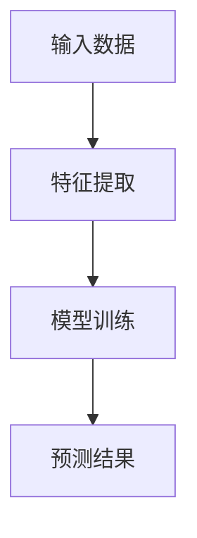
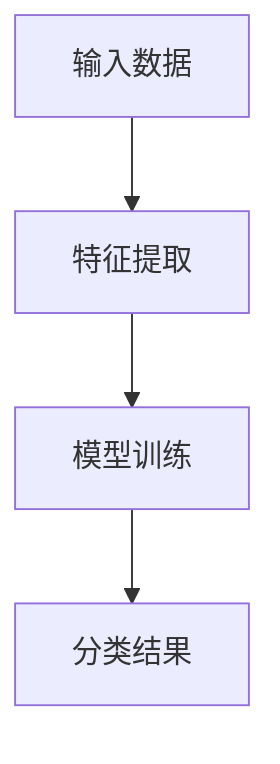
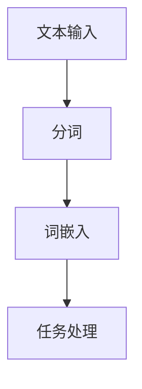
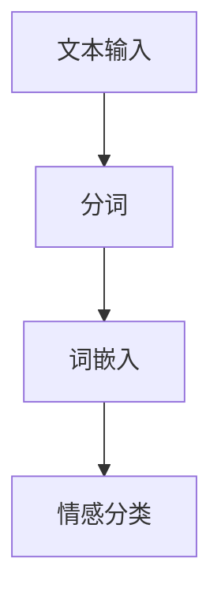
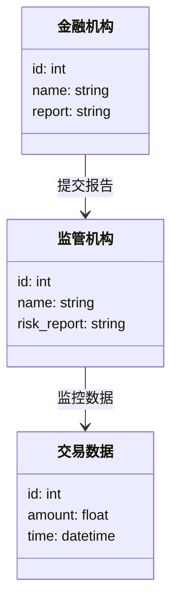
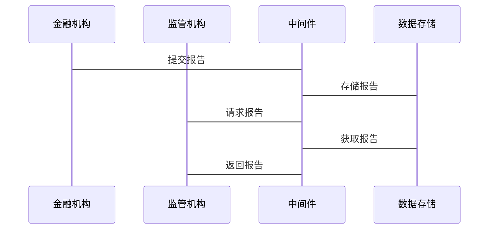

                 


# 《金融监管科技（RegTech）中的AI应用》

> **关键词**：金融监管科技（RegTech），人工智能（AI），机器学习，自然语言处理（NLP），风险管理，合规性

> **摘要**：本文深入探讨了人工智能（AI）技术在金融监管科技（RegTech）中的应用，分析了AI如何通过机器学习、自然语言处理和计算机视觉等技术手段，提升金融监管的效率和准确性。文章从背景介绍、核心概念、算法原理、系统架构设计、项目实战到最佳实践，全面解析了AI在RegTech中的应用，为金融从业者和科技人士提供了深入的技术洞察。

---

## 第1章: 金融监管科技（RegTech）与AI的背景介绍

### 1.1 金融监管科技（RegTech）的定义与特点
RegTech（ Regulatory Technology）是指利用先进的技术手段，如人工智能、大数据、区块链等，来优化和改善金融监管流程的新兴领域。其核心目标是提高监管效率、降低成本，并确保金融市场的合规性和透明性。

**1.1.1 RegTech的核心概念**
RegTech通过技术手段解决传统金融监管中的痛点，例如数据处理复杂、合规性检查繁琐、风险监控滞后等问题。

**1.1.2 RegTech与传统金融监管的区别**
传统金融监管主要依赖人工审查和手动操作，效率低下且容易出错。而RegTech利用自动化技术，能够快速处理大量数据，实时监控市场动态，显著提高了监管效率。

**1.1.3 RegTech的兴起背景**
随着金融科技（FinTech）的快速发展，金融市场的复杂性不断提高，传统的监管方式难以应对新型风险。因此，RegTech应运而生，成为解决这些挑战的重要工具。

---

### 1.2 AI在金融监管中的作用
AI技术为RegTech带来了革命性的变化，使得金融监管更加智能化和自动化。

**1.2.1 AI技术的基本概念**
人工智能（AI）是指计算机系统模拟人类智能的能力，包括学习、推理、自我改进等功能。在金融监管中，AI主要用于数据分析、模式识别和决策支持。

**1.2.2 AI在金融监管中的应用领域**
- **风险监控**：通过机器学习算法实时监测市场风险，预测潜在的金融危机。
- **合规性检查**：利用自然语言处理技术分析企业报告和合同，确保符合监管要求。
- **欺诈检测**：通过异常检测算法识别交易中的欺诈行为。

**1.2.3 AI技术对RegTech的推动作用**
AI技术的引入，使得RegTech能够更高效地处理大量数据，快速识别潜在风险，并提供智能化的监管解决方案。

---

### 1.3 RegTech与AI结合的必要性
随着金融市场的日益复杂化，RegTech与AI的结合变得尤为重要。

**1.3.1 传统金融监管的痛点**
- 数据量大，处理成本高
- 监管规则复杂，人工操作容易出错
- 风险监测滞后，难以及时应对

**1.3.2 AI技术如何解决RegTech中的问题**
- **自动化数据处理**：AI能够快速分析海量数据，提高监管效率。
- **实时监控**：通过AI算法实时监测市场动态，及时发现风险。
- **智能决策支持**：AI提供数据驱动的决策支持，帮助监管机构做出更明智的决策。

**1.3.3 RegTech与AI结合的未来趋势**
随着技术的不断进步，AI在RegTech中的应用将更加广泛和深入，未来的监管将更加智能化和自动化。

---

## 第2章: RegTech中的AI核心概念

### 2.1 AI在RegTech中的核心概念
在RegTech中，AI主要通过机器学习、自然语言处理（NLP）和计算机视觉等技术来实现监管目标。

**2.1.1 机器学习在RegTech中的应用**
机器学习是一种AI技术，通过训练模型从数据中学习规律，并用于预测和分类。在RegTech中，机器学习广泛应用于风险评估、欺诈检测等领域。

**2.1.2 自然语言处理（NLP）在RegTech中的应用**
NLP是一种处理自然语言数据的AI技术，能够理解人类语言的语义和情感。在RegTech中，NLP用于分析企业报告、新闻媒体等内容，提取有用信息。

**2.1.3 计算机视觉在RegTech中的应用**
计算机视觉是一种AI技术，能够识别和处理图像信息。在RegTech中，计算机视觉可以用于识别交易中的异常行为，如识别虚假签名。

---

### 2.2 AI核心概念的原理
理解AI的核心原理是应用AI技术的基础。

**2.2.1 机器学习的基本原理**
机器学习通过训练数据建立模型，然后利用模型进行预测。例如，线性回归模型可以用来预测股票价格的变化趋势。

**2.2.2 NLP的基本原理**
NLP通过分词、句法分析和语义理解等步骤，将自然语言文本转化为计算机可以处理的数据。例如，使用词袋模型（Bag-of-Words）将文本转换为向量表示。

**2.2.3 计算机视觉的基本原理**
计算机视觉通过图像处理和深度学习技术，识别和分析图像中的内容。例如，使用卷积神经网络（CNN）识别图像中的物体。

---

### 2.3 AI核心概念对比表
通过对比分析，可以更好地理解不同AI技术的特点和应用场景。

**2.3.1 机器学习与NLP的对比**
| 特性 | 机器学习 | NLP |
|------|----------|-----|
| 应用场景 | 风险评估、欺诈检测 | 文本分析、情感分析 |
| 数据类型 | 结构化数据（如数值、类别数据） | 非结构化数据（如文本） |

**2.3.2 NLP与计算机视觉的对比**
| 特性 | NLP | 计算机视觉 |
|------|-----|------------|
| 数据类型 | 文本 | 图像、视频 |
| 应用场景 | 信息提取、语义理解 | 图像识别、视频监控 |

**2.3.3 机器学习与计算机视觉的对比**
| 特性 | 机器学习 | 计算机视觉 |
|------|----------|------------|
| 数据类型 | 结构化数据 | 图像、视频 |
| 应用场景 | 预测、分类 | 图像识别、行为分析 |

---

### 2.4 ER实体关系图
通过ER图可以清晰地展示RegTech中的实体关系。

```mermaid
er
  entity 1: 金融机构
  entity 2: 监管机构
  entity 3: 交易数据
  entity 4: 风险报告
  relationship: 金融机构向监管机构提交交易数据，监管机构生成风险报告。
```

---

## 第3章: RegTech中的AI算法原理

### 3.1 机器学习算法
机器学习是RegTech中最常用的AI技术之一。

**3.1.1 线性回归模型**
线性回归是一种简单的回归算法，适用于预测连续型变量。



数学模型：
$$ y = \beta_0 + \beta_1 x + \epsilon $$

**3.1.2 支持向量机（SVM）**
SVM是一种监督学习算法，适用于分类和回归问题。



数学模型：
$$ \text{最大化} \ \frac{1}{2}||\mathbf{w}||^2 $$
$$ \text{subject to} \ y_i (\mathbf{w} \cdot \mathbf{x}_i + b) \geq 1 $$
其中，$\mathbf{w}$ 是权重向量，$b$ 是偏置项，$y_i$ 是标签。

---

### 3.2 自然语言处理（NLP）算法
NLP在RegTech中的应用主要集中在文本分析和信息提取。

**3.2.1 词嵌入（Word Embedding）**
词嵌入是一种将词语表示为低维向量的技术，常用的模型有Word2Vec、GloVe和BERT。



数学模型（BERT）：
$$ \text{BERT}(x) = \text{max}(1, \text{len}(x)/2) \times \text{dmodel} $$

**3.2.2 情感分析**
情感分析是通过NLP技术判断文本的情感倾向，常用于风险评估。



数学模型：
$$ P(\text{positive}|x) = \frac{e^{\mathbf{w} \cdot \mathbf{x}}}{1 + e^{\mathbf{w} \cdot \mathbf{x}}} $$

---

## 第4章: RegTech中的AI系统架构设计

### 4.1 系统功能设计
系统功能设计是AI在RegTech中的核心部分。

**4.1.1 领域模型**
领域模型是系统功能设计的基础，通常使用类图表示。



---

### 4.2 系统架构设计
系统架构设计决定了系统的整体结构和组件之间的关系。


---

### 4.3 接口设计
接口设计是系统架构的重要部分，通常使用序列图表示。



---

## 第5章: RegTech中的AI项目实战

### 5.1 环境安装
项目实战需要安装必要的开发环境和工具。

**5.1.1 安装Python和相关库**
```bash
pip install numpy pandas scikit-learn transformers
```

---

### 5.2 核心代码实现
以下是机器学习和NLP的实现代码示例。

**5.2.1 机器学习模型实现**
```python
from sklearn.linear_model import LinearRegression

# 创建数据集
import numpy as np
X = np.array([1, 2, 3, 4, 5])
y = np.array([2, 4, 5, 4, 5])

# 训练模型
model = LinearRegression()
model.fit(X.reshape(-1, 1), y)

# 预测结果
print(model.predict([[6]]))  # 输出：[[6.8]]
```

**5.2.2 NLP模型实现**
```python
from transformers import pipeline

# 加载预训练模型
nlp = pipeline("sentiment-analysis")

# 情感分析
result = nlp("This is a positive sentence.")
print(result)  # 输出：[{'label': 'POSITIVE', 'score': 0.99}]
```

---

### 5.3 案例分析
通过实际案例分析，展示AI在RegTech中的应用。

**5.3.1 风险监控案例**
使用机器学习模型监控市场风险，预测股票价格的变化趋势。

---

## 第6章: RegTech中的AI最佳实践

### 6.1 小结
本文全面探讨了AI在RegTech中的应用，从背景介绍到系统架构设计，再到项目实战，为读者提供了全面的技术视角。

### 6.2 注意事项
- 数据隐私和安全问题需要高度重视。
- 在实际应用中，需要结合具体业务场景选择合适的AI技术。

### 6.3 拓展阅读
- 推荐阅读《金融监管科技（RegTech）入门与实践》。
- 关注RegTech领域的最新技术动态和应用案例。

---

## 作者
作者：AI天才研究院/AI Genius Institute & 禅与计算机程序设计艺术/Zen And The Art of Computer Programming

---

以上就是《金融监管科技（RegTech）中的AI应用》的完整文章内容。

