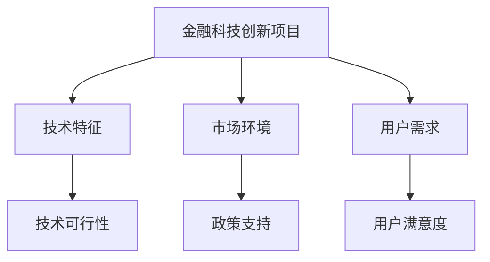
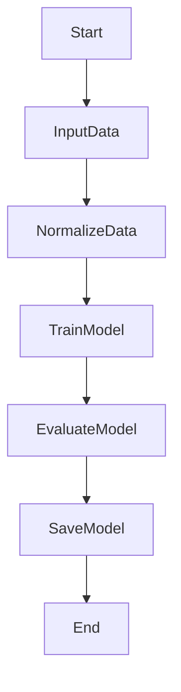
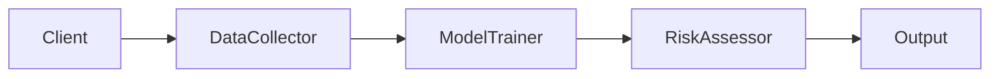

                 


# 金融科技创新项目ROI预测与风险评估

> 关键词：金融科技创新，ROI预测，风险评估，机器学习，金融科技

> 摘要：本文深入探讨了金融科技创新项目中的ROI预测与风险评估方法，结合实际案例，详细讲解了从背景分析、核心概念、算法原理到系统架构设计的全过程，旨在为金融科技创新项目的决策者和从业者提供理论支持和实践指导。

---

## 第1章 金融科技创新项目的背景与现状

### 1.1 金融科技创新的背景
1.1.1 金融科技的定义与内涵  
金融科技（FinTech）是指通过技术手段优化或替代传统金融服务的模式，涵盖支付、借贷、投资、保险等多个领域。  
1.1.2 金融科技创新的驱动力  
技术进步（如人工智能、区块链）、市场需求（如普惠金融）和政策支持是推动FinTech创新的主要动力。  
1.1.3 金融科技对传统金融的颠覆性影响  
FinTech通过数字化和智能化手段，显著提升了金融服务的效率和用户体验。

### 1.2 金融科技创新项目的挑战与机遇
1.2.1 传统金融业务的痛点与难点  
传统金融业务流程繁琐、成本高、体验差，亟需技术手段优化。  
1.2.2 金融科技带来的创新机会  
通过大数据分析、人工智能等技术，FinTech项目可以实现精准营销、智能风控等创新应用。  
1.2.3 金融科技对市场的重塑  
FinTech不仅改变传统金融业态，还催生了新的商业模式和市场参与者。

### 1.3 ROI预测与风险评估的重要性
1.3.1 ROI预测的核心意义  
ROI（Return on Investment）预测帮助项目评估投资回报率，是决策的关键依据。  
1.3.2 风险评估的必要性  
通过风险评估，项目可以识别潜在风险并制定应对策略，降低失败概率。  
1.3.3 金融科技创新项目中的关键平衡点  
在创新与风险之间找到平衡，是FinTech项目成功的关键。

---

## 第2章 金融科技创新项目的核心概念与联系

### 2.1 核心概念定义
2.1.1 金融科技创新项目的定义  
FinTech项目是指利用新兴技术优化或创新金融服务的项目。  
2.1.2 ROI预测的数学模型  
ROI预测模型通过输入变量（如投资金额、收益周期）预测项目回报率。  
2.1.3 风险评估的指标体系  
风险评估指标包括市场风险、技术风险、运营风险等。

### 2.2 核心概念对比分析
2.2.1 不同金融科技创新项目的特征对比  
| 项目类型 | 投资金额 | 收益周期 | 风险等级 |  
|----------|----------|----------|----------|  
| 支付平台 | 中等 | 中等 | 中等 |  
| 人工智能信贷 | 高 | 长 | 高 |  

2.2.2 ROI预测与风险评估的关联性分析  
ROI预测和风险评估相互影响，高风险项目通常具有更高的潜在回报。  
2.2.3 金融科技创新与传统金融业务的差异  
FinTech项目更注重技术创新和用户体验，而传统金融更依赖流程和制度。

### 2.3 实体关系图


---

## 第3章 ROI预测的算法原理与实现

### 3.1 ROI预测的数学模型
3.1.1 线性回归模型  
$$ ROI = \beta_0 + \beta_1 X + \epsilon $$  
其中，$X$ 表示输入变量，$\beta_0$ 和 $\beta_1$ 是回归系数，$\epsilon$ 是误差项。

### 3.2 机器学习算法实现


### 3.3 算法实现代码
```python
import numpy as np
from sklearn.linear_model import LinearRegression

# 示例数据
X = np.array([1, 2, 3, 4, 5]).reshape(-1, 1)
y = np.array([2, 4, 5, 4, 6])

# 训练模型
model = LinearRegression()
model.fit(X, y)

# 预测
 predictions = model.predict(X)
 print("预测值:", predictions)
```

---

## 第4章 风险评估的系统分析与架构设计

### 4.1 系统功能设计
4.1.1 数据采集模块  
收集项目相关的市场数据、技术数据等。  
4.1.2 模型训练模块  
基于历史数据训练风险评估模型。  
4.1.3 风险评估模块  
根据模型输出风险等级。

### 4.2 系统架构设计


---

## 第5章 项目实战与案例分析

### 5.1 项目环境安装
安装必要的库，如scikit-learn、pandas等。

### 5.2 代码实现
```python
import pandas as pd
from sklearn.model_selection import train_test_split
from sklearn.metrics import accuracy_score

# 数据预处理
data = pd.read_csv('fin_data.csv')
X = data.drop('risk', axis=1)
y = data['risk']

# 划分训练集和测试集
X_train, X_test, y_train, y_test = train_test_split(X, y, test_size=0.2)

# 训练模型
from sklearn.tree import DecisionTreeClassifier
model = DecisionTreeClassifier()
model.fit(X_train, y_train)

# 评估模型
predictions = model.predict(X_test)
print("准确率:", accuracy_score(y_test, predictions))
```

### 5.3 案例分析
以区块链支付项目为例，分析其ROI和风险评估。

---

## 第6章 最佳实践与总结

### 6.1 小结
通过科学的方法和工具，可以有效预测ROI并降低风险。

### 6.2 注意事项
数据质量、模型选择和持续监控是关键。

### 6.3 未来趋势
人工智能和大数据技术将在FinTech领域发挥更大作用。

### 6.4 拓展阅读
推荐书籍和论文，深入学习相关知识。

---

作者：AI天才研究院/AI Genius Institute & 禅与计算机程序设计艺术 /Zen And The Art of Computer Programming

