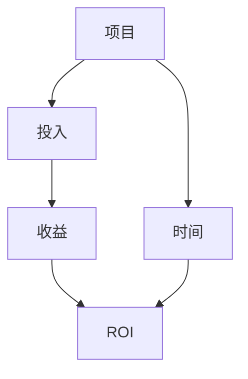
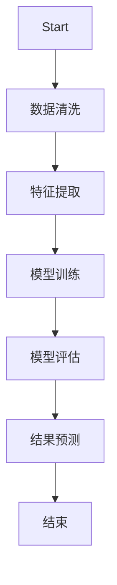
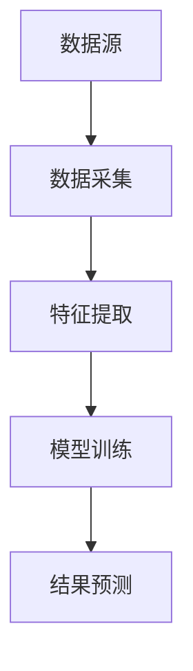
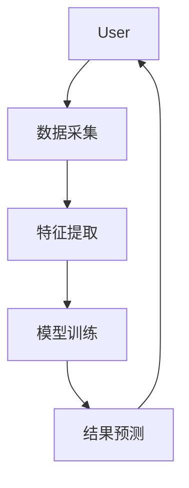

                 


# 《金融科技创新项目ROI预测模型》

## 关键词：金融科技创新，ROI预测，机器学习，算法原理，系统架构，项目实战

## 摘要：本文深入探讨了金融科技创新项目中ROI预测模型的构建与应用。通过分析金融创新项目的特征和挑战，提出了一种基于机器学习的ROI预测方法，结合数学模型和系统架构设计，提供了详细的实现步骤和案例分析，帮助读者理解和应用这一模型。

---

## 第一部分：背景介绍

### 第1章：金融科技创新项目ROI预测模型概述

#### 1.1 问题背景
金融科技创新项目的 ROI 预测是行业中的重要课题，涉及大数据分析和机器学习技术。传统方法依赖于历史数据和专家经验，但难以适应快速变化的市场环境。随着技术进步，数据驱动的方法逐渐成为主流。

#### 1.2 问题描述
金融科技创新项目具有高风险和高回报的特点，准确预测 ROI 对投资决策至关重要。然而，项目的复杂性和不确定性使得传统方法难以有效预测。

#### 1.3 问题解决
通过整合结构化和非结构化数据，利用机器学习算法构建预测模型，能够更准确地评估 ROI，辅助决策者制定优化策略。

#### 1.4 概念结构与核心要素
- 项目投入：包括资金、资源和时间。
- 项目收益：直接和间接的经济回报。
- ROI 计算：净现值、内部收益率等指标。
- 时间因素：项目周期对 ROI 的影响。

---

## 第二部分：核心概念与联系

### 第2章：核心概念与联系

#### 2.1 ROI预测模型的核心原理
数据驱动的 ROI 预测模型利用历史数据和机器学习算法，识别关键因素，预测未来 ROI。模型需要处理多维数据和复杂关系。

#### 2.2 核心概念对比表格
| 方法 | 输入数据 | 模型复杂度 | 预测准确性 |
|------|----------|------------|------------|
| 传统 | 结构化数据 | 低          | 中等        |
| 数据驱动 | 结构化+非结构化 | 高          | 高          |

#### 2.3 ER 实体关系图


---

## 第三部分：算法原理讲解

### 第3章：算法原理与实现

#### 3.1 算法原理
- 线性回归：适用于线性关系，预测 ROI 的趋势。
- 支持向量回归：处理非线性关系，提升预测精度。
- 随机森林与梯度提升树：集成方法，提高模型鲁棒性。

#### 3.2 算法流程图


#### 3.3 Python 实现
```python
import pandas as pd
from sklearn.model_selection import train_test_split
from sklearn.linear_model import LinearRegression
from sklearn.metrics import mean_squared_error

# 数据加载与预处理
data = pd.read_csv('project_data.csv')
data['时间'] = pd.to_datetime(data['时间'])
data['ROI'] = data['收益'] / data['投入']

# 特征工程
features = ['投入', '时间']
target = 'ROI'

X = data[features]
y = data[target]

# 数据分割
X_train, X_test, y_train, y_test = train_test_split(X, y, test_size=0.2, random_state=42)

# 模型训练
model = LinearRegression()
model.fit(X_train, y_train)

# 预测与评估
y_pred = model.predict(X_test)
print(mean_squared_error(y_test, y_pred))
```

#### 3.4 数学公式
线性回归模型的预测公式为：
$$ ROI = \beta_0 + \beta_1 \times 投入 + \beta_2 \times 时间 + \epsilon $$

---

## 第四部分：系统分析与架构设计

### 第4章：系统分析与架构设计

#### 4.1 系统功能设计
- 数据采集模块：收集项目数据。
- 特征提取模块：生成预测特征。
- 模型训练模块：训练预测模型。
- 结果预测模块：输出 ROI 预测结果。

#### 4.2 系统架构图


#### 4.3 系统接口设计
- 数据接口：提供数据输入和输出的标准格式。
- 模型接口：定义模型训练和预测的 API。

#### 4.4 系统交互流程


---

## 第五部分：项目实战

### 第5章：项目实战

#### 5.1 环境安装
- 安装 Python 和相关库（如 scikit-learn、pandas）。

#### 5.2 核心实现代码
```python
import pandas as pd
from sklearn.ensemble import RandomForestRegressor
from sklearn.metrics import r2_score

# 数据加载
data = pd.read_csv('project_data.csv')

# 特征工程
features = ['投入', '时间']
target = 'ROI'

# 数据分割
X_train, X_test, y_train, y_test = train_test_split(data[features], data[target], test_size=0.2, random_state=42)

# 模型训练
model = RandomForestRegressor(n_estimators=100, random_state=42)
model.fit(X_train, y_train)

# 预测与评估
y_pred = model.predict(X_test)
print(r2_score(y_test, y_pred))
```

#### 5.3 实际案例分析
通过一个具体案例，详细分析数据预处理、模型训练和结果解读的过程，帮助读者理解实际应用中的步骤和注意事项。

---

## 第六部分：总结与展望

### 第6章：总结与展望

#### 6.1 最佳实践 tips
- 数据预处理是关键，确保数据质量。
- 选择合适的模型，并进行交叉验证。
- 定期更新模型，适应市场变化。

#### 6.2 小结
本文详细介绍了 ROI 预测模型的构建过程，从数据准备到模型实现，再到结果分析，为读者提供了全面的指导。

#### 6.3 注意事项
- 数据隐私和安全问题需重视。
- 模型结果仅供参考，需结合实际进行调整。

#### 6.4 拓展阅读
推荐相关书籍和论文，进一步深入学习 ROI 预测和机器学习技术。

---

## 作者：AI天才研究院/AI Genius Institute & 禅与计算机程序设计艺术 /Zen And The Art of Computer Programming

