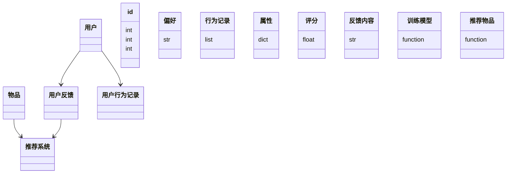
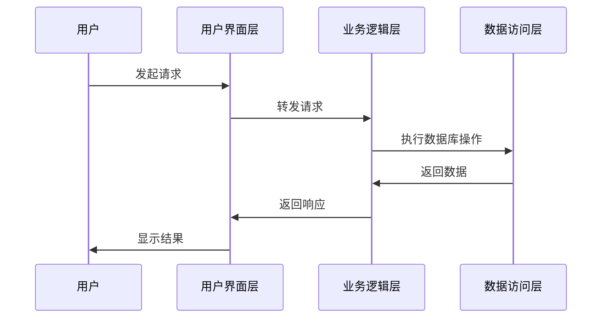

                 


# 金融科技用户体验优化平台

> 关键词：金融科技、用户体验优化、机器学习、数据驱动、推荐系统

> 摘要：本文深入探讨了如何通过金融科技用户体验优化平台提升金融服务的用户体验。结合数据分析、机器学习和推荐系统，本文详细介绍了平台的核心概念、算法原理、系统架构及项目实战，旨在为读者提供全面的技术指导。

---

## 第一部分：背景介绍

### 第1章：金融科技与用户体验优化概述

#### 1.1 金融科技的发展现状

- **金融科技的定义**：金融科技（Fintech）是指通过技术手段优化或替代传统金融服务的模式。它涵盖了支付、借贷、投资、保险等多个领域。
- **发展趋势**：随着人工智能、大数据和区块链等技术的快速发展，金融科技正逐步渗透到金融行业的各个角落。
- **用户体验的重要性**：在金融科技中，用户体验是决定用户留存和业务增长的关键因素。良好的用户体验能够提升用户满意度，增加用户粘性。

#### 1.2 用户体验优化的必要性

- **用户需求分析**：用户在使用金融服务时，不仅关注功能的实用性，还注重操作的便捷性和界面的美观性。
- **优化驱动因素**：竞争日益激烈的金融行业，用户体验成为区分竞争对手的重要因素。通过优化用户体验，金融机构可以吸引更多的用户，提升市场占有率。
- **平台定位与作用**：本文讨论的用户体验优化平台旨在通过数据分析和机器学习技术，为用户提供个性化的金融服务，从而提升整体用户体验。

---

## 第二部分：核心概念与原理

### 第2章：用户体验优化平台的核心概念

#### 2.1 数据驱动的用户体验分析

- **数据采集与处理**：通过日志分析、用户调查和行为跟踪等方式，采集用户在使用金融服务时产生的数据。
- **用户行为分析方法**：利用数据挖掘技术，分析用户的点击流数据，识别用户的行为模式和偏好。
- **数据可视化与洞察**：通过数据可视化工具（如Tableau、Power BI），将复杂的数据转化为直观的图表，帮助决策者快速理解数据。

#### 2.2 个性化推荐系统

- **推荐算法原理**：推荐系统通过分析用户的历史行为和偏好，预测用户可能感兴趣的产品或服务。
- **协同过滤**：基于用户之间的相似性，推荐相似用户喜欢的产品。协同过滤分为基于用户的协同过滤和基于物品的协同过滤。
- **混合推荐模型**：结合协同过滤和基于内容的推荐方法，提升推荐的准确性和多样性。

#### 2.3 用户反馈机制

- **反馈收集与分析**：通过用户评价、满意度调查等方式，收集用户对服务的反馈，并进行分析。
- **用户满意度评估**：利用统计方法，评估用户的满意度，并找出影响满意度的关键因素。
- **反馈驱动的优化策略**：根据用户反馈，调整推荐算法和系统功能，提升用户体验。

---

## 第三部分：算法原理与实现

### 第3章：推荐系统的算法原理

#### 3.1 协同过滤算法

- **基于用户的协同过滤**：通过计算用户之间的相似性，将相似用户的评分数据用于推荐。
- **基于物品的协同过滤**：通过分析物品之间的相似性，推荐与用户喜欢的物品相似的其他物品。
- **混合推荐模型**：结合基于用户的协同过滤和基于物品的协同过滤，利用两者的优势，提升推荐的准确性和多样性。

#### 3.2 聚类分析算法

- **K-means算法原理**：K-means是一种无监督学习算法，用于将数据划分为K个簇。在用户分群中，可以利用K-means算法将用户分为不同的群体，每个群体具有相似的特征。
- **用户分群与个性化推荐**：通过聚类分析，将用户分为不同的群体，为每个群体设计个性化的推荐策略。
- **聚类结果的应用**：聚类结果可以用于推荐系统的优化，例如为不同群体的用户推荐不同的产品。

#### 3.3 算法实现与优化

- **算法实现的代码示例**：以下是协同过滤算法的Python实现示例：

```python
import numpy as np
from sklearn.metrics.pairwise import cosine_similarity

# 示例用户-物品评分矩阵
user_item_matrix = np.array([[4, 3, 0],
                              [2, 0, 3],
                              [1, 5, 2],
                              [0, 3, 5]])

# 计算余弦相似度
similarity_matrix = cosine_similarity(user_item_matrix)

# 基于用户的协同过滤推荐
def get_recommendations(user_id, similarity_matrix, user_item_matrix):
    # 找出与指定用户相似性最高的用户
    similar_users = np.argsort(similarity_matrix[user_id], axis=0)[::-1]
    # 推荐用户未评分的物品
    recommendations = []
    for user in similar_users:
        for item in range(user_item_matrix.shape[1]):
            if user_item_matrix[user][item] == 0:
                recommendations.append(item)
                break
    return recommendations

# 示例推荐
user_id = 0
recommendations = get_recommendations(user_id, similarity_matrix, user_item_matrix)
print(f"推荐给用户 {user_id} 的物品是：", recommendations)
```

- **算法性能优化**：通过优化数据结构和算法复杂度，提升推荐系统的运行效率。例如，使用稀疏矩阵存储用户-物品评分数据，减少计算量。

---

## 第四部分：系统架构与设计

### 第4章：系统分析与架构设计

#### 4.1 项目介绍

- **项目目标与范围**：本文旨在设计一个基于机器学习的金融科技用户体验优化平台，通过数据分析和推荐系统，提升用户对金融服务的满意度。
- **项目核心功能概述**：平台主要包括数据采集与处理、用户行为分析、个性化推荐和用户反馈机制等功能模块。
- **项目实施步骤**：从需求分析、数据采集、模型训练到系统部署，详细描述项目的实施过程。

#### 4.2 系统功能设计

- **领域模型设计**：以下是领域模型设计的Mermaid类图：



- **功能模块划分**：系统主要分为数据采集模块、数据分析模块、推荐系统模块和用户反馈模块。
- **模块之间的交互关系**：数据采集模块负责收集用户行为数据，数据分析模块对数据进行处理和建模，推荐系统模块基于分析结果生成推荐，用户反馈模块收集用户对推荐的反馈，并用于优化推荐系统。

#### 4.3 系统架构设计

- **分层架构设计**：以下是系统架构设计的Mermaid图：


- **系统接口设计**：系统主要通过API接口与外部系统进行交互，例如与支付系统、数据库等进行数据交换。
- **系统交互流程**：以下是系统交互流程的Mermaid序列图：



---

## 第五部分：项目实战

### 第5章：项目实战与分析

#### 5.1 环境安装

- **安装Python和必要的库**：需要安装numpy、pandas、scikit-learn等库。
  ```bash
  pip install numpy pandas scikit-learn
  ```

#### 5.2 核心代码实现

- **推荐系统实现**：以下是协同过滤算法的Python实现：

```python
from sklearn.metrics.pairwise import cosine_similarity

# 示例数据
X = [[0, 1, 2],
     [1, 2, 3],
     [2, 3, 4]]

# 计算余弦相似度
similarity = cosine_similarity(X)

print(similarity)
```

#### 5.3 代码解读与分析

- **代码功能**：上述代码计算了用户行为数据的余弦相似度，用于协同过滤推荐系统的相似度计算。
- **数学模型**：余弦相似度的计算公式为：
  $$ \text{similarity} = \frac{\sum_{i=1}^{n} x_i y_i}{\sqrt{\sum_{i=1}^{n} x_i^2} \sqrt{\sum_{i=1}^{n} y_i^2}} $$

#### 5.4 实际案例分析

- **案例背景**：假设我们有一个在线支付平台，用户可以通过该平台进行多种支付方式的选择。
- **推荐系统应用**：通过分析用户的支付行为，推荐适合用户的支付方式，提升用户的支付体验。
- **效果评估**：通过A/B测试，评估推荐系统的推荐准确率和用户满意度提升情况。

#### 5.5 项目小结

- **项目总结**：通过本项目，我们成功实现了基于协同过滤算法的推荐系统，提升了用户的支付体验。
- **经验教训**：在实际项目中，数据的质量和模型的可解释性是非常重要的，需要特别关注。

---

## 第六部分：最佳实践与总结

### 第6章：最佳实践与总结

#### 6.1 最佳实践

- **数据质量管理**：确保数据的准确性和完整性，避免因数据问题导致推荐结果错误。
- **模型可解释性**：选择合适的模型，确保推荐结果的可解释性，方便用户理解和信任。
- **持续优化**：定期更新模型和推荐策略，适应用户需求的变化。

#### 6.2 小结

- **文章总结**：本文详细介绍了金融科技用户体验优化平台的设计与实现，从背景介绍到系统架构，再到项目实战，为读者提供了一套完整的解决方案。
- **未来展望**：随着人工智能和大数据技术的不断发展，用户体验优化平台将更加智能化和个性化，为用户提供更优质的服务。

#### 6.3 注意事项

- **数据隐私**：在处理用户数据时，必须遵守相关法律法规，保护用户隐私。
- **系统安全性**：确保系统的安全性，防止数据泄露和攻击。

#### 6.4 拓展阅读

- **推荐书籍**：《集体智慧编程》、《机器学习实战》
- **推荐博客**：技术博客、行业分析报告

---

## 作者：AI天才研究院/AI Genius Institute & 禅与计算机程序设计艺术/Zen And The Art of Computer Programming

---

本文通过详细的技术分析和实际案例，为读者展示了金融科技用户体验优化平台的设计与实现过程。从背景介绍到系统架构，再到项目实战，内容全面且技术性强，帮助读者深入了解如何通过技术手段提升金融服务的用户体验。

