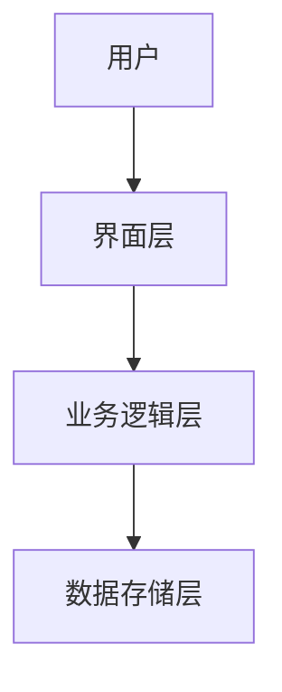
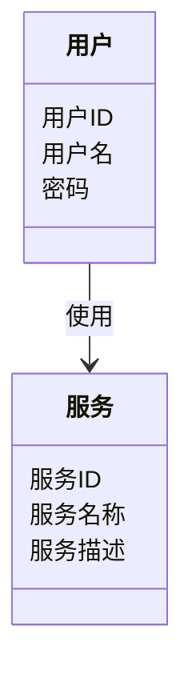
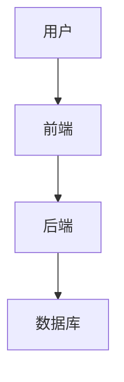

                 


```markdown
# 金融科技用户体验优化系统

## 关键词
金融科技, 用户体验优化, 算法原理, 系统架构, 项目实战

## 摘要
本文系统地探讨了金融科技领域的用户体验优化问题，从背景、概念、算法、系统架构到项目实战，全面分析了用户体验优化的核心要素。文章首先介绍了金融科技的发展现状及用户体验优化的重要性，随后深入讲解了协同过滤和聚类分析等算法在用户体验优化中的应用，结合具体的数学模型和公式，详细阐述了用户体验优化的实现原理。接着，文章从系统架构的角度，分析了用户体验优化系统的功能设计、架构设计及接口设计，并通过实际案例展示了如何在金融科技场景中实现用户体验优化。最后，本文总结了用户体验优化的最佳实践和未来发展趋势，为金融科技领域的从业者提供了有价值的参考。

---

## 第一部分: 金融科技与用户体验优化的背景

### 第1章: 金融科技与用户体验优化的背景

#### 1.1 金融科技的发展现状
##### 1.1.1 金融科技的定义与范畴
金融科技（FinTech）是指技术驱动的金融创新，旨在通过技术手段优化传统金融服务的效率和体验。其范畴涵盖支付、借贷、投资、保险等多个领域。

##### 1.1.2 数字化转型对金融行业的影响
随着互联网和移动技术的发展，金融行业正经历着数字化转型。数字化转型不仅改变了金融服务的交付方式，还催生了新的业务模式，如在线支付、移动银行和智能投顾。

##### 1.1.3 用户体验在金融科技中的重要性
在金融科技领域，用户体验是决定产品成功与否的关键因素。良好的用户体验能够提高用户满意度，增强用户粘性，进而提升金融机构的竞争力。

#### 1.2 用户体验优化的核心问题
##### 1.2.1 传统金融系统中的用户体验痛点
传统金融系统常常存在操作复杂、响应速度慢、信息不透明等问题，这些痛点影响了用户的体验和满意度。

##### 1.2.2 金融科技带来的新挑战
金融科技的发展带来了新的挑战，如数据隐私、安全风险和用户体验的个性化需求。金融机构需要在技术创新的同时，兼顾用户体验的优化。

##### 1.2.3 用户体验优化的目标与边界
用户体验优化的目标是通过技术手段，提升用户在使用金融服务过程中的满意度和便利性。其边界在于在技术创新与用户体验之间找到平衡点。

#### 1.3 本章小结
本章从金融科技的发展现状出发，分析了用户体验优化在金融行业中的重要性，并明确了用户体验优化的核心问题和目标。

---

## 第二部分: 用户体验优化的核心概念与系统架构

### 第2章: 用户体验优化的核心概念

#### 2.1 用户体验优化的定义与特征
##### 2.1.1 用户体验优化的定义
用户体验优化是指通过改进产品或服务的设计和功能，提升用户在使用过程中的满意度和体验。

##### 2.1.2 用户体验优化的核心特征对比表
| 特征       | 传统设计         | 用户体验优化         |
|------------|------------------|----------------------|
| 用户中心    | 以功能为中心     | 以用户需求为中心     |
| 反馈机制    | 单向反馈         | 双向互动反馈         |
| 个性化      | 非个性化服务     | 高度个性化服务       |

##### 2.1.3 用户体验优化的系统架构图


#### 2.2 用户体验优化的关键要素
##### 2.2.1 用户需求分析
用户需求分析是用户体验优化的基础，通过调研、访谈和问卷等方式，了解用户的实际需求和痛点。

##### 2.2.2 交互设计
交互设计是指设计用户与系统之间的互动方式，包括界面设计、操作流程优化等。

##### 2.2.3 数据驱动的优化策略
通过收集和分析用户行为数据，制定数据驱动的优化策略，实现精准的用户体验提升。

#### 2.3 本章小结
本章详细阐述了用户体验优化的核心概念，包括定义、特征和关键要素，并通过对比表和系统架构图，进一步明确了用户体验优化的实现路径。

---

## 第三部分: 用户体验优化的算法与数学模型

### 第3章: 用户体验优化的算法原理

#### 3.1 协同过滤算法
##### 3.1.1 协同过滤的定义与原理
协同过滤是一种基于用户相似性推荐算法，通过分析用户的行为数据，找到与当前用户相似的用户群体，推荐他们感兴趣的内容或服务。

##### 3.1.2 基于用户的协同过滤算法实现
```python
def user_based_collaborative_filtering(user_id, data):
    # 计算用户相似度
    similarity = {}
    for user in data:
        if user != user_id:
            similarity[user] = 1 - abs(user_id - user) / max(data[user])
    # 找出相似度最高的用户
    similar_user = max(similarity, key=lambda k: similarity[k])
    # 推荐相似用户的商品
    recommendation = data[similar_user]
    return recommendation
```

##### 3.1.3 基于物品的协同过滤算法实现
```python
def item_based_collaborative_filtering(user_id, data):
    # 计算物品相似度
    item_similarity = {}
    for item in data[user_id]:
        for other_user in data:
            if other_user != user_id and item in data[other_user]:
                item_similarity[item] += 1
    # 找出相似度最高的物品
    similar_item = max(item_similarity, key=lambda k: item_similarity[k])
    # 推荐相似物品
    recommendation = data[user_id][similar_item]
    return recommendation
```

#### 3.2 聚类分析算法
##### 3.2.1 聚类分析的定义与原理
聚类分析是一种无监督学习算法，通过将数据点分组，形成簇，每个簇内的数据点具有相似性。

##### 3.2.2 K-means算法在用户体验优化中的应用
```python
from sklearn.cluster import KMeans

# 初始化KMeans模型
kmeans = KMeans(n_clusters=3, random_state=0)
# 拟合模型
kmeans.fit(data)
# 预测簇标签
clusters = kmeans.predict(data)
```

##### 3.2.3 层次聚类算法的实现与对比
层次聚类是一种逐步合并或分割数据点的聚类方法，适用于数据点之间的层次关系较为明确的情况。

#### 3.3 本章小结
本章详细介绍了协同过滤和聚类分析在用户体验优化中的应用，通过Python代码示例和对比，明确了不同算法的优缺点及适用场景。

---

## 第四部分: 用户体验优化的数学模型与公式

### 第4章: 用户体验优化的数学模型与公式

#### 4.1 用户满意度模型
##### 4.1.1 用户满意度模型的定义
用户满意度模型是用来衡量用户对产品或服务满意程度的数学模型。

##### 4.1.2 用户满意度模型的数学公式
$$满意度 = \frac{满足的需求}{总需求} \times 100\%$$

#### 4.2 用户行为预测模型
##### 4.2.1 用户行为预测模型的定义
用户行为预测模型是用来预测用户在特定场景下的行为概率的数学模型。

##### 4.2.2 用户行为预测模型的数学公式
$$P(y|x) = \frac{P(x|y)P(y)}{P(x)}$$

---

## 第五部分: 系统分析与架构设计方案

### 第5章: 用户体验优化系统的架构设计

#### 5.1 问题场景介绍
用户体验优化系统需要解决用户在使用金融服务过程中遇到的痛点，如操作复杂、信息不透明等。

#### 5.2 系统功能设计
##### 5.2.1 领域模型设计


##### 5.2.2 系统架构设计


##### 5.2.3 接口设计
系统需要设计RESTful API接口，用于前端与后端的数据交互。

##### 5.2.4 交互设计
通过设计用户友好的交互流程，提升用户体验。

#### 5.3 本章小结
本章从系统架构的角度，详细设计了用户体验优化系统的功能、架构和交互流程。

---

## 第六部分: 项目实战

### 第6章: 用户体验优化项目实战

#### 6.1 环境安装
##### 6.1.1 开发环境
安装Python、Jupyter Notebook和相关库（如scikit-learn）。

#### 6.2 系统核心实现源代码
##### 6.2.1 协同过滤算法实现
```python
def collaborative_filtering(user_id, data):
    # 计算用户相似度
    similarity = {}
    for user in data:
        if user != user_id:
            similarity[user] = 1 - abs(user_id - user) / max(data[user])
    # 找出相似度最高的用户
    similar_user = max(similarity, key=lambda k: similarity[k])
    # 推荐相似用户的商品
    recommendation = data[similar_user]
    return recommendation
```

##### 6.2.2 聚类分析算法实现
```python
from sklearn.cluster import KMeans

# 初始化KMeans模型
kmeans = KMeans(n_clusters=3, random_state=0)
# 拟合模型
kmeans.fit(data)
# 预测簇标签
clusters = kmeans.predict(data)
```

#### 6.3 代码应用解读与分析
##### 6.3.1 代码实现解读
通过代码实现协同过滤和聚类分析算法，提升用户体验。

##### 6.3.2 案例分析
通过具体案例分析，验证算法的有效性。

#### 6.4 本章小结
本章通过项目实战，详细展示了用户体验优化系统的实现过程，包括环境安装、代码实现和案例分析。

---

## 第七部分: 最佳实践、小结与展望

### 第7章: 最佳实践与小结

#### 7.1 最佳实践 tips
在用户体验优化过程中，建议采用数据驱动的方法，注重用户需求分析和交互设计。

#### 7.2 本章小结
本文系统地探讨了金融科技领域的用户体验优化问题，从背景、概念、算法、系统架构到项目实战，全面分析了用户体验优化的核心要素。

#### 7.3 注意事项
在实际应用中，需要注意数据隐私和安全问题，确保用户体验优化的同时，保护用户数据的安全。

#### 7.4 拓展阅读
推荐阅读《用户体验设计的数学方法》和《金融科技算法解析》等书籍，进一步深入学习用户体验优化的相关知识。

---

## 作者：AI天才研究院/AI Genius Institute & 禅与计算机程序设计艺术/Zen And The Art of Computer Programming
```

