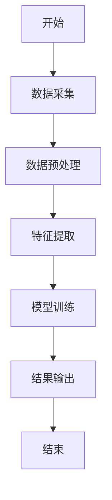
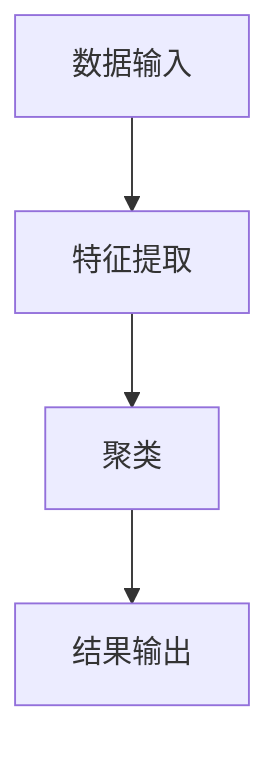
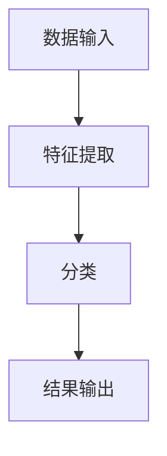
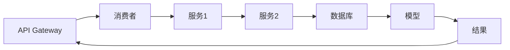

                 


# 金融科技用户行为分析平台

## 关键词：金融科技，用户行为分析，数据挖掘，机器学习，系统架构，项目实战

## 摘要：  
金融科技用户行为分析平台是一种基于大数据和人工智能技术的金融用户行为分析系统，旨在通过对用户行为数据的深度挖掘，揭示用户行为模式和偏好，为金融机构提供精准的用户画像和决策支持。本文将从背景、核心概念、算法原理、系统架构到项目实战，全面解析金融科技用户行为分析平台的构建与实现。

---

# 第一部分: 金融科技用户行为分析平台概述

# 第1章: 金融科技用户行为分析平台的背景与意义

## 1.1 金融科技的发展背景

### 1.1.1 金融科技的定义与特点  
金融科技（FinTech）是指利用现代信息技术手段对传统金融行业进行改革创新，以提高金融服务效率、降低成本、增强用户体验为核心目标的一系列技术和模式的集合。金融科技的特点包括数据驱动、智能化、场景化和高效性。

### 1.1.2 金融科技的核心技术与发展趋势  
金融科技的核心技术包括大数据、人工智能、区块链、云计算和物联网等。随着技术的不断发展，金融科技正在向智能化、个性化和场景化方向演进，用户行为分析成为其中的重要一环。

### 1.1.3 用户行为分析在金融科技中的重要性  
用户行为分析是通过收集和分析用户在金融平台上的行为数据，揭示用户的偏好、需求和行为模式，从而帮助金融机构优化产品设计、提升用户体验和风险控制能力。

---

## 1.2 金融科技用户行为分析平台的定义与目标

### 1.2.1 平台的定义  
金融科技用户行为分析平台是一个基于大数据和人工智能技术的系统，旨在通过收集、处理和分析用户的金融行为数据，提供用户画像、行为预测和决策支持。

### 1.2.2 平台的核心目标与功能  
平台的核心目标包括：  
1. 数据采集：收集用户在金融平台上的行为数据，如点击、浏览、交易等。  
2. 数据分析：通过数据挖掘和机器学习算法，分析用户行为模式。  
3. 用户画像：构建用户画像，揭示用户的特征和需求。  
4. 风险控制：通过行为分析识别潜在风险，如欺诈行为。  

### 1.2.3 平台的边界与外延  
平台的边界包括用户行为数据的采集、存储和分析，外延则包括与用户行为相关的金融业务场景，如投资、借贷和支付等。

---

## 1.3 本章小结  
本章从金融科技的发展背景入手，阐述了用户行为分析在金融科技中的重要性，并定义了金融科技用户行为分析平台的核心目标和功能。

---

# 第二部分: 核心概念与技术原理

# 第2章: 用户行为分析的核心概念与联系

## 2.1 用户行为分析的实体关系图  
```mermaid
er
    actor: 用户
    actor --> user_behavior: 用户行为数据
    user_behavior --> analysis_model: 分析模型
    analysis_model --> result: 分析结果
```

## 2.2 用户行为分析的流程图  


## 2.3 核心概念对比表  
| 概念 | 描述 |
|------|------|
| 用户行为 | 用户在平台上的操作记录 |
| 数据采集 | 从日志、数据库等来源获取数据 |
| 特征提取 | 从数据中提取有用的特征 |
| 模型训练 | 使用机器学习算法训练模型 |

---

## 2.4 本章小结  
本章通过实体关系图和流程图，详细阐述了用户行为分析的核心概念及其联系，并通过对比表进一步明确了各概念的属性和功能。

---

# 第3章: 用户行为分析的算法原理

## 3.1 常见的用户行为分析算法

### 3.1.1 聚类分析  
聚类分析是一种无监督学习算法，用于将用户分成不同的群体，揭示用户的相似性。  


### 3.1.2 分类分析  
分类分析是一种有监督学习算法，用于预测用户的某种行为是否属于某个类别。  


---

## 3.2 算法实现代码示例

### 3.2.1 聚类分析代码示例  
```python
from sklearn.cluster import KMeans
import pandas as pd

# 示例数据
data = pd.DataFrame({
    'x': [1, 2, 3],
    'y': [4, 5, 6]
})

# 模型训练
model = KMeans(n_clusters=2)
model.fit(data)

# 获取聚类结果
labels = model.labels_
print(labels)
```

### 3.2.2 分类分析代码示例  
```python
from sklearn.tree import DecisionTreeClassifier
from sklearn.datasets import make_classification

# 示例数据
X, y = make_classification(n_samples=100, n_features=2, n_classes=2)

# 模型训练
model = DecisionTreeClassifier()
model.fit(X, y)

# 预测结果
print(model.predict(X))
```

---

## 3.3 本章小结  
本章详细介绍了用户行为分析中常用的聚类分析和分类分析算法，并通过代码示例展示了算法的实现过程。

---

# 第三部分: 系统架构与设计

# 第4章: 系统架构与设计

## 4.1 问题场景介绍  
金融科技用户行为分析平台需要支持大规模数据的采集、处理和分析，同时需要满足实时性和高效性的要求。

## 4.2 系统功能设计  
系统功能包括数据采集、数据存储、特征提取、模型训练和结果输出。

## 4.3 系统架构设计  


## 4.4 系统接口设计  
系统接口包括数据采集接口、模型训练接口和结果查询接口。

---

## 4.5 本章小结  
本章通过系统架构设计和接口设计，展示了金融科技用户行为分析平台的整体结构和功能模块。

---

# 第四部分: 项目实战

# 第5章: 项目实战

## 5.1 环境安装  
需要安装Python、机器学习库（如scikit-learn）和数据处理库（如pandas）。

## 5.2 系统核心实现

### 5.2.1 数据采集与预处理  
```python
import pandas as pd

# 数据采集
data = pd.read_csv('user_behavior.csv')

# 数据预处理
data.dropna(inplace=True)
```

### 5.2.2 特征工程  
```python
from sklearn.preprocessing import StandardScaler

# 特征提取
features = data[['x', 'y']]
scaler = StandardScaler()
features_scaled = scaler.fit_transform(features)
```

### 5.2.3 模型训练  
```python
from sklearn.cluster import KMeans

# 模型训练
model = KMeans(n_clusters=3)
model.fit(features_scaled)
```

## 5.3 代码应用解读与分析  
通过代码实现用户行为分析的全过程，包括数据采集、预处理、特征提取和模型训练。

## 5.4 实际案例分析  
以具体案例为例，展示如何通过平台分析用户的金融行为。

---

## 5.5 本章小结  
本章通过实际项目实战，展示了金融科技用户行为分析平台的实现过程，包括环境搭建、数据处理和模型训练。

---

# 第五部分: 总结与展望

# 第6章: 总结与展望

## 6.1 最佳实践 tips  
1. 数据质量是用户行为分析的核心，需重视数据清洗和特征工程。  
2. 模型选择需结合业务场景和数据特点，避免盲目追求复杂算法。  

## 6.2 小结  
本篇文章全面解析了金融科技用户行为分析平台的构建与实现，从背景、核心概念、算法原理到系统架构和项目实战，为读者提供了系统的知识体系。

## 6.3 注意事项  
1. 数据隐私和合规性需严格遵守相关法律法规。  
2. 模型的可解释性是用户行为分析的重要考量因素。  

## 6.4 拓展阅读  
推荐阅读《机器学习实战》和《数据挖掘导论》等书籍，深入学习用户行为分析的技术细节。

---

# 作者：AI天才研究院 & 禅与计算机程序设计艺术

