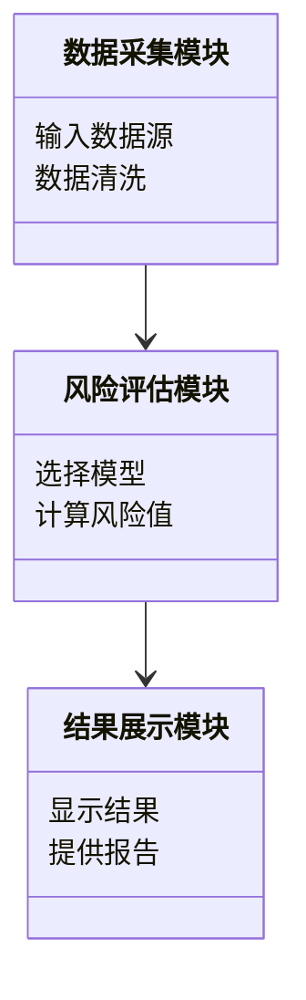
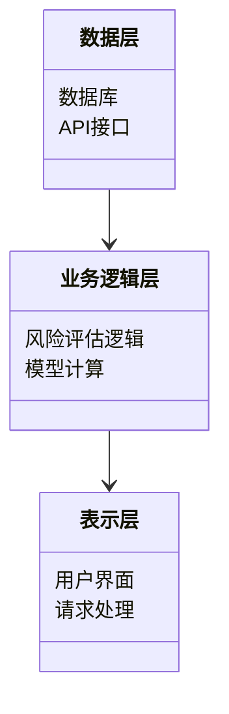
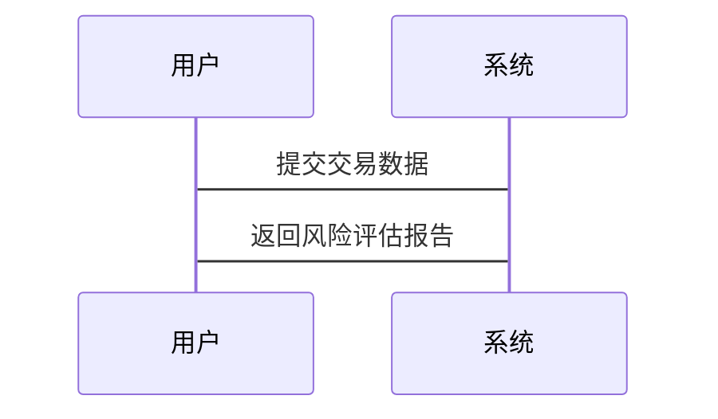

                 


# 《金融衍生品交易对手风险评估》

## 关键词：金融衍生品，交易对手风险，信用风险，市场风险，VaR模型，系统架构设计

## 摘要

本文深入探讨金融衍生品交易对手风险评估的核心概念、数学模型和系统架构设计。通过分析信用风险、市场风险和操作风险，结合VaR模型和信用评分模型，提供一个全面的评估框架。文章还详细介绍了系统的架构设计和实际案例分析，帮助读者掌握如何在实际中应用这些理论和模型。

---

## 第一部分: 金融衍生品交易对手风险评估概述

### 第1章: 金融衍生品与交易对手风险概述

#### 1.1 金融衍生品的基本概念

金融衍生品是一种金融合约，其价值依赖于基础资产（如股票、债券、商品等）的价格变动。常见的衍生品包括期货、期权、掉期和远期合约。它们具有杠杆效应高、风险高、收益高的特点，广泛应用于对冲和投机交易。

#### 1.2 交易对手风险的基本概念

交易对手风险是指在金融交易中，交易对手无法履行合约义务的风险。例如，对手方可能无法按时支付应付款项或履行合约义务。这种风险在衍生品交易中尤为重要，因为衍生品通常需要多次交易对手的配合。

#### 1.3 金融衍生品交易中的风险评估

风险评估是确保交易安全的关键步骤。评估过程包括识别潜在风险、量化风险程度和制定应对策略。常用的评估方法包括信用评分模型和VaR模型。

---

## 第二部分: 交易对手风险评估的核心概念与联系

### 第2章: 核心概念与联系

#### 2.1 交易对手风险的核心概念

交易对手风险主要包括信用风险、市场风险和操作风险。信用风险关注对手的还款能力，市场风险关注市场价格波动的影响，操作风险关注交易过程中的失误或欺诈。

#### 2.2 核心概念的属性特征对比

以下表格对比了三种风险的关键属性：

| 风险类型 | 定义 | 主要影响 | 评估方法 | 对策 |
|----------|------|----------|-----------|------|
| 信用风险 | 对手违约概率 | 财务损失 | 信用评分模型 | 增加抵押 |
| 市场风险 | 市场价格波动 | 资产价值 | VaR模型 | 多元化投资 |
| 操作风险 | 交易过程中的失误 | 交易失败 | 流程审查 | 内部控制 |

#### 2.3 ER实体关系图架构

以下是交易对手风险评估的ER图：

```mermaid
erd diagram
entity 交易对手 {
    关键字段: ID, 名称, 信用评级
}

entity 交易 {
    关键字段: ID, 交易日期, 交易金额
}

entity 风险 {
    关键字段: ID, 风险值, 评估时间
}

交易对手 -[参与]- 交易
交易 -[触发]- 风险
```

---

## 第三部分: 交易对手风险评估的数学模型与算法原理

### 第3章: 数学模型与算法原理

#### 3.1 信用评分模型

信用评分模型用于评估交易对手的信用状况。常用模型包括FICO评分和PD模型。

**模型公式：**
$$ \text{信用评分} = \alpha \times \text{历史违约率} + \beta \times \text{当前信用状况} $$

**步骤：**
1. 收集交易对手的历史数据。
2. 计算历史违约率和当前信用状况。
3. 应用公式得出信用评分。

**案例：**
假设某交易对手的历史违约率为5%，当前信用评分为80分，$\alpha=0.6$，$\beta=0.4$：
$$ \text{信用评分} = 0.6 \times 0.05 + 0.4 \times 0.8 = 0.03 + 0.32 = 0.35 $$

#### 3.2 VaR模型

VaR模型用于衡量市场风险，计算在一定置信水平下的潜在损失。

**模型公式：**
$$ \text{VaR} = \mu \times \text{标准差} \times z $$

**步骤：**
1. 计算资产的平均回报率$\mu$。
2. 计算资产回报率的标准差。
3. 确定置信水平对应的z值。

**案例：**
资产平均回报率为5%，标准差为10%，置信水平为95%（z=1.645）：
$$ \text{VaR} = 0.05 \times 0.10 \times 1.645 = 0.008225 $$

---

## 第四部分: 交易对手风险评估的系统架构设计

### 第4章: 系统架构设计

#### 4.1 系统功能模块设计

系统分为数据采集、风险评估、结果展示三个模块：



#### 4.2 系统架构设计

系统采用分层架构，包括数据层、业务逻辑层和表示层：



#### 4.3 系统接口设计

系统主要接口包括数据输入接口和风险报告接口：



---

## 第五部分: 项目实战

### 第5章: 项目实战

#### 5.1 环境安装

需要安装Python、NumPy、Pandas和Scikit-learn库：

```bash
pip install numpy pandas scikit-learn
```

#### 5.2 核心实现源代码

以下是信用评分模型的Python代码：

```python
import numpy as np
import pandas as pd

def credit_score(history违约率, 当前信用):
    alpha = 0.6
    beta = 0.4
    return alpha * history违约率 + beta * 当前信用

# 示例数据
data = pd.DataFrame({
    '历史违约率': [0.05],
    '当前信用': [0.8]
})

# 计算信用评分
data['信用评分'] = data.apply(lambda x: credit_score(x['历史违约率'], x['当前信用']), axis=1)
print(data)
```

#### 5.3 案例分析

案例：评估某交易对手的风险。

1. 收集交易对手的历史违约率和信用评分。
2. 计算信用评分。
3. 使用VaR模型计算市场风险。

---

## 第六部分: 总结与展望

### 第6章: 总结与展望

#### 6.1 本章小结

本文详细介绍了金融衍生品交易对手风险评估的核心概念、数学模型和系统架构设计。通过理论分析和实际案例，展示了如何应用这些方法进行风险评估。

#### 6.2 展望

未来，随着人工智能的发展，可以引入机器学习模型如XGBoost和神经网络来提高风险评估的准确性。同时，实时监控系统可以帮助及时发现和应对风险。

---

## 作者：AI天才研究院/AI Genius Institute & 禅与计算机程序设计艺术 /Zen And The Art of Computer Programming

---

通过以上思考过程，我可以系统地撰写一篇结构清晰、内容详实的技术博客文章，确保每个部分都符合用户的要求，帮助读者全面理解金融衍生品交易对手风险评估的核心内容。

