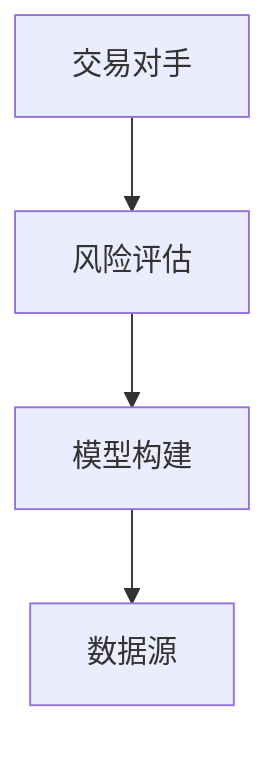
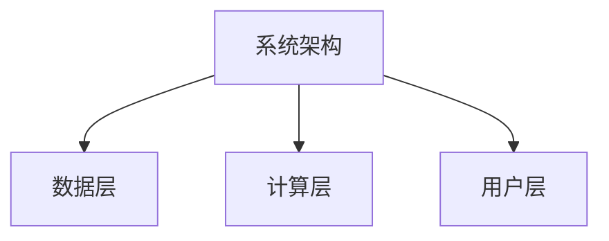
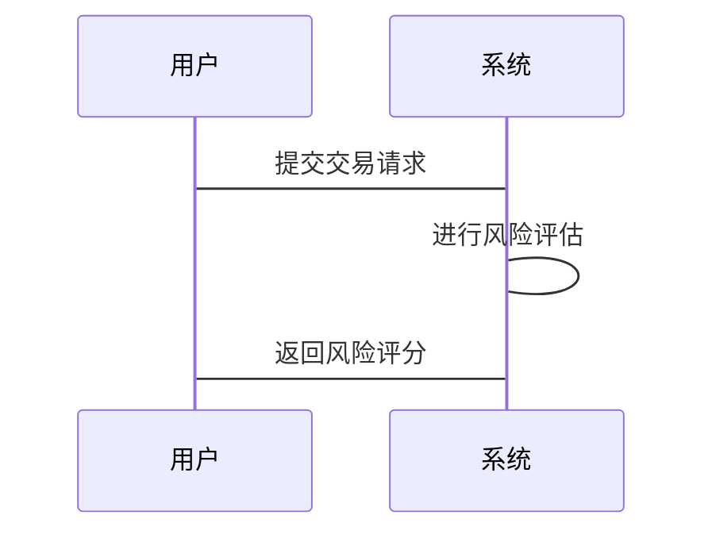

                 


# 金融衍生品交易对手风险评估模型

## 关键词
- 金融衍生品
- 交易对手风险
- 风险评估模型
- 信用风险
- 市场风险
- 系统架构设计
- 项目实战

## 摘要
本文深入探讨了金融衍生品交易对手风险评估模型的构建与应用。通过分析交易对手风险的核心概念，结合数学模型和系统架构设计，详细阐述了如何利用逻辑回归、支持向量机等算法进行风险评估。文章还通过具体项目案例，展示了模型的实际应用和优化过程，为金融机构的风险管理提供了有效的解决方案。

---

# 第一部分: 金融衍生品交易对手风险评估模型概述

## 第1章: 金融衍生品与交易对手风险概述

### 1.1 金融衍生品的基本概念
金融衍生品是指从基础金融工具或其价格衍生出来的金融工具或合同，其价值取决于基础资产的价格变动。常见的金融衍生品包括期货、期权、互换和远期合约等。这些工具具有高杠杆性、高风险性和复杂性，广泛应用于投机、套利和对冲。

#### 1.1.1 金融衍生品的定义
金融衍生品是一种金融合同，其价值取决于基础资产的价格或指数的变动。它可以用于对冲风险或进行投机。

#### 1.1.2 金融衍生品的主要类型
- 期货：约定在未来某一时间以预定价格买卖资产的合同。
- 期权：买方有权在特定时间内以预定价格买入或卖出资产。
- 互换：约定在未来某个时间段内交换现金流的合同。
- 远期合约：非标准化的私下协议，类似于期货。

#### 1.1.3 金融衍生品的市场特点
- 杠杆效应高：少量资金控制大量资产。
- 风险复杂：涉及市场风险、信用风险和操作风险。
- 流动性高：可以在市场中快速买卖。

### 1.2 交易对手风险的基本概念
交易对手风险是指交易对手在履行合同义务时违约的可能性。在金融衍生品交易中，交易对手风险尤为重要，因为衍生品的价值依赖于对手的信用状况。

#### 1.2.1 交易对手风险的定义
交易对手风险是指交易对手未能履行其合同义务的可能性，包括未能按时支付或履行其他义务。

#### 1.2.2 交易对手风险的分类
- 信用风险：交易对手因信用问题无法履行义务。
- 市场风险：市场价格波动导致交易对手的财务状况恶化。
- 操作风险：交易过程中的失误或欺诈行为。

#### 1.2.3 交易对手风险的影响因素
- 交易对手的信用评级。
- 市场波动性。
- 法律和监管环境。
- 交易对手的财务状况。

### 1.3 交易对手风险评估的重要性
在金融衍生品交易中，准确评估交易对手的风险是确保交易安全和机构稳健的关键。

#### 1.3.1 风险评估在金融衍生品交易中的作用
- 识别高风险交易对手，避免重大损失。
- 优化资本配置，降低风险敞口。
- 提高交易透明度，确保合规性。

#### 1.3.2 交易对手风险对金融机构的影响
- 直接影响机构的财务健康和声誉。
- 影响市场参与度和交易活跃度。
- 增加监管合规的压力。

#### 1.3.3 风险评估的必要性与边界
- 必要性：确保交易安全，降低损失。
- 边界：模型只能提供参考，不能完全消除风险。

---

## 第2章: 交易对手风险评估的核心概念与联系

### 2.1 核心概念原理
交易对手风险评估涉及多个核心概念，包括信用风险、市场风险和操作风险。

#### 2.1.1 信用风险与市场风险的关系
- 信用风险：交易对手违约的可能性。
- 市场风险：市场价格波动带来的风险。
- 关系：信用风险受市场风险影响，市场波动可能引发信用问题。

#### 2.1.2 交易对手风险的量化方法
- 信用评分：基于交易对手的信用历史和财务状况。
- 资产价值评估：基于交易对手的资产价值和市场波动。

#### 2.1.3 风险评估模型的构建逻辑
- 数据收集：交易对手的信用历史、财务数据、市场数据。
- 特征提取：关键风险指标，如违约概率（PD）、违约损失率（LGD）。
- 模型训练：使用逻辑回归、支持向量机等算法进行分类或回归。

### 2.2 风险类型对比分析
通过表格和图表比较不同风险类型，帮助读者理解它们的特征和关联。

#### 2.2.1 信用风险与市场风险的特征对比
| 特性       | 信用风险          | 市场风险          |
|------------|-------------------|-------------------|
| 定义       | 对手违约风险      | 价格波动风险      |
| 影响因素   | 对手信用状况      | 市场波动、经济环境 |
| 度量方法   | 信用评分、违约概率| VaR、波动率       |

#### 2.2.2 交易对手风险与其他风险的关联
- 交易对手风险与信用风险密切相关。
- 市场波动可能引发交易对手的信用问题。

#### 2.2.3 风险评估的核心指标
- 违约概率（PD）：交易对手违约的可能性。
- 违约损失率（LGD）：违约时的平均损失比例。
- 风险敞口：机构对交易对手的风险暴露程度。

### 2.3 ER实体关系图
通过ER图展示交易对手、风险评估、模型构建之间的关系。



---

## 第3章: 交易对手风险评估模型的算法原理

### 3.1 模型构建流程
从数据收集到模型优化的完整流程。

#### 3.1.1 数据收集与预处理
- 数据来源：交易对手的信用历史、财务数据、市场数据。
- 数据清洗：处理缺失值、异常值。
- 数据标准化：统一数据格式，确保模型输入一致。

#### 3.1.2 特征选择与提取
- 选择关键特征：如违约概率、资产价值、市场波动率。
- 特征提取：使用主成分分析（PCA）降低维度。

#### 3.1.3 模型训练与验证
- 训练数据：使用历史数据训练模型。
- 验证数据：评估模型的准确性和稳定性。

#### 3.1.4 模型评估与优化
- 评估指标：准确率、召回率、F1分数。
- 模型优化：调整参数，防止过拟合。

### 3.2 风险评估算法
介绍几种常用的算法及其数学模型。

#### 3.2.1 线性回归模型
用于预测交易对手的违约概率。

$$ y = \beta_0 + \beta_1x_1 + \beta_2x_2 + \epsilon $$

其中，$y$ 是违约概率，$x_i$ 是特征变量，$\beta$ 是回归系数。

#### 3.2.2 逻辑回归模型
用于分类交易对手的信用风险。

$$ P(Y=1|X) = \frac{e^{\beta X}}{1 + e^{\beta X}} $$

其中，$Y=1$ 表示违约，$X$ 是特征向量。

#### 3.2.3 支持向量机（SVM）
用于分类交易对手的信用风险。

$$ \text{最大化} \quad \frac{1}{2}||\beta||^2 $$
$$ \text{满足} \quad y_i (\beta x_i + \beta_0) \geq 1 $$

其中，$y_i$ 是类别标签，$x_i$ 是特征向量。

### 3.3 算法比较与选择
通过表格比较不同算法的优缺点。

| 算法       | 优点                          | 缺点                          |
|------------|-------------------------------|-------------------------------|
| 线性回归   | 简单，易于解释                 | 不能处理非线性关系             |
| 逻辑回归   | 适合分类问题                   | 易受数据分布影响               |
| SVM        | 高精度，适合高维数据           | 计算复杂，需要参数调整         |

---

## 第4章: 交易对手风险评估系统的系统分析与架构设计

### 4.1 系统功能设计
交易对手风险评估系统的功能模块。

#### 4.1.1 数据采集模块
- 数据接口：与交易系统、数据库对接。
- 数据处理：清洗和预处理数据。

#### 4.1.2 风险评估模块
- 特征提取：从数据中提取关键特征。
- 模型调用：调用训练好的模型进行评估。

#### 4.1.3 结果展示模块
- 可视化：展示交易对手的风险评分。
- 报告生成：生成风险评估报告。

### 4.2 系统架构设计
使用分层架构设计，确保系统的模块化和可扩展性。



其中，数据层负责数据存储和处理，计算层负责模型训练和评估，用户层负责接口和展示。

### 4.3 系统接口设计
- 数据接口：与交易系统对接。
- API接口：供其他系统调用风险评估结果。

### 4.4 系统交互设计
使用序列图展示用户与系统之间的交互流程。



---

## 第5章: 项目实战——金融衍生品交易对手风险评估系统实现

### 5.1 项目环境配置
- 操作系统：Linux/Windows/MacOS
- 开发工具：Python、Jupyter Notebook
- 依赖库：Pandas、NumPy、Scikit-learn、Matplotlib

### 5.2 核心代码实现

#### 5.2.1 数据预处理
```python
import pandas as pd
import numpy as np

# 加载数据
data = pd.read_csv('交易对手数据.csv')

# 处理缺失值
data = data.dropna()

# 标准化处理
from sklearn.preprocessing import StandardScaler
scaler = StandardScaler()
data_scaled = scaler.fit_transform(data)
```

#### 5.2.2 模型训练
```python
from sklearn.linear_model import LogisticRegression

# 特征选择
features = data_scaled[:, :-1]
labels = data_scaled[:, -1]

# 训练模型
model = LogisticRegression()
model.fit(features, labels)

# 预测结果
predictions = model.predict(features)
```

#### 5.2.3 模型评估
```python
from sklearn.metrics import classification_report

print(classification_report(labels, predictions))
```

### 5.3 项目实现流程
- 数据清洗与预处理。
- 特征选择与提取。
- 模型训练与优化。
- 模型评估与部署。

### 5.4 项目优化与拓展
- 引入机器学习模型，如随机森林、XGBoost，提升模型精度。
- 实时监控交易对手的信用状况，动态调整风险评估。

---

## 第6章: 总结与展望

### 6.1 核心内容总结
- 交易对手风险是金融衍生品交易中的重要风险。
- 风险评估模型是管理和控制风险的关键工具。
- 系统架构设计和算法优化是提高模型性能的重要手段。

### 6.2 未来展望
- 结合机器学习和大数据技术，提升风险评估的准确性和实时性。
- 引入区块链技术，确保数据的安全性和不可篡改性。
- 开发智能化的风险管理系统，实现自动化风险监控和应对。

---

# 作者：AI天才研究院/AI Genius Institute & 禅与计算机程序设计艺术 /Zen And The Art of Computer Programming

