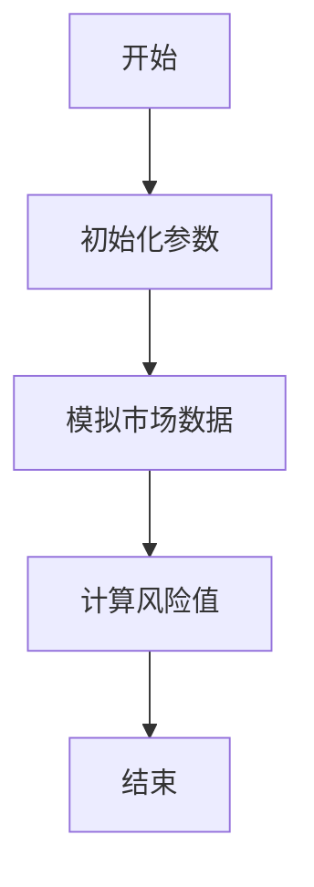
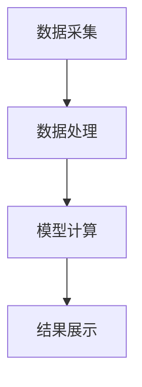

                 


# 金融衍生品交易对手风险量化模型

> 关键词：金融衍生品，交易对手风险，VaR模型，CVaR模型，系统架构设计

> 摘要：本文详细探讨了金融衍生品交易中交易对手风险的量化模型，从核心概念、算法原理到系统架构设计，全面解析了如何构建和应用这些模型来评估和管理交易对手风险。文章通过具体的数学公式和系统流程图，深入浅出地解释了VaR、CVaR等模型，并结合实际案例分析了这些模型的应用场景和局限性，为金融从业者提供了实用的参考。

---

# 第一部分: 金融衍生品与交易对手风险概述

## 第1章: 金融衍生品与交易对手风险概述

### 1.1 金融衍生品的基本概念

#### 1.1.1 金融衍生品的定义与分类

金融衍生品（Financial Derivatives）是指其价值依赖于其他基础资产（如股票、债券、商品等）或市场变量（如利率、汇率、指数等）的金融工具。常见的衍生品包括期货、期权、互换和远期合约等。

衍生品的分类如下：

1. **按合约性质**：
   - 期货合约（Futures）：标准化合约，规定在未来某一时间以约定价格买卖资产。
   - 期权合约（Options）：买方有权在特定时间内以约定价格买入或卖出资产，卖方则承担相应的义务。
   - 互换合约（Swaps）：双方同意在未来按约定条件交换现金流。
   - 远期合约（Forwards）：类似于期货，但通常是非标准化的。

2. **按基础资产**：
   - 股权衍生品（基于股票的衍生品）。
   - 债权衍生品（基于债券的衍生品）。
   - 商品衍生品（基于商品的衍生品）。
   - 外汇衍生品（基于汇率的衍生品）。

---

#### 1.1.2 交易对手风险的定义与特征

交易对手风险（Counterparty Risk）是指在金融交易中，交易对手方（counterparty）未能履行其合同义务而导致的风险。例如，交易对手可能无法按时支付应付款项或履行合约规定的义务。

交易对手风险的特征包括：

1. **信用风险**：交易对手因信用问题导致违约。
2. **市场风险**：由于市场价格波动，交易对手可能因资产价值下降而无法履行合约。
3. **操作风险**：交易对手在操作过程中出现失误或欺诈行为。
4. **法律风险**：合约条款的不明确或法律纠纷可能导致交易对手无法履行义务。

---

#### 1.1.3 交易对手风险的重要性

在金融衍生品交易中，交易对手风险尤为重要，因为衍生品的价值通常依赖于未来的市场变量，且交易对手可能因市场波动或自身财务状况恶化而无法履行合约。

---

### 1.2 交易对手风险的背景与问题背景

#### 1.2.1 金融危机与交易对手风险的关联

2008年全球金融危机就是一个典型的例子，交易对手风险在其中发挥了重要作用。当时，许多金融机构因持有复杂的衍生品头寸而面临巨大的交易对手风险，导致系统性金融危机的爆发。

---

#### 1.2.2 交易对手风险的产生原因

交易对手风险的产生主要源于以下几个方面：

1. **市场波动**：市场价格的剧烈波动可能导致交易对手的资产价值下降，从而无法履行合约。
2. **信用问题**：交易对手的信用状况恶化，导致其无法履行合约义务。
3. **流动性风险**：交易对手因流动性不足而无法履行合约。
4. **操作失误**：交易对手在交易过程中出现操作失误，导致合约无法履行。

---

#### 1.2.3 交易对手风险的边界与外延

交易对手风险的边界是指其影响的范围和限制。具体来说，交易对手风险主要集中在信用风险、市场风险和操作风险方面。外延则包括与交易对手相关的法律风险、结算风险等。

---

### 1.3 交易对手风险量化模型的核心要素

#### 1.3.1 模型的基本构成

交易对手风险量化模型的基本构成包括以下几个方面：

1. **输入数据**：包括交易对手的信用状况、市场数据（如利率、汇率）、合约条款等。
2. **风险度量方法**：如VaR、CVaR等。
3. **模型输出**：包括交易对手的信用风险值（Credit Risk）、违约概率（PD）等。

---

#### 1.3.2 核心要素的特征对比

以下表格对比了VaR和CVaR模型的核心要素：

| 模型 | VaR | CVaR |
|------|-----|------|
| 定义 | 在给定置信水平下，资产可能遭受的最大损失。 | 在给定置信水平下，超过VaR的平均损失。 |
| 优势 | 计算简单，易于理解。 | 更为稳健，考虑了尾部风险。 |
| 局限性 | 未能考虑损失超过VaR的情况。 | 计算复杂，对数据要求较高。 |

---

#### 1.3.3 ER实体关系图架构

以下是交易对手风险量化模型的实体关系图：

```mermaid
erd
actor(交易对手) -|{交易对手信息}| entity(交易对手信息)
entity(交易对手信息) -|{合约条款}| entity(合约条款)
entity(合约条款) -|{市场数据}| entity(市场数据)
```

---

## 第2章: 核心概念与联系

### 2.1 概念原理

#### 2.1.1 概率论与统计学基础

概率论和统计学是构建交易对手风险量化模型的基础。例如，VaR模型基于正态分布假设，而CVaR模型则基于分位数的计算。

---

#### 2.1.2 风险量化的核心原理

风险量化的核心原理是通过数学模型将交易对手的信用风险、市场风险等转化为具体的数值指标（如VaR、CVaR等），以便于评估和管理。

---

#### 2.1.3 模型构建的基本方法

模型构建的基本方法包括：

1. **数据收集**：收集交易对手的信用数据、市场数据等。
2. **模型选择**：选择合适的模型（如VaR、CVaR）。
3. **参数估计**：估计模型的参数（如置信水平、波动率等）。
4. **风险计算**：计算交易对手的风险值。
5. **结果分析**：分析结果并制定风险管理策略。

---

### 2.2 概念属性特征对比

以下是VaR和CVaR模型的属性特征对比：

| 模型 | VaR | CVaR |
|------|-----|------|
| 计算复杂度 | 简单 | 复杂 |
| 置信水平 | 给定 | 给定 |
| 风险度量 | 最大损失 | 平均损失超过VaR |

---

## 第3章: 算法原理讲解

### 3.1 算法原理

#### 3.1.1 VaR模型

VaR模型基于正态分布假设，计算在给定置信水平下，资产可能遭受的最大损失。公式如下：

$$ VaR = \mu + z \cdot \sigma $$

其中：
- $\mu$ 是资产的平均回报率。
- $z$ 是标准正态分布的分位数。
- $\sigma$ 是资产的波动率。

---

#### 3.1.2 CVaR模型

CVaR模型是在VaR的基础上，计算超过VaR的平均损失。公式如下：

$$ CVaR = \frac{1}{1 - \alpha} \int_{\alpha}^{1} VaR(d) dd $$

其中：
- $\alpha$ 是置信水平。

---

#### 3.1.3 Monte Carlo模拟方法

Monte Carlo模拟方法通过模拟市场数据的随机波动，计算交易对手的风险值。以下是Monte Carlo模拟的流程图：



---

## 第4章: 数学模型与公式

### 4.1 VaR模型

#### 4.1.1 VaR的数学公式

$$ VaR = \mu + z \cdot \sigma $$

---

#### 4.1.2 VaR的计算方法

VaR的计算方法包括历史模拟法、方差-协方差法和蒙特卡洛模拟法。以下是方差-协方差法的Python代码示例：

```python
import numpy as np

# 假设资产回报率为正态分布
mu = 0.05
sigma = 0.1
confidence_level = 0.95

# 标准正态分布的分位数
z = np.percentile(np.random.standard_normal(100000), confidence_level * 100)

VaR = mu + z * sigma
print("VaR:", VaR)
```

---

### 4.2 CVaR模型

#### 4.2.1 CVaR的数学公式

$$ CVaR = \frac{1}{1 - \alpha} \int_{\alpha}^{1} VaR(d) dd $$

---

#### 4.2.2 CVaR的计算方法

CVaR的计算方法通常基于VaR的模拟结果。以下是使用Python计算CVaR的代码示例：

```python
import numpy as np

# 假设VaR的模拟结果
VaR_simulation = np.random.normal(mu, sigma, 100000)
confidence_level = 0.95

# 计算CVaR
VaR_sorted = np.sort(VaR_simulation)
CVaR = np.mean(VaR_sorted[int(confidence_level * len(VaR_sorted)) :])

print("CVaR:", CVaR)
```

---

## 第5章: 系统分析与架构设计

### 5.1 问题场景介绍

#### 5.1.1 交易对手风险量化的需求分析

在金融衍生品交易中，交易对手风险的量化需求包括：

1. **实时监控**：实时监控交易对手的信用风险。
2. **风险预警**：根据模型结果，发出风险预警信号。
3. **决策支持**：为交易决策提供数据支持。

---

#### 5.1.2 系统的目标与范围

系统的目标是构建一个交易对手风险量化平台，实现以下功能：

1. **数据采集**：采集交易对手的信用数据和市场数据。
2. **模型计算**：计算交易对手的风险值。
3. **结果展示**：以可视化方式展示风险结果。

---

### 5.2 系统架构设计

#### 5.2.1 系统模块划分

系统模块划分如下：

1. **数据采集模块**：负责采集交易对手的信用数据和市场数据。
2. **模型计算模块**：负责计算交易对手的风险值。
3. **结果展示模块**：负责以可视化方式展示风险结果。

---

#### 5.2.2 系统架构图

以下是系统的架构图：



---

## 第6章: 项目实战

### 6.1 环境安装

以下是构建交易对手风险量化系统的环境要求：

1. **编程语言**：Python 3.8+
2. **库依赖**：numpy, pandas, matplotlib

---

### 6.2 系统核心实现源代码

以下是VaR和CVaR模型的Python实现代码：

```python
import numpy as np
import matplotlib.pyplot as plt

# 1. VaR模型实现
mu = 0.05
sigma = 0.1
confidence_level = 0.95

# 标准正态分布的分位数
z = np.percentile(np.random.standard_normal(100000), confidence_level * 100)

VaR = mu + z * sigma
print("VaR:", VaR)

# 2. CVaR模型实现
VaR_simulation = np.random.normal(mu, sigma, 100000)
VaR_sorted = np.sort(VaR_simulation)
CVaR = np.mean(VaR_sorted[int(confidence_level * len(VaR_sorted)) :])

print("CVaR:", CVaR)

# 3. 可视化展示
plt.hist(VaR_simulation, bins=50, alpha=0.7)
plt.title("VaR Simulation Distribution")
plt.xlabel("Value")
plt.ylabel("Frequency")
plt.show()
```

---

### 6.3 代码应用解读与分析

上述代码实现了VaR和CVaR模型的计算，并通过直方图展示了VaR的模拟分布。从代码中可以看出：

1. **VaR模型**：基于正态分布假设，计算在给定置信水平下的VaR值。
2. **CVaR模型**：基于VaR的模拟结果，计算超过VaR的平均损失。
3. **可视化**：通过直方图展示VaR的模拟分布，帮助理解VaR的计算过程。

---

## 第7章: 最佳实践

### 7.1 小结

交易对手风险量化模型是金融衍生品交易中不可或缺的工具。通过VaR和CVaR模型，可以有效评估和管理交易对手的信用风险和市场风险。

---

### 7.2 注意事项

1. **数据质量**：模型的准确性依赖于输入数据的质量。
2. **模型假设**：VaR和CVaR模型基于特定的假设，实际应用中需注意其局限性。
3. **实时性**：交易对手风险需要实时监控，以应对市场的快速变化。

---

### 7.3 拓展阅读

1. **《金融风险管理》**：深入探讨金融风险管理的核心概念和方法。
2. **《蒙特卡洛方法在金融中的应用》**：详细讲解蒙特卡洛模拟在金融衍生品定价中的应用。

---

# 作者

作者：AI天才研究院/AI Genius Institute & 禅与计算机程序设计艺术/Zen And The Art of Computer Programming

---

感谢您的阅读！如需进一步了解交易对手风险量化模型，请参考相关文献和最佳实践。

