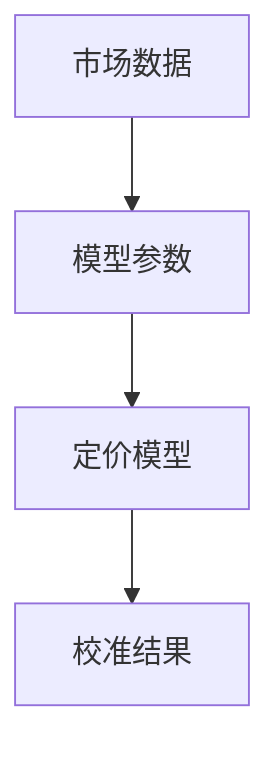
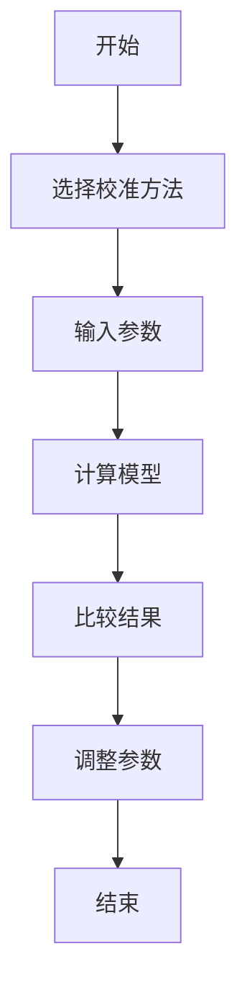
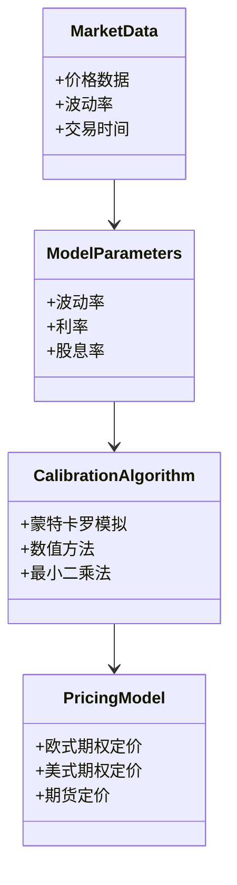
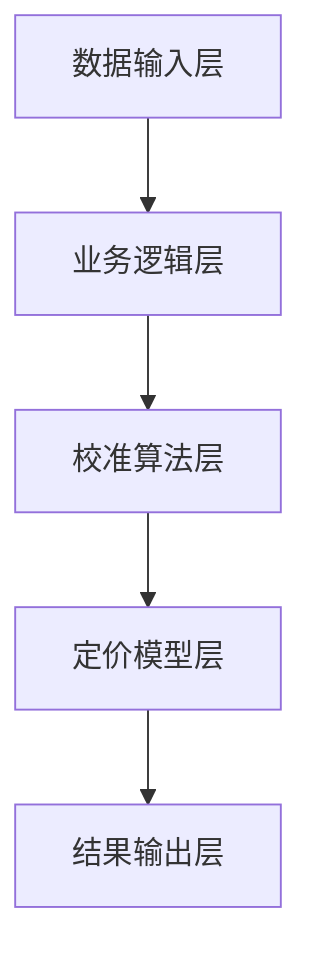
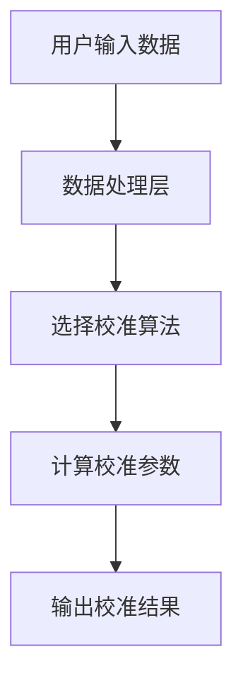

                 


# 金融衍生品定价模型校准

> 关键词：金融衍生品，定价模型，校准，蒙特卡罗模拟，数值方法，系统架构

> 摘要：本文详细探讨了金融衍生品定价模型校准的核心概念、算法原理、系统架构及实际应用。通过分析不同校准方法的优缺点，结合实际案例，展示了如何通过蒙特卡罗模拟和数值方法实现模型校准，确保定价模型的准确性和可靠性。

---

## 第1章 金融衍生品定价模型概述

### 1.1 金融衍生品的基本概念

#### 1.1.1 衍生品的定义与分类
金融衍生品是基于基础资产（如股票、债券、商品等）的金融合约，其价值依赖于基础资产的价格变动。常见的衍生品包括期权、期货、掉期和互换等。

#### 1.1.2 金融衍生品的市场与应用
衍生品广泛应用于风险管理、投机和套利。通过衍生品，企业和投资者可以对冲价格波动风险，或利用价格差异进行套利。

#### 1.1.3 衍生品定价的重要性
准确的定价是确保衍生品交易公平、有效和风险可控的关键。定价模型需要考虑市场波动性、时间价值和潜在风险因素。

### 1.2 定价模型的基本原理

#### 1.2.1 定价模型的核心概念
定价模型通过数学公式描述衍生品的价格与其影响因素之间的关系。常见的模型包括Black-Scholes模型、蒙特卡罗模拟和二叉树模型。

#### 1.2.2 不同衍生品的定价方法
- **欧式期权**：使用Black-Scholes公式。
- **美式期权**：采用数值方法或二叉树模型。
- **期货和掉期**：基于无套利原理定价。

#### 1.2.3 校准在定价中的作用
校准是将理论模型与实际市场数据调整一致的过程，确保模型能够准确反映市场价格。

### 1.3 校准的基本概念与意义

#### 1.3.1 校准的定义
校准是调整模型参数，使其与市场数据一致的过程，确保模型预测的价格与实际市场价格相符。

#### 1.3.2 校准的目的与作用
- **提高模型准确性**：使模型更贴近市场实际情况。
- **优化风险管理**：确保定价模型的风险评估准确可靠。

#### 1.3.3 校准的常见方法
- **蒙特卡罗模拟**：通过大量随机抽样估计参数。
- **数值方法**：使用差分法或有限元方法求解模型。
- **最小二乘法**：基于最小化残差平方和调整参数。

### 1.4 本章小结
本章介绍了金融衍生品的基本概念、定价模型的核心原理以及校准的重要性。校准是确保定价模型准确性的关键步骤，决定了模型的实际应用价值。

---

## 第2章 定价模型校准的核心概念与联系

### 2.1 核心概念原理

#### 2.1.1 随机过程与衍生品定价
衍生品价格受随机波动影响，通常使用随机微分方程（SDE）建模，如几何布朗运动。

#### 2.1.2 校准的基本原理
校准通过调整模型参数，使理论价格与市场价一致，确保模型的有效性。

#### 2.1.3 模型参数与市场数据的关系
模型参数（如波动率、无风险利率）直接影响定价结果，需与市场数据匹配。

### 2.2 核心概念对比表格

| 校准方法 | 优点 | 缺点 |
|----------|------|------|
| 蒙特卡罗模拟 | 高度灵活，适用于复杂模型 | 计算成本高，收敛速度慢 |
| 数值方法 | 计算效率高，适用于线性问题 | 适用于简单模型，不适用于高维问题 |
| 最小二乘法 | 简单高效 | 易受过拟合影响 |

### 2.3 ER实体关系图



### 2.4 本章小结
本章分析了校准的核心概念及其与模型参数和市场数据的关系，通过对比不同方法的优缺点，帮助读者选择合适的校准策略。

---

## 第3章 定价模型校准的算法原理

### 3.1 蒙特卡罗模拟

#### 3.1.1 蒙特卡罗模拟的基本原理
蒙特卡罗模拟通过生成大量随机路径，估计衍生品的期望值。公式如下：

$$ E[V] = \frac{1}{N} \sum_{i=1}^{N} V(S_T) $$

其中，$S_T$ 是到期时的资产价格，$N$ 是模拟次数。

#### 3.1.2 蒙特卡罗模拟的实现步骤

1. 确定模型参数（如波动率、利率）。
2. 生成随机数，模拟资产价格路径。
3. 计算每条路径下的衍生品价值。
4. 求平均值，得到期望值。

#### 3.1.3 蒙特卡罗模拟的优缺点
- **优点**：灵活，适用于高维问题。
- **缺点**：计算量大，收敛慢。

### 3.2 数值方法

#### 3.2.1 有限差分法
有限差分法通过离散化时间或空间变量，求解偏微分方程。公式如下：

$$ V(t, S) = V(t, S + \Delta S) \times \alpha + V(t, S - \Delta S) \times (1 - \alpha) $$

其中，$\alpha$ 是权重因子。

#### 3.2.2 二叉树模型
二叉树模型将资产价格分为上行和下行两种可能，递归计算期权价值。

### 3.3 最小二乘法

#### 3.3.1 最小二乘法的基本原理
最小二乘法通过最小化残差平方和，调整模型参数。公式如下：

$$ \min_{\theta} \sum_{i=1}^{n} (P_i - P_i^{model})^2 $$

其中，$P_i$ 是市场价格，$P_i^{model}$ 是模型预测价格。

#### 3.3.2 最小二乘法的实现步骤
1. 收集市场数据。
2. 设定模型形式。
3. 使用优化算法调整参数。
4. 验证模型准确性。

### 3.4 算法流程图



### 3.5 本章小结
本章详细介绍了几种常见的校准算法，包括蒙特卡罗模拟、数值方法和最小二乘法，分析了它们的实现步骤和优缺点，为实际应用提供了参考。

---

## 第4章 系统分析与架构设计

### 4.1 系统需求分析

#### 4.1.1 问题场景
- **输入**：市场数据（如期权价格、波动率）。
- **输出**：校准后的模型参数。
- **目标**：提高模型预测的准确性。

### 4.2 系统功能设计

#### 4.2.1 领域模型（类图）



#### 4.2.2 系统架构设计



#### 4.2.3 接口设计
- **输入接口**：市场数据接口。
- **输出接口**：校准结果接口。

#### 4.2.4 交互流程图



### 4.3 本章小结
本章从系统角度分析了校准的实现，设计了系统的功能模块和架构，为后续的代码实现奠定了基础。

---

## 第5章 项目实战：欧式期权定价模型校准

### 5.1 环境配置

#### 5.1.1 安装必要的库
使用Python的`numpy`、`scipy`和`matplotlib`库。

### 5.2 核心实现代码

```python
import numpy as np

def black_scholes(S, K, r, T, sigma):
    """
    计算欧式期权的价格
    """
    d1 = (np.log(S/K) + (r + 0.5*sigma**2)*T) / (sigma*np.sqrt(T))
    d2 = d1 - sigma*np.sqrt(T)
    call_price = S * np.cdf(d1) - K * np.exp(-r*T) * np.cdf(d2)
    return call_price

# 收敛测试
S = 100
K = 100
r = 0.05
T = 1
sigma = 0.2

price = black_scholes(S, K, r, T, sigma)
print("欧式期权价格:", price)
```

### 5.3 代码应用解读与分析

#### 5.3.1 代码功能
该代码实现了Black-Scholes模型，计算欧式期权的价格。通过调整波动率参数，实现模型校准。

#### 5.3.2 结果分析
通过比较理论价格与市场价格，调整波动率参数，使理论价格与实际价格一致。

### 5.4 实际案例分析

#### 5.4.1 数据准备
收集市场上某欧式期权的交易数据，包括执行价格、市场价格和波动率。

#### 5.4.2 校准过程
使用最小二乘法调整波动率参数，使理论价格与实际价格最小化残差平方和。

### 5.5 本章小结
本章通过实际案例展示了欧式期权定价模型的校准过程，详细讲解了代码实现和结果分析。

---

## 第6章 最佳实践与总结

### 6.1 校准的关键点

#### 6.1.1 数据质量
确保市场数据的准确性和完整性，避免偏差。

#### 6.1.2 模型选择
根据具体情况选择合适的校准方法，如复杂模型选择蒙特卡罗模拟，简单模型选择数值方法。

### 6.2 小结

校准是金融衍生品定价的重要环节，选择合适的算法和工具，能够显著提高模型的准确性和可靠性。

### 6.3 注意事项

- 校准结果需定期更新，以反映市场变化。
- 注意模型的局限性，避免过度拟合。

### 6.4 拓展阅读

- 更深入的校准方法，如最大似然估计。
- 高频交易中的校准应用。

---

## 作者：AI天才研究院/AI Genius Institute & 禅与计算机程序设计艺术 /Zen And The Art of Computer Programming

---

本文通过详细分析金融衍生品定价模型校准的核心概念、算法原理、系统架构及实际应用，帮助读者全面理解并掌握校准的关键步骤和技巧。通过实际案例和代码实现，进一步巩固理论知识，提升实战能力。

