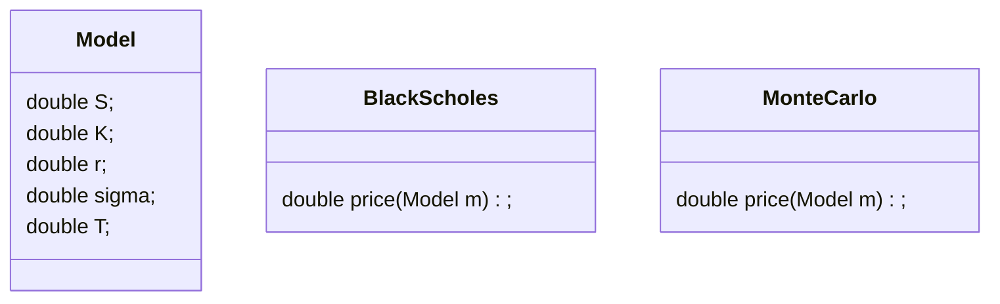

                 


# 《金融衍生品定价模型比较与选择框架》

> 关键词：金融衍生品、定价模型、Black-Scholes、蒙特卡洛模拟、风险中性定价

> 摘要：本文系统地探讨了金融衍生品定价模型的核心原理、应用场景及选择框架。通过对Black-Scholes模型、蒙特卡洛模拟等主要模型的深入分析，结合数学推导和实际案例，总结了各模型的优缺点，并提出了基于实际需求的模型选择策略。

---

## 第1章: 金融衍生品定价模型概述

### 1.1 金融衍生品的基本概念

#### 1.1.1 金融衍生品的定义
金融衍生品是基于标的资产（如股票、债券、商品等）的金融合约，其价值取决于标的资产的价格变动。衍生品主要包括期权、期货、互换和掉期等。

#### 1.1.2 金融衍生品的主要类型
1. **期权**：买方有权在特定时间以特定价格买入或卖出标的资产。
2. **期货**：买方和卖方同意在未来某一时间按约定价格买卖标的资产。
3. **互换**：两方同意在未来按约定条件交换现金流。
4. **掉期**：类似于互换，但通常涉及货币或利率。

#### 1.1.3 金融衍生品的市场发展
衍生品市场的快速发展源于对风险管理和投机需求的满足。随着金融市场的复杂化，衍生品在对冲风险和优化投资组合中扮演了重要角色。

### 1.2 定价模型的重要性

#### 1.2.1 定价模型在金融衍生品中的作用
准确的定价模型能够帮助金融机构合理评估衍生品的价值，降低市场风险，确保交易的公平性。

#### 1.2.2 定价模型的分类与特点
1. **解析模型**：如Black-Scholes模型，基于数学公式直接计算衍生品价格。
2. **数值模型**：如蒙特卡洛模拟，通过大量随机抽样估计价格分布。
3. **树模型**：如二叉树模型，基于树状结构模拟价格波动路径。

#### 1.2.3 定价模型的选择标准
- 计算复杂度
- 市场条件的适用性
- 数据输入要求
- 计算效率

### 1.3 本书的研究目标与框架

#### 1.3.1 研究目标
本文旨在比较主要金融衍生品定价模型的优缺点，提供选择模型的框架和策略。

#### 1.3.2 研究框架
1. 第一部分：背景与基础
2. 第二部分：核心概念与联系
3. 第三部分：算法原理与数学模型
4. 第四部分：系统分析与架构设计
5. 第五部分：项目实战与案例分析
6. 第六部分：总结与展望

#### 1.3.3 研究方法
- 文献综述法
- 案例分析法
- 数学建模法

---

## 第2章: 金融衍生品的核心要素

### 2.1 标的资产与执行价格

#### 2.1.1 标的资产的定义与特征
标的资产是衍生品合约的基础资产，其价格波动直接影响衍生品的价值。

#### 2.1.2 执行价格的确定方法
1. 市场均衡法
2. 基于波动率的定价法
3. 市场参与者协商确定

### 2.2 时间与波动率的影响

#### 2.2.1 时间对定价的影响
- 时间衰减：期权的内在价值随到期日减少。
- 时间价值：期权的市场价包含时间因素。

#### 2.2.2 波动率的度量与应用
- 历史波动率
- 隐含波动率
- 波动率在Black-Scholes公式中的应用

### 2.3 无风险利率与风险中性定价

#### 2.3.1 无风险利率的定义与作用
无风险利率是金融资产的无风险收益率，用于计算衍生品的现值。

#### 2.3.2 风险中性定价原理
在风险中性框架下，投资者对风险持中立态度，期望收益等于无风险利率。

---

## 第3章: 定价模型的核心原理与联系

### 3.1 随机过程与定价模型

#### 3.1.1 随机过程的基本概念
随机过程描述了标的资产价格随时间的随机波动。

#### 3.1.2 随机过程在定价中的应用
- 价格预测
- 风险管理
- 价值评估

### 3.2 Black-Scholes模型的数学推导

#### 3.2.1 Black-Scholes方程的建立
基于对数正态假设，构建偏微分方程。

#### 3.2.2 Black-Scholes公式的推导
通过求解偏微分方程，得到期权的定价公式。

### 3.3 其他常见模型的对比分析

#### 3.3.1 二叉树模型
- 简单易懂
- 适用于美式期权
- 计算效率低

#### 3.3.2 蒙特卡洛模拟
- 适用于高维问题
- 计算复杂度高
- 适合路径依赖型期权

---

## 第4章: Black-Scholes模型的算法原理

### 4.1 Black-Scholes模型的算法步骤

#### 4.1.1 输入参数的获取
- 标的资产价格
- 执行价格
- 到期时间
- 波动率
- 无风险利率

#### 4.1.2 计算d1和d2值
\[
d1 = \frac{\ln\left(\frac{S}{K}\right) + \left(r + \frac{\sigma^2}{2}\right)T}{\sigma \sqrt{T}}
\]
\[
d2 = d1 - \sigma \sqrt{T}
\]

#### 4.1.3 计算期权价格
\[
C = S N(d1) - K e^{-rT} N(d2)
\]

### 4.2 Black-Scholes模型的数学公式

#### 4.2.1 期权价格公式
\[
C = S N(d1) - K e^{-rT} N(d2)
\]

#### 4.2.2 对数正态分布假设
标的资产价格服从对数正态分布。

#### 4.2.3 风险中性定价公式
\[
E[Max(S_T - K, 0)] = S_0 N(d1) - K e^{-rT} N(d2)
\]

### 4.3 Black-Scholes模型的Python实现

#### 4.3.1 环境搭建
安装Python和相关库（numpy, scipy）。

#### 4.3.2 核心代码实现

```python
import numpy as np
from scipy.stats import norm

def black_scholes(S, K, r, sigma, T):
    T = T / 365
    d1 = (np.log(S/K) + (r + sigma**2/2)*T) / (sigma*np.sqrt(T))
    d2 = d1 - sigma*np.sqrt(T)
    C = S * norm.cdf(d1) - K * np.exp(-r*T) * norm.cdf(d2)
    return C
```

#### 4.3.3 代码运行与结果分析
输入参数，运行代码，输出期权价格。

---

## 第5章:蒙特卡洛模拟

### 5.1 蒙特卡洛模拟的算法步骤

#### 5.1.1 标的资产价格模拟
基于随机游走模型，模拟标的资产价格路径。

#### 5.1.2 期权 payoff 计算
\[
payoff = max(S_T - K, 0)
\]

#### 5.1.3 期望值计算
\[
E[Payoff] = \frac{1}{N} \sum_{i=1}^{N} payoff_i
\]

### 5.2 蒙特卡洛模拟的数学模型

#### 5.2.1 随机数生成
使用均匀分布随机数生成标的资产价格路径。

#### 5.2.2 模拟路径数量与精度
模拟路径越多，结果越精确。

### 5.3 蒙特卡洛模拟的Python实现

#### 5.3.1 核心代码实现

```python
import numpy as np

def monte_carlo(S, K, r, sigma, T, N=10000):
    np.random.seed(42)
    T = T / 365
    paths = np.zeros(N)
    for i in range(N):
        z = np.random.standard_normal()
        S_T = S * np.exp((r - 0.5*sigma**2)*T + sigma*np.sqrt(T)*z)
        paths[i] = max(S_T - K, 0)
    C = np.exp(-r*T) * (paths.mean())
    return C
```

#### 5.3.2 代码运行与结果分析
输入参数，运行代码，输出期权价格。

---

## 第6章: 系统分析与架构设计

### 6.1 项目背景与需求分析
金融机构需要准确的定价模型进行风险管理和投资决策。

### 6.2 系统功能设计

#### 6.2.1 领域模型（Mermaid类图）


#### 6.2.2 系统架构设计（Mermaid架构图）


---

## 第7章: 项目实战与案例分析

### 7.1 环境安装
安装Python和相关库（numpy, scipy, matplotlib）。

### 7.2 核心代码实现

#### 7.2.1 代码实现

```python
import numpy as np
from scipy.stats import norm

def black_scholes(S, K, r, sigma, T):
    T = T / 365
    d1 = (np.log(S/K) + (r + sigma**2/2)*T) / (sigma*np.sqrt(T))
    d2 = d1 - sigma*np.sqrt(T)
    C = S * norm.cdf(d1) - K * np.exp(-r*T) * norm.cdf(d2)
    return C

def monte_carlo(S, K, r, sigma, T, N=10000):
    np.random.seed(42)
    T = T / 365
    paths = np.zeros(N)
    for i in range(N):
        z = np.random.standard_normal()
        S_T = S * np.exp((r - 0.5*sigma**2)*T + sigma*np.sqrt(T)*z)
        paths[i] = max(S_T - K, 0)
    C = np.exp(-r*T) * (paths.mean())
    return C
```

#### 7.2.2 代码运行与结果分析
输入参数，运行代码，输出期权价格。

### 7.3 实际案例分析
以某股票期权为例，比较Black-Scholes和蒙特卡洛模拟的定价结果。

---

## 第8章: 总结与展望

### 8.1 主要模型的优缺点总结
- **Black-Scholes模型**：解析解，计算效率高，但假设标的资产服从对数正态分布。
- **蒙特卡洛模拟**：适用于复杂问题，但计算复杂度高。

### 8.2 模型选择的建议
根据市场条件、计算资源和模型复杂度选择合适的定价模型。

### 8.3 未来研究方向
- 更精确的随机过程建模
- 人工智能在定价中的应用
- 多因素定价模型

---

## 附录

### 附录A: 完整代码示例
```python
import numpy as np
from scipy.stats import norm

def black_scholes(S, K, r, sigma, T):
    T = T / 365
    d1 = (np.log(S/K) + (r + sigma**2/2)*T) / (sigma*np.sqrt(T))
    d2 = d1 - sigma*np.sqrt(T)
    C = S * norm.cdf(d1) - K * np.exp(-r*T) * norm.cdf(d2)
    return C

def monte_carlo(S, K, r, sigma, T, N=10000):
    np.random.seed(42)
    T = T / 365
    paths = np.zeros(N)
    for i in range(N):
        z = np.random.standard_normal()
        S_T = S * np.exp((r - 0.5*sigma**2)*T + sigma*np.sqrt(T)*z)
        paths[i] = max(S_T - K, 0)
    C = np.exp(-r*T) * (paths.mean())
    return C

# 示例计算
S = 100
K = 105
r = 0.05
sigma = 0.2
T = 30

bs_price = black_scholes(S, K, r, sigma, T)
mc_price = monte_carlo(S, K, r, sigma, T)

print(f"Black-Scholes定价: {bs_price}")
print(f"蒙特卡洛模拟定价: {mc_price}")
```

### 附录B: 参考文献
1. Hull, J. C. (2019). 《期权、期货及其他衍生品》.
2. Shreve, S. E. (2004). 《随机微积分在金融中的应用》.
3. Glasserman, P. (2006). 《蒙特卡洛方法在金融工程中的应用》.

---

## 作者：AI天才研究院 & 禅与计算机程序设计艺术

---

感谢您的阅读！希望本文能为您提供有价值的见解和实用的框架，帮助您在金融衍生品定价模型的选择与应用中做出明智决策。

