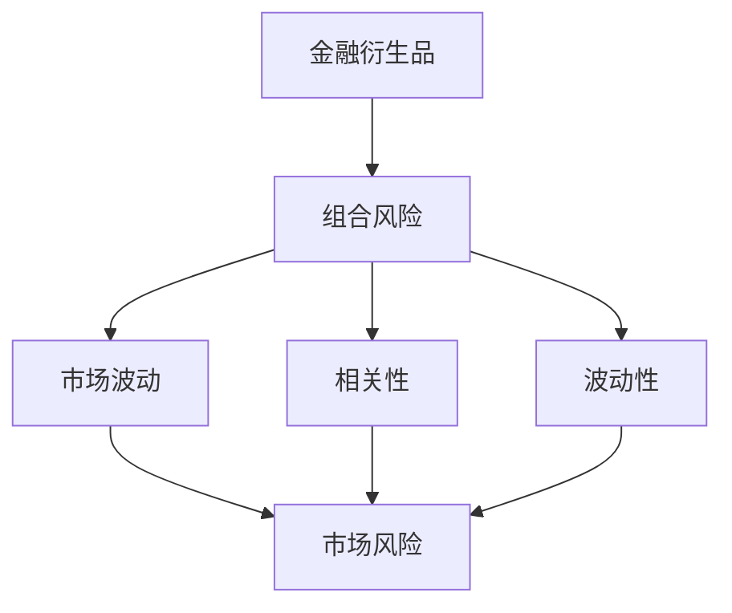
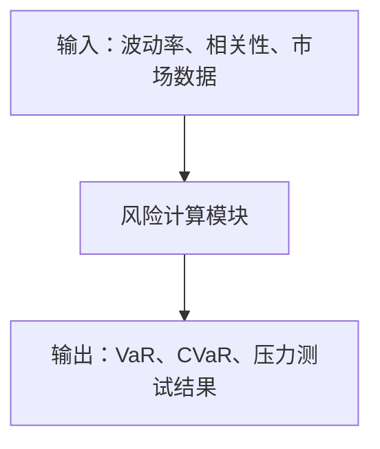
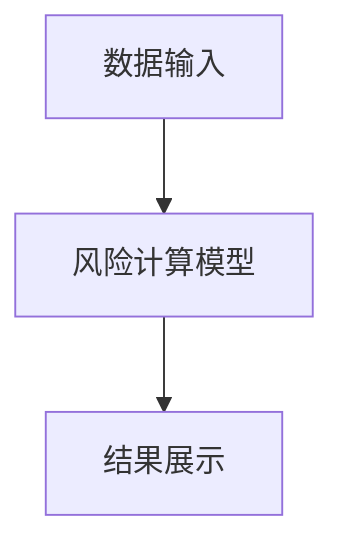
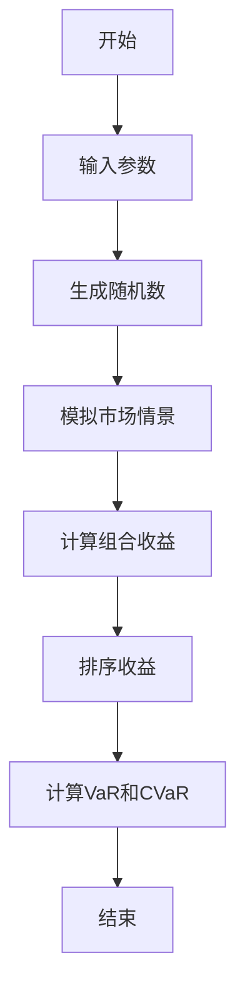
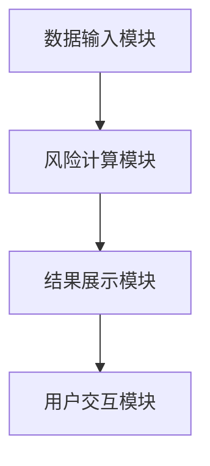
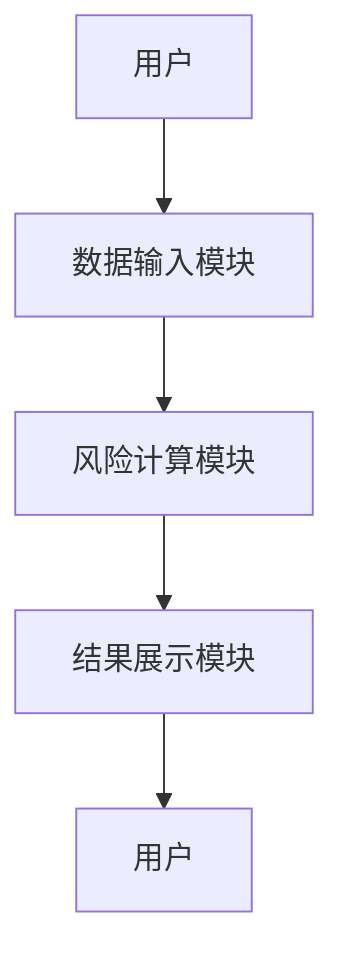
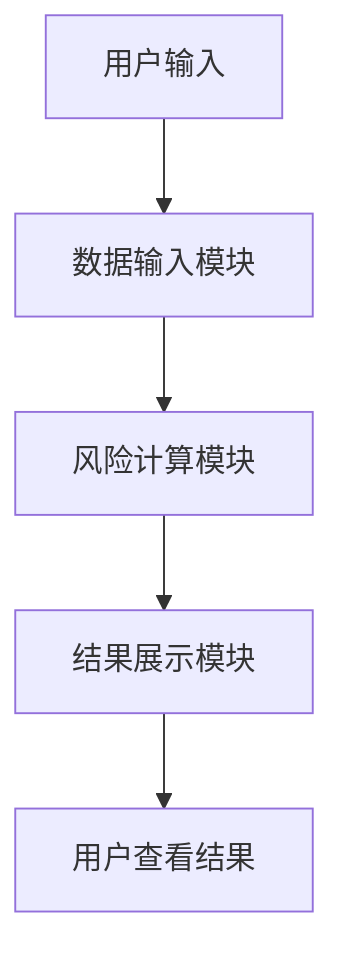

                 


# 《金融衍生品组合风险分析工具》

**关键词**: 金融衍生品，组合风险，风险分析工具，蒙特卡洛模拟，方差协方差矩阵，VaR，CVaR

---

## 摘要

本文深入探讨了金融衍生品组合风险分析工具的设计与实现，从背景、核心概念、算法原理到系统架构和项目实战，全面解析了该工具的构建过程。文章首先介绍了金融衍生品的基本概念及其组合风险的重要性，然后详细阐述了组合风险分析工具的核心算法原理，包括蒙特卡洛模拟和方差协方差矩阵等方法。接着，从系统架构设计的角度，分析了工具的模块划分和交互流程。最后，通过具体案例展示了工具的实现过程，并总结了最佳实践和注意事项。本文旨在为金融从业者和技术开发人员提供一套完整的解决方案，帮助他们更好地理解和管理金融衍生品组合风险。

---

## 第1章: 金融衍生品组合风险分析工具的背景与意义

### 1.1 金融衍生品的定义与特点

金融衍生品是一种金融合约，其价值来源于基础资产（如股票、债券、商品等）的价格波动。常见的金融衍生品包括期权、期货、掉期和互换等。其特点如下：

1. **杠杆效应**：衍生品允许投资者以较小的资金控制更大的头寸。
2. **风险放大**：由于杠杆效应，收益或亏损可能被放大。
3. **多样性**：衍生品种类繁多，具有不同的风险敞口和收益结构。

#### 表1-1: 金融衍生品的主要类型与特点

| 类型       | 描述                       | 风险特征               |
|------------|----------------------------|------------------------|
| 期权       | 买方有权在特定时间以特定价格买入或卖出标的资产 | 收益有限，风险可控       |
| 期货       | 标准化合约，用于对冲或投机   | 风险对称，需盯市结算     |
| 掉期       | 约定在未来某个时间交换资产   | 风险对称，信用风险较高   |
| 互换       | 期限内定期交换现金流       | 风险对称，信用风险较高   |

### 1.2 组合风险分析的重要性

在金融市场中，单一资产的风险相对容易量化，但组合风险的复杂性更高。组合风险分析需要考虑资产之间的相关性、波动性和市场环境的变化。金融衍生品组合的风险分析尤其重要，因为其杠杆效应和多样性可能导致更大的市场波动。

#### 图1-1: 金融衍生品组合风险的关联性



### 1.3 本章小结

本章介绍了金融衍生品的基本概念及其组合风险的重要性。金融衍生品的多样性和杠杆效应使其成为金融市场中风险管理的关键工具，但同时也带来了复杂的组合风险。接下来的章节将深入探讨组合风险分析工具的核心算法和系统设计。

---

## 第2章: 金融衍生品组合风险分析工具的核心概念

### 2.1 金融衍生品组合风险的定义

金融衍生品组合风险是指一组金融衍生品在市场波动下可能带来的损失。这种风险可以通过多种指标量化，如VaR（Value at Risk）和CVaR（Conditional Value at Risk）。

#### 表2-1: VaR与CVaR的对比

| 指标   | 描述                                   | 优点                  | 局限性               |
|--------|----------------------------------------|-----------------------|----------------------|
| VaR    | 在一定置信水平下，可能的最大损失       | 易计算，直观           | 未考虑尾部风险       |
| CVaR   | 在VaR的基础上，考虑超过VaR的期望损失   | 更全面，适合风险厌恶型投资者 | 计算复杂             |

### 2.2 金融衍生品组合风险分析工具的核心要素

组合风险分析工具通常包括以下核心要素：

1. **数据输入**：包括金融衍生品的参数（如波动率、相关性）和市场数据。
2. **风险计算模型**：包括蒙特卡洛模拟和方差协方差矩阵。
3. **结果展示**：以图表和数值形式展示风险指标。

#### 图2-1: 风险计算模型的输入与输出



### 2.3 核心概念之间的关系

金融衍生品组合风险分析工具的核心概念包括数据输入、风险计算模型和结果展示。这些概念之间通过数据流和算法逻辑相互关联，形成一个完整的系统。

#### 图2-2: 核心概念的关系图



### 2.4 本章小结

本章详细介绍了金融衍生品组合风险的定义及其分析工具的核心要素。接下来的章节将从算法和系统设计的角度深入探讨工具的实现细节。

---

## 第3章: 金融衍生品组合风险分析工具的核心算法原理

### 3.1 风险计算的核心算法

#### 3.1.1 蒙特卡洛模拟算法

蒙特卡洛模拟是一种基于随机数的模拟方法，用于估计金融资产的可能收益和风险。

**算法步骤：**
1. 确定输入参数（如波动率、相关性）。
2. 生成随机数并模拟市场情景。
3. 计算每种情景下的组合收益。
4. 排序收益并计算VaR和CVaR。

#### 3.1.2 方差协方差矩阵计算

方差协方差矩阵用于描述资产之间的相关性。

**公式：**
$$
\text{协方差}(X,Y) = \frac{1}{n-1}\sum_{i=1}^{n}(x_i - \bar{x})(y_i - \bar{y})
$$

### 3.2 算法原理的数学模型

#### 3.2.1 蒙特卡洛模拟的数学公式

$$
\text{VaR}(\alpha) = \text{quantile}(\alpha) \text{ of portfolio returns}
$$

$$
\text{CVaR}(\alpha) = \mathbb{E}[\text{Loss} | \text{Loss} \geq \text{VaR}(\alpha)]
$$`

#### 3.2.2 压力测试的数学模型

$$
\text{压力测试损失} = \max(-\text{VaR}, -\text{CVaR})
$$`

### 3.3 算法流程图

#### 图3-1: 蒙特卡洛模拟流程图



### 3.4 本章小结

本章详细介绍了蒙特卡洛模拟和方差协方差矩阵等核心算法的原理和实现步骤。接下来的章节将从系统设计的角度探讨工具的实现细节。

---

## 第4章: 金融衍生品组合风险分析工具的系统架构设计

### 4.1 系统功能模块划分

金融衍生品组合风险分析工具的系统架构可以划分为以下几个模块：

1. **数据输入模块**：接收用户输入的金融衍生品参数和市场数据。
2. **风险计算模块**：执行蒙特卡洛模拟和方差协方差矩阵计算。
3. **结果展示模块**：以图表和数值形式展示风险指标。
4. **用户交互模块**：与用户进行数据输入和结果展示的交互。

#### 图4-1: 系统功能模块划分



### 4.2 系统架构设计

金融衍生品组合风险分析工具的系统架构可以采用模块化设计，每个模块负责特定的功能。

#### 图4-2: 系统架构设计



### 4.3 系统接口设计

1. **数据输入接口**：接收金融衍生品参数和市场数据。
2. **风险计算接口**：执行蒙特卡洛模拟和方差协方差矩阵计算。
3. **结果展示接口**：以图表和数值形式展示风险指标。

#### 图4-3: 系统交互流程图



### 4.4 本章小结

本章详细介绍了金融衍生品组合风险分析工具的系统架构设计，包括模块划分、接口设计和交互流程。接下来的章节将通过具体案例展示工具的实现过程。

---

## 第5章: 金融衍生品组合风险分析工具的项目实战

### 5.1 环境安装与配置

#### 5.1.1 安装Python环境

```bash
# 安装Python
python --version
```

#### 5.1.2 安装必要的Python库

```bash
pip install numpy pandas matplotlib
```

### 5.2 核心代码实现

#### 5.2.1 蒙特卡洛模拟代码

```python
import numpy as np
import matplotlib.pyplot as plt

def monte_carlo_simulation(returns, num_simulations=10000):
    simulations = []
    for _ in range(num_simulations):
        simulation = np.random.choice(returns)
        simulations.append(simulation)
    return simulations

# 示例数据
returns = [0.01, -0.02, 0.03, -0.01]
simulations = monte_carlo_simulation(returns)
print("模拟结果：", simulations)
```

#### 5.2.2 方差协方差矩阵代码

```python
def calculate_cov_matrix(returns):
    return np.cov(returns)

# 示例数据
returns = np.array([[0.01, -0.02, 0.03, -0.01]])
cov_matrix = calculate_cov_matrix(returns)
print("协方差矩阵：", cov_matrix)
```

### 5.3 项目小结

本章通过具体案例展示了金融衍生品组合风险分析工具的实现过程，包括环境安装、核心代码实现和结果展示。读者可以通过这些代码和步骤实现一个简单的组合风险分析工具。

---

## 作者：AI天才研究院/AI Genius Institute & 禅与计算机程序设计艺术 /Zen And The Art of Computer Programming

---

通过以上章节，我们详细探讨了金融衍生品组合风险分析工具的设计与实现。从背景、核心概念、算法原理到系统架构和项目实战，本文为读者提供了一套完整的解决方案。希望本文能够帮助金融从业者和技术开发人员更好地理解和管理金融衍生品组合风险。

