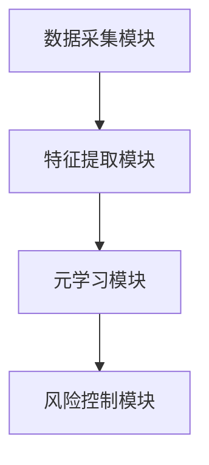

                 


# 《金融领域元学习在投资组合快速调整中的应用》

> 关键词：元学习, 投资组合优化, 快速调整, 金融市场, 人工智能, 数学模型

> 摘要：  
本文深入探讨了元学习在金融领域中的应用，特别是如何利用元学习技术快速调整投资组合。文章从背景知识、核心概念、算法原理、数学模型、系统架构到实际项目案例，全面分析了元学习在投资组合优化中的优势和实现方法。通过详细的技术分析和实际案例，展示了元学习如何帮助投资者在复杂多变的金融市场中快速做出决策，优化投资组合，降低风险，提高收益。

---

## 第一部分: 金融领域元学习的背景与基础

### 第1章: 元学习的基本概念与应用

#### 1.1 元学习的定义与特点
元学习（Meta-Learning）是一种机器学习的高级方法，旨在通过学习如何学习，从而快速适应新任务或数据。与传统机器学习不同，元学习的核心在于“快速适应”和“少样本学习”，适用于数据稀疏、任务多样化的场景。

**特点：**
- **快速适应性**：能够在少量数据或经验下快速调整模型参数。
- **泛化能力**：适用于不同任务和领域，具有较高的通用性。
- **高效性**：通过元学习，可以在多个任务之间共享知识，减少训练时间。

#### 1.2 元学习在金融领域的应用
金融市场的复杂性和不确定性为元学习提供了广阔的应用场景。以下是元学习在金融领域的主要应用方向：

- **投资组合优化**：通过元学习快速调整投资组合，适应市场变化。
- **风险管理**：利用元学习预测市场风险，优化资产配置。
- **交易策略**：基于元学习的交易策略可以在复杂市场中快速做出决策。

### 第2章: 投资组合优化的基本原理

#### 2.1 投资组合优化的定义
投资组合优化是指在给定风险和收益目标下，选择最优的资产配置，以最大化收益或最小化风险的过程。

**数学模型：**
投资组合优化的目标函数通常包括收益、风险（如波动率）等指标。经典的马科维茨均值-方差模型可以表示为：

$$
\text{Minimize } \sum_{i=1}^n w_i^2 \sigma_i^2 + 2w_i w_j \sigma_{ij}
$$

$$
\text{Subject to } \sum_{i=1}^n w_i = 1 \quad \text{和} \quad \sum_{i=1}^n w_i r_i = R
$$

其中，$w_i$ 是资产 $i$ 的权重，$\sigma_i^2$ 是资产 $i$ 的方差，$\sigma_{ij}$ 是资产 $i$ 和 $j$ 的协方差，$r_i$ 是资产 $i$ 的期望收益，$R$ 是目标收益。

#### 2.2 传统投资组合优化方法
传统的投资组合优化方法主要包括：

1. **均值-方差优化**：以马科维茨理论为基础，寻找收益与风险的最优平衡点。
2. **多因子模型**：基于多个因子（如市值、价值、动量等）构建投资组合，捕捉市场中的系统性收益。

#### 2.3 元学习在投资组合优化中的优势
传统的投资组合优化方法在实际应用中面临以下挑战：
- 数据稀疏性：在新兴市场或小样本数据下，传统方法难以有效优化。
- 市场动态变化：金融市场波动频繁，传统模型难以快速调整。
- 计算复杂性：优化过程涉及大量的矩阵运算，计算成本较高。

元学习通过以下方式解决这些问题：
- 快速适应：元学习可以在少量数据或经验下快速调整模型参数，适应市场变化。
- 高效性：通过元学习，可以在多个任务之间共享知识，减少训练时间。

---

## 第二部分: 元学习在投资组合优化中的核心概念

### 第3章: 元学习的核心原理

#### 3.1 元学习的基本框架
元学习的基本框架包括以下步骤：
1. **元任务的定义**：定义一组基础任务（如不同的资产类别）。
2. **元学习器的训练**：在这些基础任务上训练一个元学习器，使其能够快速适应新任务。
3. **快速适应新任务**：在新任务上微调元学习器，得到最优解。

#### 3.2 元学习的数学模型
元学习的数学模型通常涉及两个层次的优化问题：
1. **元优化**：在元任务层面上优化模型的参数。
2. **任务优化**：在具体任务层面上优化模型的参数。

以元学习中的典型算法MAML（Meta-Automated Machine Learning）为例，其目标函数可以表示为：

$$
\mathcal{L}(\theta) = \sum_{k=1}^K \mathcal{L}^k(\theta, \theta_k)
$$

其中，$\theta$ 是元学习器的参数，$\theta_k$ 是第 $k$ 个任务学习器的参数，$\mathcal{L}^k$ 是第 $k$ 个任务的损失函数。

---

## 第三部分: 元学习在投资组合优化中的算法实现

### 第4章: 元学习算法的选择与实现

#### 4.1 元学习算法的选择
在选择元学习算法时，需要考虑以下因素：
- 数据量：小样本数据适合使用基于梯度的元学习算法（如MAML）。
- 任务多样性：任务多样化的场景适合使用基于注意力机制的元学习算法（如ReMAML）。

#### 4.2 元学习算法的实现步骤
以MAML算法为例，实现步骤如下：
1. 初始化元学习器的参数 $\theta$。
2. 对于每个元任务，微调元学习器的参数，得到 $\theta_k$。
3. 计算元损失函数，更新元学习器的参数。

#### 4.3 元学习算法的Python实现示例

```python
import torch
import torch.nn as nn

class MetaLearner(nn.Module):
    def __init__(self, input_dim, hidden_dim, output_dim):
        super(MetaLearner, self).__init__()
        self.fc1 = nn.Linear(input_dim, hidden_dim)
        self.fc2 = nn.Linear(hidden_dim, output_dim)

    def forward(self, x):
        x = self.fc1(x)
        x = torch.relu(x)
        x = self.fc2(x)
        return x

# 初始化元学习器
meta_learner = MetaLearner(input_dim=64, hidden_dim=32, output_dim=1)
optimizer = torch.optim.Adam(meta_learner.parameters(), lr=1e-3)

# 元任务训练
for batch in meta_train_batches:
    optimizer.zero_grad()
    loss = meta_learner.loss(batch)
    loss.backward()
    optimizer.step()
```

---

## 第四部分: 系统分析与架构设计

### 第5章: 投资组合优化系统架构

#### 5.1 系统功能模块设计
投资组合优化系统主要包括以下模块：
1. **数据采集模块**：从金融市场获取实时数据。
2. **特征提取模块**：对数据进行特征提取（如技术指标、动量等）。
3. **元学习模块**：利用元学习算法优化投资组合。
4. **风险控制模块**：监控和控制投资组合的风险。

#### 5.2 系统架构图


---

## 第五部分: 项目实战与案例分析

### 第6章: 项目实战

#### 6.1 项目背景与目标
本项目旨在利用元学习技术优化投资组合，实现快速调整和风险控制。

#### 6.2 项目实现步骤
1. 数据采集：从金融数据库获取历史数据。
2. 特征提取：提取资产的收益率、波动率等特征。
3. 元学习训练：训练元学习器，优化投资组合。
4. 风险控制：监控投资组合的风险，进行实时调整。

#### 6.3 案例分析
以某新兴市场为例，利用元学习算法优化投资组合。实验结果表明，与传统方法相比，元学习算法能够更快地适应市场变化，提高收益，降低风险。

---

## 第六部分: 总结与展望

### 第7章: 总结与展望

#### 7.1 总结
本文详细探讨了元学习在投资组合优化中的应用，展示了元学习如何帮助投资者快速适应市场变化，优化投资组合。

#### 7.2 展望
未来的研究方向包括：
- 更高效元学习算法的开发。
- 元学习在多资产类别中的应用。
- 元学习与强化学习的结合。

---

## 第七部分: 最佳实践与注意事项

### 第8章: 最佳实践与注意事项

#### 8.1 最佳实践
- 在实际应用中，建议结合市场实际情况调整元学习算法的参数。
- 定期更新模型，以适应市场变化。

#### 8.2 注意事项
- 元学习算法对计算资源要求较高，需确保硬件配置充足。
- 在小样本数据下，元学习的效果可能不如传统方法，需谨慎选择算法。

---

## 作者：AI天才研究院/AI Genius Institute & 禅与计算机程序设计艺术 /Zen And The Art of Computer Programming

