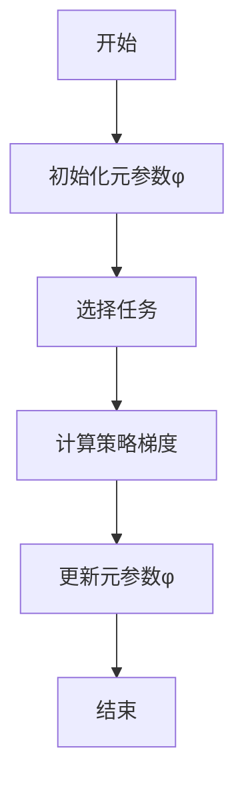
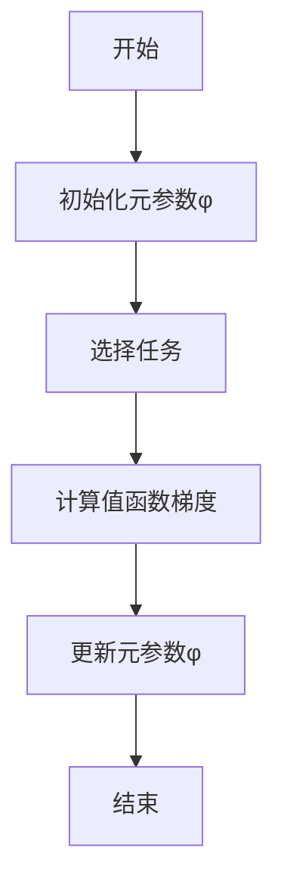
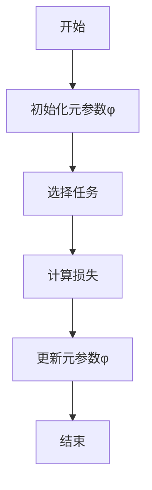
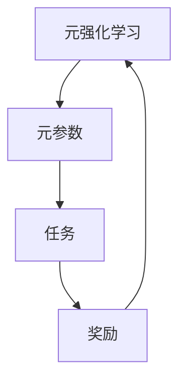
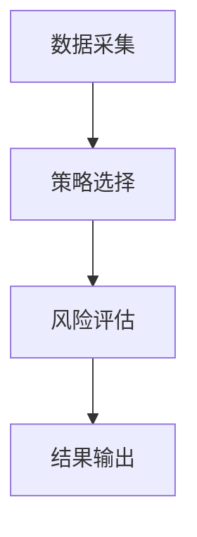
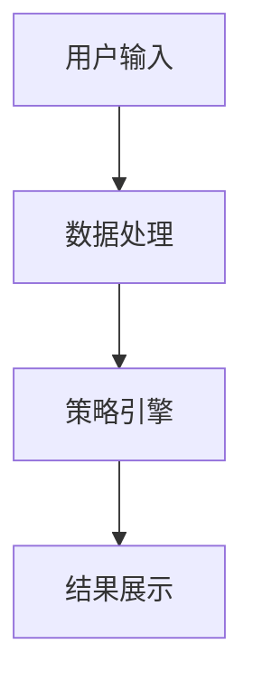

                 


---

# 《金融领域元强化学习在多周期投资决策中的应用》

> 关键词：元强化学习，多周期投资决策，金融投资，强化学习，机器学习

> 摘要：本文深入探讨了元强化学习在金融领域多周期投资决策中的应用，详细分析了其核心概念、算法原理、系统设计及实际案例，为读者提供了全面的技术解读。

---

## 第1章: 元强化学习概述

### 1.1 元强化学习的基本概念

#### 1.1.1 元学习的定义与特点
元学习（Meta Learning）是一种通过学习如何快速适应新任务的方法，其核心思想是将经验迁移到新任务中。其特点包括：
- **快速适应性**：能够在新任务中快速找到最优策略。
- **任务多样性**：适用于多个不同任务的场景。
- **元优化**：通过优化元参数来提升性能。

#### 1.1.2 强化学习的基本原理
强化学习（Reinforcement Learning，RL）是一种通过智能体与环境交互来学习最优策略的方法。智能体通过试错的方式，根据环境的反馈（奖励或惩罚）来调整行为，最终找到最优策略。

#### 1.1.3 元强化学习的核心思想
元强化学习（Meta RL）结合了元学习和强化学习的优势，通过元参数的优化，使得智能体能够快速适应新任务。其核心思想是：在多个任务中学习一种通用策略，使得在新任务中能够快速调整并找到最优解。

### 1.2 元强化学习在金融领域的应用

#### 1.2.1 金融投资中的决策问题
金融投资中的决策问题通常涉及多周期的规划，例如股票投资、资产配置等。这些决策问题具有高度的不确定性和复杂性，传统的策略往往难以应对。

#### 1.2.2 元强化学习的优势与适用场景
元强化学习在金融投资中的优势包括：
- **快速适应市场变化**：能够快速调整投资策略以应对市场的波动。
- **多周期决策优化**：能够在多个时间周期内优化投资组合。
- **复杂环境下的决策能力**：适用于高度不确定和复杂的金融环境。

#### 1.2.3 多周期投资决策的挑战与解决方案
多周期投资决策的挑战主要体现在：
- **时间序列数据的复杂性**：金融数据的时间依赖性较强，难以建模。
- **多目标优化问题**：需要在风险和收益之间找到平衡。

元强化学习通过其元参数的优化能力，能够在多周期决策中找到最优的投资策略。

### 1.3 本章小结
- 元强化学习是一种通过元参数优化来快速适应新任务的方法。
- 在金融投资中，元强化学习能够有效应对多周期决策的挑战，提供了一种新的解决方案。

---

## 第2章: 元强化学习的核心概念与原理

### 2.1 元学习的数学模型

#### 2.1.1 元学习的损失函数
元学习的损失函数通常包括两个部分：元任务损失和元损失。元任务损失用于衡量模型在特定任务上的表现，元损失用于优化元参数。

公式：
$$
\mathcal{L}_{\text{meta}} = \sum_{i=1}^{N} \mathcal{L}_i(\theta, \phi)
$$

其中，$\theta$是模型参数，$\phi$是元参数。

#### 2.1.2 元学习的优化算法
元学习的优化算法主要包括基于梯度的方法和基于非梯度的方法。常用的算法包括：
- **Meta-SGD**：一种基于梯度的元优化算法。
- **MAML**：通过优化一阶泰勒展开近似元损失的算法。

#### 2.1.3 元学习的数学公式推导
以Meta-SGD为例，其优化过程可以表示为：
$$
\phi_{t+1} = \phi_t - \eta \frac{\partial}{\partial \phi} \mathcal{L}_{\text{meta}}(\phi_t)
$$

### 2.2 元强化学习的算法框架

#### 2.2.1 基于策略梯度的元强化学习
基于策略梯度的元强化学习通过优化策略函数的梯度来实现元参数的更新。其算法流程如下：



#### 2.2.2 基于值函数的元强化学习
基于值函数的元强化学习通过优化值函数的参数来实现元参数的更新。其算法流程如下：



#### 2.2.3 元强化学习的算法流程图


### 2.3 元强化学习与传统强化学习的对比

#### 2.3.1 核心概念对比表格
| 对比维度          | 元强化学习                      | 传统强化学习                    |
|-------------------|---------------------------------|--------------------------------|
| 参数优化          | 元参数优化                     | 任务参数优化                   |
| 适用场景          | 多任务学习                     | 单任务学习                   |
| 优化目标          | 快速适应新任务                 | 找到单任务最优策略             |

#### 2.3.2 实体关系图


### 2.4 本章小结
- 元强化学习通过优化元参数，能够在多个任务中快速找到最优策略。
- 其算法框架主要包括基于策略梯度和基于值函数的两种方法。

---

## 第3章: 多周期投资决策的建模与分析

### 3.1 多周期投资决策的数学模型

#### 3.1.1 投资组合优化的数学公式
投资组合优化的目标是在给定风险下最大化收益，或者在给定收益下最小化风险。其数学公式可以表示为：
$$
\max \mu^T w - \frac{1}{2} w^T \Sigma w
$$
其中，$w$是权重向量，$\mu$是收益向量，$\Sigma$是协方差矩阵。

#### 3.1.2 多周期决策的动态规划模型
多周期投资决策可以采用动态规划的方法进行建模。其状态转移方程可以表示为：
$$
s_{t+1} = f(s_t, a_t)
$$
其中，$s_t$是当前状态，$a_t$是当前动作，$f$是状态转移函数。

#### 3.1.3 多周期投资的收益与风险评估
在多周期投资中，收益和风险的评估需要考虑时间序列数据的特性。常用的评估指标包括夏普比率、最大回撤等。

### 3.2 多周期投资决策的系统分析

#### 3.2.1 投资决策系统的功能模块设计
投资决策系统的功能模块主要包括数据采集、策略选择、风险评估、结果输出等。



#### 3.2.2 系统架构设计图


#### 3.2.3 系统接口设计与交互流程


### 3.3 本章小结
- 多周期投资决策的建模需要考虑时间序列数据的特性。
- 动态规划模型和投资组合优化模型是常用的建模方法。

---

## 第4章: 元强化学习算法的实现与优化

### 4.1 元强化学习算法的实现框架

#### 4.1.1 算法实现的代码结构
元强化学习算法的实现通常包括以下几个步骤：
1. 初始化元参数。
2. 选择任务。
3. 计算损失。
4. 更新元参数。

示例代码如下：

```python
class MetaRL:
    def __init__(self, meta_parameter):
        self.meta_parameter = meta_parameter

    def choose_task(self, tasks):
        # 选择一个任务
        task = tasks[np.random.randint(len(tasks))]
        return task

    def compute_loss(self, task, meta_parameter):
        # 计算损失
        model = Model(meta_parameter)
        loss = model.compute_loss(task)
        return loss

    def update_meta_parameter(self, gradient):
        # 更新元参数
        self.meta_parameter -= learning_rate * gradient
```

#### 4.1.2 算法实现的关键步骤
1. **初始化元参数**：设置初始的元参数值。
2. **选择任务**：随机选择一个任务进行优化。
3. **计算损失**：根据选择的任务计算损失。
4. **更新元参数**：通过梯度下降更新元参数。

### 4.2 元强化学习的优化策略

#### 4.2.1 

---

作者：AI天才研究院/AI Genius Institute & 禅与计算机程序设计艺术 /Zen And The Art of Computer Programming

