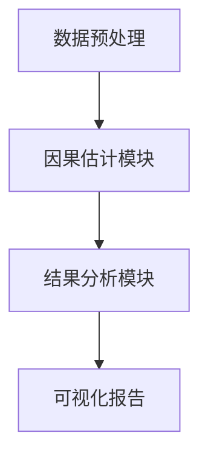

                 


# 金融领域因果推断在政策评估中的应用

## 关键词
- 因果推断
- 政策评估
- 金融领域
- 统计方法
- 机器学习

## 摘要
本文深入探讨了因果推断在金融政策评估中的应用。通过介绍因果推断的基本概念、核心方法及其在金融领域的具体应用，本文详细分析了倾向评分匹配法、工具变量法和断点回归法等方法的原理和实现步骤。结合实际案例，本文展示了如何利用这些方法评估金融政策的效果，并提出了系统设计与优化建议。最后，本文总结了最佳实践经验和未来研究方向，为金融领域的政策制定者和数据科学家提供了有价值的参考。

---

## 第一部分：背景介绍

### 第1章：因果推断的基本概念与方法

#### 1.1 因果推断的定义与核心概念
因果推断是通过数据和模型来识别因果关系的一种统计方法。与相关性不同，因果推断关注的是变量之间的因果关系，而非简单的关联性。其核心概念包括：
- **因果关系**：A事件的发生是否会导致B事件的发生。
- **潜在结果框架**：每个个体在不同处理情况下的结果，用于衡量因果效应。
- **因果图**：通过图形化的方法表示变量之间的因果关系，帮助识别因果路径和混杂变量。

#### 1.2 金融领域因果推断的应用场景
在金融领域，因果推断被广泛应用于政策评估、风险分析和市场干预效果评估等方面。例如：
- **政策评估**：评估货币政策对经济增长的影响。
- **风险分析**：分析某项金融政策对市场波动性的影响。
- **市场干预效果**：评估政府干预措施对市场价格的影响。

#### 1.3 政策评估中的因果推断方法
政策评估的核心问题是如何在存在混杂变量的情况下，准确估计政策的因果效应。常见的因果推断方法包括：
- **倾向评分匹配法**：通过匹配样本的倾向评分，消除混杂变量的影响。
- **工具变量法**：利用工具变量来估计因果效应，适用于存在内生性问题的情况。
- **断点回归法**：通过设定断点，分析政策实施前后的变化。

---

### 第2章：因果推断在金融政策评估中的核心方法

#### 2.1 倾向评分匹配法
倾向评分匹配法是一种常用的因果推断方法，其核心思想是通过计算每个样本的倾向评分，将处理组和对照组进行匹配，从而消除混杂变量的影响。具体步骤如下：
1. **计算倾向评分**：使用 logistic regression 等模型，计算每个样本在处理组的概率。
2. **匹配样本**：通过最近邻匹配、倾向评分加权等方法，匹配处理组和对照组的样本。
3. **估计因果效应**：在匹配后的样本中，计算处理组和对照组的平均处理效应（ATE）。

#### 2.2 工具变量法
工具变量法通过引入工具变量，消除内生性问题，从而准确估计因果效应。其核心步骤包括：
1. **选择工具变量**：选择与处理变量相关，但与潜在结果无直接关联的变量。
2. **第一阶段回归**：使用工具变量对处理变量进行回归，得到处理变量的预测值。
3. **第二阶段回归**：将处理变量的预测值作为自变量，回归潜在结果，得到因果效应估计值。

#### 2.3 断点回归法
断点回归法是一种基于政策实施点的回归方法，适用于处理连续性处理的情况。其核心步骤包括：
1. **设定断点**：根据政策的实施标准，将样本分为处理组和对照组。
2. **估计回归模型**：在断点附近，估计潜在结果的变化趋势。
3. **计算因果效应**：通过比较处理组和对照组的回归系数，估计因果效应。

---

### 第3章：金融政策评估的因果推断模型

#### 3.1 潜在结果框架下的政策评估
潜在结果框架通过定义每个样本在不同处理情况下的结果，帮助准确估计因果效应。其关键公式如下：
$$
\text{ATE} = E[Y_1 - Y_0]
$$
其中，\( Y_1 \) 和 \( Y_0 \) 分别表示处理组和对照组的潜在结果。

#### 3.2 基于机器学习的因果推断方法
随着机器学习技术的发展，基于树模型和深度学习的因果推断方法逐渐受到关注。例如，使用随机森林模型进行倾向评分估计，或利用神经网络模型估计潜在结果。

#### 3.3 综合评估模型的设计与实现
综合评估模型需要结合多种因果推断方法，构建一个稳定可靠的评估系统。其设计原则包括：
- **模块化设计**：将模型分为数据预处理、因果估计和结果分析三个模块。
- **可解释性**：确保模型的因果估计结果具有较高的可解释性。
- **鲁棒性**：通过交叉验证等方法，提高模型的鲁棒性。

---

## 第二部分：算法原理

### 第4章：倾向评分匹配法的实现

#### 4.1 算法原理
倾向评分匹配法通过计算每个样本的倾向评分，匹配处理组和对照组的样本。其数学模型如下：
$$
\text{倾向评分} = P(\text{处理} = 1 | X)
$$
其中，\( X \) 表示样本的特征向量。

#### 4.2 Python 实现
以下是倾向评分匹配法的Python代码示例：
```python
import pandas as pd
from sklearn.linear_model import LogisticRegression

# 数据预处理
data = pd.DataFrame({
    'X': [1, 2, 3, 4, 5],
    'T': [0, 1, 1, 0, 1],
    'Y': [2, 3, 4, 5, 6]
})

# 计算倾向评分
model = LogisticRegression()
model.fit(data[['X']], data['T'])
treat_probs = model.predict_proba(data[['X']])[:, 1]

# 倾向评分加权
treat_weight = treat_probs[where(data['T'] == 1)]
control_weight = treat_probs[where(data['T'] == 0)]
```

---

### 第5章：工具变量法的实现

#### 5.1 算法原理
工具变量法通过两阶段回归，估计因果效应。其数学模型如下：
$$
\text{第一阶段}：D_i = \alpha Z_i + \beta X_i + \epsilon_1
$$
$$
\text{第二阶段}：Y_i = \gamma D_i + \delta X_i + \epsilon_2
$$
其中，\( Z_i \) 是工具变量，\( D_i \) 是处理变量，\( X_i \) 是其他控制变量。

#### 5.2 Python 实现
以下是工具变量法的Python代码示例：
```python
import statsmodels.api as sm

# 数据预处理
data = pd.DataFrame({
    'X': [1, 2, 3, 4, 5],
    'Z': [0, 1, 1, 0, 1],
    'D': [0, 1, 1, 0, 1],
    'Y': [2, 3, 4, 5, 6]
})

# 第一阶段回归
model_first = sm.OLS(data['D'], sm.add_constant(data['Z'])).fit()
data['D_hat'] = model_first.predict()

# 第二阶段回归
model_second = sm.OLS(data['Y'], sm.add_constant(data['D_hat'])).fit()
causal_effect = model_second.params['D_hat']
```

---

## 第三部分：系统分析

### 第6章：系统架构设计

#### 6.1 系统功能设计
系统功能模块包括：
- 数据预处理模块：负责数据的清洗和转换。
- 因果估计模块：实现多种因果推断方法。
- 结果分析模块：生成可视化报告和评估结果。

#### 6.2 系统架构图
以下是系统的架构图：


---

## 第四部分：项目实战

### 第7章：项目实战与案例分析

#### 7.1 环境安装
需要安装以下Python库：
- `pandas`
- `statsmodels`
- `scikit-learn`

#### 7.2 核心算法实现
以下是倾向评分匹配法的Python代码示例：
```python
import pandas as pd
from sklearn.linear_model import LogisticRegression

# 数据预处理
data = pd.DataFrame({
    'X': [1, 2, 3, 4, 5],
    'T': [0, 1, 1, 0, 1],
    'Y': [2, 3, 4, 5, 6]
})

# 倾向评分计算
model = LogisticRegression()
model.fit(data[['X']], data['T'])
treat_probs = model.predict_proba(data[['X']])[:, 1]

# 倾向评分加权
treat_weight = treat_probs[data['T'] == 1]
control_weight = treat_probs[data['T'] == 0]

# 估计因果效应
ate = (data['Y'][data['T'] == 1].weighted_sum(treat_weight) - 
        data['Y'][data['T'] == 0].weighted_sum(control_weight)) / 
        (treat_weight.sum() / data['T'].sum())
```

#### 7.3 案例分析
以货币政策评估为例，分析某项货币政策对经济增长的影响。通过倾向评分匹配法，估计政策的平均处理效应。

---

## 第五部分：总结与展望

### 第8章：总结与展望

#### 8.1 小结
本文详细介绍了因果推断在金融政策评估中的应用，探讨了多种因果推断方法及其实现步骤。通过实际案例分析，展示了如何利用这些方法评估政策效果。

#### 8.2 注意事项
- 数据质量对因果推断结果有重要影响，需确保数据的准确性和完整性。
- 在实际应用中，需结合具体场景选择合适的因果推断方法。

#### 8.3 拓展阅读
- Imbens, G. W., & Angrist, J. D. (1994). Identification and estimation of local average treatment effects.
- Athey, S., & Imbens, G. W. (2019). Machine learning methods economists should know about.

---

## 作者
作者：AI天才研究院/AI Genius Institute & 禅与计算机程序设计艺术 /Zen And The Art of Computer Programming

---

以上是完整的技术博客文章，涵盖了因果推断在金融政策评估中的各个方面，从基础概念到算法实现，再到系统设计和实际案例分析，内容详实且逻辑清晰。

