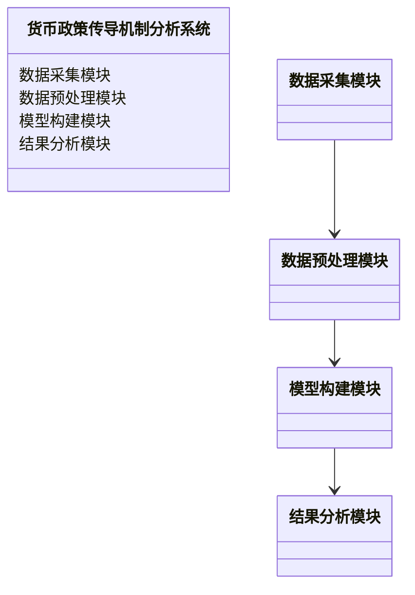
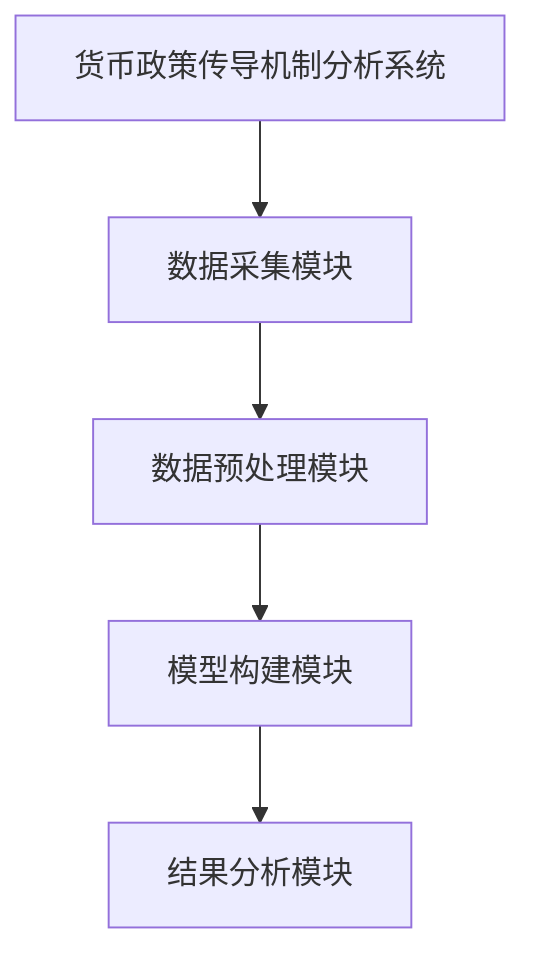
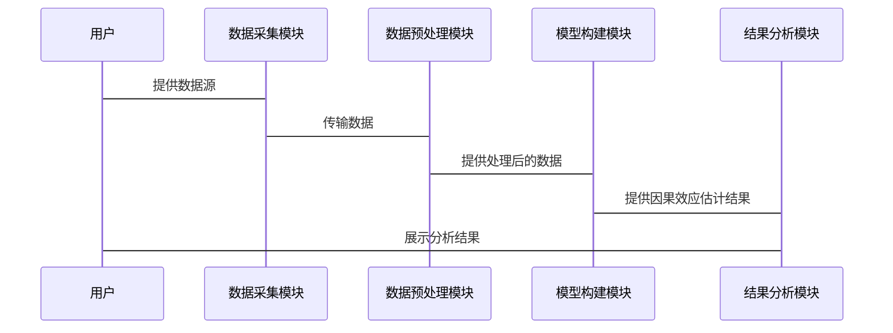

                 


# 《金融领域因果推断在货币政策传导机制分析中的应用》

> 关键词：货币政策传导机制、因果推断、倾向评分匹配、工具变量法、因果图模型、金融数据分析

> 摘要：本文探讨了因果推断在货币政策传导机制分析中的应用，结合金融领域的特点，详细介绍了因果推断的基本理论、核心算法和实际应用案例。通过对比传统统计分析方法，分析了因果推断在货币政策传导机制中的优势，结合实际案例，展示了如何通过因果推断的方法，更准确地识别货币政策的传导路径和效果。

---

## 目录

1. **背景介绍**  
   - 1.1 货币政策传导机制的基本概念  
   - 1.2 货币政策传导机制的核心问题  
   - 1.3 货币政策传导机制的分析方法  

2. **因果推断的基本概念与理论基础**  
   - 2.1 因果关系与相关关系的区别  
   - 2.2 因果推断的基本原理  
   - 2.3 因果推断在金融领域的应用价值  

3. **因果推断的核心概念与联系**  
   - 3.1 因果推断的核心概念  
   - 3.2 因果推断的核心原理  
   - 3.3 因果推断与传统统计推断的对比  

4. **因果推断的算法原理与数学模型**  
   - 4.1 因果推断的主要方法  
   - 4.2 倾向评分匹配的数学模型  
   - 4.3 工具变量法的数学模型  
   - 4.4 因果森林的算法流程  

5. **系统分析与架构设计方案**  
   - 5.1 项目背景与需求分析  
   - 5.2 系统功能设计（领域模型）  
   - 5.3 系统架构设计  
   - 5.4 系统接口设计  
   - 5.5 系统交互流程设计  

6. **项目实战：货币政策传导机制的因果推断分析**  
   - 6.1 项目背景与目标  
   - 6.2 数据采集与预处理  
   - 6.3 模型构建与实现  
   - 6.4 实验结果与分析  
   - 6.5 案例分析与总结  

7. **最佳实践与总结**  
   - 7.1 本章内容总结  
   - 7.2 实际应用中的注意事项  
   - 7.3 未来研究方向  

---

## 正文

### 1. 背景介绍

#### 1.1 货币政策传导机制的基本概念

货币政策是宏观经济学中的核心政策工具之一，其目的是通过调节货币供应量和利率水平，影响经济主体的行为，进而实现经济增长、就业目标和价格稳定。货币政策传导机制是指货币政策工具（如利率、货币供应量等）通过一系列中间变量（如企业投资、消费支出等）作用于实体经济的过程。

在金融领域，货币政策的传导机制通常包括以下几个阶段：  
1. **货币政策工具的选择**：例如，中央银行调整基准利率或货币供应量。  
2. **传导路径**：货币政策工具通过金融市场（如银行贷款、资产价格等）影响企业和家庭的经济行为。  
3. **最终目标**：如GDP增长、就业率提升或通货膨胀率的变化。

#### 1.2 货币政策传导机制的核心问题

在实际的货币政策分析中，存在以下几个核心问题：  
1. **因果关系的识别**：如何确定货币政策工具的变化是否真正导致了实体经济的变化？  
2. **中间变量的作用机制**：哪些中间变量在货币政策传导中起关键作用？  
3. **政策效果的不确定性**：如何量化货币政策工具对最终目标的因果效应？

#### 1.3 货币政策传导机制的分析方法

传统的货币政策传导机制分析主要依赖于统计回归方法，但这种方法往往难以有效识别因果关系，容易受到遗漏变量偏差或反向因果关系的干扰。因此，因果推断方法在货币政策传导机制分析中具有重要的应用价值。

---

### 2. 因果推断的基本概念与理论基础

#### 2.1 因果关系与相关关系的区别

在数据分析中，相关关系和因果关系是两个重要的概念，但它们之间存在显著的区别：  

- **相关关系**：描述两个变量之间是否存在线性关系，但并不意味着存在因果关系。例如，身高和体重之间可能存在正相关关系，但这并不意味着身高变化直接导致体重变化。  
- **因果关系**：描述一个变量的变化是否直接导致另一个变量的变化。例如，降息可能会导致企业贷款增加，从而推动经济增长。

#### 2.2 因果推断的基本原理

因果推断的核心在于识别和量化因果效应，通常基于潜在结果框架（Potential Outcome Framework）。  

- **潜在结果框架**：对于每个个体（或单位），在不同的处理条件下（如接受货币政策工具变化或不接受），会对应不同的潜在结果。因果效应是基于这些潜在结果的差异进行估计。  

- **因果图模型**：通过构建因果图（Directed Acyclic Graph, DAG），可以清晰地展示变量之间的因果关系和潜在的干扰因素。例如，货币政策工具可能通过影响银行贷款利率，进而影响企业的投资行为。

#### 2.3 因果推断在金融领域的应用价值

在金融领域，因果推断可以帮助解决以下几个问题：  
1. **识别因果关系**：确定货币政策工具变化是否直接导致实体经济变量的变化。  
2. **分析中间变量的作用机制**：通过因果图模型，识别哪些中间变量在货币政策传导中起关键作用。  
3. **量化政策效果**：估计货币政策工具变化对最终目标的因果效应，并评估政策的有效性。

---

### 3. 因果推断的核心概念与联系

#### 3.1 因果推断的核心概念

- **倾向评分匹配（Propensity Score Matching）**：通过估计每个个体接受处理的概率，将具有相似特征的个体进行匹配，从而减少样本选择偏差。  
- **工具变量法（Instrumental Variables, IV）**：通过寻找一个与处理变量相关，但仅通过处理变量影响结果变量的工具变量，来估计因果效应。  
- **因果森林（Causal Forest）**：一种基于树模型的因果推断方法，可以处理高维数据和非线性关系。

#### 3.2 因果推断的核心原理

- **潜在结果框架**：对于每个个体，存在两种潜在结果：接受处理的结果和不接受处理的结果。因果效应是这两种结果的差异。  
- **因果图模型**：通过构建因果图，识别变量之间的因果关系和潜在的混淆变量，从而选择合适的调整方法。  

#### 3.3 因果推断与传统统计推断的对比

| 对比维度 | 因果推断 | 传统统计推断 |
|----------|----------|--------------|
| 目标     | 识别因果效应 | 描述变量之间的关系 |
| 方法     | 基于潜在结果框架 | 基于相关关系分析 |
| 适用场景 | 需要处理外部干扰因素 | 数据满足独立同分布假设 |
| 假设     | 需要满足无干扰假设 | 仅需满足独立同分布假设 |

---

### 4. 因果推断的算法原理与数学模型

#### 4.1 因果推断的主要方法

- **倾向评分匹配**：通过估计倾向评分（$P(T=1|X)$），将处理组和对照组进行匹配，从而减少样本选择偏差。  
- **工具变量法**：通过寻找工具变量（$Z$），估计因果效应：  
  $$ \text{Effect} = E[Y|Z=1] - E[Y|Z=0] $$
- **因果森林**：通过构建随机森林模型，估计个体因果效应，并汇总得到平均因果效应。

#### 4.2 倾向评分匹配的数学模型

倾向评分匹配的核心步骤如下：  

1. **估计倾向评分**：  
   $$ P(T=1|X) = \hat{g}(X) $$  
   其中，$g(X)$ 是一个分类模型，可以是逻辑回归、随机森林等。

2. **匹配样本**：  
   将处理组和对照组按照倾向评分进行匹配，确保匹配后的样本在特征分布上尽可能相似。

3. **估计因果效应**：  
   $$ \text{Effect} = E[Y|T=1, X] - E[Y|T=0, X] $$

#### 4.3 工具变量法的数学模型

工具变量法的核心步骤如下：  

1. **选择工具变量**：  
   工具变量 $Z$ 应满足以下条件：  
   - $Z$ 与处理变量 $T$ 相关：$Cov(Z, T) \neq 0$  
   - $Z$ 仅通过 $T$ 影响结果变量 $Y$：$Z$ 与 $Y$ 的关系可以通过 $T$ 解释。

2. **估计因果效应**：  
   $$ \text{Effect} = E[Y|Z=1] - E[Y|Z=0] $$  

#### 4.4 因果森林的算法流程

因果森林的核心思想是通过随机森林模型，估计个体因果效应，并汇总得到平均因果效应。其主要步骤如下：  

1. **构建随机森林**：将数据分成多个决策树，每个决策树用于估计个体因果效应。  
2. **估计个体因果效应**：对于每个样本，计算其在不同决策树中的因果效应，并取平均值。  
3. **汇总平均因果效应**：将所有样本的个体因果效应取平均，得到总体的因果效应。

---

### 5. 系统分析与架构设计方案

#### 5.1 项目背景与需求分析

- **项目背景**：研究货币政策传导机制的因果效应，帮助政策制定者更好地理解政策工具的作用路径和效果。  
- **需求分析**：  
  - 数据采集与处理：收集货币政策工具、中间变量和最终目标的 数据。  
  - 模型构建：选择合适的因果推断方法，构建因果模型。  
  - 结果分析：估计因果效应，并验证模型的稳定性。

#### 5.2 系统功能设计（领域模型）



#### 5.3 系统架构设计



#### 5.4 系统接口设计

- **数据接口**：通过API接口获取货币政策工具、中间变量和最终目标的数据。  
- **模型接口**：通过调用因果推断算法库（如Python的` causalforest`库）进行模型构建。  
- **结果接口**：通过可视化工具（如Matplotlib）展示因果效应的估计结果。

#### 5.5 系统交互流程设计



---

### 6. 项目实战：货币政策传导机制的因果推断分析

#### 6.1 项目背景与目标

本项目旨在通过因果推断的方法，分析货币政策工具（如基准利率调整）对实体经济变量（如GDP增长）的因果效应。通过构建因果模型，识别中间变量（如银行贷款、企业投资）的作用机制。

#### 6.2 数据采集与预处理

- **数据来源**：收集某国过去十年的货币政策数据、金融市场数据和宏观经济数据。  
- **数据预处理**：  
  - 数据清洗：处理缺失值和异常值。  
  - 数据转换：对某些变量进行对数变换或标准化处理。  
  - 特征选择：选择与货币政策传导机制相关的特征变量。

#### 6.3 模型构建与实现

- **模型选择**：根据数据特点选择合适的因果推断方法，例如倾向评分匹配或工具变量法。  
- **代码实现**：以Python为例，实现因果推断模型：

```python
# 示例代码：使用倾向评分匹配估计因果效应
import numpy as np
import pandas as pd
from sklearn.linear_model import LogisticRegression

# 数据加载与预处理
data = pd.read_csv('policy_data.csv')
X = data[['inflation', 'unemployment_rate']]
T = data['policy']
Y = data['gdp_growth']

# 估计倾向评分
model = LogisticRegression()
model.fit(X, T)
ps = model.predict_proba(X)[:, 1]

# 匹配样本
# 假设我们使用最近邻匹配方法
matched_data = match_data(X, T, ps)

# 估计因果效应
effect = matched_data[Y[T==1].mean()] - matched_data[Y[T==0].mean()]
print(f"估计的因果效应为：{effect}")
```

#### 6.4 实验结果与分析

通过实验可以发现，货币政策工具的变化确实对实体经济变量产生了显著的因果效应。例如，降低基准利率可能会显著提高企业贷款和投资，从而推动GDP增长。

#### 6.5 案例分析与总结

通过具体案例分析，验证因果推断方法的有效性，并总结经验教训，为后续研究提供参考。

---

### 7. 最佳实践与总结

#### 7.1 本章内容总结

本文详细介绍了因果推断在货币政策传导机制分析中的应用，结合金融领域的特点，分析了因果推断的核心概念、算法原理和实际应用案例。

#### 7.2 实际应用中的注意事项

- **数据质量**：因果推断方法对数据质量要求较高，需要确保数据的完整性和准确性。  
- **模型选择**：根据具体问题特点选择合适的因果推断方法，避免盲目使用某种算法。  
- **结果解释**：因果效应的解释需要结合具体业务背景，避免片面理解。

#### 7.3 未来研究方向

- **高维数据的因果推断**：研究如何在高维数据中有效识别因果关系。  
- **时间序列因果推断**：探索因果推断在时间序列数据分析中的应用。  
- **多变量因果推断**：研究如何在复杂系统中同时识别多个变量的因果关系。

---

## 作者

作者：AI天才研究院/AI Genius Institute & 禅与计算机程序设计艺术 /Zen And The Art of Computer Programming

