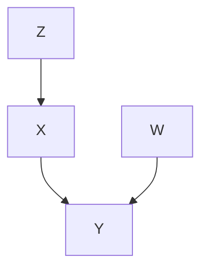
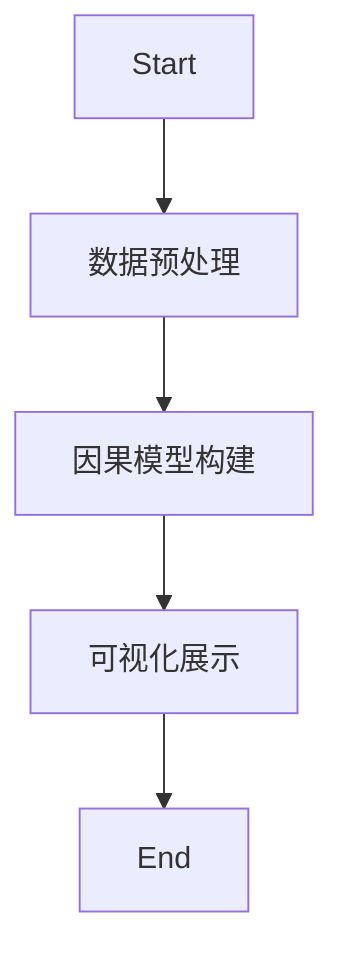
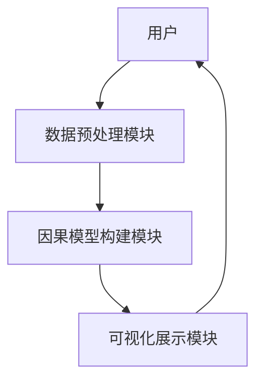
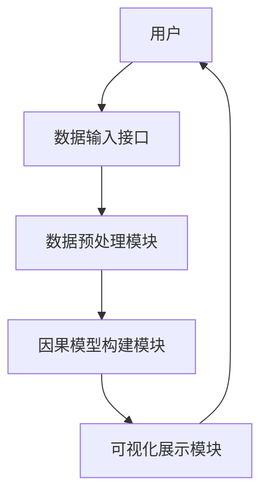

                 


# 《金融领域因果推断的研究与应用》

---

## 关键词：
- 因果推断
- 金融领域
- 机器学习
- 数据分析
- 系统设计

---

## 摘要：
本文系统地探讨了因果推断在金融领域的研究与应用，从理论基础到实际案例，全面分析了因果推断在金融数据中的应用价值。文章首先介绍了因果推断的基本概念和背景，随后深入讲解了因果推断的核心理论与方法，包括潜在结果框架、因果图模型和倾向评分匹配等。接着，从系统设计的角度，详细分析了金融因果推断系统的架构与实现。最后，通过股票市场案例，展示了因果推断在实际项目中的应用，并总结了相关经验和最佳实践。本文旨在为金融领域的因果推断研究与实践提供理论支持与实践指导。

---

# 第一部分: 金融领域因果推断的背景与基础

## 第1章: 因果推断的基本概念与背景

### 1.1 因果推断的定义与特点

#### 1.1.1 因果推断的定义
因果推断是一种通过分析数据来确定变量之间因果关系的统计方法。它不仅关注变量之间的相关性，还致力于揭示因果关系的方向和强度。

$$ \text{因果关系的定义:} \quad X \rightarrow Y $$

#### 1.1.2 因果推断与相关概念的对比
因果推断与相关分析的区别如下：

| 概念 | 描述 | 示例 |
|------|------|------|
| 相关分析 | 描述变量之间的关联性 | $X$ 和 $Y$ 的相关系数为 0.8 |
| 因果推断 | 描述变量之间的因果关系 | $X$ 对 $Y$ 的变化有因果影响 |

#### 1.1.3 金融领域因果推断的重要性
在金融领域，因果推断可以帮助我们更好地理解市场行为、评估政策效果以及优化投资决策。

### 1.2 金融领域的因果推断问题

#### 1.2.1 金融数据的复杂性
金融数据通常具有高度的噪声、异方差性和非线性特征，这使得因果推断的实施更具挑战性。

#### 1.2.2 传统统计推断的局限性
传统统计方法往往只能发现变量之间的相关性，而无法揭示因果关系。

#### 1.2.3 因果推断在金融中的应用前景
因果推断在金融领域的应用前景广阔，尤其是在资产定价、风险管理、政策评估等领域。

### 1.3 本章小结
本章介绍了因果推断的基本概念、与相关概念的区别以及在金融领域的重要性。

---

# 第二部分: 因果推断的核心理论与方法

## 第2章: 因果推断的潜在结果框架

### 2.1 潜在结果模型

#### 2.1.1 潜在结果的定义
潜在结果是指在特定条件下，变量 $X$ 对结果变量 $Y$ 的影响。

$$ \text{潜在结果的公式:} \quad Y_i(X) $$

#### 2.1.2 潜在结果的假设条件
- 稳定性假设：对于不同的单位，因果关系保持不变。
- 无干扰假设：一个单位的处理不会影响其他单位的结果。

#### 2.1.3 潜在结果的估计方法
常用的估计方法包括匹配估计量和回归估计量。

### 2.2 因果图模型

#### 2.2.1 因果图的基本结构
因果图通过有向边表示变量之间的因果关系。



#### 2.2.2 调整因果图的步骤
1. 确定因果图的结构。
2. 消除混杂变量的影响。
3. 计算调整后的因果效应。

#### 2.2.3 因果图在金融中的应用
例如，在股票市场中，因果图可以用于分析市场情绪对股价的影响。

### 2.3 倾向评分匹配

#### 2.3.1 倾向评分的定义
倾向评分是处理变量对结果变量的影响概率。

$$ \text{倾向评分公式:} \quad P(X=1|W) $$

#### 2.3.2 倾向评分匹配的方法
- 确定处理变量 $X$ 和控制变量 $W$。
- 计算倾向评分 $P(X=1|W)$。
- 使用匹配方法（如近邻匹配）进行匹配。

#### 2.3.3 倾向评分在金融中的应用
例如，在评估政策对股价的影响时，倾向评分匹配可以有效控制混杂变量。

### 2.4 本章小结
本章详细介绍了潜在结果框架、因果图模型和倾向评分匹配等核心理论。

---

# 第三部分: 金融领域因果推断的系统分析与架构设计

## 第3章: 金融因果推断的系统设计

### 3.1 系统功能设计

#### 3.1.1 系统目标与范围
系统目标：分析金融数据中的因果关系。
系统范围：支持多种金融数据格式，提供因果推断的可视化结果。

#### 3.1.2 系统功能模块划分
- 数据预处理模块
- 因果模型构建模块
- 可视化展示模块

#### 3.1.3 系统功能流程图


### 3.2 系统架构设计

#### 3.2.1 系统架构图


#### 3.2.2 模块之间的交互关系
- 用户输入数据
- 数据预处理模块处理数据
- 因果模型构建模块分析数据
- 可视化展示模块展示结果

#### 3.2.3 系统扩展性设计
支持多种因果推断算法的扩展。

### 3.3 系统接口设计

#### 3.3.1 输入接口设计
- 数据输入接口：支持CSV、Excel格式
- 参数设置接口：允许用户自定义因果模型参数

#### 3.3.2 输出接口设计
- 结果输出接口：展示因果关系图
- 报告生成接口：输出因果推断报告

#### 3.3.3 接口交互流程


### 3.4 本章小结
本章从系统设计的角度，详细分析了金融因果推断系统的功能、架构和接口设计。

---

# 第四部分: 金融领域因果推断的项目实战

## 第4章: 股票市场因果推断案例分析

### 4.1 项目背景与目标

#### 4.1.1 项目背景
研究股票市场的因果关系，帮助投资者做出更明智的决策。

#### 4.1.2 项目目标
分析市场情绪对股价的影响。

#### 4.1.3 数据来源与预处理
数据来源：股票价格和市场情绪数据。
预处理步骤：
1. 数据清洗：处理缺失值和异常值。
2. 数据标准化：对数据进行归一化处理。

### 4.2 项目实施与代码

#### 4.2.1 环境安装
安装必要的库：

```bash
pip install pandas numpy sklearn
```

#### 4.2.2 系统核心实现源代码
```python
import pandas as pd
import numpy as np
from sklearn.linear_model import LogisticRegression

# 数据预处理
def preprocess_data(data):
    data = data.dropna()
    data = (data - data.mean()) / data.std()
    return data

# 因果模型构建
def causal_model(X, Y):
    model = LogisticRegression()
    model.fit(X, Y)
    return model

# 可视化展示
def visualize_results(model, X, Y):
    plt.scatter(X, Y)
    plt.plot(X, model.predict(X))
    plt.show()
```

#### 4.2.3 代码应用解读与分析
1. 数据预处理：清洗和标准化数据。
2. 因果模型构建：使用逻辑回归模型进行因果推断。
3. 可视化展示：绘制实际结果与预测结果的对比图。

#### 4.2.4 实际案例分析
通过具体案例，分析市场情绪对股价的影响。

### 4.3 本章小结
本章通过股票市场案例，展示了因果推断在实际项目中的应用。

---

# 第五部分: 总结与展望

## 第5章: 金融因果推断的总结与展望

### 5.1 本章总结
本文系统地探讨了因果推断在金融领域的研究与应用，从理论到实践，全面分析了因果推断在金融数据中的应用价值。

### 5.2 研究热点与未来方向
未来的研究方向包括：
1. 多因果变量的处理
2. 高维数据的因果推断
3. 机器学习与因果推断的结合

### 5.3 最佳实践 tips
- 数据预处理是关键
- 模型选择要谨慎
- 可视化结果有助于理解

### 5.4 注意事项
- 确保数据质量
- 合理选择因果模型
- 注意混杂变量的影响

### 5.5 拓展阅读
推荐阅读相关书籍和论文，深入学习因果推断的知识。

---

# 作者：AI天才研究院 & 禅与计算机程序设计艺术

---

**感谢您的阅读！**

