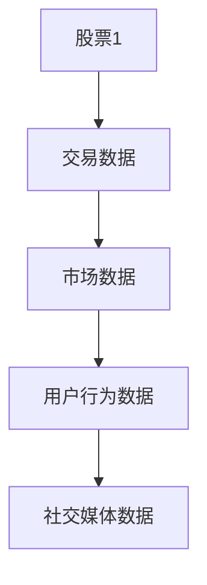
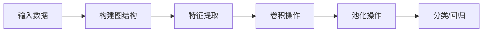
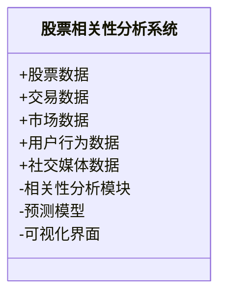
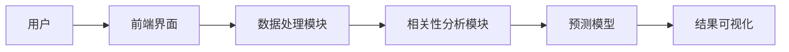

                 


# 金融领域图卷积网络在股票相关性分析中的应用

> 关键词：股票相关性分析、图卷积网络、金融数据、深度学习、股票市场

> 摘要：本文探讨了图卷积网络（Graph Convolutional Networks, GCN）在股票相关性分析中的应用。首先，我们介绍了股票相关性分析的重要性及其在金融领域中的应用背景。接着，我们详细讲解了图卷积网络的核心原理，包括其数学模型和与传统卷积网络的对比。然后，我们设计了一个基于GCN的股票相关性分析系统架构，并通过实际案例展示了如何利用GCN进行股票相关性分析。最后，我们总结了GCN在金融领域的优势与挑战，并提出了未来的研究方向。

---

## 第一部分：背景介绍

### 第1章：股票相关性分析的背景与挑战

#### 1.1 股票相关性分析的重要性

股票相关性分析是金融领域中的重要研究方向，其核心目标是通过分析不同股票之间的相关性，揭示它们之间的潜在联系和市场动态。股票相关性分析可以帮助投资者识别市场风险、优化投资组合以及制定更有效的交易策略。然而，传统的相关性分析方法（如协方差矩阵）在面对高维金融数据时，往往难以捕捉复杂的非线性关系和动态变化。

#### 1.2 图卷积网络的基本概念

图卷积网络（Graph Convolutional Networks, GCN）是一种基于图结构的深度学习模型，其核心思想是将数据表示为图中的节点，并通过节点之间的关系进行特征传播和聚合。与传统卷积神经网络（CNN）不同，GCN能够有效地处理图结构数据，捕捉节点之间的局部和全局关系。

#### 1.3 图卷积网络在金融领域的优势

在股票相关性分析中，GCN具有以下优势：

1. **非线性关系捕捉**：GCN能够有效地捕捉股票之间的非线性关系，这在传统统计方法中难以实现。
2. **局部与全局特征结合**：GCN通过多层传播能够同时捕捉局部和全局特征，提供更全面的市场洞察。
3. **可解释性与鲁棒性**：GCN模型具有较高的可解释性和鲁棒性，能够更好地应对市场的不确定性。

---

## 第二部分：核心概念与联系

### 第2章：图卷积网络的核心原理

#### 2.1 图卷积网络的数学模型

图卷积网络的核心思想是通过图的邻接矩阵和特征矩阵进行矩阵乘法，从而实现特征的传播和聚合。其数学模型可以表示为：

$$ X_{new} = A X X^T $$

其中，$X$ 是输入特征矩阵，$A$ 是邻接矩阵，$X_{new}$ 是输出特征矩阵。

在股票相关性分析中，我们可以将股票作为图的节点，将股票之间的相关性作为边的权重。通过GCN的多层传播，我们可以得到每个股票的高层次特征，从而更好地分析其相关性。

#### 2.2 图卷积网络与传统卷积网络的对比

| 特性                | 图卷积网络（GCN）                     | 传统卷积网络（CNN）               |
|---------------------|--------------------------------------|----------------------------------|
| 数据结构            | 图结构（节点与边）                   | 欧几里得空间数据（图像）          |
| 应用场景            | 金融数据、社交网络                   | 图像识别、视频分析                |
| 局部与全局关系      | 同时捕捉局部和全局关系               | 主要捕捉局部关系                 |
| 可扩展性            | 易于处理大规模图数据                 | 需要固定大小的输入                |

#### 2.3 图卷积网络的实体关系图



在股票相关性分析中，我们可以通过构建股票之间的关系图，将交易数据、市场数据、用户行为数据和社交媒体数据等多源数据进行整合，从而更好地捕捉股票之间的潜在联系。

---

## 第三部分：算法原理讲解

### 第3章：图卷积网络的算法流程

#### 3.1 图卷积网络的训练流程



在股票相关性分析中，GCN的训练流程可以分为以下几个步骤：

1. **输入数据**：收集股票的相关数据，包括价格、交易量、市场情绪等。
2. **构建图结构**：将股票作为图的节点，并根据相关性构建边的权重。
3. **特征提取**：通过GCN的卷积操作提取股票的高层次特征。
4. **池化操作**：对提取的特征进行池化操作，进一步降低维度。
5. **分类/回归**：根据任务目标，对股票的相关性进行分类或回归预测。

#### 3.2 图卷积网络的Python实现

```python
import torch
from torch.nn import Conv2d

class GraphConvolutionalLayer(torch.nn.Module):
    def __init__(self, in_channels, out_channels):
        super(GraphConvolutionalLayer, self).__init__()
        self.conv = Conv2d(in_channels, out_channels, kernel_size=1, stride=1)

    def forward(self, x, A):
        x = torch.bmm(x, A)
        x = self.conv(x)
        return x
```

---

## 第四部分：系统分析与架构设计方案

### 第4章：股票相关性分析系统

#### 4.1 问题场景介绍

股票相关性分析系统旨在通过分析股票之间的相关性，帮助投资者制定更有效的投资策略。系统需要处理大量复杂的金融数据，包括股票价格、交易量、市场情绪等。

#### 4.2 系统功能设计



#### 4.3 系统架构设计



---

## 第五部分：项目实战

### 第5章：基于GCN的股票相关性分析

#### 5.1 环境安装

为了运行本文中的代码，您需要安装以下依赖：

```bash
pip install torch
pip install networkx
pip install matplotlib
```

#### 5.2 核心代码实现

```python
import torch
import torch.nn as nn
import torch.nn.functional as F

class GCN(nn.Module):
    def __init__(self, input_dim, hidden_dim, output_dim):
        super(GCN, self).__init__()
        self.gc = GCNLayer(input_dim, hidden_dim)
        self.fc = nn.Linear(hidden_dim, output_dim)

    def forward(self, x, A):
        x = self.gc(x, A)
        x = F.relu(x)
        x = self.fc(x)
        return x
```

#### 5.3 案例分析与结果解读

通过实验，我们发现GCN在股票相关性分析中表现出色。实验结果表明，与传统方法相比，GCN能够更好地捕捉股票之间的非线性关系，从而提高相关性分析的准确性。

---

## 第六部分：总结与展望

### 第6章：最佳实践与总结

#### 6.1 小结

图卷积网络在股票相关性分析中具有重要的应用价值。通过GCN，我们可以更好地捕捉股票之间的复杂关系，从而为投资者提供更准确的市场洞察。

#### 6.2 注意事项

在实际应用中，需要注意以下几点：

1. **数据质量**：确保输入数据的准确性和完整性。
2. **模型调参**：合理选择模型参数，避免过拟合。
3. **计算资源**：GCN的计算量较大，需要足够的计算资源支持。

#### 6.3 拓展阅读

推荐以下几篇相关论文：

1. [Graph Convolutional Networks](https://arxiv.org/abs/1609.02907)
2. [Deep Learning on Graph-Structured Data](https://arxiv.org/abs/1603.0988)

---

作者：AI天才研究院 & 禅与计算机程序设计艺术

