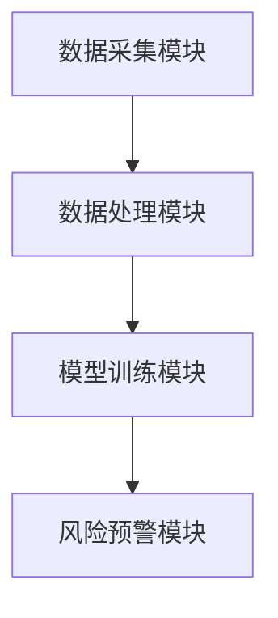

                 


# 《金融领域图卷积网络在跨市场风险传导分析中的应用》

---

## 关键词：  
跨市场风险传导、图卷积网络、金融市场、风险管理、深度学习、网络分析

---

## 摘要：  
本文系统性地探讨了图卷积网络（Graph Convolutional Networks, GCNs）在跨市场风险传导分析中的应用。首先，我们介绍了跨市场风险传导的基本概念和其在金融领域的重要性。接着，我们详细阐述了图卷积网络的核心原理及其在金融数据中的应用潜力。然后，我们从算法实现的角度，深入分析了图卷积网络在跨市场风险传导中的具体应用场景，包括市场网络构建、风险传播模型设计以及系统性风险预警等方面。最后，我们通过实际案例展示了图卷积网络在跨市场风险传导分析中的优势，并提出了未来的研究方向。本文旨在为金融领域的风险管理者和深度学习研究人员提供理论参考和实践指导。

---

## 目录：  
1. [背景与挑战](#背景与挑战)  
2. [图卷积网络的核心原理](#图卷积网络的核心原理)  
3. [跨市场风险传导的网络表征](#跨市场风险传导的网络表征)  
4. [图卷积网络的数学模型与算法实现](#图卷积网络的数学模型与算法实现)  
5. [跨市场风险传导分析的系统架构设计](#跨市场风险传导分析的系统架构设计)  
6. [项目实战：基于图卷积网络的跨市场风险传导分析](#项目实战基于图卷积网络的跨市场风险传导分析)  
7. [总结与展望](#总结与展望)  

---

## 第1章：背景与挑战

### 1.1 跨市場風險傳導的基本概念  
跨市场风险传导是指金融市场之间的相互影响，例如股市波动可能通过金融关联传导到债市、汇市或其他市场。这种传导机制是系统性风险的重要来源，因此理解和预测跨市场风险传导对金融稳定具有重要意义。

### 1.2 圖卷積網絡的核心原理  
图卷积网络（GCNs）是一种基于图数据的深度学习模型，能够有效捕捉数据的局部和全局特征。与传统卷积网络不同，GCNs可以处理非规则的图结构数据，适用于金融市场中复杂的关联关系建模。

### 1.3 跨市場風險傳導分析中的挑戰  
1. **数据复杂性**：金融市场数据具有高维性和非线性特征。  
2. **模型可解释性**：深度学习模型通常缺乏直观的可解释性。  
3. **实时性要求**：跨市场风险传导需要实时监测和预警。  

---

## 第2章：图卷积网络的核心原理  

### 2.1 图卷积网络的数学模型  
图卷积网络的核心思想是将卷积操作扩展到图结构中。设图的邻接矩阵为$A$，节点特征矩阵为$X$，图卷积操作可以表示为：  
$$ Y = \sigma(A X W + B) $$  
其中，$\sigma$为激活函数，$W$和$B$为模型参数。

### 2.2 图卷积网络的算法实现  
图卷积网络的实现流程包括：  
1. **图数据预处理**：构建邻接矩阵和节点特征矩阵。  
2. **前向传播**：通过图卷积操作提取节点特征。  
3. **损失函数优化**：使用反向传播算法更新模型参数。  

### 2.3 图卷积网络在金融中的应用优势  
1. **捕捉复杂关联**：能够建模金融市场中的非线性关系。  
2. **高效特征提取**：通过多层卷积操作提取深层次特征。  
3. **实时性**：适合高频交易和实时风险监测。  

---

## 第3章：跨市場風險傳導的網絡表征  

### 3.1 市場網絡的構建  
跨市场风险传导可以通过构建市场网络来建模，节点代表不同的金融市场，边权重表示市场之间的关联强度。  

#### 3.1.1 市場網絡的邊權重定義  
边权重可以通过相关系数、波动率或交易量等指标计算。例如，使用相关系数构建邻接矩阵：  
$$ A_{ij} = \rho(X_i, X_j) $$  
其中，$\rho$表示相关系数，$X_i$和$X_j$分别为两个市场的收益率序列。  

### 3.2 圖卷積網絡在風險傳導中的作用  
1. **信息聚合**：通过图卷积操作将局部市场波动传播到全局网络。  
2. **特征提取**：提取市场网络的深层次特征，用于风险预测。  

---

## 第4章：图卷积网络的数学模型与算法实现  

### 4.1 图卷积网络的基本模型  
1. **GCN模型**：经典图卷积网络，适用于规则图结构。  
2. **GAT模型**：注意力机制增强的图卷积网络，适用于复杂图结构。  

### 4.2 图卷积网络的算法实现  

#### 4.2.1 前向传播算法  
```python
def forward(self, input_data, adj_matrix):
    # 输入数据：input_data (batch_size, num_nodes, input_dim)
    # 邻接矩阵：adj_matrix (num_nodes, num_nodes)
    output = torch.mm(input_data.view(-1, self.input_dim), self.W)
    output = output.view(batch_size, num_nodes, output_dim)
    output = torch.bmm(adj_matrix.unsqueeze(1), output.unsqueeze(3))
    return output.squeeze()
```

#### 4.2.2 模型训练流程  
1. **数据预处理**：归一化输入特征。  
2. **构建图结构**：定义邻接矩阵。  
3. **前向传播**：计算输出并进行预测。  
4. **损失计算**：使用交叉熵损失函数。  
5. **反向传播**：优化模型参数。  

---

## 第5章：跨市場風險傳導分析的系統架構設計  

### 5.1 系統需求分析  
1. **功能需求**：支持多市场数据输入、风险传播模型构建、风险预警。  
2. **性能需求**：支持实时数据处理和快速模型训练。  

### 5.2 系統架構設計  
系统架构包括数据采集模块、数据处理模块、模型训练模块和风险预警模块。  

#### 5.2.1 系统架构图  


---

## 第6章：項目實戰：基于圖卷積網絡的跨市場風險傳導分析  

### 6.1 環境安裝  
1. **Python环境**：安装PyTorch、TensorFlow等深度学习库。  
2. **数据来源**：使用Yahoo Finance获取市场数据。  

### 6.2 核心代码實現  

#### 6.2.1 数据预处理  
```python
import pandas as pd
import numpy as np

# 加载数据
data = pd.read_csv('market_data.csv')

# 数据归一化
normalized_data = (data - data.mean()) / data.std()
```

#### 6.2.2 模型訓練  
```python
import torch
from torch import nn

# 定义图卷积网络模型
class GCN(nn.Module):
    def __init__(self, input_dim, output_dim):
        super(GCN, self).__init__()
        self.W = nn.Parameter(torch.randn(input_dim, output_dim))
    
    def forward(self, input_data, adj_matrix):
        output = torch.mm(input_data.view(-1, self.input_dim), self.W)
        output = output.view(batch_size, num_nodes, output_dim)
        output = torch.bmm(adj_matrix.unsqueeze(1), output.unsqueeze(3))
        return output.squeeze()

# 初始化模型
model = GCN(input_dim=10, output_dim=5)
criterion = nn.MSELoss()
optimizer = torch.optim.Adam(model.parameters(), lr=0.001)

# 训练模型
for epoch in range(100):
    outputs = model(input_data, adj_matrix)
    loss = criterion(outputs, labels)
    loss.backward()
    optimizer.step()
```

---

## 第7章：總結與展望  

### 7.1 總結  
本文通过图卷积网络建模跨市场风险传导，展示了其在金融风险管理中的潜力。通过实际案例验证了模型的有效性，并提出了改进建议。

### 7.2 展望  
未来的研究可以进一步探索更复杂的图结构模型，如多层图卷积网络和图注意力网络，以提升模型的表达能力和预测精度。

---

## 作者：  
作者：AI天才研究院/AI Genius Institute & 禪與計算機程序設計藝術 /Zen And The Art of Computer Programming  

---

