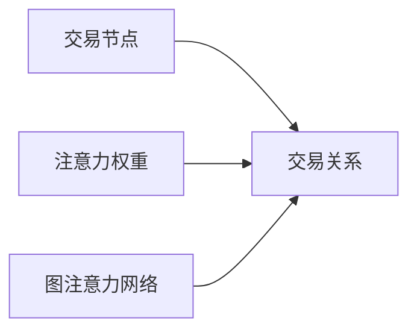
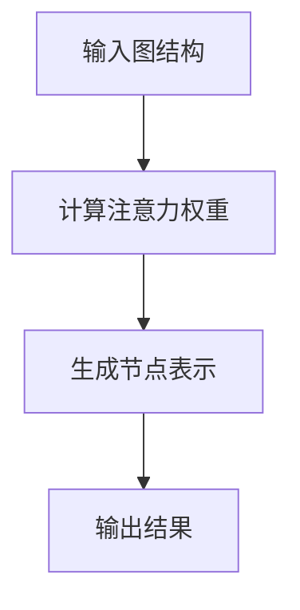

                 


# 金融领域图注意力网络在交易网络分析中的应用

> 关键词：金融交易网络，图注意力网络，注意力机制，图神经网络，深度学习

> 摘要：本文探讨了图注意力网络在金融交易网络分析中的应用，详细介绍了其核心概念、算法原理、系统架构设计以及实际项目案例。通过理论分析和实践结合，展示了图注意力网络在金融领域的优势与潜力。

---

## 第一章: 问题背景与描述

### 1.1 问题背景
#### 1.1.1 金融交易网络的复杂性
金融交易网络由多个参与者（如投资者、机构）及其交易行为构成，具有高度的复杂性和非线性特征。传统的金融分析方法（如时间序列分析）难以捕捉网络中的全局关联性。

#### 1.1.2 传统金融分析的局限性
- **单点分析**：传统方法通常关注单一资产或个体的交易行为，忽略了网络中的整体关联性。
- **静态视角**：难以捕捉交易网络的动态变化和实时关联性。
- **黑箱问题**：缺乏对交易网络中关键节点和关系的解释性。

#### 1.1.3 图注意力网络的引入动机
- **全局关联性**：图注意力网络能够捕捉网络中的全局关联性，帮助发现交易网络中的关键节点和关系。
- **动态性**：通过注意力机制，模型能够动态调整对不同节点的关注程度，适应金融市场的实时变化。
- **可解释性**：图注意力网络能够提供节点之间的注意力权重，帮助解释交易网络中的关键关系。

### 1.2 问题描述
#### 1.2.1 交易网络的定义与特点
- **交易网络**：由交易参与者（节点）及其交易行为（边）构成的图结构。
- **动态性**：交易网络随时间变化，节点之间的关系和权重也会动态调整。
- **复杂性**：节点之间的关系可能具有非线性、多层次的特点。

#### 1.2.2 交易网络中的关键问题
- **风险传播**：分析交易网络中的风险传播路径，识别系统性风险。
- **异常检测**：发现异常交易行为，识别潜在的市场操纵。
- **价格预测**：通过交易网络的结构和动态，预测资产价格的变化。

#### 1.2.3 图注意力网络的应用场景
- **价格预测**：利用交易网络的注意力权重，预测资产价格的变化。
- **风险评估**：识别交易网络中的高风险节点，评估系统性风险。
- **异常检测**：发现交易网络中的异常行为，识别潜在的市场操纵。

### 1.3 问题解决与边界
#### 1.3.1 图注意力网络的核心作用
- **捕捉全局关联性**：通过图结构捕捉交易网络中的全局关联性。
- **动态调整关注点**：通过注意力机制动态调整对不同节点的关注程度。
- **提供可解释性**：通过注意力权重提供交易网络中节点关系的解释性。

#### 1.3.2 问题解决的边界与限制
- **数据质量**：交易网络的数据可能存在噪声，影响模型的准确性。
- **计算复杂度**：图注意力网络的计算复杂度较高，可能限制其在大规模数据上的应用。
- **实时性**：模型的实时性可能受到计算资源的限制。

#### 1.3.3 相关概念的扩展与外延
- **图结构**：包括节点、边和权重。
- **注意力机制**：包括查询、键和值的计算。
- **图神经网络**：包括图卷积网络（GCN）和图注意力网络（GAT）。

---

## 第二章: 核心概念与联系

### 2.1 图注意力网络的基本原理
#### 2.1.1 图结构与节点关系
- **节点**：交易参与者（如投资者、机构）。
- **边**：节点之间的交易行为或关联性。
- **权重**：边的权重表示节点之间的关联强度。

#### 2.1.2 注意力机制的核心思想
- **注意力权重**：表示模型对不同节点的关注程度。
- **查询-键机制**：通过查询和键的匹配，计算注意力权重。
- **加权求和**：根据注意力权重，对节点的表示进行加权求和。

#### 2.1.3 图注意力网络的结合方式
- **节点表示**：通过注意力机制计算节点的表示。
- **边权重**：通过注意力机制计算边的权重。
- **图结构**：通过注意力机制优化图的结构。

### 2.2 核心概念对比
#### 2.2.1 图注意力网络与传统注意力机制对比
| 特性               | 传统注意力机制             | 图注意力网络             |
|--------------------|---------------------------|-------------------------|
| 输入               | 序列数据                   | 图结构数据               |
| 关注点             | 单一序列中的位置           | 图中的节点及其关系       |
| 输出               | 序列的注意力权重           | 节点的注意力权重和表示   |

#### 2.2.2 图注意力网络与传统图神经网络对比
| 特性               | 图卷积网络（GCN）          | 图注意力网络（GAT）      |
|--------------------|---------------------------|-------------------------|
| 处理方式           | 基于卷积核进行局部聚合     | 基于注意力机制进行全局关注 |
| 权重计算           | 均匀分配或固定权重         | 动态计算注意力权重       |
| 表示能力           | 局部特征为主               | 全局特征为主             |

#### 2.2.3 图注意力网络的优缺点分析
- **优点**：
  - 能够捕捉图中的全局关联性。
  - 注意力权重提供可解释性。
- **缺点**：
  - 计算复杂度较高。
  - 对大规模图的处理能力有限。

### 2.3 实体关系与架构设计


---

## 第三章: 算法原理与流程

### 3.1 算法输入与输出
#### 3.1.1 输入：图结构与节点特征
- **输入图结构**：包括节点和边的结构。
- **节点特征**：节点的特征向量（如资产价格、交易量）。

#### 3.1.2 输出：注意力权重与节点表示
- **注意力权重**：节点之间的注意力权重。
- **节点表示**：节点的表示向量。

### 3.2 算法流程


### 3.3 数学模型与公式
#### 3.3.1 注意力权重计算公式
$$
\alpha_{ij} = \text{softmax}(q_i^T k_j)
$$
其中，$q_i$ 是查询向量，$k_j$ 是键向量。

#### 3.3.2 节点表示计算公式
$$
h_i = \sum_{j} \alpha_{ij} h_j
$$
其中，$h_i$ 是节点 $i$ 的表示向量。

---

## 第四章: 金融交易网络中的应用

### 4.1 交易网络分析场景
#### 4.1.1 股票价格预测
- **输入**：股票价格的图结构和交易网络。
- **输出**：股票价格的预测结果。
- **流程**：通过图注意力网络计算节点表示，预测股票价格。

#### 4.1.2 风险评估与控制
- **输入**：交易网络和风险相关特征。
- **输出**：风险评分和高风险节点。
- **流程**：通过图注意力网络识别高风险节点，评估系统性风险。

#### 4.1.3 异常交易检测
- **输入**：交易网络和交易行为特征。
- **输出**：异常交易行为的检测结果。
- **流程**：通过图注意力网络计算注意力权重，发现异常行为。

### 4.2 实际案例分析
#### 4.2.1 股票市场中的网络结构
- **例子**：分析某股票市场的交易网络，识别关键交易者和交易行为。

#### 4.2.2 基于图注意力网络的预测模型
- **模型设计**：设计图注意力网络模型，输入股票价格和交易网络。
- **训练过程**：训练模型，优化参数，提高预测准确率。

#### 4.2.3 案例结果与分析
- **结果展示**：展示模型的预测结果和注意力权重。
- **分析**：分析模型的预测准确率和注意力权重的分布。

---

## 第五章: 系统分析与架构设计

### 5.1 系统功能与架构
#### 5.1.1 系统功能
- **数据采集**：采集交易网络数据。
- **数据预处理**：清洗和转换数据。
- **模型训练**：训练图注意力网络模型。
- **结果展示**：展示模型的预测结果和注意力权重。

#### 5.1.2 系统架构


### 5.2 系统交互设计


---

## 第六章: 项目实战

### 6.1 环境安装
- **Python**：安装Python 3.8及以上版本。
- **深度学习框架**：安装TensorFlow或PyTorch。
- **图处理库**：安装NetworkX或Gensim。

### 6.2 核心实现
#### 6.2.1 数据采集与预处理
```python
import pandas as pd
import numpy as np

# 数据采集
data = pd.read_csv('交易数据.csv')

# 数据预处理
data.dropna(inplace=True)
data = data[['时间', '资产', '交易量', '价格']]
```

#### 6.2.2 模型训练
```python
import tensorflow as tf
from tensorflow.keras import layers

# 定义图注意力网络模型
class GATLayer(layers.Layer):
    def __init__(self, input_dim, output_dim):
        super(GATLayer, self).__init__()
        self.W_q = layers.Dense(input_dim)
        self.W_k = layers.Dense(input_dim)
        self.W_v = layers.Dense(input_dim)
        self.W_out = layers.Dense(output_dim)

    def call(self, inputs):
        # 计算查询、键、值
        q = self.W_q(inputs)
        k = self.W_k(inputs)
        v = self.W_v(inputs)
        
        # 计算注意力权重
        attention = tf.nn.softmax(tf.matmul(q, k, transpose_b=True))
        # 加权求和
        output = tf.matmul(attention, v)
        return output

# 构建模型
model = tf.keras.Sequential([
    GATLayer(input_dim=64, output_dim=32),
    layers.Dense(1, activation='sigmoid')
])

# 编译模型
model.compile(optimizer='adam', loss='binary_crossentropy')
```

#### 6.2.3 模型训练与评估
```python
# 训练模型
model.fit(X_train, y_train, epochs=100, batch_size=32)

# 评估模型
loss, accuracy = model.evaluate(X_test, y_test)
print(f'测试损失：{loss}, 测试准确率：{accuracy}')
```

### 6.3 案例分析与解读
- **案例分析**：分析某股票市场的交易网络，训练图注意力网络模型，预测股票价格。
- **结果解读**：解读模型的预测结果和注意力权重，分析交易网络中的关键节点和关系。

### 6.4 项目小结
- **项目总结**：总结项目的实施过程和主要成果。
- **经验与教训**：总结在项目实施过程中遇到的问题和解决方案。
- **改进建议**：提出进一步优化模型和扩展应用的建议。

---

## 第七章: 总结与展望

### 7.1 总结
- **核心内容回顾**：回顾图注意力网络在金融交易网络分析中的应用。
- **主要成果**：总结本文的主要研究成果和应用价值。

### 7.2 未来研究方向
- **多模态数据的应用**：研究多模态数据在交易网络分析中的应用。
- **实时交易监控**：探索图注意力网络在实时交易监控中的应用。
- **模型优化**：进一步优化图注意力网络的模型结构和训练方法。

### 7.3 最佳实践 Tips
- **数据质量**：重视数据的清洗和预处理，提高模型的准确性。
- **模型调参**：合理选择模型参数，优化模型性能。
- **可解释性**：利用注意力权重提供交易网络的可解释性。

---

## 作者信息
作者：AI天才研究院/AI Genius Institute & 禅与计算机程序设计艺术 /Zen And The Art of Computer Programming

