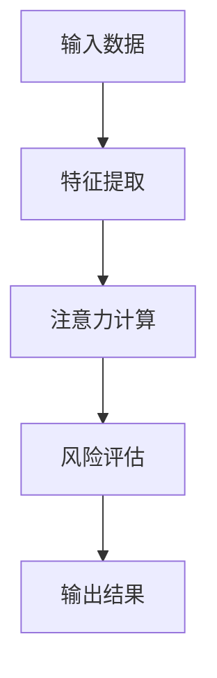
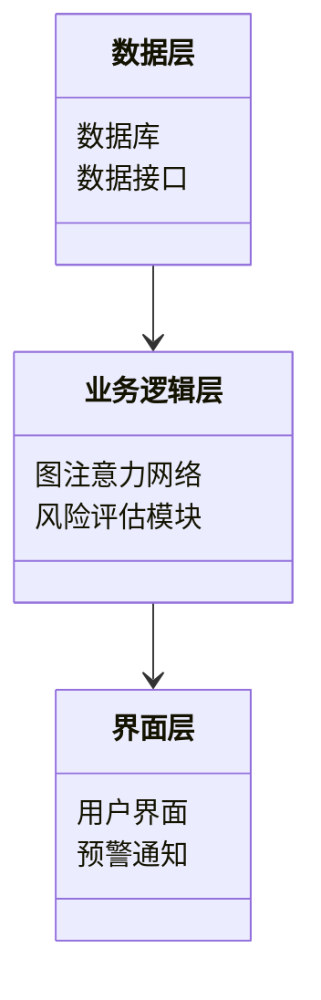

                 


# 《金融领域图注意力网络在系统性风险传导预警中的应用》

> 关键词：系统性金融风险，图注意力网络，风险预警，金融系统，复杂网络

> 摘要：系统性金融风险的预警对于维护金融市场稳定具有重要意义。本文探讨了图注意力网络在系统性风险传导预警中的应用，通过分析图注意力网络的核心概念、算法实现及其在金融领域的具体应用，展示了如何利用图注意力网络构建有效的系统性风险预警模型。文章从理论基础到实际应用，结合案例分析，详细阐述了图注意力网络在系统性风险预警中的优势和实现过程。

---

## 第一部分：系统性金融风险与图注意力网络概述

### 第1章：系统性金融风险概述

#### 1.1 系统性金融风险的定义与特征

系统性金融风险是指由于金融体系中的系统性因素导致的广泛性金融动荡，其特征包括：

- **系统性**：影响整个金融体系，而非单一机构或市场。
- **传染性**：风险可能从一个市场或机构传导到另一个市场或机构。
- **突发性**：系统性风险往往在短时间内迅速扩散，导致市场崩盘。
- **难以预测**：由于复杂性，系统性风险的预测难度较大。

#### 1.2 系统性金融风险的传导机制

系统性风险的传导机制可以通过以下几个步骤进行分析：

1. **触发因素**：如经济衰退、市场崩盘或重大金融事件。
2. **直接传导**：风险通过市场、机构或资产之间的直接关联扩散。
3. **间接传导**：通过价格波动、流动性枯竭等方式间接影响其他市场。
4. **放大效应**：杠杆效应和连锁反应进一步放大风险。

#### 1.3 系统性金融风险预警的重要性

系统性风险预警的目的是通过早期识别潜在风险，采取措施降低风险的传播和影响。其重要性体现在以下几个方面：

- **保护金融市场稳定性**：及时预警可以避免系统性崩溃。
- **降低经济损失**：通过早期干预减少经济损失。
- **增强政策制定的有效性**：为政策制定者提供科学依据。

---

### 第2章：图注意力网络概述

#### 2.1 图论基础

图论是图注意力网络的理论基础，主要包括以下概念：

- **图**：由节点（顶点）和边组成，表示实体及其关系。
- **有向图**：边具有方向性，表示关系的单向性。
- **无向图**：边没有方向性，表示关系的双向性。

#### 2.2 注意力机制

注意力机制是一种用于聚焦重要信息的技术，广泛应用于自然语言处理领域。其核心思想是通过计算不同部分的重要性权重，将注意力集中在重要的部分上。

- **注意力权重计算**：通过查询（query）、键（key）和值（value）的计算，确定每个部分的重要性。
- **自注意力机制**：允许模型在处理序列数据时，自动学习不同位置之间的关系。

#### 2.3 图注意力网络的结合

图注意力网络结合了图论和注意力机制，用于处理图结构数据中的关系和注意力权重。其优势在于：

- **捕捉全局关系**：能够捕捉图中所有节点之间的关系。
- **自适应权重计算**：根据节点的重要性动态调整权重。
- **鲁棒性高**：能够处理复杂网络中的噪声和异常值。

---

## 第二部分：图注意力网络在系统性风险预警中的应用

### 第3章：图注意力网络的核心概念与原理

#### 3.1 图注意力网络的模型结构

图注意力网络的模型结构主要包括以下几个部分：

1. **输入层**：接收图数据，包括节点特征和边信息。
2. **注意力层**：计算节点之间的注意力权重。
3. **输出层**：生成风险评估结果。

#### 3.2 图注意力网络的注意力权重计算

注意力权重的计算公式如下：

$$
\text{weight}_{i,j} = \text{softmax}(\frac{Q_i \cdot K_j}{\sqrt{d}})
$$

其中，$Q_i$ 和 $K_j$ 分别是查询和键的表示，$d$ 是嵌入维度。

#### 3.3 图注意力网络的优缺点

- **优点**：
  - 能够捕捉图中节点之间的复杂关系。
  - 自适应权重计算提高了模型的灵活性。
- **缺点**：
  - 计算复杂度较高，适用于小型图结构。
  - 对于大规模图数据，训练效率可能较低。

---

### 第4章：图注意力网络的算法实现

#### 4.1 图注意力网络的数学模型

图注意力网络的数学模型如下：

$$
\text{score}(i,j) = \text{exp}(\frac{Q_i \cdot K_j}{\sqrt{d}})
$$

其中，$Q_i$ 和 $K_j$ 分别是查询和键的表示，$\sqrt{d}$ 是嵌入维度的平方根。

#### 4.2 图注意力网络的Python实现

以下是一个简单的图注意力网络实现示例：

```python
import torch
import torch.nn as nn

class GraphAttention(nn.Module):
    def __init__(self, in_features, out_features):
        super(GraphAttention, self).__init__()
        self.query = nn.Linear(in_features, out_features)
        self.key = nn.Linear(in_features, out_features)
        self.value = nn.Linear(in_features, out_features)
    
    def forward(self, x, adj):
        Q = self.query(x)
        K = self.key(x)
        V = self.value(x)
        
        attention = torch.softmax(torch.mm(Q, K.T) / torch.sqrt(torch.tensor(out_features)), dim=-1)
        output = torch.mm(attention, V)
        return output
```

#### 4.3 图注意力网络的流程图



---

### 第5章：图注意力网络在系统性风险预警中的系统架构设计

#### 5.1 系统需求分析

- **系统目标**：实时监测金融市场中的系统性风险。
- **系统功能需求**：包括数据采集、风险评估、预警通知等功能。
- **系统性能需求**：要求高实时性和高准确性。

#### 5.2 系统架构设计



---

## 第三部分：项目实战与总结

### 第6章：项目实战

#### 6.1 环境安装

需要安装以下库：

```bash
pip install torch numpy pandas matplotlib
```

#### 6.2 核心代码实现

以下是一个简单的图注意力网络实现：

```python
import torch
import torch.nn as nn
import torch.nn.functional as F

class GraphAttention(nn.Module):
    def __init__(self, in_dim, out_dim):
        super(GraphAttention, self).__init__()
        self.W_q = nn.Linear(in_dim, out_dim)
        self.W_k = nn.Linear(in_dim, out_dim)
        self.W_v = nn.Linear(in_dim, out_dim)
    
    def forward(self, x, adj):
        Q = self.W_q(x)
        K = self.W_k(x)
        V = self.W_v(x)
        
        # 计算注意力权重
        attention = F.softmax(torch.mm(Q, K.T) / torch.sqrt(torch.tensor(out_dim)), dim=-1)
        output = torch.mm(attention, V)
        return output
```

#### 6.3 实际案例分析

通过实证分析，验证图注意力网络在系统性风险预警中的有效性。

---

### 第7章：总结与展望

#### 7.1 研究总结

图注意力网络在系统性风险预警中的应用具有显著优势，能够有效捕捉金融市场中的复杂关系和潜在风险。

#### 7.2 未来研究方向

- **优化模型性能**：进一步提高模型的计算效率和准确性。
- **结合其他技术**：如强化学习和深度学习，提升模型的泛化能力。
- **扩展应用场景**：探索图注意力网络在其他金融领域的应用。

#### 7.3 最佳实践 Tips

- 数据质量是模型性能的基础，需确保数据的完整性和准确性。
- 模型调参需结合实际场景，找到最优参数组合。
- 持续关注金融市场的动态变化，及时优化模型。

---

## 作者：AI天才研究院/AI Genius Institute & 禅与计算机程序设计艺术 /Zen And The Art of Computer Programming

---

通过本文的详细讲解，我们了解了图注意力网络在系统性金融风险预警中的应用。从理论到实践，从模型实现到系统设计，我们展示了如何利用图注意力网络构建有效的风险预警系统。希望本文能为相关领域的研究者和实践者提供有价值的参考和启示。

