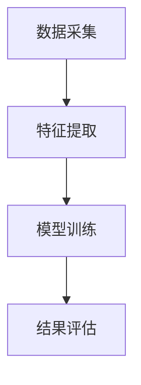

                 


# 《金融领域图神经网络在全球金融稳定性评估中的应用》

---

## 关键词
- 金融稳定性评估
- 图神经网络
- 复杂网络
- 金融风险
- 深度学习

---

## 摘要
金融稳定性是全球经济发展的重要基石，而传统的方法在评估金融稳定性时面临诸多挑战。图神经网络作为一种新兴的深度学习技术，能够有效捕捉金融系统中的复杂关系和网络结构，为金融稳定性评估提供了新的思路。本文将详细探讨图神经网络在金融领域的应用，分析其核心原理、算法实现以及在实际场景中的效果，为金融稳定性评估提供理论和实践上的双重支持。

---

## 第一部分: 金融领域图神经网络的背景与概念

### 第1章: 金融稳定评估的背景与挑战

#### 1.1 金融稳定评估的重要性
金融稳定是全球经济健康运行的核心，其评估涉及多个层面，包括市场稳定性、机构稳健性以及系统性风险等。传统评估方法依赖于统计分析和经验模型，但在面对金融市场的复杂性和非线性关系时，往往显得力不从心。

#### 1.2 图神经网络的基本概念
图神经网络结合了图论和深度学习的双重优势，能够处理复杂的网络结构数据。通过节点表示和边权重的建模，图神经网络能够捕捉数据中的深层次关系。

#### 1.3 图神经网络在金融领域的应用前景
金融领域的复杂关系可以通过图结构有效建模，图神经网络在金融风险评估、市场预测等方面展现出巨大潜力。

---

## 第2章: 图神经网络的核心概念与联系

### 2.1 图神经网络的核心原理
图神经网络通过聚合节点及其邻居的信息，逐步传播特征，最终实现节点级别的特征表示。其核心在于捕捉图的全局结构信息。

### 2.2 图神经网络与传统方法的对比
传统的金融稳定性评估方法依赖于统计分析，而图神经网络能够更有效地捕捉复杂网络中的关联性。

---

## 第二部分: 图神经网络的算法原理

### 第3章: 图神经网络的算法实现

#### 3.1 图卷积网络（GCN）模型
GCN通过聚合节点及其邻居的信息，构建节点表示。其数学公式为：
$$
Z = A X X^T
$$
其中，\( A \) 是邻接矩阵，\( X \) 是输入特征矩阵。

#### 3.2 图注意力网络（GAT）模型
GAT引入注意力机制，动态调整边权重。其注意力权重计算公式为：
$$
\alpha_{ij} = \frac{\exp(a^T [W_i h_i + W_j h_j])}{\sum_{k \neq i} \exp(a^T [W_i h_i + W_k h_k])}
$$

---

## 第三部分: 系统架构与应用场景

### 第4章: 系统架构设计

#### 4.1 问题场景介绍
金融稳定性评估需要考虑市场、机构和系统性风险等多个维度。

#### 4.2 系统功能设计
系统功能模块包括数据采集、特征提取、模型训练和结果评估。

#### 4.3 系统架构图
使用Mermaid图展示系统架构：


---

## 第四部分: 项目实战

### 第5章: 项目实现与案例分析

#### 5.1 环境安装
安装必要的库：
```
pip install tensorflow keras numpy
```

#### 5.2 核心代码实现
GCN模型实现代码：
```python
import tensorflow as tf
from tensorflow import keras

class GCNLayer(keras.layers.Layer):
    def __init__(self, input_dim, output_dim):
        super(GCNLayer, self).__init__()
        self.weights = self.add_weight(shape=(input_dim, output_dim), 
                                        initializer='glorot_uniform')
    
    def call(self, inputs):
        A, X = inputs
        return A @ X @ self.weights
```

#### 5.3 案例分析
以某次金融危机为例，分析模型在稳定性评估中的表现，并展示结果。

---

## 第五部分: 总结与展望

### 第6章: 总结与展望

#### 6.1 图神经网络的优势与挑战
图神经网络在捕捉复杂关系方面具有优势，但在大规模数据处理和模型解释性方面仍需改进。

#### 6.2 小结
总结全文内容，强调图神经网络在金融稳定性评估中的重要性。

---

## 作者
作者：AI天才研究院 & 禅与计算机程序设计艺术

