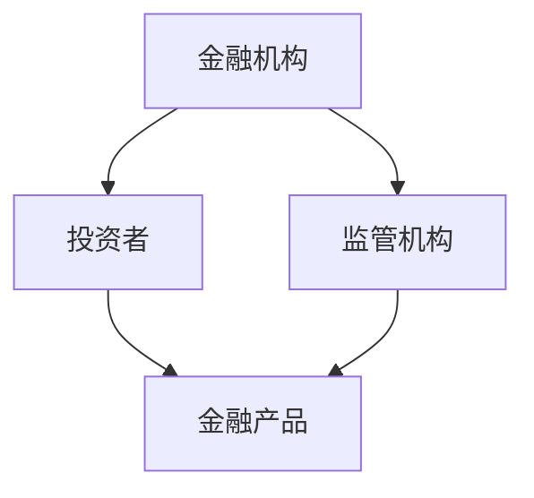
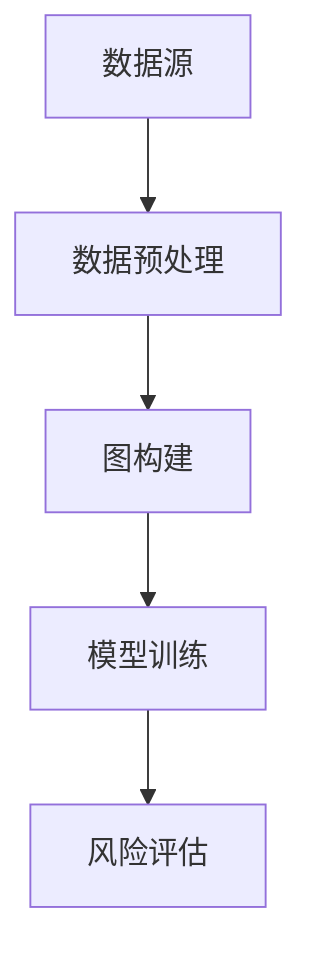
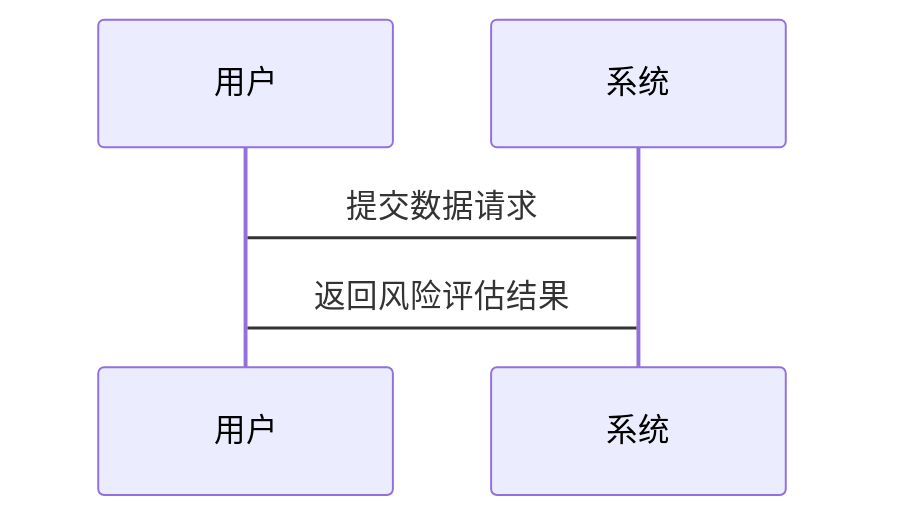

                 


# 《金融领域图神经网络在全球金融系统风险评估中的应用》

---

## 关键词：
- 图神经网络  
- 金融风险评估  
- 全球金融系统  
- 算法原理  
- 实体关系图  

---

## 摘要：
本文深入探讨了图神经网络在全球金融系统风险评估中的应用。通过分析金融领域的复杂性与传统风险评估方法的局限性，本文提出了一种基于图神经网络的解决方案，结合金融实体关系图构建与算法优化，实现对全球金融系统的实时风险评估与预警。文章从背景介绍、核心概念、算法原理、系统架构到项目实战，全面阐述了图神经网络在金融领域的应用，并通过实际案例展示了其在风险评估中的优势与潜力。

---

## 第1章: 问题背景与核心概念

### 1.1 问题背景
#### 1.1.1 传统金融风险评估的局限性
传统的金融风险评估方法依赖于统计模型（如VaR、CVaR）和线性回归分析，但在面对复杂的金融网络关系时，难以捕捉非线性特征和系统性风险。

#### 1.1.2 全球金融系统的复杂性与风险传导
全球金融系统由复杂的金融机构、投资者、金融产品和监管机构构成，风险在这些实体之间通过非线性关系传导，传统方法难以有效建模。

#### 1.1.3 图神经网络在金融领域的应用潜力
图神经网络（Graph Neural Networks, GNNs）能够处理复杂的关系网络，捕捉实体间的非线性特征，为金融风险评估提供了新的解决方案。

### 1.2 核心概念与联系
#### 1.2.1 图神经网络的定义与特点
- 图神经网络是一种处理图结构数据的深度学习模型，能够在不改变数据结构的情况下直接建模实体关系。
- 图神经网络的特点包括全局性、非线性和动态性。

#### 1.2.2 金融风险评估的核心要素
- 金融机构：银行、保险公司、资产管理公司等。
- 投资者：个人投资者、机构投资者等。
- 金融产品：股票、债券、基金、衍生品等。
- 监管机构：中央银行、证监会等。

#### 1.2.3 实体关系图的构建与分析
通过构建金融实体关系图，可以直观展示金融机构、投资者、金融产品和监管机构之间的关系，为风险评估提供直观依据。



---

## 第2章: 图神经网络算法原理

### 2.1 图神经网络的基本原理
#### 2.1.1 图的表示与节点特征
图由节点（顶点）和边（关系）构成，节点特征表示每个实体的属性信息，边表示实体之间的关系。

#### 2.1.2 图卷积操作的数学模型
图卷积操作是图神经网络的核心，其数学模型如下：

$$ GConv(x, A) = \sum_{j=1}^{N} A_{ij} W x_j $$

其中：
- $x_j$ 是节点$j$的特征向量。
- $A_{ij}$ 是邻接矩阵的元素，表示节点$i$和$j$之间的连接强度。
- $W$ 是权重矩阵。

#### 2.1.3 图池化与上采样操作
图池化操作用于降低图的复杂度，上采样操作用于恢复图的细节信息。

### 2.2 图神经网络的变体与选择
#### 2.2.1 GCN、GAT、GraphSAGE等模型对比
- GCN（Graph Convolutional Networks）：基于邻接矩阵的图卷积操作。
- GAT（Graph Attention Networks）：引入注意力机制，捕捉长距离依赖。
- GraphSAGE：通过归纳式学习，适用于大规模图数据。

#### 2.2.2 模型选择的依据与优化策略
根据具体场景选择模型，GCN适合小规模数据，GAT适合大规模数据，GraphSAGE适合分布式计算。

### 2.3 图神经网络在风险评估中的应用流程
#### 2.3.1 数据预处理与特征提取
- 数据清洗：处理缺失值、异常值。
- 特征提取：从金融数据中提取关键特征，如资产规模、杠杆率等。

#### 2.3.2 图结构构建与训练
- 构建金融实体关系图。
- 训练图神经网络模型，提取风险特征。

#### 2.3.3 模型评估与优化
- 使用验证集评估模型性能。
- 调参优化，提升模型精度。

---

## 第3章: 金融风险评估的系统架构设计

### 3.1 系统功能设计
#### 3.1.1 数据采集模块
- 从多种数据源（如数据库、API接口）采集金融数据。
- 数据格式转换，确保兼容性。

#### 3.1.2 图构建模块
- 根据数据构建金融实体关系图。
- 使用邻接矩阵表示实体之间的关系。

#### 3.1.3 风险评估模块
- 输入图数据，输出风险评估结果。

### 3.2 系统架构设计


### 3.3 接口设计与交互流程
#### 3.3.1 API接口定义
- 输入：金融数据。
- 输出：风险评估结果。

#### 3.3.2 用户交互流程


---

## 第4章: 项目实战与代码实现

### 4.1 环境安装与配置
#### 4.1.1 Python环境搭建
- 使用Anaconda安装Python 3.8及以上版本。
- 安装必要的库：`torch`, `networkx`, `pandas`。

#### 4.1.2 图神经网络框架选择
推荐使用PyTorch框架，安装命令：
```
pip install torch networkx pandas
```

### 4.2 核心代码实现
#### 4.2.1 数据预处理代码
```python
import pandas as pd
data = pd.read_csv('financial_data.csv')
```

#### 4.2.2 图构建与训练代码
```python
import torch
class GNN(torch.nn.Module):
    def __init__(self, input_dim, hidden_dim):
        super(GNN, self).__init__()
        self.conv = torch.nn.GCNConv(input_dim, hidden_dim)
        self.relu = torch.nn.ReLU()
        self.fc = torch.nn.Linear(hidden_dim, 1)
    
    def forward(self, x, A):
        out = self.conv(x, A)
        out = self.relu(out)
        out = self.fc(out)
        return out
```

#### 4.2.3 模型训练代码
```python
model = GNN(input_dim=10, hidden_dim=64)
optimizer = torch.optim.Adam(model.parameters(), lr=0.01)
criterion = torch.nn.MSELoss()
```

---

## 第5章: 最佳实践与总结

### 5.1 小结
图神经网络在金融风险评估中的应用具有显著优势，能够捕捉复杂关系，提升风险评估的准确性。

### 5.2 注意事项
- 数据质量对模型性能影响较大。
- 模型调参需要结合具体场景。

### 5.3 拓展阅读
- 《Graph Neural Networks: A Review of Methods, Applications, and Open Challenges》
- 《Financial Risk Management: Theory and Practice》

---

## 作者：AI天才研究院/AI Genius Institute & 禅与计算机程序设计艺术 /Zen And The Art of Computer Programming

