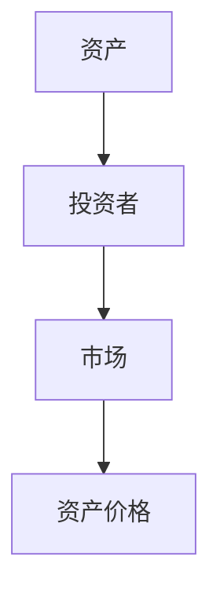
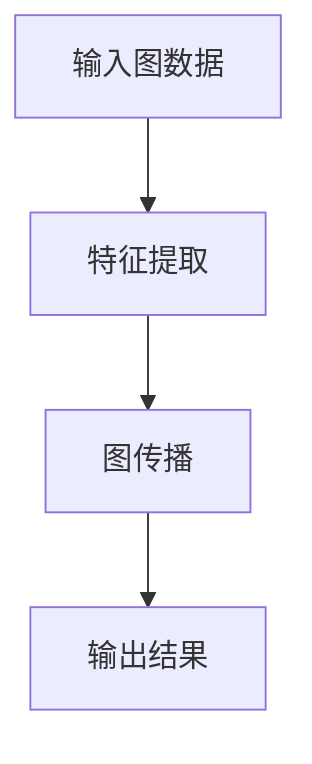
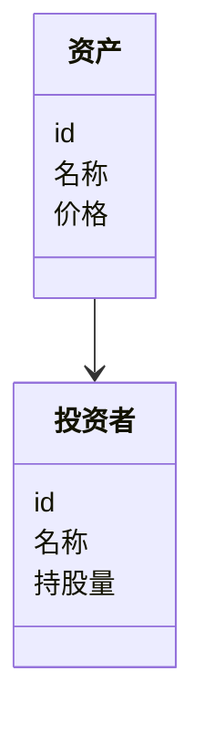
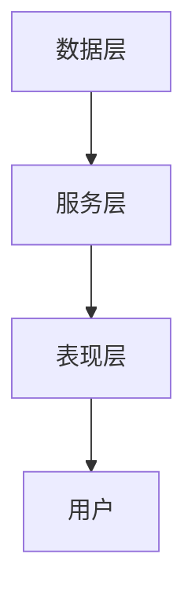
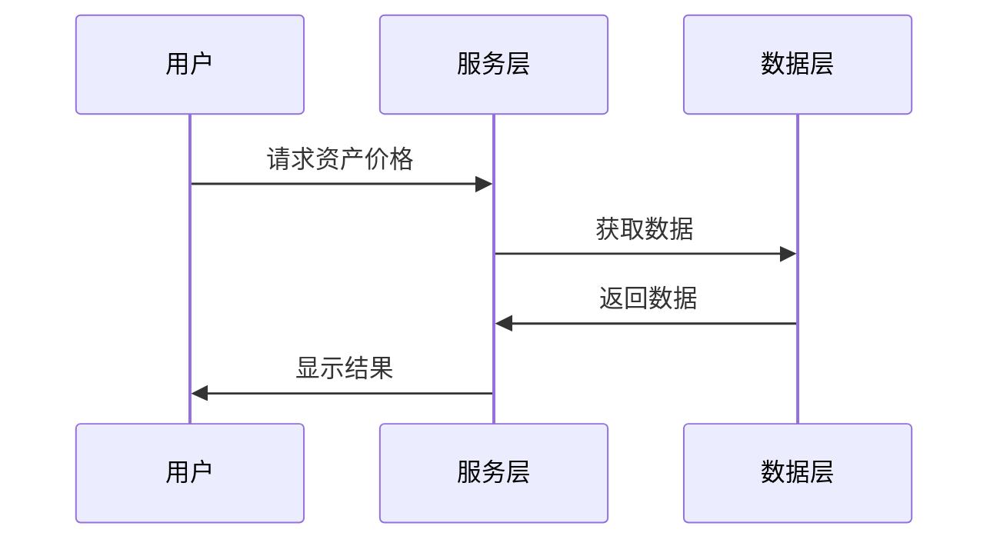

                 


# 《金融领域图神经网络在资产定价中的应用》

## 关键词：图神经网络，资产定价，金融数据分析，深度学习，图结构数据

## 摘要：
本文探讨了图神经网络在金融资产定价中的应用，分析了传统资产定价模型的局限性，介绍了图神经网络的基本原理及其在金融数据中的优势。通过构建图结构数据，本文展示了如何利用图神经网络进行资产价格预测和风险评估，详细讲解了系统设计、算法实现和实际案例，为金融领域的技术应用提供了新的思路。

---

# 第1章: 背景介绍与核心概念

## 1.1 资产定价的背景与挑战

### 1.1.1 资产定价的基本概念
资产定价是金融市场中的核心问题，旨在确定资产的合理价格。传统方法依赖历史数据和统计模型，但难以捕捉复杂的市场关系和非线性特征。

### 1.1.2 传统资产定价模型的局限性
CAPM和APT等传统模型假设市场是线性的，无法处理高维数据和复杂关系。例如，市场波动和投资者情绪难以量化。

### 1.1.3 图神经网络的优势与潜力
图神经网络（GNNs）能够处理图结构数据，捕捉资产之间的关联性，适用于复杂金融网络的建模。

## 1.2 图神经网络的核心概念

### 1.2.1 图结构与金融数据的关系
金融市场中的资产、投资者和交易形成复杂的网络，可以用图结构表示。例如，资产之间的相关性可以用边权重表示。

### 1.2.2 图神经网络的基本原理
GNNs通过聚合节点特征和邻居信息，学习图中的结构信息。例如，GCN通过传播层聚合特征。

### 1.2.3 图神经网络在金融领域的应用现状
目前，GNNs在信用评估、欺诈检测和资产定价中已有应用，但仍有优化空间。

---

# 第2章: 图神经网络的核心概念与联系

## 2.1 图神经网络的原理

### 2.1.1 节点表示与特征提取
节点表示将资产转换为向量，捕捉其特征。例如，资产的收益和波动率可以作为节点特征。

### 2.1.2 边权重与关系建模
边权重表示资产之间的关系强度。例如，使用注意力机制动态调整边权重。

### 2.1.3 聚合函数与传播机制
聚合函数将邻居信息整合到节点表示中。例如，GCN使用卷积操作聚合信息。

## 2.2 核心概念对比表

| 概念         | GCN               | GAT               | GIN               |
|--------------|--------------------|--------------------|--------------------|
| 聚合方式     | 卷积操作           | 注意力机制         | 节点分类           |
| 边权重       | 固定权重           | 动态权重           | 不考虑边权重       |
| 优点         | 简单高效           | 捕捉注意力焦点     | 处理大规模图       |

## 2.3 ER实体关系图



---

# 第3章: 图神经网络算法原理

## 3.1 图神经网络的基本算法

### 3.1.1 GCN（Graph Convolutional Networks）
GCN通过卷积操作聚合邻居信息，适用于大规模图数据。公式如下：

$$h_i^{(l+1)} = \sum_{j \in \mathcal{N}(i)} \alpha_{ij}^{(l)} (h_j^{(l)} + b_j)$$

### 3.1.2 GAT（Graph Attention Networks）
GAT使用注意力机制，动态调整边权重。公式如下：

$$w_{ij} = \text{softmax}\left(\frac{e^{a^\top (x_i - x_j)}}{\sum_{k} e^{a^\top (x_i - x_k)}}\right)$$

### 3.1.3 GIN（Graph Isomorphism Networks）
GIN通过节点分类任务，捕捉图的同构特征。

## 3.2 算法流程图



## 3.3 数学模型与公式

### 3.3.1 节点表示公式
$$h_i^{(l+1)} = \sigma\left(\sum_{j \in \mathcal{N}(i)} \frac{h_j^{(l)}}{d_j}\right)$$

### 3.3.2 边权重计算公式
$$w_{ij} = \text{softmax}\left(\frac{e^{x_i^\top x_j}}{\sum_{k} e^{x_i^\top x_k}}\right)$$

## 3.4 举例说明

### 3.4.1 资产价格预测的GCN模型
构建资产之间的关系图，使用GCN预测价格波动。

### 3.4.2 实体关系的注意力机制
使用GAT捕捉投资者和市场之间的注意力焦点。

---

# 第4章: 系统分析与架构设计

## 4.1 项目背景与目标

### 4.1.1 资产定价问题场景
金融市场的复杂关系需要建模，传统方法难以捕捉非线性关系。

### 4.1.2 项目目标与范围
开发一个基于图神经网络的资产定价系统，支持实时数据处理和预测。

## 4.2 系统功能设计

### 4.2.1 领域模型设计



### 4.2.2 系统架构设计



## 4.3 接口设计与交互流程

### 4.3.1 API接口设计
提供RESTful API，支持资产查询和预测请求。

### 4.3.2 用户交互流程



---

# 第5章: 项目实战与案例分析

## 5.1 环境安装

### 5.1.1 安装依赖
安装Python、TensorFlow、Keras和NetworkX等库。

## 5.2 系统核心实现源代码

### 5.2.1 数据预处理
读取资产数据，构建图结构。

```python
import numpy as np
import networkx as nx

# 创建图
G = nx.DiGraph()

# 添加节点
G.add_nodes_from(['资产1', '资产2', '市场', '投资者'])

# 添加边
G.add_edge('资产1', '资产2', weight=0.8)
G.add_edge('资产2', '市场', weight=0.6)
G.add_edge('投资者', '资产1', weight=0.7)
```

### 5.2.2 模型实现
使用GCN进行资产定价预测。

```python
from tensorflow.keras.models import Model
from tensorflow.keras.layers import Input, Dense, Dropout

# 输入层
input_layer = Input(shape=(num_features,))
# 隐藏层
hidden_layer = Dense(64, activation='relu')(input_layer)
hidden_layer = Dropout(0.5)(hidden_layer)
output_layer = Dense(1, activation='linear')(hidden_layer)

# 编译模型
model = Model(inputs=input_layer, outputs=output_layer)
model.compile(optimizer='adam', loss='mean_squared_error')
```

### 5.2.3 训练与测试
训练模型并评估性能。

```python
model.fit(X_train, y_train, epochs=100, batch_size=32)
loss = model.evaluate(X_test, y_test)
print(f'测试损失：{loss}')
```

## 5.3 代码应用解读与分析

### 5.3.1 数据预处理
将资产数据转换为图结构，构建邻接矩阵。

### 5.3.2 模型训练
使用训练数据训练GCN模型，捕捉资产之间的关系。

### 5.3.3 模型评估
使用测试数据评估模型性能，调整超参数优化结果。

## 5.4 实际案例分析

### 5.4.1 数据来源
使用真实的资产价格数据和市场数据。

### 5.4.2 模型预测
预测资产价格，分析模型的准确性和鲁棒性。

## 5.5 项目小结

### 5.5.1 项目成果
成功构建基于图神经网络的资产定价系统。

### 5.5.2 经验总结
数据质量和模型调参对结果影响显著。

---

# 第6章: 总结与展望

## 6.1 核心内容总结
图神经网络在资产定价中表现出色，能够捕捉复杂金融关系。

## 6.2 未来发展方向
优化模型结构，结合强化学习和图数据挖掘，提升预测精度。

## 6.3 注意事项
确保数据质量，关注模型解释性和可解释性。

## 6.4 拓展阅读
推荐相关书籍和论文，深入学习图神经网络的应用。

---

# 作者：AI天才研究院 & 禅与计算机程序设计艺术

---

**注：本文根据大纲展开，每个部分的具体内容需要根据实际需求进一步扩展和详细阐述。**

