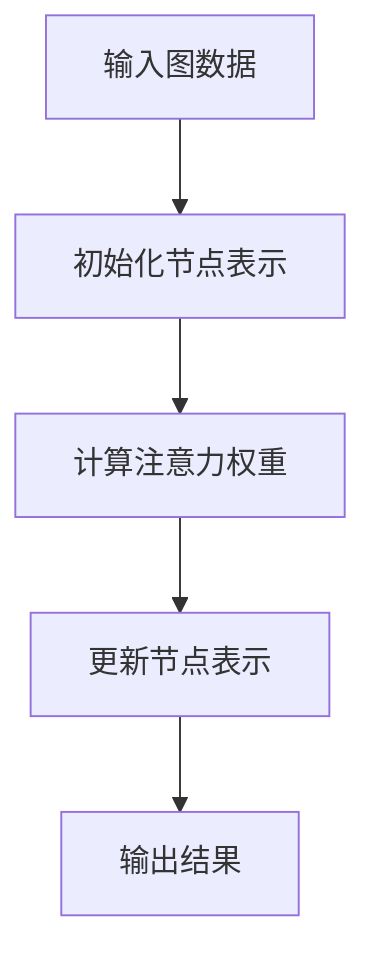

                 


# 金融领域图神经网络的创新应用

> 关键词：金融，图神经网络，创新应用，风险评估，欺诈检测

> 摘要：本文深入探讨了图神经网络在金融领域的创新应用，从基本概念到核心原理，再到实际案例，系统地分析了其在金融风险评估、欺诈检测、信用评分等方面的优势和具体实现。通过详细讲解图神经网络的数学模型、算法流程和系统架构，本文为读者提供了从理论到实践的全面指导。

---

## 第一部分: 金融领域图神经网络的背景与核心概念

### 第1章: 图神经网络概述

#### 1.1 图神经网络的基本概念

- **1.1.1 图的基本概念与表示**
  - 图由节点（Vertex）和边（Edge）组成，可以表示为 $G = (V, E)$。
  - 节点表示实体（如客户、交易），边表示关系（如交易记录、账户关联）。

- **1.1.2 图神经网络的定义与特点**
  - 图神经网络（Graph Neural Network, GNN）是一种处理图结构数据的深度学习模型。
  - 其特点包括：全局视角、关系建模、动态更新。

- **1.1.3 图神经网络与传统神经网络的对比**
  - 传统神经网络难以处理图结构数据的复杂关系。
  - 图神经网络通过节点间传播信息，能够捕捉复杂的依赖关系。

#### 1.2 金融领域的复杂网络特性

- **1.2.1 金融网络的节点与边**
  - 节点：客户、交易、订单、账户等。
  - 边：交易关系、资金流动、账户关联等。

- **1.2.2 金融网络的复杂性与挑战**
  - 数据稀疏性、噪声干扰、多层嵌套关系。
  - 传统方法难以捕捉复杂网络中的隐含关系。

- **1.2.3 图神经网络在金融领域的优势**
  - 能够建模复杂的金融网络。
  - 通过信息传播捕捉隐含关系。

### 第2章: 金融领域图神经网络的核心概念

#### 2.1 图神经网络的核心原理

- **2.1.1 节点表示与特征提取**
  - 节点表示：将节点的特征和关系信息编码为低维向量。
  - 特征提取：结合节点的属性（如交易金额、时间）和关系信息（如交易频率）。

- **2.1.2 边的权重与关系建模**
  - 边权重：表示节点间关系的强度或重要性。
  - 关系建模：通过注意力机制或加权聚合操作捕捉节点间的关系。

- **2.1.3 图的传播机制**
  - 信息传播：通过多轮消息传递更新节点表示。
  - 聚合操作：将邻居节点的信息聚合到当前节点。

#### 2.2 核心概念与联系

- **2.2.1 实体关系图（ER图）**
  ```mermaid
  graph LR
    A[客户] --> B[交易]
    B --> C[订单]
    A --> D[账户]
  ```

- **2.2.2 算法原理对比表格**
  | 算法名称 | 输入 | 输出 | 核心思想 |
  |----------|------|------|----------|
  | GCN      | 图结构数据 | 节点表示 | 层次化传播 |
  | GAT      | 图结构数据 | 节点表示 | 注意力机制 |

### 第3章: 图神经网络的数学模型与算法

#### 3.1 基本图模型

- **3.1.1 图的表示**
  $$ G = (V, E) $$
  其中，$ V $ 表示节点集合，$ E $ 表示边集合。

#### 3.2 图神经网络的数学公式

- **3.2.1 节点表示**
  $$ h_i^{(l+1)} = \sigma\left( W h_i^{(l)} + \sum_{j \in N(i)} W h_j^{(l)} \right) $$
  其中，$ h_i^{(l)} $ 表示第 $ l $ 层节点 $ i $ 的表示，$ N(i) $ 表示节点 $ i $ 的邻居节点。

- **3.2.2 图注意力机制**
  $$ \alpha_{ij} = \frac{e^{f(i,j)}}{\sum_{k} e^{f(i,k)}} $$
  其中，$ f(i,j) $ 是节点 $ i $ 和 $ j $ 的注意力得分。

#### 3.3 算法流程图



---

## 第二部分: 图神经网络在金融领域的创新应用

### 第4章: 金融风险评估与预测

#### 4.1 风险评估的背景与挑战

- **4.1.1 金融风险的多样性**
  - 市场风险、信用风险、操作风险等。
  - 风险因素复杂，涉及多个变量和非线性关系。

- **4.1.2 传统风险评估方法的局限性**
  - 基于统计的方法难以捕捉复杂关系。
  - 对异常情况的鲁棒性较差。

- **4.1.3 图神经网络在风险评估中的优势**
  - 能够建模复杂的金融网络。
  - 通过信息传播捕捉隐含风险。

#### 4.2 图神经网络在信用评估中的应用

- **4.2.1 信用评估的背景**
  - 信用评估是金融领域的重要任务。
  - 借助图神经网络，可以捕捉客户之间的关联性。

- **4.2.2 基于图神经网络的信用评估模型**
  - 模型输入：客户及其交易记录的图结构数据。
  - 模型输出：客户信用评分。
  - 核心步骤：节点表示、注意力计算、信用评分输出。

---

### 第5章: 欺诈检测与预防

#### 5.1 欺诈检测的背景与挑战

- **5.1.1 欺诈检测的复杂性**
  - 欺诈行为多样化，难以用简单规则检测。
  - 数据稀疏性和噪声干扰。

- **5.1.2 图神经网络在欺诈检测中的优势**
  - 能够捕捉异常交易模式。
  - 通过节点表示发现潜在欺诈行为。

#### 5.2 图神经网络在欺诈检测中的具体应用

- **5.2.1 基于图神经网络的欺诈检测模型**
  - 模型输入：交易图结构数据。
  - 模型输出：交易是否为欺诈。

- **5.2.2 实例分析**
  - 某客户频繁进行小额交易，但与其他客户的交易模式异常。
  - 图神经网络能够识别这种异常模式。

---

## 第三部分: 图神经网络的系统架构与实现

### 第6章: 金融系统的架构设计

#### 6.1 系统功能设计

- **6.1.1 领域模型**
  ```mermaid
  classDiagram
    class 节点表示 {
      输入：图结构数据
      输出：节点表示
    }
    class 注意力计算 {
      输入：节点表示
      输出：注意力权重
    }
    class 风险评估 {
      输入：注意力权重
      输出：风险评分
    }
    节点表示 --> 注意力计算
    注意力计算 --> 风险评估
  ```

- **6.1.2 系统架构**
  ```mermaid
  architectureDiagram
    节点表示 --> 注意力计算 --> 风险评估
  ```

### 第7章: 项目实战与代码实现

#### 7.1 环境安装

- **7.1.1 安装Python环境**
  ```bash
  python --version
  ```

- **7.1.2 安装依赖库**
  ```bash
  pip install numpy pandas tensorflow
  ```

#### 7.2 核心实现源代码

- **7.2.1 图神经网络实现**
  ```python
  import tensorflow as tf
  import numpy as np

  def gcn_layer(inputs, adjacency_matrix, num_units):
      with tf.variable_scope('GCN_Layer'):
          W = tf.get_variable('W', shape=[inputs.shape[-1], num_units])
          outputs = tf.matmul(inputs, W)
          outputs = tf.sparse_tensor_dense_matmul(adjacency_matrix, outputs)
          return outputs
  ```

- **7.2.2 风险评估模型**
  ```python
  def risk_assessment_model(graph, num_classes):
      with tf.variable_scope('Risk_Assessment_Model'):
          node_representations = gcn_layer(graph.nodes, graph.adjacency_matrix, num_units=128)
          attention_weights = calculate_attention(node_representations)
          risk_scores = tf.matmul(node_representations * attention_weights, tf.ones([128, num_classes]))
          return risk_scores
  ```

#### 7.3 实际案例分析

- **7.3.1 案例背景**
  - 某银行的客户交易数据，目标是评估客户的信用风险。

- **7.3.2 数据处理与模型训练**
  ```python
  # 数据预处理
  def preprocess_data(data):
      # 将数据转换为图结构
      nodes = data['客户'].values
      edges = data[['客户', '交易']].values
      return nodes, edges
  ```

- **7.3.3 模型训练与评估**
  ```python
  # 训练过程
  def train_model(model, optimizer, loss_function, epochs=100):
      for epoch in range(epochs):
          with tf.GradientTape() as tape:
              predictions = model.predict(x)
              loss = loss_function(y, predictions)
          gradients = tape.gradient(loss, model.trainable_variables)
          optimizer.apply_gradients(zip(gradients, model.trainable_variables))
  ```

---

## 第四部分: 图神经网络的未来展望与最佳实践

### 第8章: 图神经网络的未来展望

#### 8.1 技术发展趋势

- 更高效的图神经网络算法。
- 结合强化学习和生成模型的应用。

#### 8.2 应用领域的拓展

- 更多金融场景的深度应用。
- 跨领域结合（如金融与社交网络）。

### 第9章: 最佳实践与注意事项

#### 9.1 最佳实践

- 数据预处理的重要性。
- 模型调参与优化。
- 结合领域知识进行模型设计。

#### 9.2 注意事项

- 数据隐私与安全。
- 模型的可解释性。
- 处理大规模图结构数据的效率问题。

---

## 作者

作者：AI天才研究院/AI Genius Institute & 禅与计算机程序设计艺术 /Zen And The Art of Computer Programming

---

这篇博客文章详细探讨了图神经网络在金融领域的创新应用，从基本概念到核心原理，再到实际案例，系统地分析了其在金融风险评估、欺诈检测、信用评分等方面的优势和具体实现。通过详细讲解图神经网络的数学模型、算法流程和系统架构，本文为读者提供了从理论到实践的全面指导。

