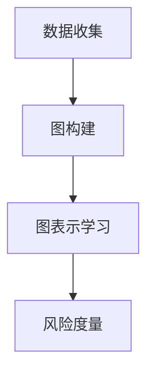

                 


# 《金融领域图表示学习在系统性风险度量中的应用》

---

## 关键词：图表示学习，系统性风险，金融网络，风险度量，深度学习，图神经网络

---

## 摘要：  
系统性风险是金融体系中的重大挑战，涉及金融机构之间的复杂关联。本文探讨图表示学习在系统性风险度量中的应用，通过构建金融网络，利用图表示学习技术提取节点特征，分析风险传播路径，评估系统性风险。文章从理论基础到实际应用，系统性地阐述了图表示学习在金融风险度量中的优势，并结合具体案例展示了其在实际金融分析中的潜力。通过本研究，我们能够更好地理解和管理金融系统中的系统性风险。

---

# 第一部分: 金融领域图表示学习与系统性风险度量的背景与基础

---

## 第1章: 系统性风险与图表示学习概述

### 1.1 系统性风险的定义与特征

系统性风险是指由于金融体系中某些关键因素的变化，导致整个金融系统发生系统性危机的可能性。其核心特征包括：

- **系统性**: 风险来源于金融体系的整体性，而非单一机构。
- **传染性**: 风险可能通过金融机构之间的关联传播。
- **难以预测性**: 系统性风险通常难以提前预测，但可以通过数据分析进行预警。

系统性风险的度量方法包括传统的VaR（Value at Risk）模型和现代的网络风险模型。网络风险模型通过分析金融机构之间的关联性，更准确地评估系统性风险。

---

### 1.2 图表示学习的定义与特点

图表示学习是一种将图结构数据转换为低维向量表示的技术。其核心特点包括：

- **全局性**: 图表示学习能够捕捉图中节点的全局信息。
- **结构性**: 依赖图的结构特征，如节点之间的连接关系。
- **可解释性**: 能够通过向量表示理解节点之间的关系。

图表示学习与传统表示学习的区别主要在于数据结构。传统表示学习通常处理线性数据，而图表示学习处理复杂的图结构数据。

---

### 1.3 金融领域中的系统性风险与图表示学习

在金融领域，系统性风险的度量通常依赖于金融机构之间的关联网络。图表示学习能够通过构建金融网络，提取节点特征，分析风险传播路径，从而更准确地评估系统性风险。

图表示学习在金融领域的优势在于其能够捕捉金融机构之间的非线性关系，并通过低维向量表示简化复杂网络的分析过程。

---

## 第2章: 图表示学习的核心概念与原理

### 2.1 图论基础

图论是图表示学习的理论基础。图由节点（顶点）和边组成，描述了数据之间的关系。图的属性包括度数、中心性等，这些属性可以帮助我们理解图的结构特征。

---

### 2.2 图表示学习的核心原理

图表示学习的目标是将图中的每个节点映射到低维向量空间，同时保留图的结构信息。常见的图表示学习算法包括Node2Vec、GraphSAGE和GAT等。

图嵌入的生成方法通常基于随机游走、矩阵分解或图神经网络。评估图嵌入的质量可以通过相似性度量、类聚性等指标进行。

---

### 2.3 图表示学习在金融系统中的应用

在金融系统中，图表示学习可以用于构建金融网络，分析金融机构之间的关联性。通过图表示学习，我们可以更准确地识别系统性风险的来源和传播路径。

---

## 第3章: 系统性风险度量中的图表示学习方法

### 3.1 系统性风险的图表示模型

构建金融网络是系统性风险度量的第一步。金融网络通常基于金融机构之间的交易数据或资产配置数据构建。通过图表示学习，我们可以提取每个金融机构的特征向量，分析其在金融网络中的重要性。

---

### 3.2 图表示学习在系统性风险中的应用

系统性风险的传播机制可以通过图表示学习进行建模。通过分析节点之间的关系，我们可以识别系统性风险的高风险区域，并制定相应的风险管理策略。

---

## 第4章: 图表示学习的数学模型与算法原理

### 4.1 图表示学习的数学模型

图表示学习的数学模型通常包括节点嵌入的生成函数和目标函数。目标函数通常基于节点相似性或分类任务设计。

例如，Node2Vec的目标函数可以表示为：

$$
\mathcal{L} = -\sum_{(u,v)\in S} \log p(v|u) - \sum_{(u,v)\notin S} \log p(v|u)
$$

其中，$S$是正样本对，$p(v|u)$是条件概率。

---

### 4.2 常见图表示学习算法的数学推导

#### Node2Vec算法的数学推导

Node2Vec通过随机游走生成节点的上下文向量。其目标是最小化节点与其邻居之间的相似性。

---

## 第5章: 金融系统性风险度量的系统架构与设计

### 5.1 系统性风险度量的系统架构

金融系统性风险度量系统通常包括数据收集、图构建、图表示学习和风险度量四个模块。

系统架构设计图如下：



---

## 第6章: 项目实战——基于图表示学习的系统性风险度量

### 6.1 环境安装与配置

在进行项目实战之前，需要安装必要的环境和库。推荐使用Python 3.8及以上版本，并安装以下库：

- `networkx`：用于图的构建和分析。
- `node2vec`：用于图表示学习。
- `tensorflow`：用于深度学习模型的训练。

---

### 6.2 系统功能设计

系统功能设计包括数据收集与预处理、图表示学习模型构建和系统性风险度量与预警。

---

### 6.3 项目实现

以下是一个基于Node2Vec的系统性风险度量的实现示例：

```python
import node2vec
from sklearn.manifold import TSNE

# 数据预处理
G = nx.Graph()
G.add_edges_from(edges)

# 图表示学习
model = node2vec.Node2Vec(G, walk_length=10, num_walks=80, embedding_size=128)

# 降维可视化
tsne = TSNE(perplexity=30, random_state=42)
embeddings = tsne.fit_transform(model.get_embeddings().tolist())

# 可视化
nx.draw(G, pos=embeddings, ...)
```

---

## 作者：AI天才研究院 & 禅与计算机程序设计艺术

---

通过以上内容，我们系统地探讨了图表示学习在金融系统性风险度量中的应用。从理论到实践，我们详细分析了图表示学习的核心原理、算法实现以及在金融领域的具体应用。希望本文能够为金融领域的风险度量提供新的思路和方法。

