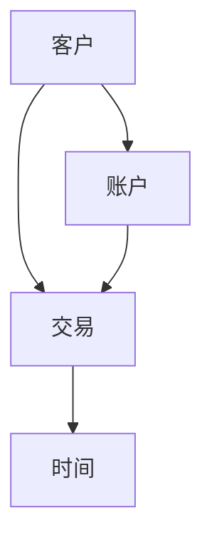
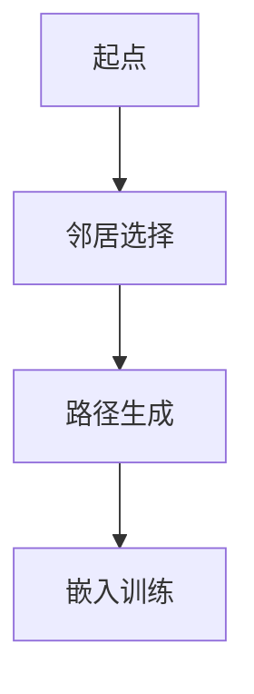
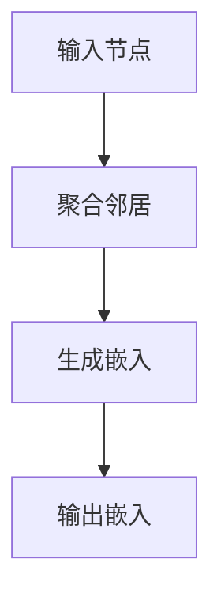
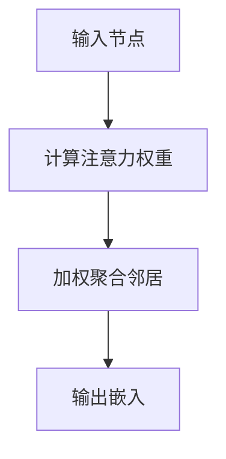
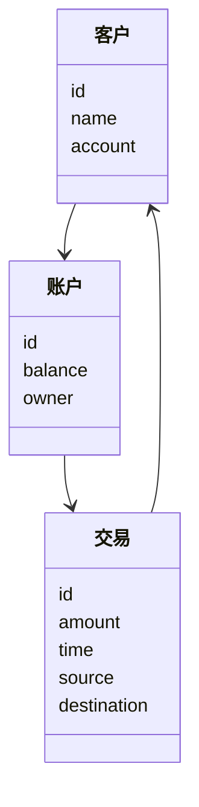
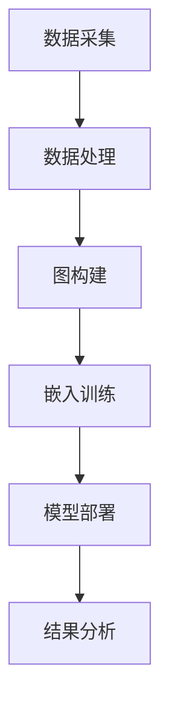

                 


# 金融领域图表示学习的应用与挑战

> 关键词：金融图表示学习，图神经网络，金融网络分析，风险管理，节点嵌入，图结构学习

> 摘要：本文深入探讨了图表示学习在金融领域的应用与挑战。首先介绍了图表示学习的基本概念和核心原理，随后分析了其在金融风险管理、欺诈检测等场景中的应用。详细讲解了几种主流的图表示学习算法及其数学模型，并通过实际案例展示了如何在金融系统中设计和实现图表示学习系统。最后，总结了当前研究的不足之处，并提出了未来的研究方向。

---

# 第一部分: 金融领域图表示学习的背景与概念

## 第1章: 图表示学习的基本概念

### 1.1 图表示学习的定义与背景

#### 1.1.1 图数据的特性与应用场景
图数据是一种复杂的非结构化数据，由节点（实体）和边（关系）组成。在金融领域，图数据广泛应用于风险管理、欺诈检测、客户关系管理等场景。例如，银行交易网络中的客户和交易记录可以表示为图结构。

#### 1.1.2 图表示学习的定义与核心目标
图表示学习（Graph Representation Learning）是指将图数据中的节点或边映射到低维向量空间的过程。其核心目标是通过提取图的结构特征和语义信息，提高图数据的可计算性和分析效率。

#### 1.1.3 金融领域中的图数据特点
金融领域的图数据通常具有以下特点：
- **复杂性**：涉及多种实体（如客户、交易、账户等）及其复杂的关联关系。
- **动态性**：图结构会随时间变化（如新增交易、账户状态变化等）。
- **高价值性**：图数据往往包含敏感的金融信息，需要较高的安全性保障。

### 1.2 金融领域的复杂性与挑战

#### 1.2.1 金融数据的多样性与关联性
金融数据通常涉及多种类型的信息，如文本、数值和时间序列数据。这些数据之间的关联性使得图结构成为分析金融数据的有效工具。

#### 1.2.2 金融风险与欺诈检测中的图结构
在金融风险管理和欺诈检测中，图结构可以帮助发现隐藏的关联关系。例如，通过分析客户之间的交易网络，可以发现潜在的欺诈行为。

#### 1.2.3 金融网络中的动态关系
金融网络中的关系是动态变化的。例如，客户之间的交易频率和金额可能会随时间变化，这种动态性使得图表示学习需要具备一定的实时性。

---

## 第2章: 图表示学习的核心概念与联系

### 2.1 图表示学习的核心原理

#### 2.1.1 图的表示与嵌入
图的表示学习通过将节点或边映射到低维向量空间，提取图的结构特征和语义信息。节点嵌入（Node Embedding）是图表示学习的核心技术之一。

#### 2.1.2 节点、边与图嵌入的关系
- **节点嵌入**：表示单个节点的特征向量。
- **边嵌入**：表示节点之间关系的特征向量。
- **图嵌入**：表示整个图的特征向量，通常通过聚合节点嵌入和边嵌入得到。

#### 2.1.3 图表示学习的数学模型
图表示学习的数学模型通常包括以下部分：
- **图的表示**：定义图的节点和边的特征。
- **嵌入函数**：将图数据映射到低维向量空间。
- **损失函数**：用于优化嵌入模型。

### 2.2 核心概念对比与ER实体关系图

#### 2.2.1 核心概念属性对比表
以下是一个核心概念的属性对比表：

| 概念       | 属性               |
|------------|--------------------|
| 节点       | 实体标识、属性      |
| 边         | 关系类型、权重      |
| 图嵌入     | 维度、语义信息       |
| 图表示     | 结构特征、语义特征   |

#### 2.2.2 ER实体关系图的Mermaid流程图


---

# 第二部分: 图表示学习的算法原理与数学模型

## 第3章: 图表示学习的主流算法

### 3.1 Node2vec算法

#### 3.1.1 Node2vec算法的Mermaid流程图


#### 3.1.2 Node2vec的Python实现代码
```python
import numpy as np
from sklearn.manifold import TSNE

def node2vec_embedding(adj_matrix):
    # 训练Node2vec模型
    model = TSNE(n_components=2)
    embedding = model.fit_transform(adj_matrix)
    return embedding
```

#### 3.1.3 Node2vec的数学模型与公式
Node2vec算法通过随机游走生成节点的上下文，并使用Skip-Gram模型训练嵌入。其数学模型如下：
$$
P(w_i, w_j) = \frac{\exp(\vec{w_i} \cdot \vec{w_j})}{\sum_{k} \exp(\vec{w_i} \cdot \vec{w_k})}
$$

### 3.2 GraphSAGE算法

#### 3.2.1 GraphSAGE算法的Mermaid流程图


#### 3.2.2 GraphSAGE的Python实现代码
```python
import tensorflow as tf

def graphsage_layer(input, neighbors):
    # 聚合邻居特征
    neighbor_embeddings = tf.reduce_mean(input + neighbors, axis=1)
    return neighbor_embeddings
```

#### 3.2.3 GraphSAGE的数学模型与公式
GraphSAGE通过聚合邻居的嵌入来生成节点的嵌入，其数学模型如下：
$$
\vec{h}_i = \sigma(\sum_{j \in N(i)} \vec{h}_j)
$$

### 3.3 GAT（Graph Attention Networks）算法

#### 3.3.1 GAT算法的Mermaid流程图


#### 3.3.2 GAT的Python实现代码
```python
import tensorflow as tf

def gat_attention(input, neighbors):
    # 计算注意力权重
    attention_weights = tf.nn.softmax(tf.matmul(input, tf.transpose(neighbors)))
    # 加权聚合邻居
    neighbor_embeddings = tf.reduce_sum(attention_weights * neighbors, axis=1)
    return neighbor_embeddings
```

#### 3.3.3 GAT的数学模型与公式
GAT通过计算节点之间的注意力权重来聚合邻居的嵌入，其数学模型如下：
$$
\alpha_{ij} = \text{softmax}(e^{\vec{h}_i^T \vec{h}_j})
$$

---

## 第4章: 图嵌入的数学模型与公式

### 4.1 图表示学习的数学基础

#### 4.1.1 图论基础
图论是图表示学习的理论基础，主要包括图的表示、遍历算法和结构分析。

#### 4.1.2 线性代数与矩阵运算
图的邻接矩阵和特征向量是图表示学习的重要工具。

#### 4.1.3 概率论与统计基础
概率论和统计方法用于模型的优化和评估。

### 4.2 图表示学习的核心公式

#### 4.2.1 节点嵌入的表示公式
$$
\vec{h}_i = f(\vec{h}_j, j \in N(i))
$$

#### 4.2.2 边权重的计算公式
$$
w_{ij} = \text{sigmoid}(\vec{h}_i^T \vec{h}_j)
$$

#### 4.2.3 图结构的数学建模
$$
G = (V, E)
$$

---

# 第三部分: 金融领域图表示学习的系统设计与项目实战

## 第5章: 金融系统中的图表示学习设计

### 5.1 问题场景介绍

#### 5.1.1 项目背景
本文以金融欺诈检测为背景，设计了一个基于图表示学习的系统。

#### 5.1.2 系统功能设计
系统功能包括数据采集、图构建、嵌入训练、模型部署和结果分析。

### 5.2 项目介绍

#### 5.2.1 项目目标
通过图表示学习技术，提高金融欺诈检测的准确性和效率。

#### 5.2.2 系统架构设计
系统架构包括数据层、计算层和应用层。

### 5.3 系统架构设计

#### 5.3.1 领域模型的Mermaid类图


#### 5.3.2 系统架构的Mermaid架构图


### 5.4 系统实现

#### 5.4.1 环境安装
- Python 3.8+
- TensorFlow 2.0+
- NumPy 1.20+

#### 5.4.2 系统核心实现源代码
```python
import numpy as np
from sklearn.manifold import TSNE

def load_data():
    # 加载金融数据
    customers = np.load('customers.npy')
    transactions = np.load('transactions.npy')
    return customers, transactions

def build_graph(customers, transactions):
    # 构建图结构
    graph = {}
    for customer in customers:
        graph[customer['id']] = []
    for transaction in transactions:
        graph[transaction['source']].append(transaction['destination'])
    return graph

def train_embedding(graph):
    # 训练嵌入
    model = TSNE(n_components=2)
    embedding = model.fit_transform(graph)
    return embedding

def detect_fraud(embedding):
    # 检测欺诈
    model = SVC()
    model.fit(embedding)
    return model.predict(embedding)
```

---

## 第6章: 项目实战与总结

### 6.1 实际案例分析

#### 6.1.1 数据预处理与分析
对加载的金融数据进行预处理，提取关键特征。

#### 6.1.2 模型训练与评估
使用训练好的嵌入模型对金融数据进行嵌入，然后训练分类模型（如SVM）进行欺诈检测。

#### 6.1.3 实验结果与分析
通过实验结果验证图表示学习在金融欺诈检测中的有效性。

### 6.2 总结

#### 6.2.1 项目小结
本文设计了一个基于图表示学习的金融欺诈检测系统，并通过实验验证了其有效性。

#### 6.2.2 最佳实践 tips
- 在金融领域，图表示学习可以有效捕捉复杂的关系。
- 选择合适的算法和参数对模型性能至关重要。

#### 6.2.3 注意事项
- 数据安全性和隐私保护是金融系统设计中的重要问题。
- 模型的实时性和可解释性需要进一步优化。

#### 6.2.4 拓展阅读
建议读者进一步阅读相关领域的最新研究，如图神经网络（Graph Neural Network）和图注意力机制（Graph Attention Mechanism）。

---

作者：AI天才研究院/AI Genius Institute & 禅与计算机程序设计艺术/Zen And The Art of Computer Programming

