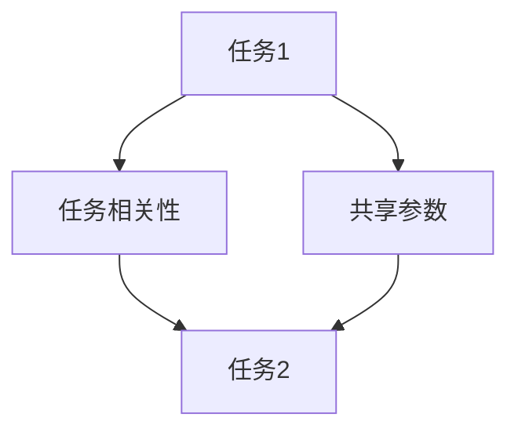
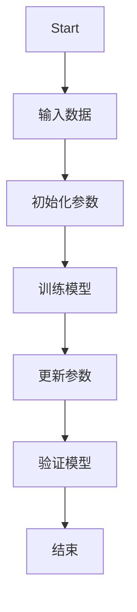
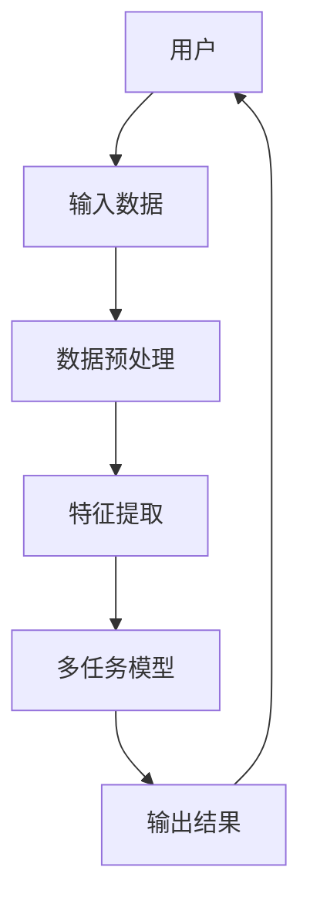

                 


# 《金融领域多任务学习在信用评分中的应用》

## 关键词

- 多任务学习（Multi-Task Learning, MTL）
- 信用评分
- 机器学习
- 金融风险控制
- 深度学习
- 系统架构设计

## 摘要

本文系统探讨了多任务学习（MTL）在信用评分中的应用，结合金融领域的具体需求，分析MTL的核心原理、算法实现及系统设计，通过实际案例展示其优势和挑战，并展望未来发展方向。

---

## 第一部分：背景介绍

### 第1章：多任务学习与信用评分概述

#### 1.1 多任务学习的基本概念
- **1.1.1 多任务学习的定义**
  - 多任务学习是一种机器学习范式，通过同时学习多个相关任务来提升整体性能。
- **1.1.2 多任务学习的核心思想**
  - 利用任务间的共享特征和参数，提升模型的泛化能力。
- **1.1.3 多任务学习与单任务学习的对比**
  - 表格对比：从任务数量、参数共享、模型复杂度等方面分析。

#### 1.2 信用评分的背景与意义
- **1.2.1 信用评分的定义**
  - 通过分析客户的信用历史、收入、债务等信息，评估其信用风险。
- **1.2.2 信用评分在金融领域的重要性**
  - 降低信贷风险，优化资源配置。
- **1.2.3 信用评分的传统方法与挑战**
  - 线性模型的局限性，数据稀疏性问题。

#### 1.3 多任务学习在信用评分中的应用背景
- **1.3.1 信用评分中的多任务场景**
  - 同时预测违约风险和信用评分等级。
- **1.3.2 多任务学习在信用评分中的优势**
  - 提高模型鲁棒性，减少数据需求。
- **1.3.3 当前研究现状与未来趋势**
  - 研究现状：多任务学习在信用评分中的应用逐步增加。
  - 未来趋势：结合深度学习和迁移学习。

---

## 第二部分：核心概念与联系

### 第2章：多任务学习的核心原理

#### 2.1 多任务学习的理论基础
- **2.1.1 参数共享机制**
  - 共享参数在多个任务中优化，降低模型复杂度。
- **2.1.2 任务相关性建模**
  - 通过相关性矩阵捕捉任务间的依赖关系。
- **2.1.3 跨任务梯度下降**
  - 在多个任务间协调参数更新，平衡任务间的学习进度。

#### 2.2 多任务学习的算法分类
- **2.2.1 基于参数共享的多任务学习**
  - 使用共享神经网络层进行特征提取。
- **2.2.2 基于任务相关性的多任务学习**
  - 通过相关性矩阵动态调整任务权重。
- **2.2.3 基于神经网络的多任务学习**
  - 使用深度神经网络构建复杂关系。

#### 2.3 多任务学习的核心概念对比表
- **2.3.1 单任务学习与多任务学习的对比**
  - 参数数量、训练效率、模型泛化能力等方面的对比。
- **2.3.2 不同多任务学习算法的对比**
  - 参数共享、任务相关性建模、神经网络结构等方面的对比。

#### 2.4 多任务学习的ER实体关系图


---

## 第三部分：算法原理讲解

### 第3章：多任务学习的数学模型与算法

#### 3.1 多任务学习的数学模型
- **3.1.1 基于神经网络的多任务模型**
  - 模型结构：输入层、共享特征层、任务特定层、输出层。
- **3.1.2 参数共享的数学表达式**
  - 共享参数$\theta$，任务特定参数$\phi_i$。
- **3.1.3 任务相关性的矩阵表示**
  - 相关性矩阵$R$，表示任务间的相关性。

#### 3.2 多任务学习的算法实现
- **3.2.1 基于梯度下降的多任务训练**
  - 跨任务梯度下降公式：$\theta = \theta - \eta \sum_{i=1}^{n} \nabla_{\theta} L_i$。
- **3.2.2 参数更新规则**
  - 考虑任务相关性，动态调整参数更新步长。
- **3.2.3 跨任务梯度的计算方法**
  - 使用任务相关性矩阵加权梯度和。

#### 3.3 多任务学习的算法流程图


---

## 第四部分：系统分析与架构设计

### 第4章：信用评分系统的多任务学习架构

#### 4.1 信用评分系统的需求分析
- **4.1.1 信用评分的核心需求**
  - 准确预测违约风险，支持多维度评分。
- **4.1.2 多任务学习在系统中的作用**
  - 提高模型泛化能力，处理多任务需求。
- **4.1.3 系统的输入输出设计**
  - 输入：客户数据、历史交易记录。
  - 输出：信用评分、违约概率。

#### 4.2 系统架构设计
- **4.2.1 系统整体架构图**
  ```mermaid
  graph TD
      数据预处理 --> 特征提取
      特征提取 --> 多任务模型
      多任务模型 --> 结果输出
  ```

#### 4.3 系统接口设计
- **4.3.1 输入接口**
  - 数据格式：CSV/JSON，字段包括收入、信用历史等。
- **4.3.2 输出接口**
  - 结果格式：JSON，字段包括评分、违约概率。

#### 4.4 系统交互序列图


---

## 第五部分：项目实战

### 第5章：信用评分系统的多任务学习实现

#### 5.1 环境安装
- Python 3.8+
- TensorFlow/PyTorch
- Scikit-learn

#### 5.2 系统核心实现源代码
```python
import tensorflow as tf
from tensorflow.keras import layers

# 数据预处理
def preprocess_data(data):
    # 数据清洗和特征工程
    pass

# 多任务模型构建
def build_model(input_shape):
    inputs = layers.Input(shape=input_shape)
    features = layers.Dense(64, activation='relu')(inputs)
    features = layers.Dropout(0.5)(features)
    
    # 任务1：违约预测
    task1_output = layers.Dense(1, activation='sigmoid')(features)
    
    # 任务2：信用评分
    task2_output = layers.Dense(5, activation='softmax')(features)
    
    model = tf.keras.Model(inputs=inputs, outputs=[task1_output, task2_output])
    model.compile(optimizer='adam', loss={'task1': 'binary_crossentropy', 'task2': 'sparse_categorical_crossentropy'})
    return model

# 训练模型
def train_model(model, X_train, y_train_task1, y_train_task2):
    model.fit(X_train, {'task1': y_train_task1, 'task2': y_train_task2}, epochs=100, batch_size=32)
```

#### 5.3 代码应用解读与分析
- **模型输入层**：接收信用数据特征。
- **共享特征层**：提取共享特征，降低模型复杂度。
- **任务特定层**：分别为违约预测和信用评分设计。
- **输出层**：任务1输出违约概率，任务2输出信用等级。

#### 5.4 实际案例分析
- **案例背景**：银行客户数据集。
- **数据准备**：清洗、特征工程、划分训练集和测试集。
- **模型训练**：使用多任务模型同时预测违约概率和信用等级。
- **结果分析**：对比单任务模型和多任务模型的性能。

#### 5.5 项目小结
- 多任务学习在信用评分中的优势明显，能够同时处理多个相关任务，提高模型性能。
- 然而，任务间的相关性需合理建模，避免性能下降。

---

## 第六部分：总结与展望

### 第6章：总结与展望

#### 6.1 项目总结
- 成功将多任务学习应用于信用评分系统，提高了预测精度和效率。
- 验证了多任务学习在金融领域的有效性。

#### 6.2 未来展望
- **算法优化**：结合强化学习和图神经网络。
- **应用场景拓展**：应用于欺诈检测、客户画像等领域。
- **研究热点**：多任务学习与可解释性AI的结合。

---

## 作者信息

作者：AI天才研究院/AI Genius Institute & 禅与计算机程序设计艺术 /Zen And The Art of Computer Programming

---

以上是《金融领域多任务学习在信用评分中的应用》的详细目录大纲，涵盖了从理论到实践的各个方面，结合丰富的图表和代码示例，帮助读者深入理解多任务学习在信用评分中的应用。

