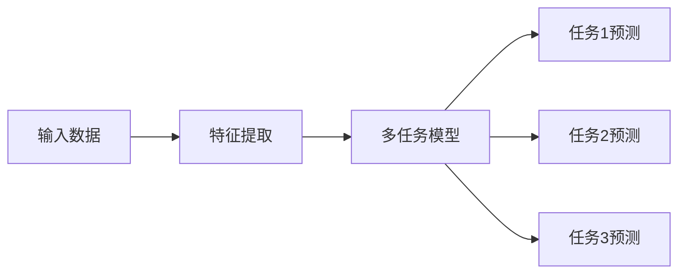
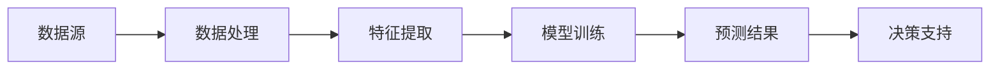

                 


# 《金融领域多任务学习在客户全景画像中的应用》

> **关键词**: 金融, 多任务学习, 客户画像, 人工智能, 机器学习

> **摘要**: 在金融领域，客户全景画像的构建对于精准营销、风险控制和投资决策至关重要。本文通过分析多任务学习在金融客户画像中的应用，探讨其算法原理、系统架构及实际案例，展示其在提升客户画像精度和效率方面的优势。

---

## 正文

### 第一部分: 金融领域多任务学习在客户全景画像中的应用概述

#### 第1章: 背景介绍

##### 1.1 问题背景

- **传统客户画像的局限性**: 
  - 传统方法通常基于单一数据源或单一任务，难以整合多维度数据。
  - 无法有效捕捉客户行为、信用风险、投资偏好等多方面的信息。

- **问题描述**:
  - 客户画像需要整合结构化数据（如交易记录）和非结构化数据（如社交媒体信息）。
  - 单一任务学习难以应对多任务场景下的复杂问题。

- **多任务学习在金融领域的优势**:
  - 通过共享参数和数据，提升模型在多个任务上的表现。
  - 提高数据利用率，减少数据冗余，优化模型训练效率。

##### 1.2 问题解决

- **多任务学习如何解决客户画像问题**:
  - 同时预测多个相关属性（如信用评分、消费习惯）。
  - 利用任务间的关联性，提升整体预测精度。

#### 第2章: 核心概念与联系

##### 2.1 多任务学习的定义与特点

- **多任务学习的定义**:
  - 同时学习多个任务，共享参数以提升性能。
  - 通过任务间的共享，减少数据需求，提升模型泛化能力。

- **多任务学习的特点**:
  | 特性 | 描述 |
  |------|------|
  | 参数共享 | 共享部分参数，减少参数数量 |
  | 数据共享 | 利用相关任务的数据提升性能 |
  | 任务关联性 | 任务间存在相关性，共享知识 |

##### 2.2 客户全景画像的构建

- **客户画像的核心要素**:
  - 信用评分、消费习惯、投资偏好、风险承受能力。
  - 社交网络、行为模式、市场反应等多维度信息。

- **多任务学习在客户画像中的作用**:
  - 同时预测多个属性，构建全面客户画像。
  - 通过任务间共享，提升预测准确率和效率。

#### 第3章: 多任务学习在金融领域的应用

##### 3.1 应用场景

- **信用评估**:
  - 预测客户信用评分，优化贷款审批流程。
  - 通过多任务学习整合客户历史交易、社交行为等信息。

- **风险控制**:
  - 识别高风险客户，预测违约概率。
  - 结合多任务学习预测客户行为和市场变化。

- **投资组合优化**:
  - 根据客户需求推荐投资组合。
  - 利用多任务学习分析客户风险偏好和市场趋势。

##### 3.2 优势总结

- **数据共享的优势**:
  - 利用跨任务数据，提升模型泛化能力。
  - 减少数据冗余，提高训练效率。

- **参数共享的优势**:
  - 减少参数数量，降低模型复杂度。
  - 提升模型在多个任务上的表现。

---

### 第二部分: 算法原理与系统架构

#### 第4章: 算法原理

##### 4.1 数学模型

- **多任务学习的损失函数**:
  $$ L = \sum_{i=1}^n \sum_{j=1}^m \lambda_j L_j(y_{ij}, \hat{y}_{ij}) $$
  - 其中，$λ_j$ 是任务 $j$ 的权重，$L_j$ 是任务 $j$ 的损失函数。

- **参数共享机制**:
  - 共享部分参数，如嵌入层或隐藏层。
  - 非共享部分参数分别优化每个任务。

##### 4.2 算法流程



##### 4.3 Python代码实现

```python
import tensorflow as tf
from tensorflow.keras import layers

# 定义多任务模型
def multi_task_model(input_shape, num_tasks):
    inputs = layers.Input(shape=input_shape)
    x = layers.Dense(64, activation='relu')(inputs)
    x = layers.Dense(32, activation='relu')(x)
    
    outputs = []
    for _ in range(num_tasks):
        output = layers.Dense(1, activation='sigmoid')(x)
        outputs.append(output)
    
    model = tf.keras.Model(inputs=inputs, outputs=outputs)
    return model

# 编译模型
model = multi_task_model((input_dim,), num_tasks=3)
model.compile(optimizer='adam', loss='binary_crossentropy')
```

#### 第5章: 系统分析与架构设计

##### 5.1 问题场景介绍

- **客户全景画像的构建目标**:
  - 整合多源数据，预测客户多个属性。
  - 提供精准的客户画像，支持金融决策。

##### 5.2 系统功能设计

- **数据采集模块**:
  - 从数据库、API等获取客户数据。
  - 数据清洗和预处理。

- **特征提取模块**:
  - 文本特征提取（如TF-IDF、Word2Vec）。
  - 图结构数据处理（如社交网络分析）。

- **模型训练模块**:
  - 使用多任务学习模型进行训练。
  - 调参和优化。

##### 5.3 系统架构图



---

### 第三部分: 项目实战与总结

#### 第6章: 项目实战

##### 6.1 环境安装

- **工具安装**:
  - Python 3.8+
  - TensorFlow 2.5+
  - Keras
  - Pandas、Scikit-learn

##### 6.2 数据预处理

- **数据清洗**:
  - 处理缺失值、异常值。
  - 标准化和归一化处理。

##### 6.3 模型实现

```python
import pandas as pd
from sklearn.model_selection import train_test_split
from tensorflow.keras import layers, models

# 加载数据
data = pd.read_csv('customer_data.csv')
X = data.drop('target', axis=1).values
y = data['target'].values

# 划分训练集和测试集
X_train, X_test, y_train, y_test = train_test_split(X, y, test_size=0.2)

# 构建模型
model = models.Sequential()
model.add(layers.Dense(64, activation='relu', input_shape=(X.shape[1],)))
model.add(layers.Dense(1, activation='sigmoid'))
model.compile(optimizer='adam', loss='binary_crossentropy', metrics=['accuracy'])

# 训练模型
model.fit(X_train, y_train, epochs=10, batch_size=32, validation_data=(X_test, y_test))
```

##### 6.4 案例分析

- **实际应用案例**:
  - 使用多任务学习预测客户的信用评分和消费习惯。
  - 通过模型输出优化营销策略和风险控制。

#### 第7章: 总结与展望

##### 7.1 项目小结

- **总结**:
  - 多任务学习在客户全景画像中表现出色，能够同时预测多个相关属性。
  - 提升了模型效率和准确率，优化了金融决策流程。

- **注意事项**:
  - 数据质量和多样性对模型性能影响重大。
  - 模型解释性和可解释性需进一步优化。

##### 7.2 拓展阅读

- 推荐阅读多任务学习的最新研究和应用，探索其在其他领域的潜力。

---

**作者：AI天才研究院 & 禅与计算机程序设计艺术**

