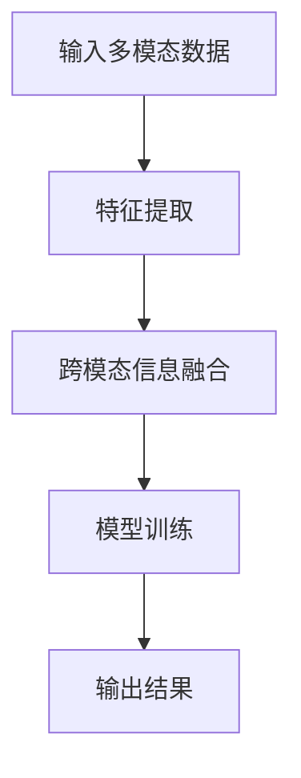
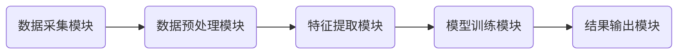

                 


# 《金融领域多模态学习在客户行为分析中的应用》

> 关键词：多模态学习、金融客户行为分析、深度学习、数据融合、系统架构设计

> 摘要：本文探讨了多模态学习在金融客户行为分析中的应用，从背景、核心概念到算法原理、系统架构设计，再到项目实战和最佳实践，全面解析了多模态学习如何提升金融客户行为分析的准确性和效率。通过案例分析和代码实现，展示了多模态学习在金融领域的实际应用价值。

---

## 第一部分：背景介绍

### 第1章：多模态学习与金融客户行为分析概述

#### 1.1 多模态学习的定义与背景
- **多模态学习的定义**：多模态学习是一种利用多种数据类型（如文本、语音、图像等）来提升模型性能的学习方法。
- **多模态学习的核心概念**：通过融合多种数据源的信息，提升模型的泛化能力和准确性。
- **金融领域客户行为分析的背景与目标**：金融客户行为分析旨在通过分析客户的交易记录、社交媒体互动、语音交流等数据，预测客户的行为模式，帮助金融机构进行风险控制和个性化服务。

#### 1.2 问题背景与问题描述
- **传统客户行为分析的局限性**：传统方法通常仅依赖单一数据源，导致分析结果片面。
- **引入多模态学习的必要性**：通过多模态数据的融合，可以更全面地捕捉客户行为特征。
- **问题解决的边界与外延**：本文聚焦于如何利用多模态学习技术提升客户行为分析的准确性和效率。

---

## 第二部分：核心概念与联系

### 第2章：多模态学习的核心概念与原理

#### 2.1 多模态学习的原理
- **数据融合方法**：多模态学习通过特征级融合、决策级融合等方法，将不同数据源的信息整合到模型中。
- **多模态特征提取**：利用深度学习模型（如CNN、RNN）从多模态数据中提取特征。
- **跨模态信息传递**：通过注意力机制等方法，实现跨模态信息的有效传递。

#### 2.2 核心概念对比与ER实体关系图
- **多模态学习与单模态学习的对比**：
  | 对比维度 | 单模态学习 | 多模态学习 |
  |----------|------------|------------|
  | 数据来源 | 单一数据源 | 多个数据源 |
  | 模型复杂度 | 较低 | 较高 |
  | 性能表现 | 有限 | 更优 |
- **ER实体关系图**：
```mermaid
erDiagram
    actor 用户
    actor 金融机构
    actor 行为数据
    actor 文本数据
    actor 图像数据
    actor 音频数据
    用户 --> 行为数据 : 产生
    用户 --> 文本数据 : 生成
    用户 --> 图像数据 : 生成
    用户 --> 音频数据 : 生成
    金融机构 --> 行为数据 : 分析
    金融机构 --> 文本数据 : 解析
    金融机构 --> 图像数据 : 分析
    金融机构 --> 音频数据 : 分析
```

---

## 第三部分：算法原理讲解

### 第3章：多模态学习算法原理

#### 3.1 多模态学习算法的分类与选择
- **基于深度学习的多模态算法**：如多模态卷积神经网络（MMCNN）、多模态循环神经网络（MRCNN）。
- **多任务学习与自注意力机制**：通过多任务学习，模型可以在不同任务之间共享特征，提升性能。

#### 3.2 算法流程图


#### 3.3 算法实现代码示例
```python
import torch
import torch.nn as nn

class MultiModal(nn.Module):
    def __init__(self, input_dim1, input_dim2, hidden_dim, output_dim):
        super(MultiModal, self).__init__()
        self.fc1 = nn.Linear(input_dim1, hidden_dim)
        self.fc2 = nn.Linear(input_dim2, hidden_dim)
        self.fc3 = nn.Linear(hidden_dim * 2, output_dim)
        self.relu = nn.ReLU()
        self.dropout = nn.Dropout(0.5)
    
    def forward(self, x1, x2):
        out1 = self.fc1(x1)
        out1 = self.relu(out1)
        out1 = self.dropout(out1)
        
        out2 = self.fc2(x2)
        out2 = self.relu(out2)
        out2 = self.dropout(out2)
        
        out = torch.cat([out1, out2], dim=1)
        out = self.fc3(out)
        return out

# 示例输入
input1 = torch.randn(10, 64)
input2 = torch.randn(10, 64)
model = MultiModal(64, 64, 128, 1)
output = model(input1, input2)
print(output.size())  # 输出：(10, 1)
```

---

## 第四部分：系统分析与架构设计

### 第4章：系统架构设计

#### 4.1 项目场景介绍
- **问题场景**：金融机构希望通过分析客户的多模态数据（如交易记录、社交媒体文本、语音互动等），预测客户的潜在行为（如投资偏好、风险承受能力等）。

#### 4.2 系统功能设计
- **数据采集模块**：收集客户的多模态数据。
- **数据预处理模块**：清洗和标准化数据。
- **特征提取模块**：利用深度学习模型提取多模态特征。
- **模型训练模块**：训练多模态学习模型。
- **结果输出模块**：输出客户行为分析结果。

#### 4.3 系统架构图


---

## 第五部分：项目实战

### 第5章：项目实战与代码实现

#### 5.1 环境安装
```bash
pip install torch
pip install numpy
pip install matplotlib
```

#### 5.2 核心代码实现
```python
import torch
import torch.nn as nn
import torch.optim as optim
import numpy as np
import matplotlib.pyplot as plt

# 数据生成（示例）
class DataGenerator:
    def __init__(self, batch_size, input_dim1, input_dim2, output_dim):
        self.batch_size = batch_size
        self.input_dim1 = input_dim1
        self.input_dim2 = input_dim2
        self.output_dim = output_dim
    
    def generate_data(self):
        x1 = torch.randn(self.batch_size, self.input_dim1)
        x2 = torch.randn(self.batch_size, self.input_dim2)
        y = torch.randint(0, self.output_dim, (self.batch_size,))
        return x1, x2, y

# 模型定义
class MultiModal(nn.Module):
    def __init__(self, input_dim1, input_dim2, hidden_dim, output_dim):
        super(MultiModal, self).__init__()
        self.fc1 = nn.Linear(input_dim1, hidden_dim)
        self.fc2 = nn.Linear(input_dim2, hidden_dim)
        self.fc3 = nn.Linear(hidden_dim * 2, output_dim)
        self.relu = nn.ReLU()
        self.dropout = nn.Dropout(0.5)
    
    def forward(self, x1, x2):
        out1 = self.fc1(x1)
        out1 = self.relu(out1)
        out1 = self.dropout(out1)
        
        out2 = self.fc2(x2)
        out2 = self.relu(out2)
        out2 = self.dropout(out2)
        
        out = torch.cat([out1, out2], dim=1)
        out = self.fc3(out)
        return out

# 训练过程
def train(model, optimizer, criterion, x1, x2, y):
    optimizer.zero_grad()
    outputs = model(x1, x2)
    loss = criterion(outputs, y)
    loss.backward()
    optimizer.step()
    return loss.item()

# 主函数
def main():
    batch_size = 32
    input_dim1 = 64
    input_dim2 = 64
    hidden_dim = 128
    output_dim = 10
    learning_rate = 0.001
    num_epochs = 100
    
    data_generator = DataGenerator(batch_size, input_dim1, input_dim2, output_dim)
    model = MultiModal(input_dim1, input_dim2, hidden_dim, output_dim)
    optimizer = optim.Adam(model.parameters(), lr=learning_rate)
    criterion = nn.CrossEntropyLoss()
    
    for epoch in range(num_epochs):
        x1, x2, y = data_generator.generate_data()
        loss = train(model, optimizer, criterion, x1, x2, y)
        if epoch % 10 == 0:
            print(f'Epoch [{epoch+1}/{num_epochs}], Loss: {loss:.4f}')
    
    # 模型评估
    with torch.no_grad():
        outputs = model(x1, x2)
        _, predicted = torch.max(outputs.data, 1)
        accuracy = (predicted == y).sum().item() / batch_size
        print(f'Accuracy: {accuracy:.4f}')

if __name__ == '__main__':
    main()
```

---

## 第六部分：最佳实践

### 第6章：总结与展望

#### 6.1 总结
- **多模态学习的优势**：通过融合多种数据源的信息，提升客户行为分析的准确性和全面性。
- **实际应用中的挑战**：数据隐私、模型复杂度、计算资源需求等。

#### 6.2 小结
- 多模态学习在金融客户行为分析中具有广阔的应用前景，但也需要克服一些技术挑战。

#### 6.3 注意事项
- 数据隐私保护是金融领域的重要问题，需在模型设计中充分考虑。
- 模型的可解释性也是实际应用中的关键因素。

#### 6.4 拓展阅读
- 建议读者深入研究多模态学习的前沿算法，如对比学习、自监督学习等。
- 关注金融领域的最新研究，了解多模态学习在其他金融场景中的应用。

---

## 作者：AI天才研究院/AI Genius Institute & 禅与计算机程序设计艺术 /Zen And The Art of Computer Programming

