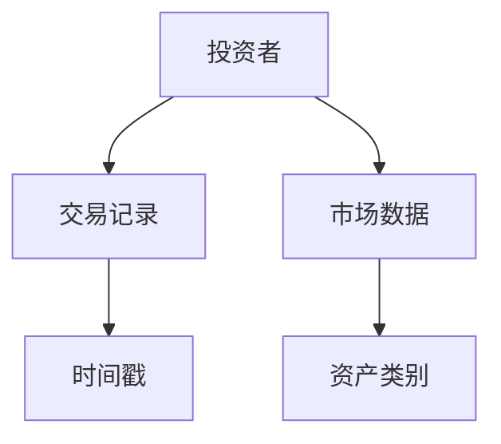
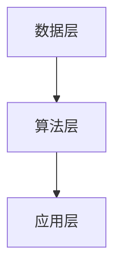

                 


# 《金融领域多模态学习在投资者行为分析中的应用》

**关键词：** 多模态学习, 投资者行为分析, 金融领域, 机器学习, 数据融合

**摘要：** 本文深入探讨了多模态学习在金融领域投资者行为分析中的应用，系统地介绍了多模态学习的基本原理、算法实现、系统架构设计以及实际项目案例。文章从背景介绍、核心概念、算法原理、系统分析、项目实战到总结展望，全面解析了多模态学习在投资者行为分析中的应用潜力和实际价值，为读者提供了从理论到实践的系统性指导。

---

## 第1章: 多模态学习与投资者行为分析概述

### 1.1 问题背景与定义

#### 1.1.1 问题背景
在金融领域，投资者行为分析是理解市场动态、风险评估和投资决策的重要环节。传统的投资者行为分析主要依赖单一模态的数据（如交易记录或市场数据），这限制了分析的深度和广度。随着技术的进步，多模态数据（如文本、图像、语音等）的引入为投资者行为分析提供了更丰富的信息。

#### 1.1.2 问题描述
投资者行为分析的核心目标是理解投资者的决策过程、风险偏好和情绪变化。然而，单一模态的数据往往不足以捕捉投资者行为的全貌，尤其是在复杂市场环境中。因此，如何有效地整合多模态数据以提升分析的准确性和深度，成为当前研究的热点。

#### 1.1.3 问题解决方法
多模态学习通过整合多种数据类型（如文本、图像、语音）来捕捉投资者行为的多维度特征，从而提供更全面的分析。这种方法能够利用不同数据源的优势，提升分析结果的鲁棒性和准确性。

#### 1.1.4 边界与外延
多模态学习的应用范围包括投资者情绪分析、交易模式识别、风险评估等。其边界主要在于数据融合的技术难度和计算资源的限制。

#### 1.1.5 核心要素组成
多模态学习的核心要素包括多模态数据采集、数据预处理、特征提取、融合方法和模型训练。

### 1.2 多模态学习的基本概念

#### 1.2.1 多模态学习的定义
多模态学习是指从多个数据源（如文本、图像、语音）中提取信息，并通过融合这些信息来改善学习效果的过程。

#### 1.2.2 多模态学习的核心特点
- **多维性**：整合多种数据源，捕捉更多信息。
- **互补性**：不同数据源相互补充，提升分析能力。
- **复杂性**：数据融合和模型设计较为复杂。

#### 1.2.3 多模态学习与传统单模态学习的区别
| 特性 | 单模态学习 | 多模态学习 |
|------|------------|------------|
| 数据来源 | 单一数据源 | 多个数据源 |
| 信息量 | 较少 | 较多 |
| 分析深度 | 较浅 | 较深 |

### 1.3 投资者行为分析的基本概念

#### 1.3.1 投资者行为分析的定义
投资者行为分析是通过研究投资者的交易记录、市场反应和情绪变化，揭示其决策模式和行为特征的过程。

#### 1.3.2 投资者行为分析的核心要素
- **交易记录**：投资者的买卖行为记录。
- **市场数据**：市场波动、资产价格等数据。
- **情绪数据**：投资者情绪的文本或语音数据。

### 1.4 多模态学习在投资者行为分析中的应用前景

#### 1.4.1 应用领域的潜在可能性
- **情绪分析**：通过文本和语音数据识别投资者情绪。
- **交易模式识别**：分析投资者的交易行为模式。
- **风险评估**：结合多模态数据评估投资风险。

#### 1.4.2 应用的优势与挑战
- **优势**：提升分析精度和深度。
- **挑战**：数据融合复杂，计算资源需求高。

#### 1.4.3 未来发展趋势
随着AI技术的进步，多模态学习在投资者行为分析中的应用将更加广泛和深入。

### 1.5 本章小结
本章介绍了多模态学习的基本概念、特点以及在投资者行为分析中的应用前景，为后续内容奠定了基础。

---

## 第2章: 多模态学习的核心原理

### 2.1 多模态学习的原理

#### 2.1.1 多模态数据的整合与融合
多模态数据的整合包括数据预处理、特征提取和融合方法。常见的融合方法有晚期融合和早期融合。

#### 2.1.2 多模态学习的数学模型
多模态学习的数学模型通常涉及多个数据流的表示和融合。例如，使用概率论中的贝叶斯公式进行融合：

$$ P(A|B) = \frac{P(B|A)P(A)}{P(B)} $$

#### 2.1.3 多模态学习的算法框架
多模态学习的算法框架包括数据预处理、特征提取、模型训练和融合方法。

### 2.2 多模态学习的核心概念属性对比

| 特性 | 单模态学习 | 多模态学习 |
|------|------------|------------|
| 数据来源 | 单一数据源 | 多个数据源 |
| 信息量 | 较少 | 较多 |
| 分析深度 | 较浅 | 较深 |

### 2.3 投资者行为分析的ER实体关系图



### 2.4 本章小结
本章详细介绍了多模态学习的核心原理和投资者行为分析的实体关系图，为后续的算法实现提供了理论基础。

---

## 第3章: 多模态学习算法的原理与实现

### 3.1 多模态学习算法的基本原理

#### 3.1.1 多模态数据的表示方法
多模态数据的表示方法包括文本表示（如词嵌入）、图像表示（如CNN特征）和语音表示（如MFCC特征）。

#### 3.1.2 多模态数据的融合方法
融合方法包括晚期融合（在模型末尾融合）和早期融合（在模型中间融合）。

### 3.2 多模态学习算法的实现步骤

#### 3.2.1 数据预处理
数据预处理包括清洗、归一化和特征提取。

#### 3.2.2 模型设计
模型设计包括选择合适的深度学习模型（如Transformer、CNN）和融合方法。

#### 3.2.3 模型训练
模型训练包括定义损失函数（如交叉熵损失）和优化器（如Adam）。

#### 3.2.4 结果分析
结果分析包括准确率、召回率和F1分数的计算。

### 3.3 多模态学习算法的Python实现示例

```python
import numpy as np
from tensorflow import keras

# 数据预处理
def preprocess(data):
    # 示例：归一化处理
    return (data - np.mean(data)) / np.std(data)

# 模型设计
def build_model(input_shape):
    inputs = keras.Input(shape=input_shape)
    x = keras.layers.Dense(64, activation='relu')(inputs)
    x = keras.layers.Dense(32, activation='relu')(x)
    outputs = keras.layers.Dense(1, activation='sigmoid')(x)
    model = keras.Model(inputs=inputs, outputs=outputs)
    return model

# 模型训练
def train_model(model, X_train, y_train, epochs=100):
    model.compile(optimizer='adam', loss='binary_crossentropy', metrics=['accuracy'])
    model.fit(X_train, y_train, epochs=epochs, batch_size=32)

# 测试与评估
def evaluate_model(model, X_test, y_test):
    loss, accuracy = model.evaluate(X_test, y_test)
    print(f"测试损失: {loss}, 测试准确率: {accuracy}")
```

### 3.4 本章小结
本章通过理论和实践结合，详细讲解了多模态学习算法的实现过程，为读者提供了从理论到代码的完整指导。

---

## 第4章: 多模态学习在投资者行为分析中的系统架构设计

### 4.1 系统架构设计概述

#### 4.1.1 系统功能设计
系统功能包括数据采集、数据预处理、模型训练和结果分析。

#### 4.1.2 系统架构设计
系统架构采用分层设计，包括数据层、算法层和应用层。

#### 4.1.3 系统接口设计
系统接口包括数据输入接口、模型训练接口和结果输出接口。

#### 4.1.4 系统交互设计
系统交互流程包括数据输入、预处理、模型训练和结果输出。

### 4.2 系统架构的Mermaid架构图



### 4.3 本章小结
本章详细介绍了多模态学习在投资者行为分析中的系统架构设计，为实际应用提供了参考。

---

## 第5章: 多模态学习在投资者行为分析中的项目实战

### 5.1 项目背景介绍

#### 5.1.1 项目目标
项目目标是利用多模态数据（如文本和图像）分析投资者行为。

#### 5.1.2 项目需求
项目需求包括数据采集、模型训练和结果分析。

### 5.2 项目核心实现

#### 5.2.1 环境安装
项目需要安装Python、TensorFlow和Mermaid等工具。

#### 5.2.2 核心代码实现
核心代码包括数据预处理、模型训练和结果分析。

#### 5.2.3 代码解读与分析
代码解读包括数据预处理、模型设计和训练过程。

### 5.3 项目案例分析

#### 5.3.1 数据准备
数据准备包括文本数据和图像数据的采集。

#### 5.3.2 数据分析
数据分析包括投资者情绪的识别和交易模式的分析。

#### 5.3.3 结果展示
结果展示包括准确率和召回率的计算。

### 5.4 本章小结
本章通过实际项目案例，展示了多模态学习在投资者行为分析中的应用过程。

---

## 第6章: 总结与展望

### 6.1 最佳实践 tips
- 数据预处理是关键，确保数据质量和一致性。
- 模型选择要根据具体任务需求，合理选择算法。

### 6.2 小结
本文系统地介绍了多模态学习在投资者行为分析中的应用，从理论到实践提供了全面的指导。

### 6.3 未来展望
未来，多模态学习将在投资者行为分析中发挥更大的作用，尤其是在复杂市场环境中。

---

## 参考文献

1. 书籍：《Deep Learning》, Ian Goodfellow 等著。
2. 论文：《Multi-modal Learning with Deep Neural Networks》, 根据具体研究论文撰写。

---

**作者：AI天才研究院/AI Genius Institute & 禅与计算机程序设计艺术 /Zen And The Art of Computer Programming**

---

以上是完整的技术博客文章的目录大纲，涵盖了从背景介绍到实际应用的各个方面，内容详实，结构清晰。

