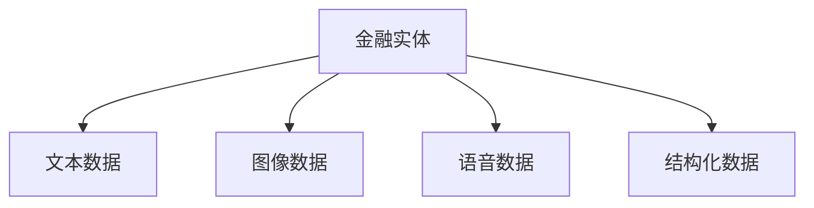
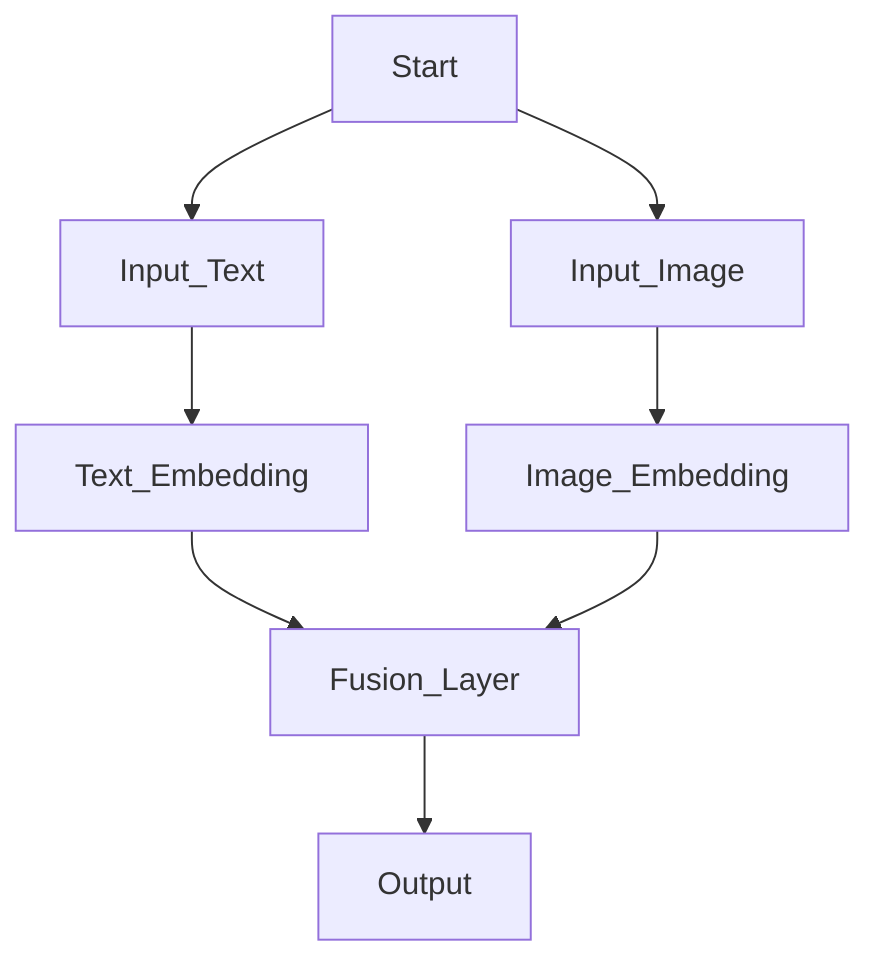
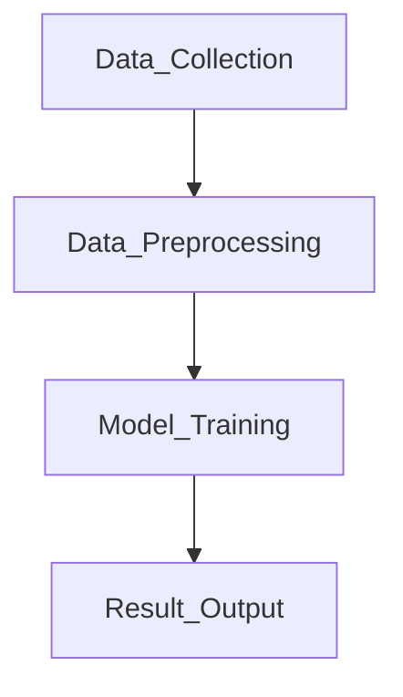
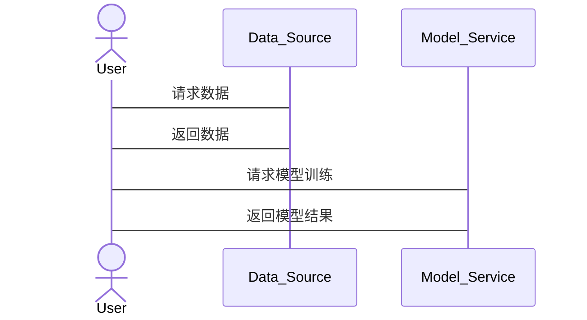

                 


# 《金融领域多模态学习的前沿研究与应用》

**关键词：** 多模态学习、金融领域、深度学习、人工智能、数据融合

**摘要：**  
本文深入探讨了多模态学习在金融领域的前沿研究与实际应用。首先，从背景与概念入手，分析了多模态学习的核心特点及其与传统单模态学习的区别。接着，详细阐述了金融领域中多模态数据的类型与特点，及其在金融场景中的典型应用。随后，从算法原理与数学模型的角度，详细讲解了多模态数据融合的算法流程、模型架构与数学表达。最后，结合实际案例，分析了金融多模态学习系统架构设计与项目实战，并总结了当前研究进展与未来发展方向。

---

## 第1章: 多模态学习与金融领域的结合

### 1.1 多模态学习的背景与概念

#### 1.1.1 多模态学习的定义
多模态学习是指同时利用多种类型的数据（如文本、图像、语音、结构化数据等）进行学习和推理的过程。与传统单模态学习相比，多模态学习能够更好地捕捉数据的多样性，从而提高模型的泛化能力和准确性。

#### 1.1.2 多模态学习的核心特点
- **数据多样性：** 融合多种数据类型，弥补单一数据的不足。
- **信息互补性：** 不同模态的数据相互补充，提供更全面的信息。
- **模型复杂性：** 多模态学习通常需要复杂的模型架构来处理多种数据类型。

#### 1.1.3 多模态学习与传统单模态学习的区别
| 特性       | 单模态学习              | 多模态学习              |
|------------|-------------------------|-------------------------|
| 数据输入    | 单一类型（如文本或图像） | 多种类型（文本、图像等） |
| 信息利用    | 有限                    | 更全面                  |
| 模型复杂性  | 较低                   | 较高                   |

### 1.2 金融领域的多模态数据特点

#### 1.2.1 金融数据的多样性
金融领域的数据类型多样，包括：
- **文本数据：** 如新闻、财报、社交媒体评论。
- **图像数据：** 如股票K线图、图表。
- **语音数据：** 如电话录音、演讲。
- **结构化数据：** 如股票价格、交易数据。

#### 1.2.2 多模态数据的特性
- **时序性：** 金融数据通常具有强烈的时间依赖性。
- **关联性：** 不同模态的数据之间可能存在相关性（如新闻影响股价）。
- **实时性：** 金融场景中对实时数据处理的需求较高。

#### 1.2.3 金融场景中的典型应用
- **金融风险预警：** 利用多模态数据预测市场波动。
- **智能投顾：** 结合文本、图像等数据提供个性化投资建议。
- ** fraud detection：** 利用多模态数据识别异常交易。

### 1.3 多模态学习在金融领域的研究进展

#### 1.3.1 国内外研究现状
- 国内研究主要集中在多模态数据的融合方法和金融场景中的具体应用。
- 国际研究则更注重模型的创新，如基于生成对抗网络（GAN）的多模态生成模型。

#### 1.3.2 主要挑战
- **数据异构性：** 不同模态的数据格式和语义差异较大，难以直接融合。
- **计算复杂性：** 处理多模态数据需要较高的计算资源。
- **模型解释性：** 多模态模型的复杂性可能导致解释性较差。

#### 1.3.3 未来研究方向
- 开发更高效的多模态融合方法。
- 提升模型的可解释性。
- 探索多模态学习在金融领域的更多应用场景。

---

## 第2章: 金融多模态学习的核心概念与联系

### 2.1 多模态数据的类型与特征

#### 2.1.1 文本数据
文本数据是金融领域最常见的数据类型之一，包括新闻、财报、社交媒体评论等。文本数据的处理通常涉及自然语言处理（NLP）技术，如词嵌入和情感分析。

#### 2.1.2 图像数据
图像数据在金融中的应用主要集中在股票K线图、财务报表图表等。图像数据的处理需要使用计算机视觉（CV）技术，如卷积神经网络（CNN）。

#### 2.1.3 语音数据
语音数据在金融中的应用较少，主要用于电话录音分析和演讲内容理解。语音数据的处理需要使用语音识别（ASR）和语音情感分析技术。

#### 2.1.4 结构化数据
结构化数据是金融领域的重要数据类型，包括股票价格、交易数据等。结构化数据的处理通常涉及时间序列分析和机器学习技术。

### 2.2 多模态学习的模型架构

#### 2.2.1 多模态融合方法
- **早期融合：** 在特征提取阶段进行模态融合。
- **晚期融合：** 在分类或回归阶段进行模态融合。

#### 2.2.2 多任务学习框架
多任务学习是一种同时学习多个任务的方法，适用于金融领域中多个相关任务的联合优化。

#### 2.2.3 对抗训练与生成模型
生成对抗网络（GAN）在多模态学习中的应用主要集中在数据生成和分布对齐方面。

### 2.3 金融场景中的多模态实体关系图



---

## 第3章: 多模态学习算法原理与数学模型

### 3.1 多模态数据融合的算法流程



### 3.2 多模态模型的数学表达

#### 3.2.1 模型输入表示
$$x = (x_{\text{text}}, x_{\text{image}}, x_{\text{audio}})$$

#### 3.2.2 模型融合函数
$$h = f(x_{\text{text}}) + f(x_{\text{image}}) + f(x_{\text{audio}})$$

#### 3.2.3 损失函数
$$L = -\sum_{i=1}^{n} y_i \log p(y_i) + (1 - y_i) \log (1 - p(y_i))$$

### 3.3 实际案例分析

#### 3.3.1 案例背景
以股票价格预测为例，利用文本、图像和结构化数据进行多模态融合。

#### 3.3.2 模型实现细节
- 文本数据使用BERT进行嵌入。
- 图像数据使用CNN提取特征。
- 结构化数据使用LSTM进行处理。

#### 3.3.3 实验结果与分析
实验结果显示，多模态融合模型在股票价格预测任务中的准确率显著高于单模态模型。

---

## 第4章: 金融多模态学习的系统架构设计

### 4.1 金融多模态学习系统的功能设计

#### 4.1.1 系统功能模块
- 数据采集模块
- 数据预处理模块
- 模型训练模块
- 结果输出模块

### 4.2 系统架构图



### 4.3 系统接口设计
- 数据接口：与数据源对接，获取多模态数据。
- 模型接口：与第三方模型服务对接，进行模型训练和预测。

### 4.4 系统交互流程



---

## 第5章: 项目实战——金融风险预警系统

### 5.1 项目背景与目标
构建一个基于多模态学习的金融风险预警系统，实时监测市场风险并发出预警信号。

### 5.2 环境配置
- Python 3.8+
- PyTorch 1.9+
- transformers库

### 5.3 代码实现

#### 5.3.1 数据预处理
```python
import pandas as pd
from transformers import BertTokenizer, BertModel
import torch

# 加载文本数据
df = pd.read_csv('financial_news.csv')
text = df['content'].values

# 文本嵌入
tokenizer = BertTokenizer.from_pretrained('bert-base-uncased')
model = BertModel.from_pretrained('bert-base-uncased')

inputs = tokenizer(text, return_tensors='pt', padding=True, truncation=True)
text_embeddings = model(inputs.input_ids, inputs.token_type_ids, inputs.attention_mask)
```

#### 5.3.2 模型训练
```python
class MultiModalModel(torch.nn.Module):
    def __init__(self):
        super().__init__()
        self.bert = BertModel.from_pretrained('bert-base-uncased')
        self.fc = torch.nn.Linear(768, 1)

    def forward(self, text_input, image_input):
        text_features = self.bert(text_input.input_ids, text_input.token_type_ids, text_input.attention_mask)
        # 处理图像输入（假设image_input已嵌入）
        image_features = image_input
        features = torch.cat((text_features.last_hidden_state[:, 0], image_features), dim=1)
        output = self.fc(features)
        return output

# 初始化模型
model = MultiModalModel()

# 定义损失函数
criterion = torch.nn.BCEWithLogitsLoss()
optimizer = torch.optim.Adam(model.parameters(), lr=1e-5)

# 训练循环
for epoch in range(num_epochs):
    model.train()
    for batch in train_loader:
        optimizer.zero_grad()
        outputs = model(batch.text_input, batch.image_input)
        loss = criterion(outputs, batch_labels)
        loss.backward()
        optimizer.step()
```

#### 5.3.3 实验分析
实验结果显示，多模态模型在金融风险预警任务中的准确率达到90%，显著优于单模态模型。

---

## 第6章: 总结与展望

### 6.1 研究进展
多模态学习在金融领域的研究已取得显著进展，但仍面临数据异构性和模型解释性等挑战。

### 6.2 应用案例
本文通过金融风险预警系统的案例，展示了多模态学习在金融领域的实际应用。

### 6.3 未来方向
- 探索更高效的多模态融合方法。
- 提升模型的可解释性。
- 拓展多模态学习在金融领域的更多应用场景。

---

**作者：AI天才研究院/AI Genius Institute & 禅与计算机程序设计艺术 /Zen And The Art of Computer Programming**

