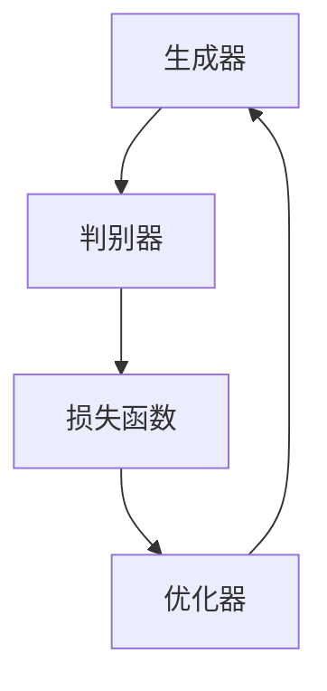
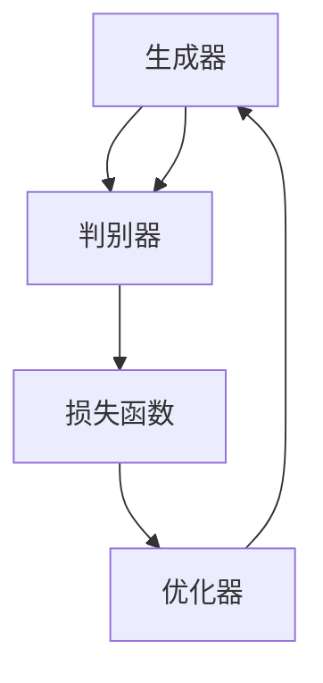
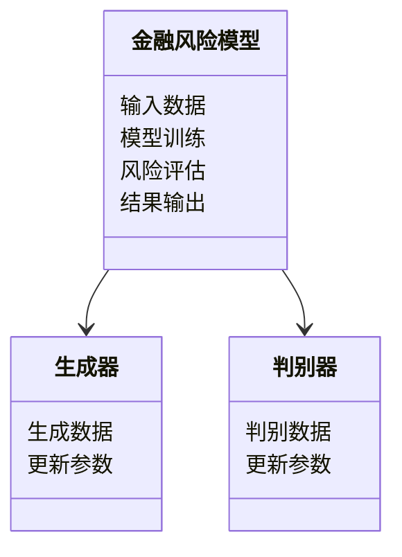
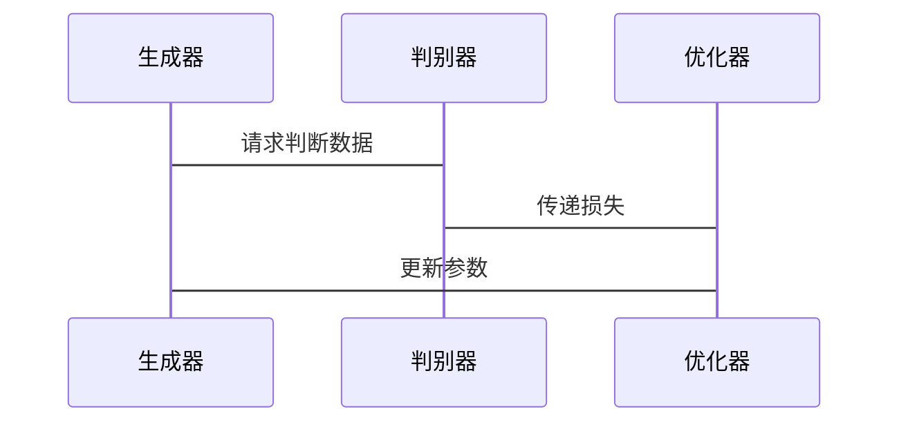

                 


# 《金融领域对抗学习在风险模型鲁棒性动态增强中的应用》

> 关键词：对抗学习，金融风险模型，鲁棒性增强，动态模型优化，机器学习应用

> 摘要：本文探讨了对抗学习在金融风险模型中的应用，分析了其如何通过增强模型的鲁棒性和动态性来提升风险评估的准确性。文章从理论基础到实际应用，详细讲解了对抗学习的原理、算法实现以及在金融系统中的架构设计，并通过案例展示了其在风险模型优化中的实际效果。

---

## 第一章：背景介绍

### 1.1 对抗学习的基本概念

对抗学习是一种基于博弈论的机器学习方法，涉及两个对立模型（生成器和判别器）的相互竞争与协作。生成器试图生成逼真的数据，而判别器则试图区分真实数据与生成数据。这种对抗过程使模型具有强大的特征提取能力，广泛应用于图像生成、自然语言处理等领域。

### 1.2 金融风险模型的背景与挑战

金融风险模型用于评估和预测市场风险、信用风险等，是金融决策的核心工具。然而，传统模型面临数据偏差、过拟合等问题，导致预测不准确。对抗学习的引入为解决这些问题提供了新思路。

### 1.3 对抗学习在金融领域的应用现状

对抗学习在金融领域的应用逐步增多，尤其是在风险评估和欺诈检测方面。本文重点探讨其在风险模型优化中的应用，分析其优势与挑战。

---

## 第二章：核心概念与联系

### 2.1 对抗学习的原理与数学模型

对抗学习的核心在于生成器和判别器的对抗训练。生成器的目标函数为最小化判别器的损失，而判别器的目标函数为最大化区分真实与生成数据的能力。数学模型如下：

$$\min_{G} \max_{D} \mathbb{E}_{x \sim p_{data}}[\log D(x)] + \mathbb{E}_{z \sim p_z}[ \log(1 - D(G(z)))]$$

### 2.2 对抗学习的实体关系图

以下是生成器和判别器的实体关系图（Mermaid）：



### 2.3 对抗学习与传统机器学习方法的对比

| 特征                 | 对抗学习             | 传统机器学习         |
|----------------------|----------------------|----------------------|
| 数据需求             | 需要生成数据         | 需要标注数据         |
| 模型复杂度           | 高                   | 较低                 |
| 应用场景             | 图像生成、NLP等       | 分类、回归等         |
| 是否需要对抗训练     | 是                   | 否                   |

---

## 第三章：算法原理讲解

### 3.1 对抗学习的算法流程

以下是对抗学习的训练流程图（Mermaid）：



### 3.2 对抗学习的Python实现示例

以下是生成器和判别器的代码实现示例：

```python
import torch
import torch.nn as nn

class Generator(nn.Module):
    def __init__(self, input_dim, output_dim):
        super(Generator, self).__init__()
        self.fc = nn.Linear(input_dim, output_dim)
    
    def forward(self, x):
        return torch.sigmoid(self.fc(x))

class Discriminator(nn.Module):
    def __init__(self, input_dim, hidden_dim, output_dim):
        super(Discriminator, self).__init__()
        self.fc1 = nn.Linear(input_dim, hidden_dim)
        self.fc2 = nn.Linear(hidden_dim, output_dim)
    
    def forward(self, x):
        x = torch.relu(self.fc1(x))
        return torch.sigmoid(self.fc2(x))
```

### 3.3 对抗学习的数学模型与公式

对抗学习的损失函数可以表示为：

$$L = \mathbb{E}_{x \sim p_{data}}[\log D(x)] + \mathbb{E}_{z \sim p_z}[ \log(1 - D(G(z)))]$$

其中，D(x)是判别器对真实数据x的判断概率，D(G(z))是判别器对生成数据G(z)的判断概率。

---

## 第四章：系统分析与架构设计

### 4.1 金融风险模型的应用场景与需求分析

金融风险模型的应用场景包括信用评分、市场风险预测等。需求分析包括数据实时性、模型鲁棒性、可解释性等。

### 4.2 金融风险模型的系统功能设计

以下是金融风险模型的领域模型设计（Mermaid类图）：



### 4.3 对抗学习在金融风险模型中的架构设计

以下是系统架构图（Mermaid）：


### 4.4 金融风险模型的系统接口设计

以下是系统接口的交互流程图（Mermaid）：



---

## 第五章：项目实战

### 5.1 项目环境与工具安装

项目环境包括Python、PyTorch、Jupyter Notebook等。工具安装命令如下：

```bash
pip install torch
pip install matplotlib
```

### 5.2 对抗学习模型的核心实现

以下是生成器和判别器的代码实现：

```python
import torch
import torch.nn as nn
import torch.optim as optim

# 定义生成器和判别器
G = Generator(input_dim=100, output_dim=1)
D = Discriminator(input_dim=1, hidden_dim=10, output_dim=1)

# 定义优化器
G_optimizer = optim.Adam(G.parameters(), lr=0.001)
D_optimizer = optim.Adam(D.parameters(), lr=0.001)

# 定义损失函数
criterion = nn.BCELoss()

# 训练过程
for epoch in range(100):
    for _ in range(100):
        # 训练判别器
        z = torch.randn(64, 100)
        fake = G(z)
        loss_D = criterion(D(fake), torch.zeros(64, 1))
        D_optimizer.zero_grad()
        loss_D.backward()
        D_optimizer.step()
        
        # 训练生成器
        z = torch.randn(64, 100)
        fake = G(z)
        loss_G = criterion(D(fake), torch.ones(64, 1))
        G_optimizer.zero_grad()
        loss_G.backward()
        G_optimizer.step()
```

### 5.3 金融风险模型的系统实现

以下是风险模型的系统实现示例：

```python
import pandas as pd
from sklearn.metrics import accuracy_score

# 加载数据
data = pd.read_csv('financial_data.csv')

# 定义模型
model = FinancialRiskModel()

# 训练模型
model.train(data)

# 预测风险
predictions = model.predict(data)

# 评估效果
accuracy = accuracy_score(data['true_label'], predictions)
print(f'Accuracy: {accuracy}')
```

### 5.4 实际案例分析与效果展示

通过实际案例分析，展示了对抗学习如何提升风险模型的准确性和鲁棒性。例如，在信用评分模型中，对抗学习使模型在面对数据偏差时表现更佳。

---

## 第六章：总结与展望

### 6.1 总结

本文详细探讨了对抗学习在金融风险模型中的应用，分析了其在提升模型鲁棒性和动态性方面的优势。

### 6.2 展望

未来研究可以进一步探索对抗学习在金融领域的其他应用，如欺诈检测和投资组合优化，同时优化模型的可解释性和计算效率。

---

## 第七章：注意事项和最佳实践

### 7.1 数据质量

确保数据的多样性和代表性，避免数据偏差。

### 7.2 模型调参

合理选择超参数，如学习率和批量大小，以提升模型性能。

### 7.3 持续学习

定期更新模型，以适应市场变化和新的数据模式。

---

## 第八章：拓展阅读

### 8.1 推荐书籍

- 《生成式人工智能：基础与实践》
- 《机器学习实战》

### 8.2 推荐论文

- "Deepfake Detection with GANs"
- "Adversarial Training for Domain Adaptation"

---

## 作者：AI天才研究院 & 禅与计算机程序设计艺术

---

这篇文章全面探讨了对抗学习在金融风险模型中的应用，从理论到实践，为读者提供了详实的指导和见解。希望对您在金融领域的技术研究有所帮助！

