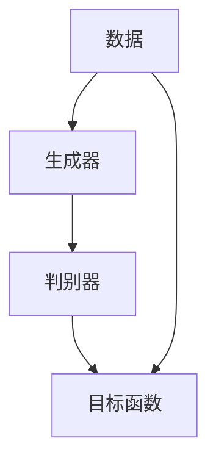

                 

# 第二章: 对抗学习的核心概念与联系

## 2.1 对抗学习的原理

### 2.1.1 对抗网络的结构

对抗学习的核心在于生成器（Generator）和判别器（Discriminator）的博弈过程。生成器的目标是生成逼真的数据，使其能够欺骗判别器，而判别器的任务是区分真实数据和生成数据。这种博弈关系使得两个模型在训练过程中相互促进，不断提高生成数据的质量。

生成器通常采用生成对抗网络（GAN）的结构，通过多层感知机（MLP）或卷积神经网络（CNN）来生成数据。判别器则通过MLP或CNN来判断输入数据是真实数据还是生成数据。

### 2.1.2 生成器与判别器的博弈过程

在对抗学习中，生成器和判别器的损失函数相互关联。生成器的损失函数旨在最大化判别器将生成数据误判为真实数据的概率，而判别器的损失函数则旨在最小化这种误判概率。两个模型通过交替优化来提升性能。

生成器的损失函数可以表示为：
$$ L_G = -\log(D(G(x))) $$
其中，$D$是判别器，$G$是生成器，$x$是输入噪声。

判别器的损失函数可以表示为：
$$ L_D = -(\log(D(x)) + \log(1 - D(G(x)))) $$】

通过不断优化这两个损失函数，生成器和判别器的能力都会得到提升。

### 2.1.3 对抗学习的数学模型

对抗学习的数学模型可以表示为一个联合优化问题：
$$ \min_G \max_D \mathbb{E}_{x \sim P_{\text{data}}}[ \log D(x)] + \mathbb{E}_{z \sim P_z}[ \log (1 - D(G(z)))] $$】
其中，$G$是生成器，$D$是判别器，$z$是生成器的输入噪声，$P_{\text{data}}$是真实数据的分布，$P_z$是噪声分布。

## 2.2 对抗学习的核心概念对比

为了更好地理解对抗学习的特点，我们需要将其与其他相关技术进行对比。以下是几种主要的对比：

### 2.2.1 对抗学习与传统机器学习的对比

| 对比维度 | 对抗学习 | 传统机器学习 |
|----------|----------|--------------|
| 模型结构 | 双模型：生成器和判别器 | 单模型：监督或无监督 |
| 优化目标 | 最小化生成数据被判别器拒绝的概率 | 最小化预测误差或分类错误 |
| 数据需求 | 需要生成数据与真实数据对比 | 需要真实标签或无标签数据 |

### 2.2.2 对抗学习与强化学习的对比

| 对比维度 | 对抗学习 | 强化学习 |
|----------|----------|----------|
| 学习目标 | 生成器生成真实数据 | 智能体在环境中获得最大奖励 |
| 模型结构 | 双模型：生成器和判别器 | 单模型：智能体和环境 |
| 优化方式 | 最小化判别器的损失 | 最大化累积奖励 |

### 2.2.3 对抗学习与其他生成模型的对比

| 对比维度 | 对抗学习（GAN） | 变分自编码器（VAE） |
|----------|----------------|-------------------|
| 模型结构 | 生成器和判别器 | 编码器和解码器 |
| 生成方式 | 按对抗方式进行 | 确定性生成 |
| 优点 | 高质量生成 | 稳定性好 |
| 缺点 | 训练不稳定 | 生成多样性不足 |

## 2.3 对抗学习的ER实体关系图

以下是描述对抗学习核心要素的ER实体关系图：

这张图展示了数据、生成器、判别器和目标函数之间的关系。数据被输入生成器，生成器生成数据并将其传递给判别器。判别器的任务是判断数据的真实性和生成数据的相似性，并将结果传递给目标函数，目标函数指导生成器和判别器的优化过程。

## 2.4 本章小结

通过对对抗学习的核心概念和相关技术的对比分析，我们可以看到对抗学习的独特性和优势。生成器和判别器的博弈关系使得对抗学习在生成高质量数据方面具有显著的优势。同时，对抗学习的数学模型和算法实现也为金融领域的数据生成和分析提供了新的思路。接下来的章节将详细讲解对抗学习的算法原理及其在金融领域的具体应用。

---

* 作者：AI天才研究院/AI Genius Institute & 禅与计算机程序设计艺术 /Zen And The Art of Computer Programming

