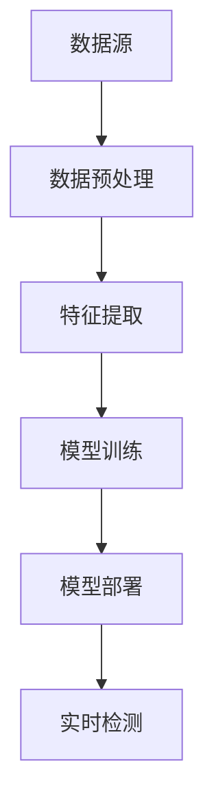

                 


---

# 《金融领域对比学习在异常检测中的应用》

> 关键词：对比学习，异常检测，金融数据，深度学习，机器学习

> 摘要：对比学习是一种新兴的机器学习技术，通过对比不同数据之间的关系，能够有效地检测数据中的异常点。本文详细探讨了对比学习在金融领域中的应用，分析了其在金融数据异常检测中的优势和挑战，并通过实际案例展示了如何利用对比学习算法构建高效的金融异常检测系统。文章内容涵盖对比学习基础、金融领域异常检测的需求、对比学习的核心算法、系统架构设计以及项目实战，为读者提供了从理论到实践的全面指导。

---

## 第一部分: 对比学习基础

### 第1章: 对比学习的定义与技术原理

#### 1.1 对比学习的定义

##### 1.1.1 对比学习的核心概念

对比学习是一种基于对比机制的机器学习技术，其核心思想是通过比较不同数据点之间的关系，学习数据的潜在结构。在金融领域，对比学习可以用于识别异常交易、欺诈检测等任务。

**对比学习的核心概念包括：**

1. **对比损失函数**：衡量数据点之间相似性或差异性的损失函数，用于优化模型参数。
2. **数据增强**：通过生成多样化的数据样本，增强模型的鲁棒性。
3. **特征提取**：从原始数据中提取有用的特征，用于后续的对比学习过程。

##### 1.1.2 对比学习的技术特点

**对比学习的技术特点如下：**

1. **无监督学习**：对比学习通常在无监督或半监督环境下进行，适用于标注数据不足的情况。
2. **高维数据处理**：对比学习能够有效处理高维金融数据，提取其潜在特征。
3. **实时性**：通过在线学习方法，对比学习可以实现实时异常检测。

#### 1.2 对比学习在异常检测中的应用背景

##### 1.2.1 金融领域的异常检测需求

**金融数据的特点：**

1. **高维性**：金融数据通常包含大量特征，如股票价格、交易量、市场指数等。
2. **时间依赖性**：金融数据的时间序列特性使其容易受到市场波动的影响。
3. **噪声多**：金融数据中存在大量噪声，如市场操纵、虚假交易等。

**金融异常检测的重要性：**

1. **风险管理**：及时发现异常交易可以有效降低金融风险。
2. **欺诈检测**：识别欺诈交易是金融机构合规性的关键。
3. **市场监控**：监控市场异常行为有助于维护金融市场的稳定。

##### 1.2.2 对比学习在异常检测中的优势

**对比学习在异常检测中的优势：**

1. **高效性**：对比学习能够快速识别异常点，适用于实时检测。
2. **鲁棒性**：对比学习能够处理高维和复杂的金融数据。
3. **可解释性**：通过对比分析，模型能够提供可解释的异常检测结果。

---

## 第二部分: 对比学习在金融领域中的应用

### 第2章: 金融领域的异常检测需求

#### 2.1 金融数据的特点

**金融数据的特点：**

1. **多样性**：金融数据涵盖股票、债券、期货等多种金融产品。
2. **复杂性**：金融数据受到多种因素影响，如市场情绪、政策变化等。
3. **动态性**：金融数据具有很强的时间依赖性，市场环境会不断变化。

#### 2.2 对比学习在金融异常检测中的具体应用

##### 2.2.1 股票市场的异常检测

**股票市场的异常检测：**

1. **算法设计**：利用对比学习算法，识别股票价格的异常波动。
2. **案例分析**：通过实际案例，展示对比学习在识别市场操纵中的应用。

##### 2.2.2 交易欺诈检测

**交易欺诈检测：**

1. **数据特征提取**：从交易记录中提取特征，用于对比学习模型的训练。
2. **模型训练**：通过对比学习模型，识别异常交易行为。

---

## 第三部分: 对比学习的核心算法

### 第3章: 对比学习的核心算法

#### 3.1 对比学习的算法原理

##### 3.1.1 对比损失函数

**对比损失函数：**

$$ L = \frac{1}{N}\sum_{i=1}^{N} \text{contrastive_loss}(x_i, y_i) $$

其中，$x_i$ 是输入数据，$y_i$ 是对应的标签，$\text{contrastive_loss}$ 是对比损失函数。

##### 3.1.2 数据增强方法

**数据增强方法：**

1. **随机裁剪**：随机选择数据的子区域作为输入。
2. **旋转**：对数据进行随机角度的旋转。
3. **噪声添加**：在数据中添加随机噪声。

##### 3.1.3 特征提取与判别器设计

**特征提取网络：**

$$ f(x) = \text{dense}(x, 128) $$

其中，$f(x)$ 是特征提取网络，将输入数据映射到128维特征空间。

**判别器网络：**

$$ D(f(x_i), f(x_j)) = \text{dense}(f(x_i) - f(x_j), 1) $$

其中，$D$ 是判别器网络，用于判断两个特征是否来自同一类别。

#### 3.2 对比学习算法的实现

##### 3.2.1 对比学习算法的Python代码实现

```python
import torch
import torch.nn as nn
import torch.optim as optim

class ContrastiveLoss(nn.Module):
    def __init__(self, temperature=0.1):
        super(ContrastiveLoss, self).__init__()
        self.temperature = temperature

    def forward(self, features, labels):
        # 计算相似性
        similarities = torch.mm(features, features.t())
        # 计算标签是否相同
        labels = labels.unsqueeze(1)
        same_labels = torch.eq(labels, labels.t()).float()
        # 计算对比损失
        numerator = similarities - same_labels
        denominator = torch.exp(similarities / self.temperature)
        loss = torch.mean(torch.log(1 + torch.sum(numerator * denominator, dim=1)))
        return loss

# 初始化特征提取网络和判别器网络
feature_extractor = nn.Linear(128, 128)
discriminator = nn.Linear(256, 1)

# 初始化优化器
optimizer = optim.Adam([feature_extractor.parameters(), discriminator.parameters()], lr=0.001)

# 初始化损失函数
criterion = ContrastiveLoss()
```

---

## 第四部分: 系统架构与实现方案

### 第4章: 系统架构设计

#### 4.1 金融异常检测系统设计

##### 4.1.1 系统功能设计

**系统功能设计：**

1. **数据预处理**：对金融数据进行清洗和特征提取。
2. **模型训练**：利用对比学习算法训练异常检测模型。
3. **实时检测**：对实时金融数据进行异常检测。

##### 4.1.2 系统架构设计

**系统架构图：**



##### 4.1.3 系统接口设计

**系统接口设计：**

1. **数据输入接口**：接收金融数据，格式为CSV或JSON。
2. **模型训练接口**：对特征提取网络和判别器网络进行训练。
3. **异常检测接口**：对实时数据进行异常检测并返回结果。

---

## 第五部分: 项目实战

### 第5章: 项目实战

#### 5.1 项目环境配置

##### 5.1.1 环境安装

**安装所需的库：**

```bash
pip install torch numpy pandas scikit-learn
```

##### 5.1.2 数据准备

**数据加载与预处理：**

```python
import pandas as pd
import numpy as np

# 加载数据
data = pd.read_csv('financial_data.csv')

# 数据预处理
data = data.dropna()
data = data.sample(frac=1)
```

##### 5.1.3 模型训练与评估

**模型训练：**

```python
# 训练特征提取网络和判别器网络
optimizer.zero_grad()
loss.backward()
optimizer.step()
```

**模型评估：**

```python
# 计算准确率
correct = 0
total = 0
with torch.no_grad():
    for inputs, labels in test_loader:
        features = feature_extractor(inputs)
        outputs = discriminator(features)
        predicted = torch.round(outputs)
        total += labels.size(0)
        correct += (predicted == labels).sum().item()

accuracy = 100 * correct / total
print(f'Accuracy: {accuracy}%')
```

---

## 第六部分: 总结与展望

### 第6章: 总结与展望

#### 6.1 全文总结

对比学习作为一种新兴的机器学习技术，在金融领域的异常检测中展现了巨大的潜力。本文详细探讨了对比学习的理论基础、算法实现以及在金融领域的具体应用，展示了对比学习在股票市场异常检测和交易欺诈检测中的有效性。

#### 6.2 未来展望

对比学习在金融领域的应用前景广阔，未来的研究方向包括：

1. **优化算法**：进一步优化对比损失函数，提高模型的检测精度。
2. **多模态数据处理**：结合文本、图像等多种数据源，提升模型的综合分析能力。
3. **在线学习**：研究在线对比学习方法，实现实时异常检测。

---

## 作者信息

作者：AI天才研究院/AI Genius Institute & 禅与计算机程序设计艺术 /Zen And The Art of Computer Programming

--- 

以上是《金融领域对比学习在异常检测中的应用》的技术博客文章的详细目录和部分内容。

