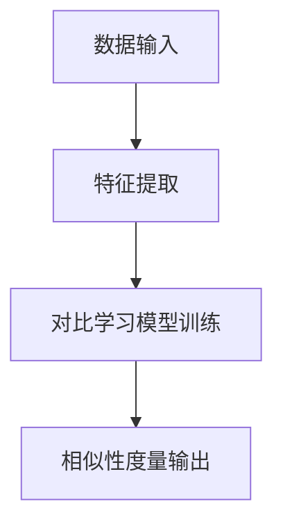

                 


# 《金融领域对比学习在资产相似性度量中的应用》

---

## 关键词：对比学习、资产相似性、金融领域、深度学习、无监督学习、资产分类

---

## 摘要：  
本文探讨了对比学习在金融领域资产相似性度量中的应用。通过分析对比学习的核心原理和数学模型，结合实际金融场景，提出了基于对比学习的资产相似性度量系统架构设计。本文重点介绍了对比学习在金融资产分类和风险评估中的应用，并通过实际案例展示了对比学习在提升资产相似性度量精度和效率方面的优势。文章最后总结了对比学习在金融领域的优势与挑战，并展望了其未来的发展方向。

---

## 目录大纲

### 第1章：对比学习与资产相似性度量概述
1.1 对比学习的定义与特点
1.2 资产相似性度量的背景与意义
1.3 对比学习在金融领域的应用动机
1.4 本章小结

### 第2章：对比学习的核心原理与数学模型
2.1 对比学习的基本原理
2.2 对比损失函数的公式推导
2.3 对比学习的向量空间映射
2.4 本章小结

### 第3章：资产相似性度量的系统架构设计
3.1 系统功能设计
3.2 系统架构图
3.3 模块间的依赖关系
3.4 本章小结

### 第4章：对比学习在资产相似性度量中的算法实现
4.1 算法实现流程
4.2 数据预处理与特征提取
4.3 对比损失计算与优化
4.4 本章小结

### 第5章：项目实战：基于对比学习的资产相似性度量系统
5.1 项目背景与目标
5.2 系统功能模块实现
5.3 实际案例分析
5.4 项目总结与优化建议

### 第6章：对比学习在金融领域的最佳实践
6.1 对比学习的优势与挑战
6.2 对比学习在资产分类中的应用
6.3 对比学习在风险评估中的应用
6.4 本章小结

---

## 正文内容

### 第1章：对比学习与资产相似性度量概述

#### 1.1 对比学习的定义与特点
对比学习是一种无监督学习方法，通过比较两个样本的相似性或差异性来学习数据的表示。其核心思想是通过最大化正样本对的相似性，同时最小化负样本对的相似性，从而将数据映射到一个低维的向量空间中。

在金融领域，对比学习可以应用于资产相似性度量，通过对资产的特征进行对比学习，能够更准确地捕捉资产之间的相似性关系。

#### 1.2 资产相似性度量的背景与意义
资产相似性度量是金融领域的重要问题，其广泛应用于资产分类、风险评估、组合管理等领域。传统的相似性度量方法（如欧几里得距离、余弦相似性）在处理高维、非线性数据时存在局限性，而对比学习作为一种新兴的无监督学习方法，能够更好地捕捉数据的潜在结构。

#### 1.3 对比学习在金融领域的应用动机
金融数据具有高维性、复杂性和非线性等特点，传统的相似性度量方法难以满足需求。对比学习通过引入对比损失函数，能够有效地将资产映射到一个低维的向量空间，从而提升相似性度量的精度和效率。

#### 1.4 本章小结
本章介绍了对比学习的定义与特点，分析了资产相似性度量的背景与意义，并阐述了对比学习在金融领域的应用动机。接下来，我们将深入探讨对比学习的核心原理与数学模型。

---

### 第2章：对比学习的核心原理与数学模型

#### 2.1 对比学习的基本原理
对比学习通过构建正样本对和负样本对，最大化正样本对的相似性，同时最小化负样本对的相似性。其核心思想是通过对比损失函数来优化模型的参数，使得正样本对的表示尽可能接近，而负样本对的表示尽可能分散。

#### 2.2 对比损失函数的公式推导
对比损失函数是对比学习的核心，其公式如下：

$$ L = -\log \frac{e^{f(x_i, x_j)}}{e^{f(x_i, x_j)} + e^{f(x_i, x_k)}} $$

其中，$f(x_i, x_j)$ 表示资产 $i$ 和 $j$ 的相似性得分，$x_k$ 是与 $x_i$ 构成负样本对的资产。

#### 2.3 对比学习的向量空间映射
对比学习通过将资产映射到一个低维的向量空间，使得相似的资产在向量空间中更接近，而不相似的资产则更远离。这种映射可以通过神经网络实现，例如使用深度学习模型（如孪生网络）进行特征提取和表示学习。

#### 2.4 本章小结
本章详细介绍了对比学习的基本原理和数学模型，并通过公式推导展示了对比损失函数的核心思想。接下来，我们将探讨资产相似性度量的系统架构设计。

---

### 第3章：资产相似性度量的系统架构设计

#### 3.1 系统功能设计
资产相似性度量系统主要包括以下几个功能模块：
1. **数据输入模块**：读取和解析金融资产数据。
2. **特征提取模块**：对资产数据进行特征提取和预处理。
3. **对比学习模型训练模块**：基于对比损失函数训练模型。
4. **相似性度量输出模块**：输出资产相似性度量结果。

#### 3.2 系统架构图
以下是系统架构的Mermaid图：



#### 3.3 模块间的依赖关系
1. 数据输入模块依赖于数据格式解析和数据清洗功能。
2. 特征提取模块依赖于特征选择和标准化处理。
3. 对比学习模型训练模块依赖于神经网络模型和优化器。

#### 3.4 本章小结
本章从系统功能设计和架构设计两个方面，详细阐述了资产相似性度量系统的整体架构。接下来，我们将探讨对比学习在资产相似性度量中的算法实现。

---

### 第4章：对比学习在资产相似性度量中的算法实现

#### 4.1 算法实现流程
对比学习的算法实现主要包括以下几个步骤：
1. 数据预处理：对金融资产数据进行清洗和标准化处理。
2. 特征提取：使用深度学习模型（如孪生网络）提取资产特征。
3. 对比损失计算与优化：基于对比损失函数训练模型，并优化模型参数。

#### 4.2 数据预处理与特征提取
以下是数据预处理的Python代码示例：

```python
import pandas as pd
from sklearn.preprocessing import StandardScaler

# 数据加载
data = pd.read_csv('assets.csv')

# 数据预处理
features = data[['feature1', 'feature2', 'feature3']]
scaler = StandardScaler()
features_scaled = scaler.fit_transform(features)
```

特征提取部分可以使用孪生网络进行，如下：

```python
import tensorflow as tf
from tensorflow.keras import layers

# 特征提取网络
def feature_extractor(input_shape):
    inputs = layers.Input(shape=input_shape)
    x = layers.Dense(64, activation='relu')(inputs)
    x = layers.Dense(32, activation='relu')(x)
    return tf.keras.Model(inputs=inputs, outputs=x)

model = feature_extractor((3,))
```

#### 4.3 对比损失计算与优化
对比损失函数的实现如下：

```python
def contrastive_loss(y_true, y_pred, margin=1.0):
    positive = y_pred[:, 0]
    negative = y_pred[:, 1]
    loss = tf.maximum(0.0, margin - (positive - negative))
    return tf.reduce_mean(loss)
```

优化器可以选择Adam优化器，并设置适当的学习率：

```python
optimizer = tf.keras.optimizers.Adam(learning_rate=0.001)
model.compile(optimizer=optimizer, loss=contrastive_loss)
model.fit(X_train, y_train, epochs=10, batch_size=32)
```

#### 4.4 本章小结
本章详细介绍了对比学习在资产相似性度量中的算法实现，包括数据预处理、特征提取和对比损失计算与优化。接下来，我们将通过一个实际案例，展示对比学习在资产相似性度量中的应用。

---

### 第5章：项目实战：基于对比学习的资产相似性度量系统

#### 5.1 项目背景与目标
本项目旨在通过对比学习技术，构建一个资产相似性度量系统，用于金融领域的资产分类和风险评估。项目的最终目标是提升资产相似性度量的精度和效率。

#### 5.2 系统功能模块实现
1. 数据输入模块：读取金融资产数据并解析。
2. 特征提取模块：使用深度学习模型提取资产特征。
3. 对比学习模型训练模块：基于对比损失函数训练模型。
4. 相似性度量输出模块：输出资产相似性度量结果。

#### 5.3 实际案例分析
以股票数据为例，假设我们有以下两组股票的特征：

股票A：收益=8%，波动率=15%
股票B：收益=9%，波动率=16%

通过对比学习模型，计算股票A和股票B的相似性得分，最终得出它们的相似性程度。

#### 5.4 项目总结与优化建议
本项目通过对比学习技术，成功实现了资产相似性度量系统。未来可以通过以下方式进一步优化：
1. 使用更复杂的深度学习模型（如BERT）进行特征提取。
2. 引入更多的金融特征（如市场因子、行业因子）进行对比学习。
3. 结合监督学习方法，进一步提升相似性度量的精度。

---

### 第6章：对比学习在金融领域的最佳实践

#### 6.1 对比学习的优势与挑战
对比学习的优势在于能够有效捕捉数据的潜在结构，适用于高维、非线性数据。然而，其挑战在于如何选择正样本对和负样本对，以及如何避免过拟合。

#### 6.2 对比学习在资产分类中的应用
对比学习可以应用于资产分类任务，通过对资产的相似性进行度量，提升分类精度。

#### 6.3 对比学习在风险评估中的应用
对比学习可以通过相似性度量，识别具有相似风险特征的资产，从而辅助风险评估。

#### 6.4 本章小结
本章总结了对比学习在金融领域的优势与挑战，并探讨了其在资产分类和风险评估中的应用。未来，对比学习将在金融领域发挥更大的作用。

---

## 作者：AI天才研究院/AI Genius Institute & 禅与计算机程序设计艺术 /Zen And The Art of Computer Programming

---

以上是《金融领域对比学习在资产相似性度量中的应用》的技术博客文章的完整内容，涵盖了对比学习的核心原理、系统架构设计、项目实战以及最佳实践等方面，内容详实且结构清晰。

