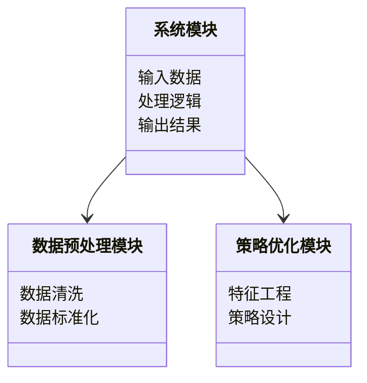
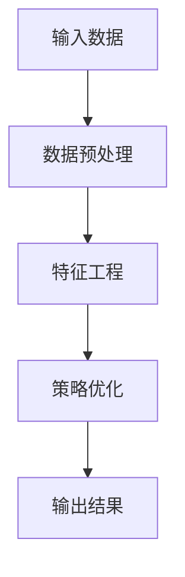
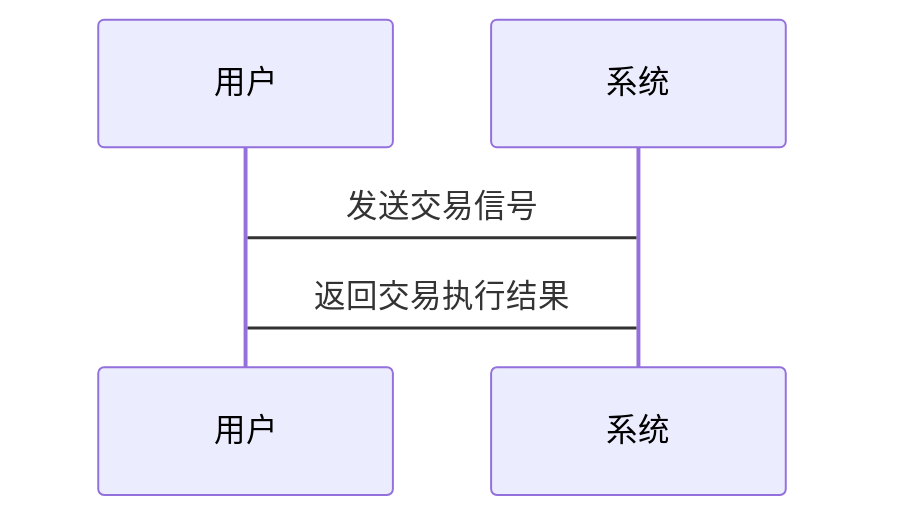

                 


# 金融领域强化学习在交易执行中的应用

> 关键词：强化学习，金融交易，算法交易，智能投资组合，高频交易

> 摘要：本文探讨了强化学习在金融交易执行中的应用，分析了强化学习的核心概念、算法原理及其在高频交易、算法交易和智能投资组合管理中的具体应用。通过系统架构设计和项目实战，详细介绍了如何利用强化学习优化交易策略，并提供了实际案例和最佳实践建议。

---

# 第1章: 金融领域强化学习概述

## 1.1 强化学习的基本概念

### 1.1.1 强化学习的定义与特点

强化学习（Reinforcement Learning，RL）是一种机器学习范式，通过智能体与环境的交互，学习最优策略以最大化累积奖励。其特点包括：

- **长期目标导向**：强化学习关注长期累积奖励，而非短期收益。
- **实时交互**：智能体通过与环境交互获取经验。
- **策略优化**：通过试错不断优化策略。

### 1.1.2 强化学习在金融领域的应用背景

金融交易涉及复杂决策，传统方法依赖经验丰富的交易员或复杂模型。强化学习的引入为金融交易提供了新的解决方案。

### 1.1.3 强化学习与传统交易执行方式的对比

| 方面 | 强化学习 | 传统交易 |
|------|----------|----------|
| 决策依据 | 数据驱动 | 专家经验 |
| 决策速度 | 实时 | 延时 |
| 决策优化 | 自动优化 | 手动调整 |

## 1.2 金融交易执行的核心问题

### 1.2.1 交易执行的基本流程

交易执行包括订单生成、订单匹配和订单执行三个阶段。

### 1.2.2 交易执行中的关键挑战

- **市场微观结构**：理解市场如何运作。
- **交易成本**：降低交易成本。
- **风险控制**：避免过度风险。

### 1.2.3 强化学习如何解决交易执行问题

强化学习通过模拟不同交易策略，优化订单生成和执行，降低交易成本并控制风险。

## 1.3 本书的核心目标与结构

### 1.3.1 本书的研究目标

分析强化学习在金融交易中的应用，优化交易策略。

### 1.3.2 本书的主要内容框架

涵盖强化学习基础、算法原理、金融应用、数据处理、系统设计、项目实战和案例分析。

### 1.3.3 本书的读者对象与学习要求

适用于金融从业者、数据科学家和技术爱好者，需掌握基础编程和机器学习知识。

---

# 第2章: 强化学习的核心概念与数学基础

## 2.1 强化学习的基本原理

### 2.1.1 状态、动作、奖励的定义

- **状态**：环境当前的状态。
- **动作**：智能体采取的行动。
- **奖励**：动作带来的反馈。

### 2.1.2 策略与价值函数的解释

- **策略**：决定动作的函数。
- **价值函数**：评估状态的价值。

### 2.1.3 探索与利用的平衡

在探索新策略和利用已知策略之间找到平衡。

## 2.2 马尔可夫决策过程（MDP）模型

### 2.2.1 状态空间与动作空间的定义

状态和动作的集合，及其转移概率。

### 2.2.2 奖励函数的设计原则

设计奖励函数时需考虑长期利益和目标一致性。

### 2.2.3 策略评估与策略改进的数学推导

Q-learning算法的数学公式：

$$ Q(s, a) \leftarrow Q(s, a) + \alpha [r + \max Q(s', a') - Q(s, a)] $$

## 2.3 强化学习算法的数学模型

### 2.3.1 Q-learning算法的公式推导

Q-learning更新公式：

$$ Q(s, a) \leftarrow Q(s, a) + \alpha (r + \gamma \max Q(s', a') - Q(s, a)) $$

### 2.3.2 深度强化学习的数学基础

使用深度神经网络近似Q值函数。

### 2.3.3 策略梯度方法的数学表达

策略梯度方法优化策略参数θ：

$$ \theta \leftarrow \theta + \alpha \nabla_\theta J(\theta) $$

---

# 第3章: 强化学习在金融交易中的具体应用

## 3.1 高频交易中的强化学习应用

### 3.1.1 高频交易的特点与挑战

- 高速执行
- 低延迟
- 复杂市场微观结构

### 3.1.2 强化学习在高频交易中的优势

- 快速决策
- 自动优化

### 3.1.3 具体应用场景与案例分析

案例：高频交易策略优化。

## 3.2 算法交易中的强化学习策略

### 3.2.1 算法交易的基本原理

基于算法自动执行交易。

### 3.2.2 强化学习在算法交易中的策略设计

设计强化学习模型优化交易策略。

### 3.2.3 策略优化与回测分析

通过回测验证策略的有效性。

## 3.3 智能投资组合管理中的强化学习

### 3.3.1 投资组合管理的核心问题

资产配置和风险控制。

### 3.3.2 强化学习在投资组合优化中的应用

优化投资组合以最大化收益。

### 3.3.3 实际案例与效果评估

案例：智能投资组合优化。

---

# 第4章: 金融数据处理

## 4.1 数据预处理

### 4.1.1 数据清洗

处理缺失值和异常值。

### 4.1.2 数据标准化

归一化和标准化处理。

## 4.2 特征工程

### 4.2.1 特征选择

选择关键特征。

### 4.2.2 特征构建

构建新的特征。

## 4.3 数据增强

### 4.3.1 数据增强方法

数据扩展和增强。

---

# 第5章: 系统架构设计

## 5.1 系统功能设计

### 5.1.1 领域模型

使用Mermaid类图展示交易系统模块。



## 5.2 系统架构设计

### 5.2.1 系统架构图



## 5.3 系统接口设计

### 5.3.1 接口定义

API设计，如RESTful API。

## 5.4 系统交互流程

### 5.4.1 交互流程图



---

# 第6章: 项目实战

## 6.1 环境安装

### 6.1.1 安装Python和相关库

安装Python和TensorFlow、Keras等库。

## 6.2 系统核心实现

### 6.2.1 核心代码实现

Q-learning算法实现：

```python
import numpy as np

class QLearning:
    def __init__(self, state_size, action_size, gamma=0.99, epsilon=1.0, epsilon_min=0.01, epsilon_decay=0.99):
        self.gamma = gamma
        self.epsilon = epsilon
        self.epsilon_min = epsilon_min
        self.epsilon_decay = epsilon_decay
        self.q_table = np.zeros((state_size, action_size))
    
    def get_action(self, state):
        if np.random.random() < self.epsilon:
            return np.random.randint(0, self.action_size)
        else:
            return np.argmax(self.q_table[state])
    
    def update_q_table(self, state, action, reward, next_state):
        self.q_table[state][action] = reward + self.gamma * np.max(self.q_table[next_state])
    
    def decay_epsilon(self):
        self.epsilon = max(self.epsilon_min, self.epsilon * self.epsilon_decay)
```

### 6.2.2 代码应用解读与分析

解释代码功能和应用场景。

## 6.3 实际案例分析

### 6.3.1 案例分析

分析强化学习在交易中的实际应用效果。

## 6.4 项目小结

总结项目成果和经验教训。

---

# 第7章: 实际案例分析

## 7.1 智能订单簿

### 7.1.1 案例背景

分析智能订单簿设计。

### 7.1.2 强化学习的应用

优化订单簿策略。

### 7.1.3 实施效果

评估实施效果。

## 7.2 算法交易系统

### 7.2.1 系统设计

设计算法交易系统。

### 7.2.2 交易策略优化

优化交易策略。

### 7.2.3 系统效果评估

评估系统效果。

---

# 第8章: 总结与展望

## 8.1 本章总结

回顾强化学习在金融交易中的应用。

## 8.2 未来研究方向

探讨未来研究方向。

## 8.3 最佳实践 tips

### 8.3.1 注意事项

注意数据质量和模型过拟合。

### 8.3.2 拓展阅读

推荐相关书籍和论文。

---

作者：AI天才研究院/AI Genius Institute & 禅与计算机程序设计艺术 /Zen And The Art of Computer Programming

