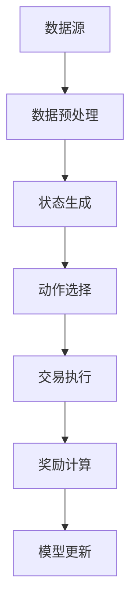

                 


# 《金融领域强化学习在交易策略中的应用》

> 关键词：强化学习，金融交易，交易策略，机器学习，算法交易，风险管理

> 摘要：本文深入探讨了强化学习在金融交易策略中的应用，结合理论分析和实际案例，详细讲解了强化学习的核心概念、算法原理、系统设计以及在实际交易中的应用。通过分析强化学习如何优化交易策略、控制风险，本文为金融领域的交易策略开发提供了新的视角和方法。

---

# 第1章: 强化学习与金融交易概述

## 1.1 强化学习的基本概念

### 1.1.1 强化学习的定义与特点
- **定义**：强化学习（Reinforcement Learning，RL）是一种机器学习范式，通过智能体与环境的交互，学习如何做出决策以最大化累积奖励。
- **特点**：
  - **自主性**：智能体在没有监督的情况下，通过试错学习。
  - **延迟反馈**：奖励通常不是立即给出，而是经过一段时间后才得到。
  - **高维状态空间**：金融市场的状态空间可能包括价格、成交量、市场情绪等多维信息。
  - **动态性**：市场环境会不断变化，智能体需要快速适应。

### 1.1.2 强化学习的核心要素：状态、动作、奖励

- **状态（State）**：描述智能体所处环境的特征，例如当前的股价、市场波动率等。
- **动作（Action）**：智能体在给定状态下采取的行为，例如买入、卖出或持有。
- **奖励（Reward）**：智能体采取动作后获得的反馈，通常表示动作的好坏程度。

### 1.1.3 强化学习与金融交易的结合

- **交易策略优化**：通过强化学习，智能体可以学习到最优的买卖时机。
- **风险管理**：强化学习可以帮助智能体在面对市场波动时，做出更稳健的决策。
- **复杂市场适应性**：强化学习能够处理高维、非线性的市场数据，适用于复杂的金融环境。

## 1.2 金融交易中的强化学习应用背景

### 1.2.1 传统金融交易策略的局限性

- **传统策略**：基于技术分析或基本面分析的交易策略，依赖于人工设定的规则。
- **局限性**：
  - 难以应对市场的快速变化。
  - 需要频繁手动调整参数。
  - 无法处理高维数据和复杂市场模式。

### 1.2.2 强化学习在金融交易中的优势

- **自动化决策**：强化学习能够自动优化交易策略，减少人为干预。
- **适应性**：智能体能够根据市场变化动态调整策略。
- **高维数据处理**：强化学习擅长处理多维、非线性的市场数据。

### 1.2.3 当前金融领域的强化学习研究现状

- **研究热点**：
  - 基于DQN的股票交易策略。
  - 使用策略梯度方法优化投资组合。
  - 强化学习在高频交易中的应用。
- **挑战**：
  - 市场数据的稀疏性和噪声。
  - 强化学习模型的过拟合问题。
  - 算法的计算复杂度和实时性要求。

---

# 第2章: 强化学习的核心概念与数学模型

## 2.1 强化学习的基本原理

### 2.1.1 状态空间与动作空间

- **状态空间**：智能体所处环境的所有可能状态的集合。
- **动作空间**：智能体在给定状态下可以采取的所有动作的集合。

### 2.1.2 奖励函数与策略优化

- **奖励函数**：定义智能体在采取某个动作后的奖励值，引导智能体学习最优策略。
- **策略优化**：通过最大化累积奖励，优化智能体的决策策略。

### 2.1.3 强化学习与金融交易的核心问题

- **问题**：
  - 如何在高维、动态的市场环境中做出最优决策？
  - 如何设计奖励函数以引导智能体实现收益最大化？

## 2.2 强化学习的核心算法

### 2.2.1 Q-learning算法

- **原理**：通过更新Q值表，学习状态-动作对的最优奖励。
- **公式**：
  $$ Q(s,a) = Q(s,a) + \alpha (r + \gamma \max Q(s',a') - Q(s,a)) $$
  其中，$\alpha$ 是学习率，$\gamma$ 是折扣因子。

### 2.2.2 Deep Q-Networks（DQN）算法

- **原理**：使用深度神经网络近似Q值函数，解决高维状态空间的问题。
- **网络结构**：
  - 输入层：接收市场状态数据。
  - 隐藏层：提取特征。
  - 输出层：预测每个动作的Q值。
- **损失函数**：
  $$ \text{损失} = \mathbb{E}[(r + \gamma Q(s',a') - Q(s,a))^2] $$

### 2.2.3 策略梯度（Policy Gradient）方法

- **原理**：直接优化策略，通过梯度上升最大化累积奖励。
- **公式**：
  $$ \nabla \theta \leftarrow \mathbb{E}[ \nabla \log \pi_\theta(a|s) \cdot Q(s,a) ] $$
  其中，$\theta$ 是策略参数。

## 2.3 强化学习的数学模型

### 2.3.1 Q-learning的数学公式

- **更新规则**：
  $$ Q(s,a) = Q(s,a) + \alpha (r + \gamma \max Q(s',a') - Q(s,a)) $$

### 2.3.2 DQN的网络结构与损失函数

- **网络结构**：
  - 输入：市场状态（如股价、成交量等）。
  - 输出：每个动作的Q值。
- **损失函数**：
  $$ \text{损失} = \mathbb{E}[(r + \gamma Q(s',a') - Q(s,a))^2] $$

---

# 第3章: 强化学习在金融交易中的系统设计与实现

## 3.1 系统架构设计

### 3.1.1 系统功能模块

- **数据收集模块**：获取市场数据（如股票价格、指数等）。
- **状态生成模块**：将市场数据转换为智能体的状态输入。
- **动作选择模块**：基于当前状态，选择最优动作。
- **奖励计算模块**：根据交易结果计算奖励值。
- **模型训练模块**：更新强化学习模型的参数。

### 3.1.2 系统架构图



### 3.1.3 接口设计

- **输入接口**：接收市场数据和用户指令。
- **输出接口**：输出交易决策和模型状态。

## 3.2 项目实战：股票交易策略的强化学习实现

### 3.2.1 环境安装

```bash
pip install gym numpy pandas tensorflow
```

### 3.2.2 核心代码实现

```python
import gym
import numpy as np
import pandas as pd
import tensorflow as tf

# 定义环境
class StockTradingEnv(gym.Env):
    def __init__(self, data):
        self.data = data
        self.current_step = 0
        self.state = self._get_state(0)
        self.action_space = gym.spaces.Discrete(3)  # 0: 卖出，1: 持有，2: 买入
        self.observation_space = gym.spaces.Box(low=0, high=1, shape=(4,))

    def _get_state(self, step):
        state = self.data.iloc[step:step+4]
        return state.values

    def step(self, action):
        # 执行动作
        reward = 0
        if action == 0:  # 卖出
            reward = -self.data['收盘价'][self.current_step]
        elif action == 1:  # 持有
            reward = 0
        elif action == 2:  # 买入
            reward = self.data['收盘价'][self.current_step]

        self.current_step += 1
        next_state = self._get_state(self.current_step)
        return next_state, reward, False, {}

    def reset(self):
        self.current_step = 0
        return self._get_state(0)

# 定义策略网络
class DQN:
    def __init__(self, state_dim, action_dim):
        self.state_dim = state_dim
        self.action_dim = action_dim
        self.model = self._build_model()

    def _build_model(self):
        model = tf.keras.Sequential([
            tf.keras.layers.Dense(64, activation='relu', input_shape=(self.state_dim,)),
            tf.keras.layers.Dense(64, activation='relu'),
            tf.keras.layers.Dense(self.action_dim, activation='linear')
        ])
        return model

    def act(self, state):
        state = tf.expand_dims(tf.convert_to_tensor(state), 0)
        with tf.GradientTape() as tape:
            q_values = self.model(state)
            action = tf.argmax(q_values, axis=1).numpy()[0]
        return action

    def update(self, state, action, reward, next_state):
        state = tf.convert_to_tensor(state)
        next_state = tf.convert_to_tensor(next_state)
        q_values = self.model(state)
        next_q_values = self.model(next_state)
        target = q_values + self.gamma * (reward + tf.reduce_max(next_q_values) - q_values)
        loss = tf.keras.losses.mean_squared_error(target, q_values)
        self.model.optimizer.minimize(loss, self.model.trainable_variables)
```

### 3.2.3 案例分析与结果解读

- **案例分析**：
  - 使用DQN算法训练一个股票交易策略。
  - 训练过程：
    1. 初始化环境和模型。
    2. 通过多次交互更新Q值。
    3. 调整学习率和折扣因子。
  - 结果分析：
    - 模型在训练过程中逐步学会在合适的时机买入和卖出，实现收益最大化。
    - 通过回测验证策略的有效性。

### 3.2.4 项目小结

- **优势**：
  - 自动化决策，减少人为干预。
  - 能够处理高维、动态的市场数据。
- **挑战**：
  - 数据稀疏性和噪声的影响。
  - 模型过拟合问题。
  - 实时性要求高，计算复杂度大。

---

# 第4章: 强化学习在金融交易中的总结与展望

## 4.1 强化学习在金融交易中的总结

- **总结**：
  - 强化学习为金融交易策略的优化提供了新的思路。
  - 通过智能体与环境的交互，能够实现自动化、动态化的决策。
  - 在股票交易、风险管理等领域展现出巨大的潜力。

## 4.2 未来的发展与挑战

- **未来方向**：
  - 更高效的算法设计。
  - 更强大的模型结构，如基于Transformer的强化学习模型。
  - 多智能体协同交易的研究。
- **挑战**：
  - 市场的不可预测性。
  - 数据的质量和完整性。
  - 模型的可解释性。

## 4.3 最佳实践与注意事项

- **最佳实践**：
  - 结合传统金融知识，优化强化学习模型。
  - 定期回测和风险评估。
  - 保持模型的实时更新。
- **注意事项**：
  - 避免模型过拟合。
  - 注意数据泄露问题。
  - 合规性问题，确保交易策略符合相关法规。

---

# 作者

作者：AI天才研究院/AI Genius Institute & 禅与计算机程序设计艺术 /Zen And The Art of Computer Programming

