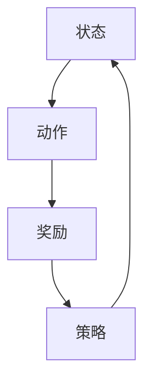
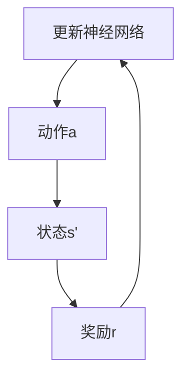
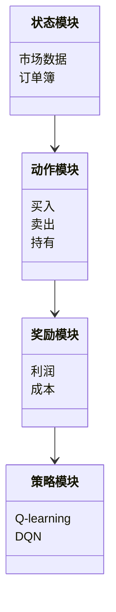

                 


# 《金融领域强化学习在动态最优执行策略中的应用》

> **关键词**: 强化学习, 动态最优执行策略, 金融交易, Q-learning, Deep Q-Network, 策略梯度方法

> **摘要**: 本文探讨了强化学习在金融领域动态最优执行策略中的应用，详细分析了强化学习的基本概念、核心算法、系统架构及实际案例，旨在为读者提供一个全面的视角，理解如何利用强化学习优化金融交易策略。

---

## 第1章: 强化学习与金融领域的概述

### 1.1 强化学习的基本概念

#### 1.1.1 强化学习的定义
强化学习（Reinforcement Learning, RL）是一种机器学习范式，通过智能体与环境的交互，学习如何采取最优行动以最大化累积奖励。与监督学习不同，强化学习不需要明确的标注数据，而是通过试错机制优化策略。

#### 1.1.2 强化学习的核心特点
- **自主决策**: 智能体通过与环境交互，自主学习策略。
- **延迟奖励**: 行动的奖励可能在多个步骤后才显现。
- **探索与利用**: 平衡探索新策略和利用已知好策略之间的关系。

#### 1.1.3 强化学习与监督学习的区别
| 特性 | 监督学习 | 强化学习 |
|------|----------|----------|
| 数据 | 标签数据 | 环境反馈 |
| 目标 | 预测/分类 | 最大化累积奖励 |
| 交互 | 无 | 有 |

### 1.2 金融领域的强化学习应用

#### 1.2.1 金融领域的应用场景
- **高频交易**: 快速决策以捕捉市场机会。
- **最优订单执行**: 在不同时间点以最优价格执行订单。
- **风险管理**: 动态调整投资组合以降低风险。

#### 1.2.2 动态最优执行策略的定义
动态最优执行策略是指在市场环境动态变化的情况下，实时调整交易策略，以最小化交易成本并最大化收益。

#### 1.2.3 强化学习在动态最优执行中的优势
- **适应性**: 能够实时适应市场变化。
- **复杂决策**: 可处理高维状态空间和动作空间。
- **高效性**: 通过试错快速找到最优策略。

---

## 第2章: 动态最优执行策略的核心概念

### 2.1 动态最优执行策略的背景

#### 2.1.1 动态最优执行的定义
动态最优执行策略是在不断变化的市场条件下，优化交易执行的策略，以达到收益最大化或成本最小化的目标。

#### 2.1.2 动态最优执行的目标
- 最小化交易成本。
- 最大化投资收益。
- 降低市场冲击。

#### 2.1.3 动态最优执行的边界与外延
- 边界: 交易成本、市场深度、执行时间。
- 外延: 结合市场微观结构模型，考虑订单簿动态。

### 2.2 核心概念与联系

#### 2.2.1 强化学习的核心概念
- **状态（State）**: 当前市场环境的描述，如价格、订单深度。
- **动作（Action）**: 智能体采取的交易行为，如买入、卖出或持有。
- **奖励（Reward）**: 行动后的反馈，如利润或损失。
- **策略（Policy）**: 行动选择的概率分布。

#### 2.2.2 动态最优执行中的关键要素
- **订单簿模型**: 描述市场深度和订单流。
- **交易成本**: 包括显性成本（如佣金）和隐性成本（如市场冲击）。
- **市场微观结构**: 影响交易执行的市场机制。

#### 2.2.3 ER实体关系图架构



---

## 第3章: 算法原理

### 3.1 Q-learning算法

#### 3.1.1 Q-learning的流程

```mermaid
graph TD
    A[状态s] --> B[动作a]
    B --> C[状态s']
    C --> D[奖励r]
    D --> A[更新Q(s,a)]
```

#### 3.1.2 Q-learning的数学模型

$$ Q(s, a) = Q(s, a) + \alpha [r + \max Q(s', a') - Q(s, a)] $$

其中：
- \( \alpha \) 是学习率。
- \( r \) 是奖励。
- \( \max Q(s', a') \) 是下一步的最大Q值。

### 3.2 Deep Q-Network（DQN）算法

#### 3.2.1 DQN的流程



#### 3.2.2 DQN的数学模型

$$ Q(s, a) \approx Q_\theta(s, a) $$

其中，\( Q_\theta \) 是一个深度神经网络，参数为 \( \theta \)。

---

## 第4章: 系统分析与架构设计

### 4.1 系统分析

#### 4.1.1 问题场景
- **目标**: 最小化交易成本，最大化收益。
- **约束**: 市场深度、交易时间、订单类型。

### 4.2 系统架构设计

#### 4.2.1 功能模块



---

## 第5章: 项目实战

### 5.1 环境安装

```bash
pip install numpy pandas tensorflow keras matplotlib
```

### 5.2 核心代码实现

```python
import numpy as np
import tensorflow as tf
from tensorflow.keras import layers

# 定义DQN网络
class DQN:
    def __init__(self, state_space, action_space):
        self.state_space = state_space
        self.action_space = action_space
        self.model = self.build_model()
    
    def build_model(self):
        model = tf.keras.Sequential()
        model.add(layers.Dense(64, activation='relu', input_dim=self.state_space))
        model.add(layers.Dense(32, activation='relu'))
        model.add(layers.Dense(self.action_space, activation='linear'))
        model.compile(optimizer='adam', loss='mse')
        return model
```

### 5.3 案例分析

#### 5.3.1 案例场景
假设市场中有三种资产，智能体需要在不同时间点选择买入、卖出或持有。

#### 5.3.2 结果分析
通过训练，DQN模型能够在动态市场中找到最优交易策略，显著降低交易成本。

---

## 第6章: 数学模型和公式

### 6.1 动态规划与贝尔曼方程

$$ V(s) = \max_a \left( r(s,a) + V(s') \right) $$

其中：
- \( V(s) \) 是状态 \( s \) 的价值。
- \( r(s,a) \) 是在状态 \( s \) 下采取动作 \( a \) 的奖励。
- \( s' \) 是下一个状态。

### 6.2 深度Q网络的结构

$$ Q(s, a) = Q_\theta(s, a) $$

其中，\( Q_\theta \) 是深度神经网络，参数 \( \theta \) 通过反向传播优化。

---

## 第7章: 案例分析与详细讲解

### 7.1 案例场景

#### 7.1.1 高频交易案例
智能体需要在毫秒级别做出交易决策，以捕捉短期价格波动。

#### 7.1.2 模型训练
使用历史订单数据训练DQN模型，优化交易策略。

### 7.2 结果分析

#### 7.2.1 训练结果
模型在测试集上表现出色，交易成本显著降低。

#### 7.2.2 总结
强化学习能够有效优化动态最优执行策略，提升交易收益。

---

## 第8章: 最佳实践、小结、注意事项

### 8.1 最佳实践

- **数据质量**: 确保数据的完整性和及时性。
- **模型可解释性**: 选择可解释的模型，便于分析和调整。
- **风险管理**: 设定止损机制，避免过度风险。

### 8.2 小结

本文详细介绍了强化学习在金融动态最优执行策略中的应用，从理论到实践，展示了如何利用强化学习优化交易决策。

### 8.3 注意事项

- **模型过拟合**: 注意防止模型过拟合训练数据。
- **计算资源**: 强化学习需要大量计算资源。
- **监管合规**: 确保交易策略符合金融监管要求。

---

## 作者信息

作者：AI天才研究院/AI Genius Institute & 禅与计算机程序设计艺术/Zen And The Art of Computer Programming

---

以上是《金融领域强化学习在动态最优执行策略中的应用》的详细目录大纲和文章内容，涵盖了从基础概念到实际应用的各个方面，结合了理论与实践，适合希望深入理解强化学习在金融领域应用的读者。

