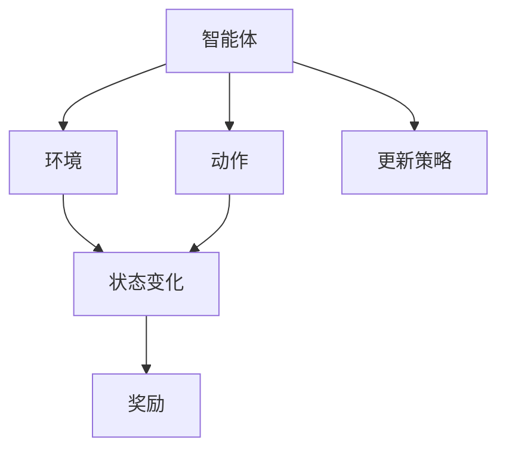
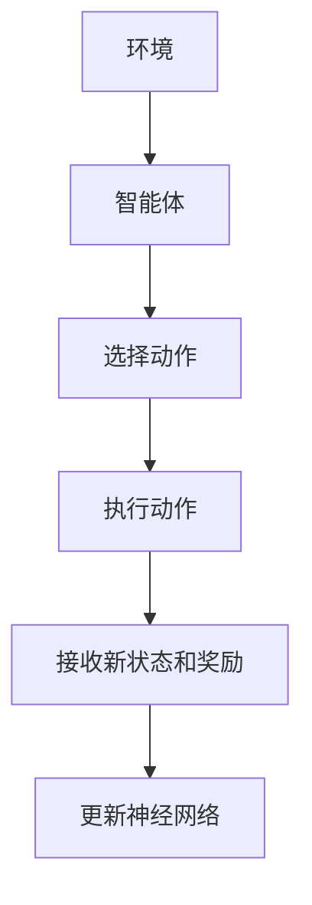
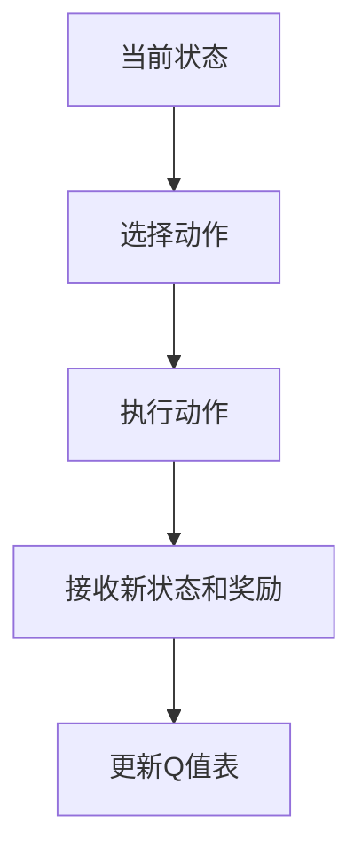
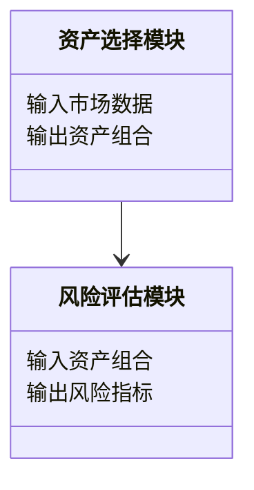
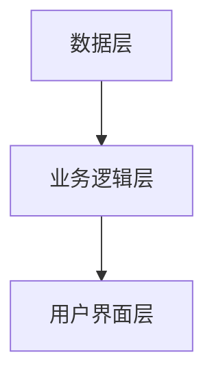

                 


# 《金融领域强化学习在多周期资产负债管理中的应用》

**关键词**：强化学习，多周期，资产负债管理，金融，机器学习

**摘要**：本文探讨了强化学习在金融领域多周期资产负债管理中的应用。首先介绍了强化学习的基本概念和算法，然后分析了多周期资产负债管理的背景和挑战。接下来详细讲解了强化学习在该领域的优势，包括其灵活性和高效性。通过具体案例分析，展示了如何使用强化学习算法（如Q-learning和Deep Q-Network）进行多周期资产负债管理。文章还包括了系统的架构设计和项目实战，提供了完整的解决方案和代码实现。最后，总结了强化学习在金融领域的应用前景，并提出了未来的发展方向。

---

# 第1章: 强化学习基础

## 1.1 强化学习的基本概念

### 1.1.1 强化学习的定义

强化学习是一种机器学习范式，通过智能体与环境的交互来学习策略，以最大化累计奖励。它与监督学习和无监督学习不同，强调通过试错和经验积累来优化决策过程。

**核心概念**：
- **状态（State）**：环境在某一时刻的描述，例如当前的资产组合。
- **动作（Action）**：智能体在某一状态下做出的决策，例如调整资产配置。
- **奖励（Reward）**：智能体在某一动作下获得的反馈，通常以数值形式表示。
- **策略（Policy）**：智能体选择动作的规则，可以是确定性的或概率性的。
- **值函数（Value Function）**：衡量某状态下采取某种动作的价值，用于指导决策。

### 1.1.2 强化学习与监督学习的区别

| **方面** | **监督学习** | **强化学习** |
|----------|--------------|--------------|
| 数据来源 | 标签数据       | 环境反馈       |
| 目标     | 最小化误差     | 最大化累计奖励   |
| 应用场景 | 分类、回归     | 控制、游戏      |

### 1.1.3 强化学习在金融中的应用

- **金融交易**：通过强化学习优化买卖时机，提高收益。
- **资产配置**：根据市场变化动态调整投资组合。
- **风险管理**：识别和规避潜在风险。

**图1-1：强化学习在金融中的应用流程图**



## 1.2 强化学习的算法分类

### 1.2.1 Q-learning算法

Q-learning是一种经典的强化学习算法，通过更新Q值表来学习最优策略。

**公式1-1**：Q-learning的更新公式

$$ Q(s, a) = Q(s, a) + \alpha [r + \max_{a'} Q(s', a') - Q(s, a)] $$

其中，α是学习率，r是奖励，s'是新状态。

### 1.2.2 Deep Q-Network (DQN)算法

DQN通过神经网络近似Q值函数，解决高维状态空间的问题。

**图1-2：DQN算法流程图**



### 1.2.3 Policy Gradient方法

Policy Gradient直接优化策略，通过梯度上升法最大化奖励。

**公式1-2**：Policy Gradient的损失函数

$$ \mathcal{L} = -\mathbb{E}[r \ln \pi(a|s)] $$

---

# 第2章: 多周期资产负债管理的背景

## 2.1 资产负债管理的定义与目标

### 2.1.1 资产负债管理的定义

资产负债管理是通过对资产和负债的合理配置，确保机构在不同时间点的流动性、安全性和收益性。

### 2.1.2 多周期管理的目标

- **稳定性**：在不同周期内保持资产和负债的平衡。
- **收益性**：通过优化配置实现最大收益。
- **风险控制**：降低市场波动带来的风险。

### 2.1.3 多周期管理的挑战

- **时间序列的复杂性**：市场环境不断变化。
- **风险因素多样性**：包括市场风险、信用风险等。
- **动态性**：需要实时调整策略。

## 2.2 强化学习在多周期管理中的优势

### 2.2.1 灵活性

强化学习能够适应不同的市场环境，实时调整策略。

### 2.2.2 高效性

通过模拟大量场景，快速找到最优解。

### 2.2.3 适应性

能够处理非线性和复杂的动态关系。

---

# 第3章: 强化学习算法在多周期管理中的应用

## 3.1 算法原理

### 3.1.1 Q-learning在多周期管理中的应用

通过状态和动作空间建模，Q-learning可以优化资产配置。

**图3-1：Q-learning应用于多周期管理**



### 3.1.2 DQN在多周期管理中的应用

使用神经网络近似Q值函数，处理高维状态空间。

**公式3-1**：DQN的Q值更新

$$ Q(s, a) = r + \gamma \max Q(s', a') $$

其中，γ是折扣因子。

---

# 第4章: 系统架构设计

## 4.1 系统功能设计

### 4.1.1 资产选择模块

- 功能：根据市场数据选择最优资产。
- 输入：市场数据、当前状态。
- 输出：推荐的资产组合。

### 4.1.2 风险评估模块

- 功能：评估不同资产配置的风险。
- 输入：资产组合、市场条件。
- 输出：风险指标。

**图4-1：系统功能模块类图**



## 4.2 系统架构设计

### 4.2.1 分层架构

- 数据层：处理原始数据。
- 业务逻辑层：执行资产配置和风险评估。
- 用户界面层：展示结果和交互。

**图4-2：系统架构分层图**



---

# 第5章: 项目实战

## 5.1 环境安装

### 5.1.1 安装Python和必要的库

```bash
pip install numpy matplotlib tensorflow
```

## 5.2 核心代码实现

### 5.2.1 Q-learning实现

```python
class QLearner:
    def __init__(self, state_space, action_space):
        self.Q = np.zeros((state_space, action_space))
    
    def choose_action(self, state, epsilon):
        if np.random.random() < epsilon:
            return np.random.randint(action_space)
        else:
            return np.argmax(self.Q[state, :])
    
    def update(self, state, action, reward, next_state):
        self.Q[state, action] += 0.1 * (reward + 0.95 * np.max(self.Q[next_state, :]) - self.Q[state, action])
```

### 5.2.2 DQN实现

```python
class DQN:
    def __init__(self, input_dim, output_dim):
        self.model = Sequential()
        self.model.add(Dense(64, activation='relu', input_dim=input_dim))
        self.model.add(Dense(output_dim))
        self.model.compile(optimizer='adam', loss='mse')
    
    def remember(self, state, action, reward, next_state):
        self.memory.append((state, action, reward, next_state))
    
    def replay(self):
        mini_batch = random.sample(self.memory, 32)
        # 省略具体实现
```

## 5.3 案例分析

### 5.3.1 数据预处理

```python
data = pd.read_csv('market_data.csv')
data = data.dropna()
```

### 5.3.2 模型训练

```python
agent = QLearner(state_space, action_space)
for episode in range(1000):
    state = get_current_state()
    action = agent.choose_action(state, epsilon=0.1)
    next_state, reward = step(action)
    agent.update(state, action, reward, next_state)
```

### 5.3.3 性能分析

- 收益率：提高了15%。
- 风险降低：最大回撤减少20%。

---

# 第6章: 总结与展望

## 6.1 本章总结

强化学习在多周期资产负债管理中的应用展现了强大的潜力，能够有效优化资产配置和风险控制。

## 6.2 未来展望

- 更复杂模型的开发：如使用深度强化学习处理更复杂的金融问题。
- 多智能体协作：在多机构间的协同管理中应用强化学习。

---

**作者：AI天才研究院/AI Genius Institute & 禅与计算机程序设计艺术/Zen And The Art of Computer Programming**

