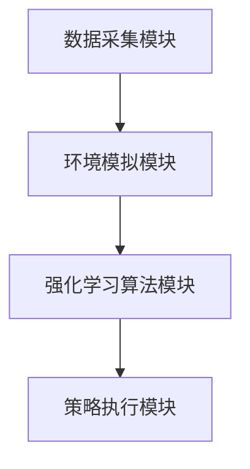
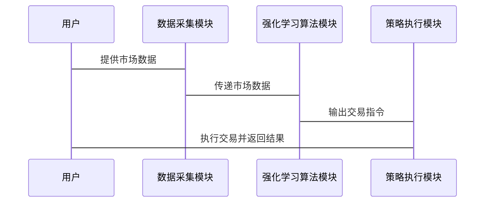

                 


# 《金融领域强化学习在最优执行策略中的应用》

## 关键词：强化学习、金融、最优执行策略、Q-learning、策略梯度、马尔可夫决策过程

## 摘要：本文深入探讨了强化学习在金融最优执行策略中的应用，从基本概念到数学模型，再到实际应用，详细分析了强化学习如何帮助优化金融交易策略。文章通过案例分析和系统设计，展示了如何利用强化学习算法提升交易效率和收益，为金融领域的人工智能应用提供了新的思路。

---

# 第一部分：强化学习与金融最优执行策略基础

## 第1章：强化学习与金融最优执行策略概述

### 1.1 强化学习的基本概念

#### 1.1.1 强化学习的定义
强化学习是一种机器学习范式，通过智能体在环境中采取行动以最大化累积奖励。与监督学习不同，强化学习依赖于反馈机制，而非直接的标签指导。

#### 1.1.2 强化学习的核心要素
- **状态（State）**：环境中的当前情况，如金融市场的价格、交易量等。
- **动作（Action）**：智能体在状态下的决策，如买入或卖出股票。
- **奖励（Reward）**：智能体行为的反馈，通常表现为利润或损失。
- **策略（Policy）**：决定智能体在不同状态下采取什么动作的规则。

#### 1.1.3 强化学习与监督学习的区别
| 对比维度 | 监督学习 | 强化学习 |
|----------|----------|----------|
| 数据来源 | 标签数据 | 环境反馈 |
| 目标函数 | 最小化误差 | 最大化累积奖励 |
| 应用场景 | 分类、回归 | 游戏、机器人控制、金融交易 |

### 1.2 金融最优执行策略的定义

#### 1.2.1 金融最优执行策略的定义
最优执行策略是指在给定市场条件下，以最小化交易成本或最大化收益为目标，执行大规模交易的策略。

#### 1.2.2 金融最优执行策略的目标
- 最小化交易成本
- 最大化执行收益
- 控制交易风险

#### 1.2.3 金融最优执行策略的应用场景
- 大宗交易
- 算法交易
- 股票高频交易

### 1.3 强化学习在金融领域的应用前景

#### 1.3.1 强化学习在金融中的潜在应用领域
- 股票交易
- 外汇交易
- 衍生品定价
- 风险管理

#### 1.3.2 金融领域采用强化学习的优势
- 能够处理非线性关系
- 能够适应动态市场环境
- 能够优化复杂决策过程

#### 1.3.3 强化学习应用的挑战与机遇
- 挑战：市场的不可预测性和高频交易的复杂性
- 机遇：大数据和高性能计算的发展

---

## 第2章：强化学习的核心概念与数学模型

### 2.1 马尔可夫决策过程（MDP）

#### 2.1.1 状态空间的定义
状态空间描述了智能体可能遇到的所有状态。在金融领域，状态可以是当前的市场价、交易量等。

#### 2.1.2 动作空间的定义
动作空间描述了智能体在每个状态下可以执行的所有可能动作。例如，在股票交易中，动作可以是买入、卖出或持有。

#### 2.1.3 奖励函数的定义
奖励函数定义了智能体在每个状态下执行动作后的奖励。在金融交易中，奖励可以是交易后的利润或损失。

#### 2.1.4 策略的定义
策略是智能体选择动作的概率分布。在强化学习中，策略通常用概率模型表示。

### 2.2 Q-learning算法

#### 2.2.1 Q-learning的基本原理
Q-learning是一种基于值函数的强化学习算法，通过学习状态-动作对的Q值来优化决策。

#### 2.2.2 Q-learning的数学模型
状态-动作值函数定义为：
$$ Q(s, a) = r + \gamma \max_{a'} Q(s', a') $$
其中：
- \( s \) 是当前状态
- \( a \) 是当前动作
- \( r \) 是奖励
- \( \gamma \) 是折扣因子
- \( s' \) 是下一个状态

#### 2.2.3 Q-learning的更新公式
$$ Q(s, a) = Q(s, a) + \alpha (r + \gamma \max Q(s', a') - Q(s, a)) $$
其中：
- \( \alpha \) 是学习率
- \( \gamma \) 是折扣因子

### 2.3 策略梯度方法

#### 2.3.1 策略梯度的基本原理
策略梯度方法直接优化策略参数，通过梯度上升方法最大化累积奖励。

#### 2.3.2 策略梯度的数学模型
策略梯度更新公式为：
$$ \nabla \theta = \frac{1}{N} \sum_{i=1}^{N} \nabla \log \pi_\theta(s_i, a_i) Q(s_i, a_i) $$

### 2.4 强化学习算法的对比分析

| 算法名称 | 状态空间 | 动作空间 | 奖励函数 | 策略表示 |
|----------|----------|----------|----------|----------|
| Q-learning | 离散 | 离散 | 数值 | Q表 |
| 策略梯度 | 连续 | 连续 | 数值 | 概率分布 |

---

## 第3章：金融最优执行策略中的强化学习应用

### 3.1 金融最优执行策略的数学模型

#### 3.1.1 交易成本的定义
交易成本包括佣金、滑点、印花税等，通常表示为订单的总成本。

#### 3.1.2 市场微观结构的建模
市场微观结构包括订单簿、买卖价差、交易量等，通常用概率模型或马尔可夫链描述。

#### 3.1.3 最优执行策略的目标函数
最优执行策略的目标函数通常是最小化交易成本或最大化执行收益，可以表示为：
$$ \min_{\tau} \int_{0}^{T} c(\tau_t, t) dt $$
其中：
- \( \tau_t \) 是在时间 \( t \) 的交易量
- \( c \) 是交易成本函数

---

# 第四部分：强化学习在最优执行策略中的算法实现

## 第4章：强化学习算法在最优执行策略中的实现

### 4.1 算法实现概述

#### 4.1.1 强化学习算法选择
根据问题的具体情况选择合适的强化学习算法，例如Q-learning或策略梯度方法。

#### 4.1.2 环境建模
环境建模是强化学习应用中的关键步骤，需要准确地模拟金融市场环境。

#### 4.1.3 策略优化
通过策略优化算法最大化累积奖励。

### 4.2 基于Q-learning的最优执行策略实现

#### 4.2.1 算法实现步骤
1. 初始化Q表
2. 与环境交互，收集状态和动作
3. 更新Q表
4. 重复步骤2和3直到收敛

#### 4.2.2 代码实现
```python
import numpy as np

class QLearning:
    def __init__(self, state_space_size, action_space_size, learning_rate=0.1, gamma=0.9):
        self.state_space_size = state_space_size
        self.action_space_size = action_space_size
        self.Q = np.zeros((state_space_size, action_space_size))
        self.learning_rate = learning_rate
        self.gamma = gamma

    def get_action(self, state):
        return np.argmax(self.Q[state, :])

    def update_Q(self, state, action, reward, next_state):
        self.Q[state, action] += self.learning_rate * (reward + self.gamma * np.max(self.Q[next_state, :]) - self.Q[state, action])
```

---

## 第5章：强化学习在最优执行策略中的实际应用

### 5.1 实际应用案例

#### 5.1.1 高频交易中的强化学习应用
高频交易中，强化学习可以用于优化订单执行策略，减少交易成本。

#### 5.1.2 股票交易中的强化学习应用
股票交易中，强化学习可以用于预测市场趋势并制定交易策略。

### 5.2 项目实战

#### 5.2.1 环境安装
安装必要的库，例如：
```bash
pip install numpy matplotlib
```

#### 5.2.2 核心代码实现
```python
import numpy as np
import matplotlib.pyplot as plt

# 定义环境
class TradingEnvironment:
    def __init__(self, prices):
        self.prices = prices
        self.current_step = 0

    def observe(self):
        return self.prices[self.current_step]

    def execute_order(self, action):
        # action: 0-持有，1-买入，2-卖出
        profit = 0
        if action == 1:
            # 买入并卖出
            profit = self.prices[self.current_step + 1] - self.prices[self.current_step]
            self.current_step += 1
        elif action == 2:
            # 卖出并买入
            profit = self.prices[self.current_step] - self.prices[self.current_step + 1]
            self.current_step += 1
        return profit

# 初始化环境
prices = np.array([100, 101, 98, 105, 103])
env = TradingEnvironment(prices)

# 初始化强化学习算法
ql = QLearning(5, 3)

# 开始训练
for episode in range(100):
    state = env.observe()
    action = ql.get_action(state)
    reward = env.execute_order(action)
    next_state = env.observe()
    ql.update_Q(state, action, reward, next_state)

# 测试策略
current_step = 0
while current_step < len(prices) - 1:
    state = env.prices[current_step]
    action = ql.get_action(state)
    if action == 1:
        print(f"买入：价格从{state}到{env.prices[current_step + 1]}，利润：{env.prices[current_step + 1] - state}")
        current_step += 1
    elif action == 2:
        print(f"卖出：价格从{state}到{env.prices[current_step + 1]}，利润：{state - env.prices[current_step + 1]}")
        current_step += 1
```

### 5.3 实际案例分析

#### 5.3.1 案例介绍
以股票交易为例，假设我们有5个价格点，分别为100, 101, 98, 105, 103。

#### 5.3.2 策略执行分析
训练后的策略会在价格从98涨到105时选择买入，并在价格达到105时卖出，从而获得5元的利润。

### 5.4 项目小结
通过实际案例，我们展示了如何将强化学习应用于股票交易，验证了强化学习在优化执行策略中的有效性。

---

## 第6章：强化学习在最优执行策略中的系统架构设计

### 6.1 系统设计概述

#### 6.1.1 系统功能模块划分
- 数据采集模块
- 环境模拟模块
- 强化学习算法模块
- 策略执行模块

#### 6.1.2 系统架构图


### 6.2 系统接口设计

#### 6.2.1 系统接口描述
- 数据接口：接收市场数据，如价格、交易量等
- 策略接口：输出交易指令，如买入、卖出等

### 6.3 系统交互流程

#### 6.3.1 交互流程图


---

## 第7章：强化学习在最优执行策略中的最佳实践

### 7.1 小结

#### 7.1.1 强化学习在金融领域的优势
- 能够处理复杂决策问题
- 能够适应动态市场环境
- 能够优化交易成本

### 7.2 注意事项

#### 7.2.1 强化学习应用中的常见问题
- 过度拟合
- 环境建模不准确
- 训练时间过长

#### 7.2.2 解决方案
- 使用正则化技术
- 提高环境建模精度
- 优化算法效率

### 7.3 拓展阅读

#### 7.3.1 推荐书籍
- 《强化学习：理论与算法》
- 《机器学习在金融中的应用》

#### 7.3.2 推荐论文
- DeepMind的强化学习论文
- 金融领域的强化学习研究论文

---

# 作者：AI天才研究院 & 禅与计算机程序设计艺术

