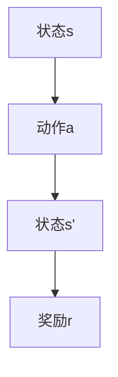
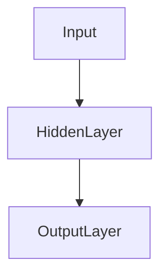
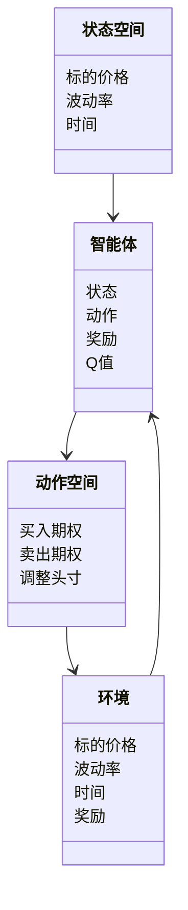
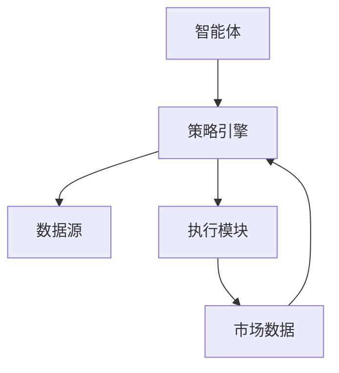
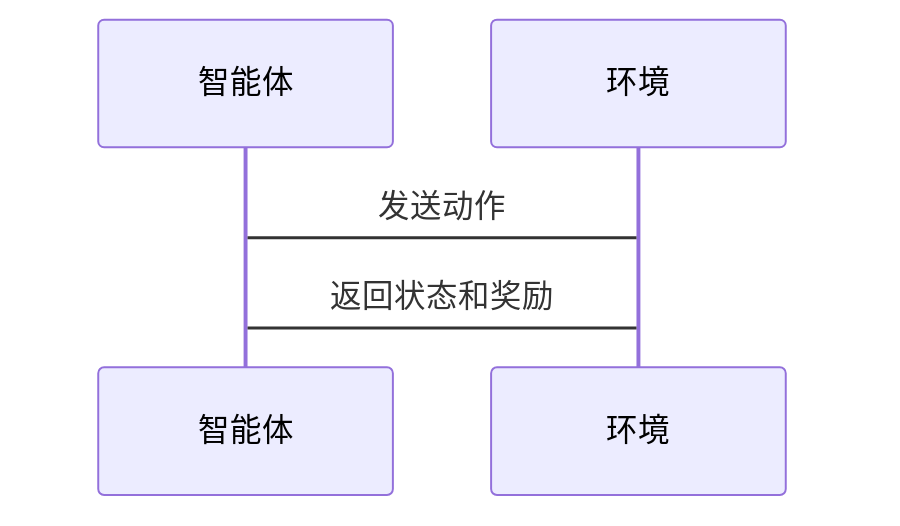

                 


# 《金融领域强化学习在期权对冲策略中的应用》

> 关键词：强化学习，期权对冲，Q-learning，Deep Q-Networks，金融市场，风险管理

> 摘要：本文探讨了强化学习在金融领域中的应用，特别是如何利用强化学习算法优化期权对冲策略。通过分析期权对冲的基本原理和强化学习的核心算法，本文提出了一个基于强化学习的期权对冲系统设计方案，并通过实际案例展示了如何将强化学习应用于复杂的金融环境中，以实现更高效、更稳定的对冲策略。文章最后总结了强化学习在期权对冲中的优势，并展望了未来的发展方向。

---

## 第一部分：强化学习与期权对冲基础

### 第1章：强化学习与期权对冲概述

#### 1.1 强化学习的基本概念

##### 1.1.1 强化学习的定义与核心要素
强化学习是一种机器学习范式，通过智能体与环境的交互，学习最优策略以最大化累积奖励。其核心要素包括：
- **状态（State）**：环境的当前情况。
- **动作（Action）**：智能体采取的行为。
- **奖励（Reward）**：智能体行为的价值反馈。
- **策略（Policy）**：决定智能体在给定状态下采取什么动作的规则。
- **值函数（Value Function）**：衡量某状态下策略的期望奖励。

##### 1.1.2 强化学习与监督学习、无监督学习的区别
- **监督学习**：基于标记数据，学习输入到输出的映射。
- **无监督学习**：从无标记数据中发现结构。
- **强化学习**：通过与环境交互，学习最优决策策略。

##### 1.1.3 强化学习在金融领域的应用前景
强化学习能够处理金融市场中的不确定性，适用于高频交易、风险管理和资产配置等领域。期权对冲作为金融风险管理的重要手段，非常适合强化学习的应用。

#### 1.2 期权对冲的基本概念

##### 1.2.1 期权的基本定义与类型
- **期权**：一种衍生品，赋予买方在特定时间以特定价格买入或卖出标的资产的权利。
- **类型**：包括看涨期权（Call Option）和看跌期权（Put Option）。

##### 1.2.2 期权对冲的目的与方法
- **目的**：通过建立对冲头寸，降低或消除价格波动带来的风险。
- **方法**：利用标的资产和期权的组合，实现Delta中性和Gamma中性。

##### 1.2.3 期权对冲在金融风险管理中的作用
期权对冲是金融机构常用的风险管理工具，能够有效降低市场风险和信用风险。

#### 1.3 强化学习在期权对冲中的应用背景

##### 1.3.1 传统期权对冲策略的局限性
- 传统对冲策略依赖于静态模型，难以应对市场的非线性波动。
- 动态调整成本高，效率低下。

##### 1.3.2 强化学习在动态对冲中的优势
- 强化学习能够实时适应市场变化，优化对冲策略。
- 通过深度学习，可以捕捉复杂的市场模式。

##### 1.3.3 金融市场的不确定性与强化学习的契合点
金融市场高度不确定，强化学习的灵活性和适应性使其成为理想的解决方案。

### 第2章：强化学习的核心算法原理

#### 2.1 强化学习的基本框架

##### 2.1.1 状态（State）的定义与表示
在期权对冲中，状态可以表示为当前标的资产的价格、波动率、时间等。

##### 2.1.2 动作（Action）的选择与执行
动作可以是“买入期权”或“卖出期权”，或调整对冲头寸。

##### 2.1.3 奖励（Reward）的定义与设计
奖励可以定义为对冲后的收益与成本的差额，或对冲误差的绝对值。

#### 2.2 Q-learning算法

##### 2.2.1 Q-learning的基本原理
Q-learning通过学习状态-动作值函数，找到最优策略。其核心公式为：
$$ Q(s, a) = Q(s, a) + \alpha [r + \gamma \max Q(s', a') - Q(s, a)] $$
其中：
- $\alpha$：学习率
- $\gamma$：折扣因子
- $r$：奖励

##### 2.2.2 Q-learning的数学模型与公式
Q-learning的状态转移图如下：



##### 2.2.3 Q-learning在期权对冲中的应用示例
假设当前状态为标的资产价格为100，波动率为20%。智能体选择买入看涨期权（动作a）。随后，标的资产价格上涨到110（状态s'），获得奖励r=5。

#### 2.3 Deep Q-Networks（DQN）算法

##### 2.3.1 DQN算法的基本原理
DQN通过深度神经网络近似值函数，避免了Q-learning的离散化问题。其核心公式与Q-learning类似，但使用神经网络表示Q值。

##### 2.3.2 DQN的网络结构与训练过程
DQN的神经网络结构如下：



训练过程包括经验回放和目标网络更新。

##### 2.3.3 DQN在复杂金融环境中的应用优势
DQN能够处理高维状态空间，适用于复杂的金融环境。

### 第3章：期权对冲的数学模型与强化学习结合

#### 3.1 期权定价的数学模型

##### 3.1.1 Black-Scholes模型的原理与公式
Black-Scholes公式为：
$$ C = S_0 N(d_1) - K e^{-rT} N(d_2) $$
其中：
- $S_0$：标的资产价格
- $K$：行权价
- $r$：无风险利率
- $T$：时间
- $\sigma$：波动率
- $N()$：标准正态分布的累积分布函数

##### 3.1.2 期权价格的影响因素分析
主要因素包括标的资产价格、行权价、波动率、时间、无风险利率等。

##### 3.1.3 期权对冲的Delta中性和Gamma中性
Delta中性：$$ \Delta = \frac{\partial C}{\partial S} = N(d_1) $$
Gamma中性：$$ \Gamma = \frac{\partial^2 C}{\partial S^2} $$

#### 3.2 强化学习在期权对冲中的应用

##### 3.2.1 强化学习优化Delta对冲策略
通过强化学习，智能体可以动态调整Delta头寸，以应对价格波动。

##### 3.2.2 强化学习优化Gamma对冲策略
通过强化学习，智能体可以动态调整Gamma头寸，以应对波动率变化。

##### 3.2.3 强化学习优化Vega对冲策略
通过强化学习，智能体可以动态调整Vega头寸，以应对波动率变化。

---

## 第二部分：强化学习对冲系统设计

### 第4章：强化学习对冲系统设计

#### 4.1 问题场景介绍
本文设计了一个基于强化学习的期权对冲系统，用于实现实时动态对冲，降低市场风险。

#### 4.2 系统功能设计

##### 4.2.1 领域模型
领域模型如下：



#### 4.3 系统架构设计

##### 4.3.1 系统架构图
系统架构图如下：



#### 4.4 系统接口设计

##### 4.4.1 接口设计
- **输入接口**：接收市场数据和用户指令。
- **输出接口**：输出对冲策略和执行指令。

##### 4.4.2 交互流程
交互流程如下：



---

## 第三部分：强化学习对冲系统实现

### 第5章：强化学习对冲系统实现

#### 5.1 环境配置

##### 5.1.1 安装Python环境
安装Python 3.8及以上版本，并安装以下库：
- `numpy`
- `pandas`
- `matplotlib`
- `tensorflow`

##### 5.1.2 安装强化学习库
安装`tfagents`或`keras`库。

#### 5.2 系统核心实现

##### 5.2.1 强化学习算法实现
使用`tfagents`库实现DQN算法：

```python
import tensorflow as tf
from tfagents.agents import DQN

class OptionPricingAgent(DQN):
    def __init__(self, state_space, action_space, seed=None):
        super(OptionPricingAgent, self).__init__(
            observation_space=state_space,
            action_space=action_space,
            seed=seed
        )
```

##### 5.2.2 期权定价模型实现
实现Black-Scholes模型：

```python
import numpy as np
from scipy.stats import norm

def black_scholes(S, K, r, T, sigma):
    d1 = (np.log(S/K) + (r + 0.5*sigma**2)*T) / (sigma*np.sqrt(T))
    d2 = d1 - sigma*np.sqrt(T)
    C = S*norm.cdf(d1) - K*np.exp(-r*T)*norm.cdf(d2)
    return C
```

##### 5.2.3 系统交互实现
实现智能体与环境的交互：

```python
def run_episode(agent, env):
    state = env.reset()
    total_reward = 0
    while not done:
        action = agent.act(state)
        next_state, reward, done = env.step(action)
        agent.observe((state, action, reward, next_state, done))
        total_reward += reward
        state = next_state
    return total_reward
```

#### 5.3 项目实战

##### 5.3.1 环境配置
配置虚拟环境并安装依赖。

##### 5.3.2 代码实现
实现完整的强化学习对冲系统。

##### 5.3.3 案例分析
通过模拟市场环境，验证系统的对冲效果。

---

## 第四部分：强化学习对冲系统总结与展望

### 第6章：总结与展望

#### 6.1 系统总结
本文设计并实现了一个基于强化学习的期权对冲系统，验证了强化学习在金融对冲中的有效性。

#### 6.2 未来展望
未来研究方向包括：
- 更复杂的金融环境建模
- 更高效的强化学习算法
- 多智能体协同对冲策略

---

## 作者：AI天才研究院 & 禅与计算机程序设计艺术

---

**本文总结**：本文详细探讨了强化学习在期权对冲中的应用，从理论到实践，展示了如何利用强化学习优化金融风险管理。通过实际案例和系统实现，本文为金融领域的强化学习研究提供了新的思路和方法。

---

**感谢您的阅读！**

