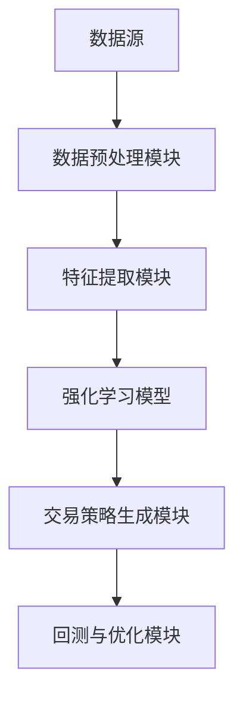
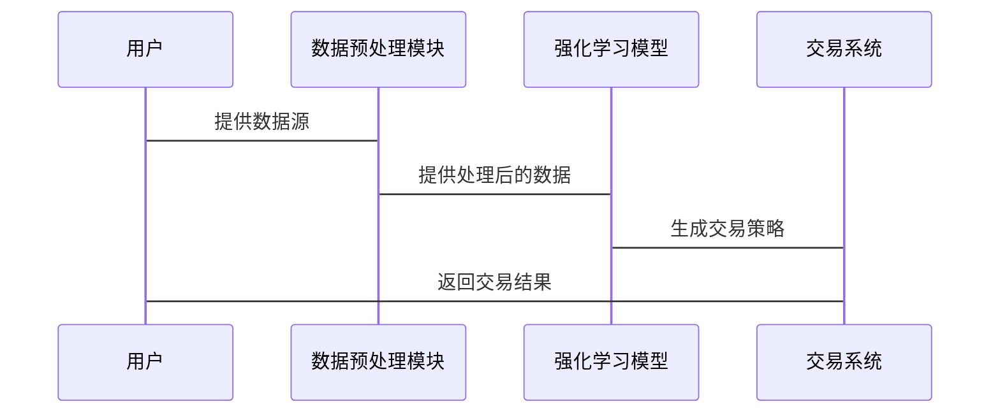

                 


# 《金融领域强化学习在算法交易中的应用》

> 关键词：强化学习，算法交易，金融，马尔可夫决策过程，Q-Learning，Deep Q-Network

> 摘要：本文系统地探讨了强化学习在金融领域算法交易中的应用，从基础概念到算法实现，再到系统架构设计，全面分析了强化学习如何优化交易策略。通过详细讲解Q-Learning和Deep Q-Network等算法，结合实际案例，展示了强化学习在复杂金融市场中的优势与挑战。

---

# 引言：强化学习与金融交易的结合

在金融市场中，投资者面临着高度的不确定性和复杂性，传统的基于规则的交易策略往往难以应对市场的快速变化。强化学习（Reinforcement Learning, RL）作为一种数据驱动的机器学习方法，通过与环境互动并基于奖励机制优化决策，为算法交易提供了新的可能性。本文将详细探讨强化学习在金融交易中的应用，从理论基础到实际实现，为读者提供全面的指导。

---

## 第1章：强化学习与算法交易概述

### 1.1 强化学习的基本概念

- **强化学习**：通过智能体与环境的交互，智能体通过试错和奖励机制，学习最优策略。与监督学习和无监督学习不同，强化学习强调实时决策和长期目标的优化。
  
- **算法交易**：利用算法和模型在金融市场中进行自动化交易。算法交易能够快速响应市场变化，提高交易效率和收益。

### 1.2 强化学习在金融交易中的优势

- **数据驱动**：强化学习通过大量历史数据学习交易策略，能够捕捉市场中的复杂模式。
  
- **适应性**：强化学习模型能够根据市场变化动态调整策略，适应不同市场条件。

### 1.3 本章小结

本章介绍了强化学习和算法交易的基本概念，并分析了强化学习在金融交易中的独特优势。

---

## 第2章：强化学习的核心概念

### 2.1 马尔可夫决策过程（MDP）

- **状态（State）**：市场当前的状态，例如价格、成交量等。

- **动作（Action）**：交易决策，例如买入、卖出或持有。

- **奖励（Reward）**：交易的结果，例如利润或损失。

- **策略（Policy）**：定义在每个状态下选择动作的概率分布。

- **价值函数（Value Function）**：衡量某个状态下采取某个动作的长期收益。

### 2.2 强化学习算法的分类

- **值函数方法**：基于状态值函数或动作值函数进行策略优化，例如Q-Learning。

- **策略梯度方法**：直接优化策略参数，例如策略梯度法。

### 2.3 金融交易中的强化学习建模

- **状态空间**：包括市场指标、技术指标等。

- **动作空间**：包括买入、卖出、持有等交易动作。

### 2.4 本章小结

本章详细介绍了强化学习的核心概念和算法分类，并探讨了其在金融交易中的应用。

---

## 第3章：基于Q-Learning的算法交易

### 3.1 Q-Learning算法原理

- **算法步骤**：
  1. 初始化Q值表。
  2. 在当前状态下选择动作。
  3. 执行动作，观察下一个状态和奖励。
  4. 更新Q值表：$$ Q(s,a) = Q(s,a) + \alpha [r + \max_{a'} Q(s',a') - Q(s,a)] $$

### 3.2 Deep Q-Network（DQN）算法

- **网络结构**：
  - 输入层：接收市场状态特征。
  - 隐藏层：提取特征并映射到Q值空间。
  - 输出层：输出每个动作的Q值。

- **训练流程**：
  1. 环境提供状态s。
  2. 网络输出Q(s,a)。
  3. 执行动作a，获得奖励r和新状态s'。
  4. 更新目标网络：$$ Q_{target}(s',a') = r + \gamma \max Q_{main}(s',a') $$
  5. 最小化损失函数：$$ \mathcal{L} = (Q_{target} - Q_{main})^2 $$

### 3.3 算法实现与优化

- **离散动作空间**：将动作空间离散化，例如分为买入、卖出、持有。

- **状态空间的特征提取**：利用技术指标（如MACD、RSI）和市场数据构建状态特征。

### 3.4 本章小结

本章详细讲解了Q-Learning和DQN算法，并探讨了其在金融交易中的实现与优化方法。

---

## 第4章：系统分析与架构设计

### 4.1 系统功能需求分析

- **数据获取与预处理**：收集历史价格数据，处理缺失值和异常值。

- **特征提取**：提取技术指标、市场情绪等特征。

- **模型训练与部署**：训练强化学习模型，并将其部署到交易系统中。

- **回测与优化**：对交易策略进行回测，评估其表现并进行优化。

### 4.2 系统架构设计



### 4.3 系统接口设计

- **数据接口**：与数据源对接，获取实时市场数据。

- **交易接口**：与交易系统对接，执行交易指令。

### 4.4 系统交互流程



### 4.5 本章小结

本章详细设计了金融交易系统的架构，并探讨了其各部分的交互流程。

---

## 第5章：项目实战

### 5.1 环境安装与配置

- **工具安装**：安装Python、TensorFlow、Keras等工具。

- **数据获取**：使用Yahoo Finance获取股票数据。

### 5.2 核心代码实现

```python
import numpy as np
import tensorflow as tf

class DQN:
    def __init__(self, state_space, action_space):
        self.state_space = state_space
        self.action_space = action_space
        self.gamma = 0.95
        self.epsilon = 1.0
        self.epsilon_min = 0.01
        self.epsilon_decay = 0.995

        self.model = self.build_model()
        self.target_model = self.build_model()
        self.update_target_model()

    def build_model(self):
        model = tf.keras.Sequential()
        model.add(tf.keras.layers.Dense(32, input_dim=self.state_space, activation='relu'))
        model.add(tf.keras.layers.Dense(32, activation='relu'))
        model.add(tf.keras.layers.Dense(self.action_space, activation='linear'))
        return model

    def update_target_model(self):
        self.target_model.set_weights(self.model.get_weights())

    def act(self, state):
        if np.random.random() < self.epsilon:
            return np.random.randint(self.action_space)
        else:
            q = self.model.predict(state)
            return np.argmax(q[0])

    def remember(self, state, action, reward, next_state):
        self.memory.append((state, action, reward, next_state))

    def replay(self, batch_size):
        if len(self.memory) < batch_size:
            return
        minibatch = random.sample(self.memory, batch_size)
        states = np.array([t[0] for t in minibatch])
        actions = np.array([t[1] for t in minibatch])
        rewards = np.array([t[2] for t in minibatch])
        next_states = np.array([t[3] for t in minibatch])

        target = self.target_model.predict(next_states)
        q = self.model.predict(states)
        for i in range(batch_size):
            target[i][actions[i]] = rewards[i] + self.gamma * np.max(target[i])
            q[i][actions[i]] = rewards[i] + self.gamma * np.max(target[i])
        self.model.fit(states, q, epochs=1, verbose=0)

    def update_epsilon(self):
        self.epsilon = max(self.epsilon_min, self.epsilon * self.epsilon_decay)
```

### 5.3 实际案例分析

- **数据预处理**：将股票价格数据标准化。

- **模型训练**：使用训练数据训练DQN模型。

- **回测与优化**：在测试数据上评估交易策略的表现，调整超参数以优化收益。

### 5.4 本章小结

本章通过实际案例展示了如何在金融交易中实现强化学习算法，并探讨了其在实际应用中的挑战和优化方法。

---

## 第6章：最佳实践与注意事项

### 6.1 强化学习在金融交易中的注意事项

- **数据质量**：确保数据的完整性和准确性。

- **模型的可解释性**：强化学习模型往往缺乏可解释性，需谨慎应用于实际交易。

- **市场环境的稳定性**：金融市场具有高度不确定性，模型需具备良好的鲁棒性。

### 6.2 系统优化建议

- **模型优化**：使用更深的网络结构或引入注意力机制以提高模型表现。

- **策略组合**：结合多种策略，降低单一策略的风险。

### 6.3 拓展阅读

- 推荐阅读《Reinforcement Learning: Theory and Algorithms》和《Algorithmic Trading: Winning Strategies and Their Rationale》。

### 6.4 本章小结

本章总结了强化学习在金融交易中的注意事项，并提供了系统优化的建议。

---

## 结论

强化学习为金融领域的算法交易提供了新的可能性，其数据驱动和自适应的优势在复杂金融市场中尤为重要。通过详细讲解强化学习的核心概念、算法实现和系统架构设计，本文为读者提供了一个全面的指导框架。未来的研究可以进一步探索如何提高模型的可解释性和鲁棒性，以应对金融市场的高度不确定性。

---

**作者：AI天才研究院/AI Genius Institute & 禅与计算机程序设计艺术 /Zen And The Art of Computer Programming**

