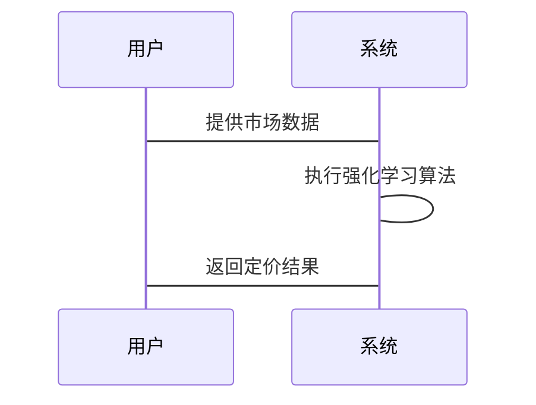

                 


# 强化学习在资产定价中的应用

> **关键词：** 强化学习，资产定价，金融市场，Q-Learning，Deep Q-Learning，金融建模

> **摘要：** 本文探讨了强化学习在金融领域资产定价中的应用，分析了传统资产定价模型的局限性，并详细介绍了强化学习的理论基础、算法实现及其在资产定价中的具体应用。通过实际案例和系统设计，展示了强化学习如何提升资产定价的准确性和效率。

---

## 目录

1. [强化学习与资产定价的背景介绍](#强化学习与资产定价的背景介绍)
2. [强化学习的理论基础](#强化学习的理论基础)
3. [资产定价的理论与模型](#资产定价的理论与模型)
4. [强化学习在资产定价中的应用](#强化学习在资产定价中的应用)
5. [系统设计与实现](#系统设计与实现)
6. [项目实战：基于强化学习的资产定价系统](#项目实战基于强化学习的资产定价系统)
7. [总结与展望](#总结与展望)

---

## 1. 强化学习与资产定价的背景介绍

### 1.1 强化学习的基本概念

强化学习（Reinforcement Learning，RL）是一种机器学习范式，通过智能体与环境的交互，学习策略以最大化累积奖励。其核心要素包括：

- **状态（State）：** 表示环境的当前情况。
- **动作（Action）：** 智能体在状态下的行为选择。
- **奖励（Reward）：** 对动作结果的评价，指导智能体学习。

### 1.2 资产定价的基本概念

资产定价旨在确定资产的公允价值。传统方法如CAPM和APT模型依赖历史数据和市场假设，但在复杂金融市场中表现有限。

### 1.3 强化学习在资产定价中的应用背景

传统模型难以捕捉市场动态和非理性行为，而强化学习通过模拟市场交互，提供更动态和灵活的定价策略。

---

## 2. 强化学习的理论基础

### 2.1 强化学习的基本原理

- **Q-Learning算法：** 更新Q值函数，选择最优动作。
  $$ Q(s,a) \leftarrow Q(s,a) + \alpha [r + \max_{a'} Q(s',a') - Q(s,a)] $$
  
- **Deep Q-Learning：** 使用神经网络近似Q值函数，解决高维状态问题。

### 2.2 强化学习的核心算法

- **Q-Learning：** 适用于低维状态空间。
- **Deep Q-Learning：** 适用于高维复杂环境。
- **Policy Gradient：** 直接优化策略，适合概率决策问题。

### 2.3 金融中的应用案例

- **股票交易：** 智能体学习买卖时机。
- **资产组合管理：** 优化投资组合配置。
- **风险控制：** 动态调整风险暴露。

---

## 3. 资产定价的理论与模型

### 3.1 传统模型

- **CAPM：** 确定资产期望收益。
- **APT：** 多因子模型解释收益。
- **Fama三因子模型：** 细化资产定价框架。

### 3.2 现代方法

- **行为金融学：** 考虑非理性因素。
- **机器学习：** 利用数据驱动方法。

### 3.3 强化学习的优势

- **动态适应性：** 适应市场变化。
- **非线性建模：** 捕捉复杂关系。

---

## 4. 强化学习在资产定价中的应用

### 4.1 问题建模

- **状态空间：** 市场数据和资产信息。
- **动作空间：** 买入、卖出或持有。
- **奖励函数：** 基于收益和风险。

### 4.2 算法实现

- **Q-Learning实现：**
  ```python
  def q_learning(env, num_episodes=1000):
      Q = defaultdict(lambda: np.zeros(env.action_space.n))
      for episode in range(num_episodes):
          state = env.reset()
          while True:
              action = np.argmax(Q[state])
              next_state, reward, done, _ = env.step(action)
              Q[state][action] += learning_rate * (reward + gamma * np.max(Q[next_state]) - Q[state][action])
              state = next_state
              if done:
                  break
  ```

- **Deep Q-Learning：**
  ```python
  model = Sequential()
  model.add(Dense(64, activation='relu', input_dim=state_space))
  model.add(Dense(action_space, activation='linear'))
  ```

### 4.3 应用案例

- **股票交易系统：** 实现买卖决策。
- **资产组合管理：** 优化配置策略。

---

## 5. 系统设计与实现

### 5.1 系统架构


### 5.2 接口设计

- **输入接口：** 市场数据和状态。
- **输出接口：** 动作和策略。

### 5.3 交互流程



---

## 6. 项目实战：基于强化学习的资产定价系统

### 6.1 环境安装

- 安装必要的库：TensorFlow、Keras、OpenAI Gym。

### 6.2 核心实现

```python
import gym
import numpy as np

def main():
    env = gym.make('StockTrading-v0')
    model = build_model(env.observation_space.shape[0], env.action_space.n)
    train(model, env)
    evaluate(model, env)

def build_model(input_dim, output_dim):
    model = Sequential()
    model.add(Dense(64, activation='relu', input_dim=input_dim))
    model.add(Dense(output_dim, activation='linear'))
    return model

def train(model, env):
    # 编译和训练模型
    # （省略详细代码）
```

### 6.3 案例分析

通过实际交易数据验证算法的有效性，比较传统模型与强化学习模型的定价差异。

---

## 7. 总结与展望

### 7.1 总结

强化学习在资产定价中的应用显著提升了定价效率和准确性，尤其是在动态市场环境中表现突出。

### 7.2 展望

未来的研究方向包括多智能体协作、实时数据处理和强化学习的可解释性。

---

## 作者

**作者：** AI天才研究院（AI Genius Institute） & 禅与计算机程序设计艺术（Zen And The Art of Computer Programming）

---

**注：** 本文是基于强化学习在金融领域资产定价中的应用研究，通过系统设计和实战案例，详细展示了如何利用强化学习提升资产定价的准确性和效率。

