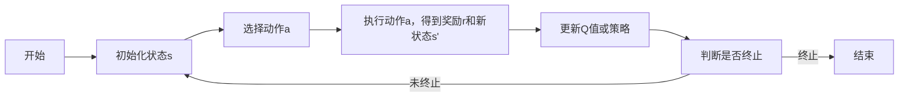
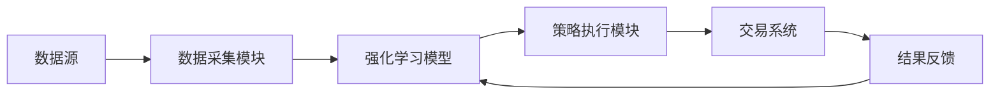
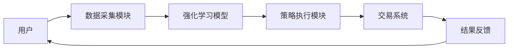

                 


# 金融领域强化学习在高频交易中的应用

> 关键词：高频交易，强化学习，Q-learning，DQN，Deep Q-Network

> 摘要：本文详细探讨了强化学习在金融高频交易中的应用，从强化学习的基本原理到其在高频交易中的具体应用，结合数学模型和实际案例，分析了强化学习如何优化交易策略，降低风险，并提高交易效率。文章还详细介绍了系统架构设计和项目实现过程，为读者提供了一个全面的视角。

---

# 第一部分: 强化学习与高频交易的背景介绍

## 第1章: 高频交易与强化学习概述

### 1.1 高频交易的定义与特点

#### 1.1.1 高频交易的定义
高频交易（High-Frequency Trading, HFT）是指在极短时间内进行大量的交易行为，通常依赖于计算机算法和高速网络，以捕捉市场中的微小价格波动。高频交易的核心在于速度和算法，能够在毫秒级别完成交易决策和执行。

#### 1.1.2 高频交易的核心特点
1. **高速性**：高频交易依赖于高速网络和快速计算能力，能够在极短时间内完成从数据接收、分析到交易执行的全过程。
2. **算法驱动**：高频交易依赖于复杂的算法模型，能够快速做出交易决策。
3. **高频性**：高频交易的交易次数远高于传统交易，能够在短时间内完成数千次甚至数万次交易。
4. **低延迟**：高频交易对系统延迟的要求极高，任何延迟都可能导致交易失败或损失。

#### 1.1.3 高频交易在金融领域的重要性
高频交易在现代金融市场中扮演着重要角色，尤其是在股票、期货等市场中。高频交易能够提高市场的流动性和价格发现效率，但也可能带来市场波动性增加的风险。

### 1.2 强化学习的定义与特点

#### 1.2.1 强化学习的定义
强化学习（Reinforcement Learning, RL）是一种机器学习范式，通过智能体（Agent）与环境的交互，学习最优策略以最大化累计奖励。强化学习的核心在于智能体通过试错和经验积累，逐步优化其决策策略。

#### 1.2.2 强化学习的核心特点
1. **试错学习**：强化学习通过不断尝试不同的动作，根据环境反馈的奖励来调整策略。
2. **策略优化**：强化学习的目标是找到最优策略，使累计奖励最大化。
3. **环境交互**：强化学习依赖于智能体与环境之间的交互，通过状态、动作和奖励的循环来学习。

#### 1.2.3 强化学习与传统机器学习的区别
| 特性 | 监督学习 | 强化学习 |
|------|----------|----------|
| 数据来源 | 标签数据 | 状态、动作、奖励 |
| 目标函数 | 最小化损失 | 最大化累计奖励 |
| 学习方式 | 无交互 | 有交互 |

### 1.3 高频交易与强化学习的结合

#### 1.3.1 高频交易中的决策问题
高频交易中的决策问题主要体现在以下几个方面：
1. **交易时机选择**：如何在最佳时机进行买卖操作。
2. **价格预测**：如何准确预测未来的价格走势。
3. **风险控制**：如何在高频交易中控制风险，避免损失。

#### 1.3.2 强化学习在高频交易中的应用优势
1. **实时决策能力**：强化学习能够快速做出决策，适应高频交易的高速性要求。
2. **自适应能力**：强化学习能够根据市场变化自适应调整策略，提高交易效率。
3. **复杂策略优化**：强化学习能够处理复杂的交易策略，优化交易效果。

#### 1.3.3 高频交易与强化学习结合的前景
随着人工智能技术的发展，强化学习在高频交易中的应用前景广阔。通过强化学习，交易系统能够更加智能地做出决策，提高交易效率和盈利能力。

### 1.4 本章小结
本章主要介绍了高频交易和强化学习的基本概念、特点及其在金融领域的结合。高频交易的高速性和算法驱动的特点，使得强化学习成为其理想的技术手段。通过强化学习，高频交易系统能够实现更高效的决策和优化。

---

## 第2章: 强化学习的核心概念与算法

### 2.1 强化学习的基本原理

#### 2.1.1 状态、动作、奖励的定义
在强化学习中，智能体与环境交互的过程中，涉及三个核心概念：
1. **状态（State）**：环境当前所处的状态，表示智能体所感知到的信息。
2. **动作（Action）**：智能体在给定状态下选择的动作，用于改变环境状态。
3. **奖励（Reward）**：智能体在执行动作后，环境给予的反馈，用于评估动作的好坏。

#### 2.1.2 策略与价值函数的定义
1. **策略（Policy）**：策略是指智能体在给定状态下选择动作的概率分布，记为 $\pi(a|s)$。
2. **价值函数（Value Function）**：价值函数衡量的是在给定状态下，采取某种策略所能获得的累计奖励，记为 $V(s)$ 或 $Q(s, a)$。

#### 2.1.3 探索与利用的平衡
在强化学习中，智能体需要在探索新动作和利用已知好的动作之间找到平衡。探索有助于发现更好的策略，而利用则能够快速获得较高的奖励。

### 2.2 主流强化学习算法

#### 2.2.1 Q-learning算法
Q-learning是一种基于值函数的强化学习算法，通过更新Q表来学习最优策略。Q表的更新公式为：
$$ Q(s, a) = Q(s, a) + \alpha (r + \gamma \max Q(s', a') - Q(s, a)) $$
其中，$\alpha$ 是学习率，$\gamma$ 是折扣因子。

#### 2.2.2 Deep Q-Network (DQN)算法
DQN是一种结合深度学习的强化学习算法，通过神经网络近似Q值函数。DQN的核心思想是使用两个神经网络，一个用于评估当前策略，另一个用于目标值函数，以稳定学习过程。

#### 2.2.3 Policy Gradient方法
Policy Gradient是一种直接优化策略的强化学习方法，通过计算策略梯度来更新参数，使累计奖励最大化。

#### 2.2.4 Actor-Critic架构
Actor-Critic是一种结合策略和价值函数的强化学习架构，通过Actor网络生成动作，Critic网络评估动作的价值，共同优化策略。

### 2.3 强化学习算法的数学模型

#### 2.3.1 Q-learning的数学公式
$$ Q(s, a) = Q(s, a) + \alpha (r + \gamma \max Q(s', a') - Q(s, a)) $$

#### 2.3.2 DQN的数学公式
$$ \text{损失函数} = \mathbb{E}[ (r + \gamma Q(s', \pi(s')) - Q(s, a))^2 ] $$

### 2.4 强化学习算法的流程图



### 2.5 本章小结
本章详细介绍了强化学习的核心概念和主流算法，包括Q-learning、DQN、Policy Gradient和Actor-Critic等。通过数学公式和流程图，展示了这些算法的基本原理和实现过程。

---

## 第3章: 高频交易中的强化学习应用

### 3.1 高频交易中的强化学习算法设计

#### 3.1.1 状态定义
在高频交易中，状态通常包括市场价格、订单簿信息、时间戳等。

#### 3.1.2 动作设计
在高频交易中，动作通常包括买入、卖出和持有等。

#### 3.1.3 奖励机制设计
在高频交易中，奖励机制通常基于交易利润、风险控制和交易频率等因素。

### 3.2 高频交易中的策略优化

#### 3.2.1 算法实现
通过强化学习算法优化交易策略，如使用DQN算法进行买卖决策。

#### 3.2.2 系统设计
设计一个高频交易系统，包括数据采集、策略执行和风险管理模块。

### 3.3 高频交易中的风险控制

#### 3.3.1 风险评估
通过强化学习模型评估交易风险。

#### 3.3.2 风险控制策略
设计风险控制策略，如止损、止盈等。

### 3.4 本章小结
本章详细介绍了强化学习在高频交易中的应用，包括算法设计、策略优化和风险控制等方面。通过强化学习，高频交易系统能够实现更高效的决策和优化。

---

## 第4章: 高频交易系统的架构设计

### 4.1 系统功能设计

#### 4.1.1 数据采集模块
负责采集市场数据，如价格、订单簿等。

#### 4.1.2 策略执行模块
负责根据强化学习模型生成的策略执行交易。

#### 4.1.3 风险控制模块
负责监控和管理交易风险。

### 4.2 系统架构设计



### 4.3 系统接口设计
系统接口设计包括数据接口、策略接口和交易接口等。

### 4.4 系统交互设计



### 4.5 本章小结
本章详细介绍了高频交易系统的架构设计，包括功能模块、系统架构、接口设计和交互设计等内容。

---

## 第5章: 项目实战

### 5.1 环境安装

#### 5.1.1 安装Python
安装Python 3.8以上版本。

#### 5.1.2 安装依赖库
安装NumPy、TensorFlow、Keras等依赖库。

### 5.2 核心代码实现

#### 5.2.1 DQN算法实现
```python
class DQNetwork:
    def __init__(self, input_dim, output_dim, hidden_units=[64, 64]):
        self.model = keras.Sequential([
            keras.layers.Dense(hidden_units[0], activation='relu', input_dim=input_dim),
            keras.layers.Dense(hidden_units[1], activation='relu'),
            keras.layers.Dense(output_dim, activation='linear')
        ])
        self.model.compile(optimizer='adam', loss='mean_squared_error')

    def call(self, x):
        return self.model(x)

    def train(self, x, y):
        self.model.fit(x, y, epochs=1, verbose=0)
```

#### 5.2.2 强化学习循环
```python
def train():
    agent = DQNetwork(state_dim, action_dim)
    for episode in range(max_episodes):
        state = env.reset()
        while not done:
            action = agent.act(state)
            next_state, reward, done = env.step(action)
            agent.remember(state, action, reward, next_state, done)
            agent.train()
```

### 5.3 实际案例分析
通过实际案例分析，展示强化学习在高频交易中的应用效果。

### 5.4 本章小结
本章通过项目实战，详细介绍了环境安装、代码实现和案例分析等内容，展示了强化学习在高频交易中的实际应用。

---

## 第6章: 总结与展望

### 6.1 本章总结
本文详细探讨了强化学习在金融高频交易中的应用，从理论到实践，全面分析了强化学习在高频交易中的优势和实现方法。

### 6.2 未来展望
未来，强化学习在高频交易中的应用将更加广泛，包括更复杂的策略优化、多市场交易、智能风控等。

### 6.3 最佳实践Tips
1. **模型优化**：在实际应用中，需要注意模型的优化和调参。
2. **风险管理**：强化学习模型需要结合实际市场情况，设计合理的风险控制机制。
3. **系统稳定性**：高频交易系统需要保证高度的稳定性和可靠性。

### 6.4 本章小结
本文总结了强化学习在高频交易中的应用，并展望了未来的发展方向，为读者提供了有益的参考。

---

## 作者信息

作者：AI天才研究院/AI Genius Institute & 禅与计算机程序设计艺术 /Zen And The Art of Computer Programming

---

以上是关于《金融领域强化学习在高频交易中的应用》的完整文章结构，涵盖了从理论到实践的各个方面，适合对强化学习和高频交易感兴趣的读者阅读。

