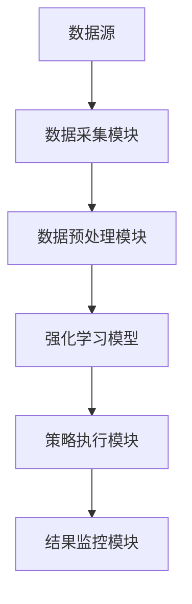
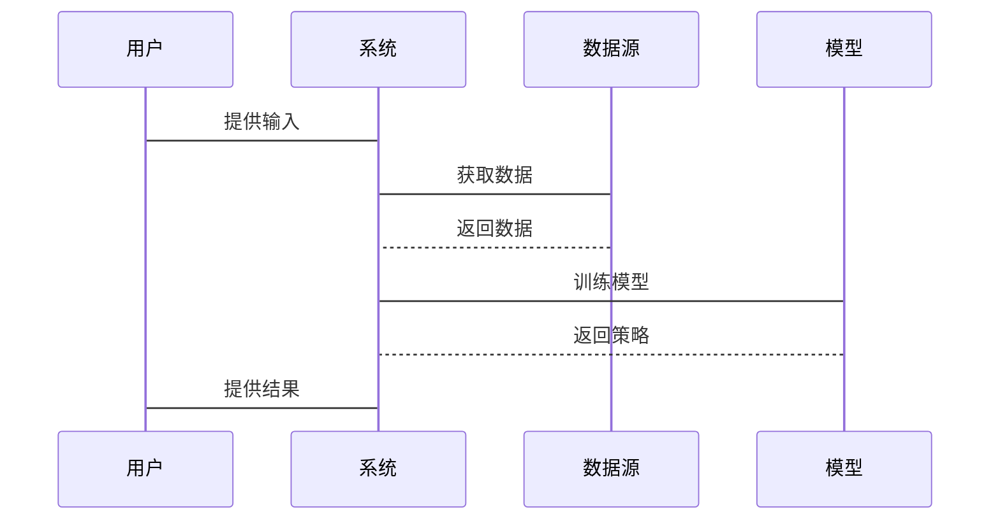

                 


# 金融领域强化学习的最新进展与应用

> **关键词**：强化学习，金融应用，算法交易，智能投顾，数学模型，系统架构

> **摘要**：强化学习作为一种先进的机器学习技术，在金融领域展现了巨大的潜力。本文从强化学习的基本概念入手，探讨其在算法交易、智能投顾等金融场景中的应用，并详细分析了其背后的数学模型和系统架构设计。通过实际案例和项目实战，展示了强化学习在金融领域的最新进展和实际应用价值。

---

## 第1章：强化学习概述

### 1.1 强化学习的基本概念

#### 1.1.1 定义与核心要素
强化学习是一种通过智能体与环境交互来学习策略的方法。其核心要素包括：
- **状态（State）**：智能体所处的环境信息。
- **动作（Action）**：智能体在给定状态下采取的行为。
- **奖励（Reward）**：智能体行为的反馈，用于指导学习。
- **策略（Policy）**：智能体在不同状态下选择动作的规则。

#### 1.1.2 强化学习的三要素：环境、智能体、奖励
- **环境（Environment）**：智能体所处的外部世界，提供状态和奖励。
- **智能体（Agent）**：通过与环境交互来学习策略的主体。
- **奖励（Reward）**：驱动智能体学习的反馈机制。

#### 1.1.3 强化学习与监督学习、无监督学习的对比
- **监督学习**：基于标注数据进行预测。
- **无监督学习**：从无标签数据中发现模式。
- **强化学习**：通过与环境交互，基于奖励机制优化策略。

### 1.2 强化学习在金融领域的应用背景

#### 1.2.1 金融领域的复杂性与不确定性
金融市场具有高度的不确定性和复杂性，智能体需要在动态环境中做出决策。

#### 1.2.2 强化学习在金融中的优势
- **动态适应性**：能够根据市场变化调整策略。
- **非线性建模**：适合处理复杂的非线性关系。
- **多目标优化**：可以同时优化多个目标，如收益与风险。

#### 1.2.3 当前研究与应用现状
- 研究热点：算法交易、智能投顾、风险管理。
- 应用案例：高频交易、个性化投资建议。

---

## 第2章：强化学习的数学基础

### 2.1 马尔可夫决策过程（MDP）

#### 2.1.1 MDP的定义与组成部分
马尔可夫决策过程由以下五部分组成：
- **状态空间（State Space）**：所有可能的状态集合。
- **动作空间（Action Space）**：所有可能的动作集合。
- **转移概率（Transition Probability）**：从当前状态和动作转移到下一个状态的概率。
- **奖励函数（Reward Function）**：智能体在状态和动作下获得的奖励。
- **终止条件（Termination Condition）**： episode的结束条件。

#### 2.1.2 状态、动作、奖励函数的数学表达
- **状态**：$s \in S$，其中$S$是状态空间。
- **动作**：$a \in A$，其中$A$是动作空间。
- **奖励函数**：$r(s, a) \in R$，其中$R$是奖励空间。

#### 2.1.3 Bellman方程与最优策略
Bellman方程描述了当前状态的最优值函数与后续状态的关系：
$$ V^*(s) = \max_{a} \left[ r(s,a) + \gamma \sum_{s'} P(s'|s,a) V^*(s') \right] $$
其中，$\gamma$是折扣因子，$P$是转移概率矩阵。

### 2.2 Q-learning算法

#### 2.2.1 Q-learning的基本原理
Q-learning通过学习Q值函数来优化策略：
$$ Q(s,a) = Q(s,a) + \alpha [r + \gamma \max Q(s',a') - Q(s,a)] $$
其中，$\alpha$是学习率。

#### 2.2.2 Q值更新的数学公式
$$ Q(s,a) = Q(s,a) + \alpha [r + \gamma \max Q(s',a') - Q(s,a)] $$

#### 2.2.3 动作空间与状态空间的扩展
- 状态空间可以是高维的，例如包含多个市场指标。
- 动作空间可以是离散的（如买、卖、持有）或连续的。

---

## 第3章：强化学习在算法交易中的应用

### 3.1 算法交易的强化学习模型

#### 3.1.1 基于强化学习的交易策略框架
- **输入**：市场数据（如价格、成交量）。
- **输出**：交易指令（如买入、卖出）。

#### 3.1.2 状态、动作、奖励的设计
- **状态**：当前市场指标（如价格、波动率）。
- **动作**：买入、卖出、持有。
- **奖励**：收益或损失。

#### 3.1.3 实验结果与分析
通过实验验证强化学习策略的有效性，分析其在不同市场条件下的表现。

---

## 第4章：强化学习在智能投顾中的应用

### 4.1 智能投顾的强化学习实现

#### 4.1.1 用户需求分析与资产配置策略
- 根据用户的风险偏好和财务目标，制定资产配置策略。

#### 4.1.2 基于强化学习的资产配置模型
- **输入**：用户信息和市场数据。
- **输出**：最优资产配置建议。

#### 4.1.3 实验结果与性能评估
评估强化学习模型在资产配置中的表现，包括收益、风险和稳定性。

---

## 第5章：强化学习的系统设计与实现

### 5.1 系统架构设计

#### 5.1.1 系统功能模块
- **数据采集与预处理模块**：收集和处理市场数据。
- **强化学习模型训练模块**：训练强化学习模型。
- **策略执行与监控模块**：执行交易策略并监控结果。

#### 5.1.2 系统架构图（Mermaid）



### 5.2 系统接口与交互设计

#### 5.2.1 系统接口设计
- **数据接口**：API设计与实现。
- **模型接口**：训练与部署接口。
- **用户接口**：输入输出交互设计。

#### 5.2.2 交互流程图（Mermaid）



---

## 第6章：项目实战

### 6.1 项目环境安装

```bash
pip install tensorflow keras matplotlib pandas numpy
```

### 6.2 系统核心实现源代码

```python
import numpy as np
import tensorflow as tf
from tensorflow.keras.models import Sequential
from tensorflow.keras.layers import Dense

# 定义强化学习类
class DQN:
    def __init__(self, state_space, action_space):
        self.state_space = state_space
        self.action_space = action_space
        self.gamma = 0.99
        self.epsilon = 1.0
        self.epsilon_min = 0.01
        self.epsilon_decay = 0.995
        self.model = self._build_model()

    def _build_model(self):
        model = Sequential()
        model.add(Dense(32, input_dim=self.state_space, activation='relu'))
        model.add(Dense(32, activation='relu'))
        model.add(Dense(self.action_space, activation='linear'))
        model.compile(optimizer='adam', loss='mean_squared_error')
        return model

    def remember(self, state, action, reward, next_state):
        # 记忆存储
        pass

    def act(self, state):
        if np.random.random() < self.epsilon:
            return np.random.randint(self.action_space)
        state = np.array([state])
        q = self.model.predict(state)
        return np.argmax(q[0])

    def replay(self, batch_size):
        # 回忆回放
        pass
```

### 6.3 代码应用解读与分析
- **DQN类**：实现Deep Q-Networks算法。
- **act方法**：根据当前状态选择动作。
- **replay方法**：通过回放记忆更新模型。

### 6.4 实际案例分析
- **股票交易策略**：基于强化学习的买卖决策。
- **风险管理**：通过策略优化降低风险。

### 6.5 项目小结
- **实现细节**：代码实现的注意事项。
- **优化建议**：如何进一步优化模型。

---

## 第7章：最佳实践与总结

### 7.1 小结
强化学习在金融领域的应用前景广阔，但仍需解决诸多挑战，如数据质量、模型解释性等。

### 7.2 注意事项
- **数据质量**：确保数据的准确性和完整性。
- **模型解释性**：提高模型的可解释性。
- **风险控制**：加强风险管理和监控。

### 7.3 拓展阅读
推荐相关书籍和论文，供读者深入学习。

---

## 作者信息

作者：AI天才研究院（AI Genius Institute） & 禅与计算机程序设计艺术（Zen And The Art of Computer Programming）

---

本文通过系统地介绍强化学习的基本概念、数学模型和在金融领域的应用，为读者提供了从理论到实践的全面指南。通过实际案例和项目实战，帮助读者深入理解强化学习在金融中的潜力和价值。

